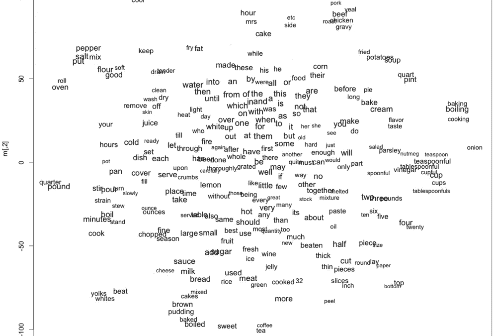
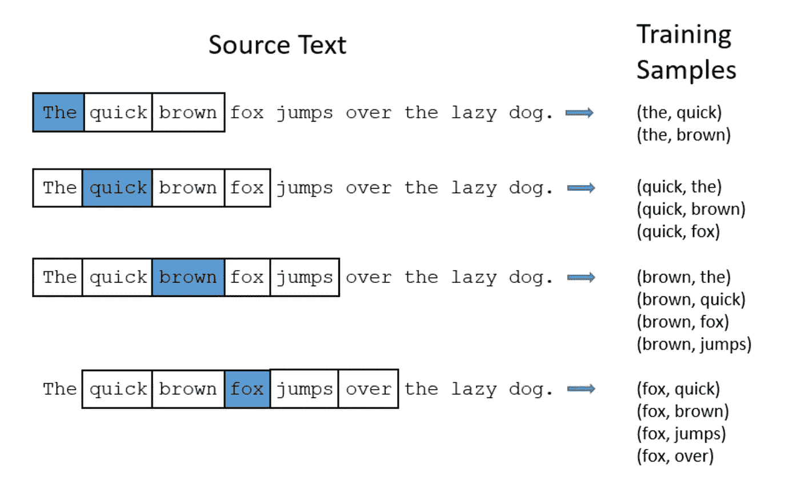
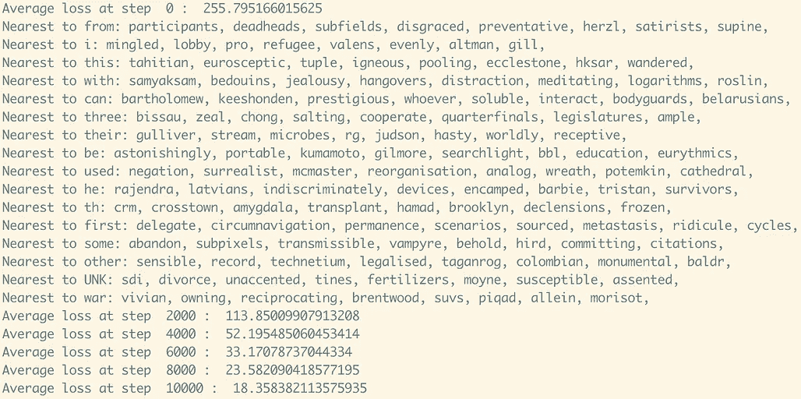
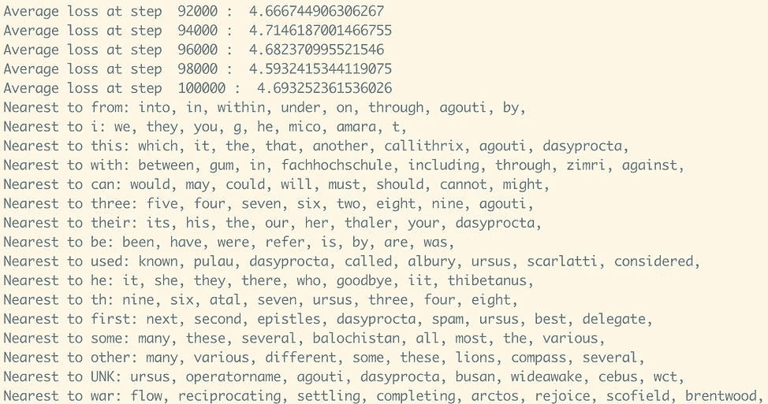
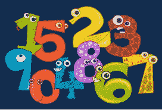
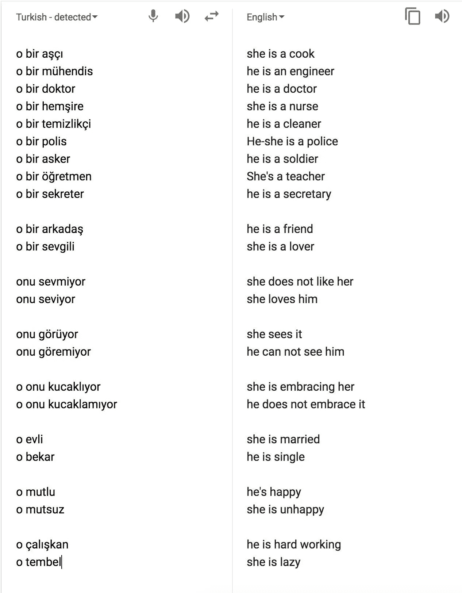

# 用 Word2vec 映射单词嵌入

> 原文：<https://towardsdatascience.com/mapping-word-embeddings-with-word2vec-99a799dc9695?source=collection_archive---------10----------------------->

## 利用词向量之间的语义和句法关系增强自然语言处理



Word embedding created using Word2vec | Source: [https://www.adityathakker.com/introduction-to-word2vec-how-it-works/](https://www.adityathakker.com/introduction-to-word2vec-how-it-works/)

## 介绍

自然语言处理(NLP)是人工智能的一个领域，专注于让计算机理解、处理和分析人类语言。NLP 广泛应用于科技行业，作为搜索引擎、垃圾邮件过滤器、语言翻译等等的主干。NLP 使计算机能够将人类语言转换成它可以阅读和理解的形式，例如向量或离散符号。例如，NLP 可以接收句子`So hungry, need food`，并将其分解为四个任意符号:`so`表示为`K45`、`hungry`表示为`J83`、`need`表示为`Q67`、`food`表示为`P21`，然后所有这些都可以由计算机处理。每个唯一的单词由不同的符号表示；然而，缺点是指定给`hungry`和`food`的符号之间没有明显的关系。这阻碍了 NLP 模型使用它所了解到的关于`hungry`的信息并将其应用到`food`，这在语义上是相关的。向量空间模型(VSM)通过将单词嵌入向量空间来帮助解决这个问题，在向量空间中，相似定义的单词被映射到彼此附近。这个空间叫做单词嵌入。

## Word2vec

Word2vec 是由谷歌的[托马斯·米科洛夫](https://arxiv.org/pdf/1310.4546.pdf)领导的一个研究小组的成果，是用于创建单词嵌入的最流行的模型之一。Word2vec 有两种将单词上下文化的主要方法:连续词袋模型(CBOW)和跳过语法模型，我将在本文中总结这两种方法。这两个模型得出了相似的结论，但是采用了几乎相反的途径。

## 连续词袋模型

CBOW 是两个模型中不太受欢迎的一个，它使用源单词来预测目标单词。例如，以这个实例中的句子`I want to learn python**.**`为例，目标词是`python`，而源词是`I want to learn`。CBOW 主要用于较小的数据集，因为它将句子的上下文视为预测目标单词的单个观察。实际上，当处理大量单词时，这变得非常低效。

## 跳格模型

Skip-Gram 模型的工作方式与 CBOW 模型相反，使用目标单词来预测周围单词的来源或上下文。考虑句子`the quick brown fox jumped over the lazy dog`,假设我们对给定单词的上下文使用一个简单的定义作为紧接在它前面和后面的单词。Skip-Gram 模型将把句子分成`**(context, target)**`对，产生一组格式如下的对:

`**([the, brown],quick), ([quick,fox],brown), ([brown,jumped],fox)...**`

这些对被进一步筛选成`**(input, output)**`对，表示每个单词(输入),该单词直接位于其前面或后面。这是必要的，因为 Skip-Gram 模型通过使用目标单词(输入)来预测上下文或输出。这些对表示如下:

`**(quick, the), (quick, brown), (brown, quick), (brown, fox)...**`

既然每个单词都能够在上下文中表示出来，有趣的事情就开始了。我不会进入数学领域——这个 [TensorFlow 教程](https://www.tensorflow.org/tutorials/representation/word2vec)提供了深入的解释——但是预测给定上下文中每个单词的损失函数可以使用随机梯度下降和迭代数据集中的每一对来优化。从那里，可以使用 [t-SNE 降维技术](https://lvdmaaten.github.io/tsne/)将向量降维为二维。



Skip-Gram model with context defined as the two words immediately before and after the target word. Source: [http://mccormickml.com/2016/04/19/word2vec-tutorial-the-skip-gram-model/](http://mccormickml.com/2016/04/19/word2vec-tutorial-the-skip-gram-model/)

## 可视化单词之间的语义和句法关系

一旦单词向量被简化为二维，就有可能看到某些单词之间的关系。语义关系的例子是男性/女性名称和国家/首都关系，而句法关系的例子是过去时和现在时。下图很好地展示了这些关系:


Source: [https://www.tensorflow.org/tutorials/representation/word2vec](https://www.tensorflow.org/tutorials/representation/word2vec)

共享语义或句法关系的单词将由相似大小的向量来表示，并且在单词包含中被映射为彼此非常接近。不再是用任意的离散符号`K93`表示`king`，用`S83`表示`queen`的情况。相反，`king`和`queen`之间的关系更加明显——事实上，它与分别对应于`man`和`woman,`的向量之间的关系完全相同。这允许在向量上执行非常酷和神奇简单的运算。例如:如果从`brother`的矢量表示中减去`boy`的矢量，然后加上`girl`的矢量，就会得到`sister`。

```
**brother - boy + girl = sister****queen - woman + man = king****biking - today + yesterday = biked**
```

这为在数据中寻找模式或其他见解开辟了一个全新的可能性维度。

## 使用 TensorFlow 实现 Word2vec

使用 TensorFlow 教程中展示的示例代码[我将演示 word2vec 在实践中是如何工作的。TensorFlow 是由谷歌大脑团队开发的内部使用的机器学习库，于 2015 年向公众开源，旨在加速人工智能的发展。TensorFlow 是一种用于深度学习、逻辑回归和强化学习的强大工具，并且由于其在训练大型数据集时优化计算效率的能力而变得流行。](https://github.com/tensorflow/tensorflow/blob/r1.10/tensorflow/examples/tutorials/word2vec/word2vec_basic.py)

提供的示例代码读取 50，000 个单词的大型数据集，并训练 skip-gram 模型以上下文方式对单词进行矢量化。然后，它遍历数据 100，000 次，以优化数据集中一批随机流行词的损失函数。首先，流行单词的最近邻居没有显示出与每个单词的任何句法或语义关系。在 100，000 步之后，可以看到清晰得多的关系，并且损失函数降低了 98%以上。



Summary showing 8 nearest neighbors for a random batch of popular words, at 0 and 100,000 steps

如上所述，在训练 skip-gram 模型之前，单词`three`的八个最近邻是:`bissau, zeal, chong, salting, cooperate, quarterfinals, legislatures, ample`。当迭代完成时，`three`的最近邻居是:`five, four, seven, six, two, eight, nine, agouti`。虽然不完美——据我所知，agouti 是一种热带美洲啮齿动物，而不是一个数字——8 个最近的邻居中有 7 个显示出与单词`three`有明确的语义关系。



**Left:** Central American Agouti | **Right:** Numbers - (Sources: Wikipedia, Google Images)

## 谷歌翻译中的性别偏见

虽然 word2vec 可以创建说明单词之间的语义和语法关系的单词嵌入，但该模型并非没有一些缺陷。2016 年一项名为 [*的研究显示，男人对于电脑程序员就像女人对于家庭主妇一样？消除单词嵌入的偏见*](https://arxiv.org/abs/1607.06520) (Bolukbasi，Chang，Zou，Saligrama，Kalai)展示了谷歌使用的单词嵌入如何以惊人的速度强化性别陈规定型观念，并确定了解决这一问题的潜在办法。数据科学家和企业家 Emre arbak 使用谷歌翻译进一步强调了单词嵌入算法所显示的性别偏见。精通土耳其语的 arbak 测试了谷歌如何将使用中性代词的土耳其语句子翻译成英语。结果既令人着迷又令人不安。([更多例子](https://translate.google.com/#tr/en/o%20bir%20asker%0Ao%20bir%20%C3%B6%C4%9Fretmen%0Ao%20bir%20doktor%0Ao%20bir%20hem%C5%9Fire%0A%0Ao%20bir%20yazar%0Ao%20bir%20kopek%0Ao%20bir%20dad%C4%B1%0Ao%20bir%20kedi%0A%0Ao%20bir%20ba%C5%9Fkan%0Ao%20bir%20giri%C5%9Fimci%0Ao%20bir%20%C5%9Eark%C4%B1c%C4%B1%0Ao%20bir%20%C3%96%C4%9Frenci%0Ao%20bir%20Terc%C3%BCman%0A%0Ao%20%C3%A7al%C4%B1%C5%9Fkan%0Ao%20tembel%0A%0Ao%20bir%20ressam%0Ao%20bir%20kuaf%C3%B6r%0Ao%20bir%20garson%0Ao%20bir%20m%C3%BChendis%0Ao%20bir%20mimar%0Ao%20bir%20Sanat%C3%A7%C4%B1%0Ao%20bir%20sekreter%0Ao%20bir%20di%C5%9F%C3%A7i%0Ao%20bir%20%C3%A7i%C3%A7ek%C3%A7i%0Ao%20bir%20muhasebeci%0Ao%20bir%20f%C4%B1r%C4%B1nc%C4%B1%0Ao%20bir%20Avukat%0Ao%20bir%20dans%C3%B6z%0Ao%20bir%20polis%0A%0Ao%20g%C3%BCzel%0Ao%20%C3%A7ok%20g%C3%BCzel%0Ao%20%C3%A7irkin%0Ao%20k%C3%BC%C3%A7%C3%BCk%0Ao%20ya%C5%9Fl%C4%B1%0A%0Ao%20kuvvetli%0Ao%20zay%C4%B1f%0Ao%20k%C3%B6t%C3%BCmser%0Ao%20iyimser))



Source: [https://www.facebook.com/photo.php?fbid=10154851496086949&set=a.10150241543551949&type=3&theater](https://www.facebook.com/photo.php?fbid=10154851496086949&set=a.10150241543551949&type=3&theater)

在很大程度上，当一个句子包含陈规定型地归因于女性的描述符`(cook, teacher, nurse)`时，土耳其中性代词`o`被翻译成`she`。相反地，包含诸如`hard working`、`lawyer`和`engineer`的句子中，代词被翻译成了男性形式。这不仅仅是谷歌的责任——它的算法是基于包含数十亿数据点的人类词汇语料库，所以谷歌只是反映了已经存在的偏见。然而，谷歌仍在确定数百万人在使用翻译(或搜索、YouTube 和任何其他流行的谷歌平台)时看到了什么。

最终，这很可能是一个强大工具的意想不到的负面后果，但它提出了一个重要问题，即我们有多容易让计算机和人工智能决定我们的想法和看法。NLP 和单词嵌入是必不可少的工具，可以说是人工智能的未来；然而，关于机器学习算法如何做出决策的公开对话非常重要，这样边缘化的声音才不会被拒之门外。

## 其他资源:

*   [TensorFlow Word2vec 教程](https://www.tensorflow.org/tutorials/representation/word2vec)
*   [Word2Vec(跳格模型):第 1 部分——直觉](/word2vec-skip-gram-model-part-1-intuition-78614e4d6e0b)作者 Manish Chablani
*   克里斯·麦考密克的 Word2Vec 教程——跳格模型
*   [TensorFlow Github](https://github.com/tensorflow/tensorflow/tree/r1.10)