# Mario vs . Wario:Python 中的图像分类

> 原文：<https://towardsdatascience.com/mario-vs-wario-image-classification-in-python-ae8d10ac6d63?source=collection_archive---------1----------------------->

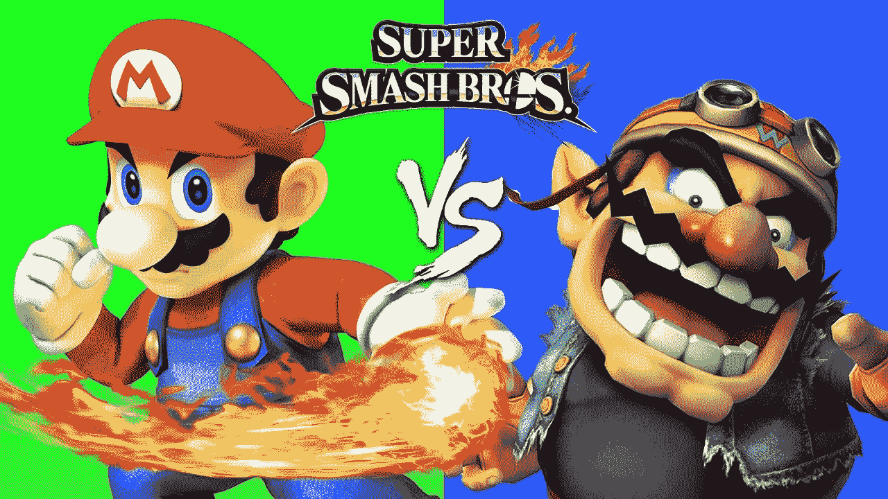

## 使用逻辑回归和卷积神经网络对视频游戏图像进行分类

从我的学龄前时代，我记得花了很多时间在我最喜欢的游戏男孩身上玩游戏。我最喜欢的两个平台游戏是马里奥和瓦里奥。我记得当我的祖母看了一眼我正在玩的游戏，问我那是什么。我解释说是超级马里奥。过了一段时间，当她看到我又在玩游戏时，她看着屏幕说:“又是马里奥？这个游戏有多长？”但这是一场完全不同的比赛，瓦里奥。这种记忆启发我尝试图像识别，并尝试看看我是否可以训练一个分类器来准确识别一些截图的来源。

在本文中，我使用了两种方法。基本的是逻辑回归，比较高级的是卷积神经网络(使用 Keras 配合 TensorFlow 后端)。我并不专注于解释算法背后的逻辑或数学，因为已经有大量关于 Medium 和其他地方的优秀文章。相反，我试图展示一个简单、随机的想法如何快速转化为数据科学项目。

为了简洁起见，我只发布了一些代码片段，而完整的代码可以在我的 GitHub 上找到。

# 数据准备

本着儿时的回忆，我选择了两款游戏进行这次实验:*超级马里奥之地 2: 6 金币*和*瓦里奥之地:超级马里奥之地 3* 。我选择这些游戏不仅是因为它们是我当时最喜欢的，而且在检查游戏的图像时，人们可以看到它们在视觉上非常相似，这应该会使任务变得有点困难！

我想知道从这些游戏中获取大量截图的最好方法是什么，于是决定从 Youtube 上的一个视频中“抓取”下来。Python 的`pytube`库可以帮助完成这项任务。我可以毫不费力地用几行代码下载整个视频。

下一步包括从视频中剪切帧。为此，我迭代所有帧(使用`OpenCV`库),并且只将每第 *n* 帧保存到指定的文件夹中。我决定用 10k 的图像(每场 5k)。在这两种方法中，我将使用相同的 80-20 训练测试分割来确保可比性。

当抓取帧时，我跳过了视频的前 60 秒，其中主要包含开场序列和菜单(我没有在视频结尾这样做，所以可能会包含一些噪声，但我们会看到的！).

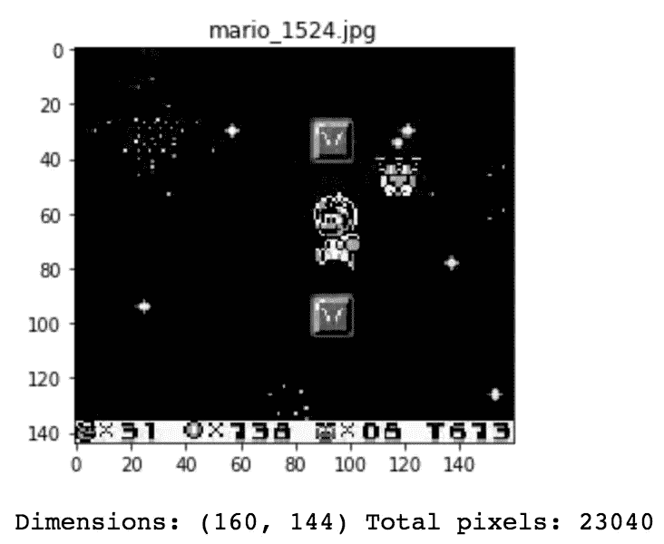

A sample image from Mario class

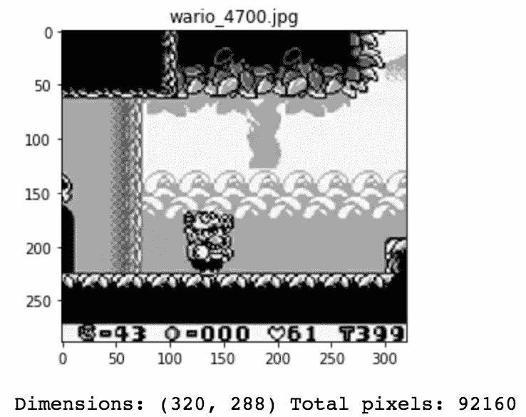

A sample image from Wario class

在看了预览后，很明显这些图像的大小不一样。这就是为什么我把它们重新调整为 64x64 像素。此外，对于逻辑回归，我会将图像转换为灰度，以减少模型的特征数量(CNN 将处理 3 个颜色通道)。

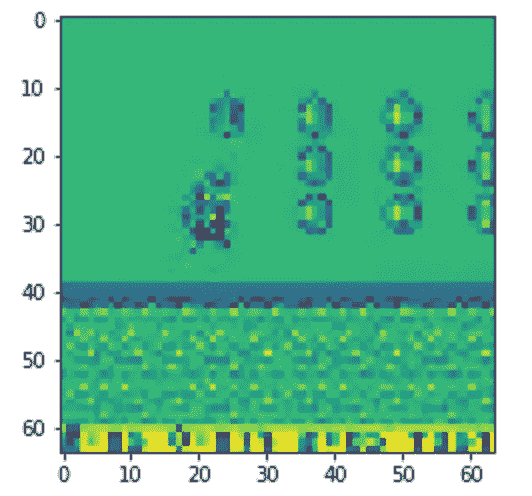

64x64 greyscale image for logistic regression

# 逻辑回归

我将从更简单的模型开始。逻辑回归是一种基本的二元分类器，*即*，使用一组预测器来分配两个类别中的一个。

话虽如此，要使用逻辑回归来解决图像分类问题，我首先需要准备数据。输入应该与从`Scikit-Learn`开始的其他模型完全相同，即特征矩阵 *X* 和标签 *y* 。

由于本文的目标是展示如何为一个特定的问题构建一个图像分类器，所以我不关注算法的调整，而是使用逻辑回归的默认设置。让我直接跳到结果！

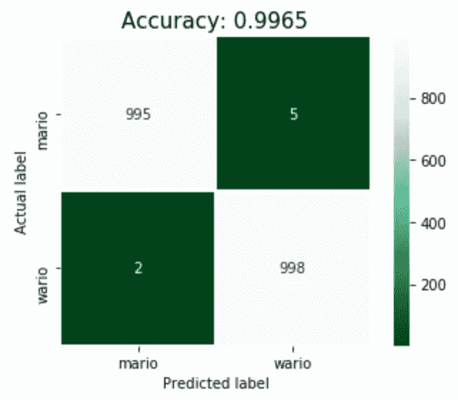

Confusion matrix for logistic regression’s predictions on the test set

上面我给出了测试集的结果，因此模型无法用于训练的部分数据(20%的数据)。这看起来很棒，实际上可能有点好得难以置信。让我们检查几个正确/错误分类图像的例子。

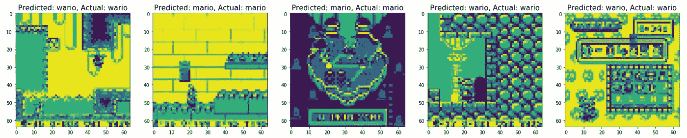

Correctly classified images

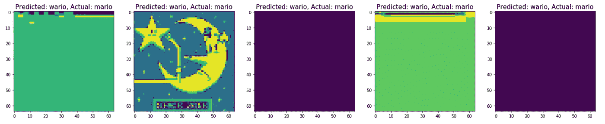

Misclassified images

5 张图片中有 4 张被错误分类，这背后的逻辑非常明显。这是一些模型实际上不能做任何事情的转换屏幕。第二个屏幕来自《超级马里奥》中的关卡地图，与游戏的其余部分明显不同(这里不是平台化游戏)。但是，我们也可以看到，该模型正确地分类了另一张地图(正确分类的图像中的图像 3)。

# 卷积神经网络

这部分显然会比逻辑回归复杂一点。第一步包括以特定的方式存储图像，这样 Keras 就可以施展它的魔法了:

```
mario_vs_wario/
    training_set/
        mario/
            mario_1.jpg
            mario_2.jpg
            ...
        wario/
            wario_1.jpg
            wario_2.jpg
            ...
    test_set/
        mario/
            mario_1.jpg
            mario_2.jpg
            ...
        wario/
            wario_1.jpg
            wario_2.jpg
            ...
```

这个目录树显示了我如何为这个特定的项目构建文件夹和文件。下一部分是数据扩充。这个想法是对可用的图像应用一些随机变换，以允许网络看到更多独特的图像用于训练。这将防止过度拟合并导致更好的泛化。我只使用了一些变换:

*   重新缩放-在进行任何其他处理之前，数据将乘以的值。原始图像由 0-255 范围内的 RGB 系数组成。对于模型来说，这样的值可能太高而无法处理(以典型的学习率)，因此乘以 1/255 的因子会将变量重新调整到 0-1 的范围内
*   shear _ range 用于随机应用剪切变换
*   zoom_range —用于随机缩放图片
*   horizontal_flip —用于水平随机翻转一半的图像(当没有水平不对称的假设时相关，例如真实世界的图片)。我决定不使用这个功能，因为在视频游戏截图的情况下，这将毫无意义(数字等)。)

当指定图像的路径时，我还确定了我要输入到神经网络的图像的大小(64x64，与逻辑回归相同)。

下面我展示了一个应用一些变换后的图像的例子。我们看到图像在两侧被拉伸。


现在是时候定义 CNN 了。首先，我初始化 3 个卷积层。在第一个例子中，我还需要指定输入图像的形状(64x64，3 个 RGB 通道)。后来，Keras 自动处理大小。对于所有这些，我使用 ReLU(校正线性单位)激活功能。

卷积层之后是扁平化。由于最后两层基本上是一个常规的人工神经网络分类器，我需要将卷积层的数据转换成 1D 向量。在这两个密集层之间，我还使用了 dropout。简单来说，dropout 在训练过程中忽略指定数量的神经元(随机选择)。这是一种防止过度拟合的方法。最后一个密集图层使用 sigmoid 激活函数，并将返回给定观测值属于其中一个类的概率。最后一步基本上就是逻辑回归所做的。

现在是时候运行 CNN 了(这可能需要一段时间……)。我使用 ADAM 作为优化器，选择二进制交叉熵作为该二进制分类任务的损失函数，并使用准确度来评估结果(不需要使用不同的度量，因为在这种特定情况下，准确度是我感兴趣的)。

那么神经网络表现如何呢？让我们看看！

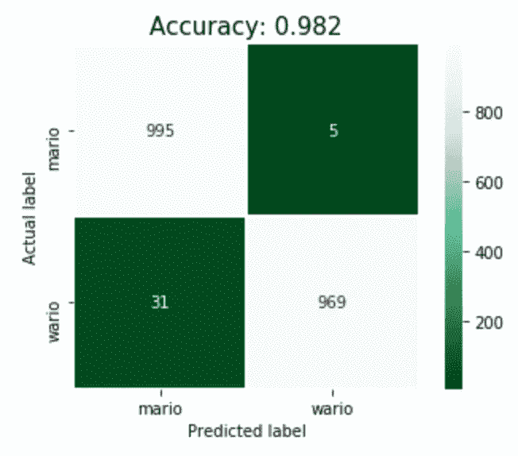

Confusion matrix for CNN’s predictions on the test set

嗯，精确度低于逻辑回归的情况，但对于这样一个快速建立的模型来说，它仍然是非常好的。可以通过改变卷积/密集层的数量、改变丢失、对图像执行额外的变换等等来微调网络。也可能是转换隐藏了图像中的一些数据(例如图像底部的摘要栏)。事实上，我最初怀疑这个条可能在识别图像中起重要作用，因为它出现在几乎所有的截图中，并且在两个游戏之间略有不同。但是我一会儿会回来。

现在是时候检查几个正确/错误分类图像的例子了。乍一看，不同之处在于，在这种情况下，没有像屏幕转换这样明显的错误分类例子。

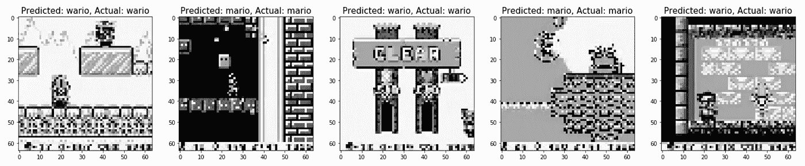

Correctly classified images

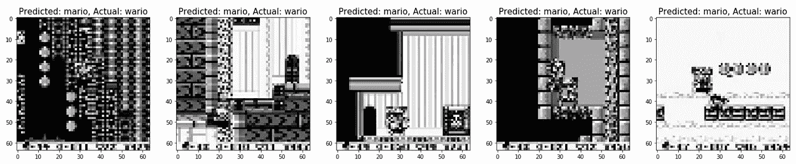

Misclassified images

# 用石灰解释分类

作为奖励，我尝试用 LIME(本地可解释模型不可知解释)解释 CNN 的图像分类。模型不可知意味着 LIME 可以应用于任何机器学习模型。它基于修改单个观察的特征值并观察对预测的影响的思想。我强烈推荐介绍这个想法的论文[2]。

下面我展示了应用石灰解释图像的结果。绿色区域表示对预测类别的积极影响，红色表示消极影响。从正确分类的案例中，我们看到角色总是在绿色区域。这是符合逻辑的。然而，对于不真实的负面情况，一些图像也只有一种颜色。这提供了一些见解，但我认为通过额外的修补，甚至可以从石灰解释中提取更多。

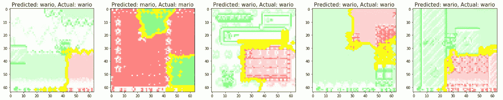

LIME explanation for correctly classified images

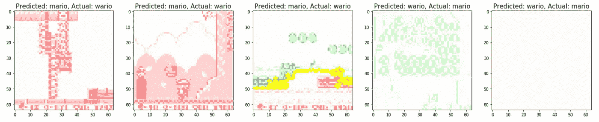

LIME explanation for misclassified images

# 结论

在本文中，我介绍了如何将一个随机的想法快速转化为一个图像分类项目。这两种方法在数据集上都表现得很好，我相信 CNN 可以通过一些调整获得更好的成绩。

进一步修补的一些潜在想法:

*   添加更多游戏(不同的平台游戏或不同的马里奥/瓦里奥系列)来研究模型在多职业环境中的表现
*   准备数据的不同方法——我可以从当前图像的中间截取更大的图像(128x128，因为两个视频都有更大的分辨率)。这也可以解决底部摘要栏的潜在问题。
*   在 CNN 的数据生成步骤中添加额外的图像变换
*   尝试检测图像中的马里奥/瓦里奥(物体检测问题)

我希望你喜欢这篇文章。如果您对框架或模型的潜在改进有任何建议，请在评论中告诉我！你也可以通过 [Twitter](https://twitter.com/erykml1) :)联系我

本文中使用的代码可以在我的 [GitHub](https://github.com/erykml/mario_vs_wario) 上找到。

参考资料:

[1] Keras 在 CNN 上的博文:[https://blog . Keras . io/building-powerful-image-class ification-models-using-very-little-data . html](https://blog.keras.io/building-powerful-image-classification-models-using-very-little-data.html)

[2]石灰纸:[https://arxiv.org/pdf/1602.04938.pdf](https://arxiv.org/pdf/1602.04938.pdf)

免责声明:我不拥有任何与 YouTube 内容或视频相关的视频游戏的权利。