# 在线零售数据的购物篮分析

> 原文：<https://towardsdatascience.com/market-basket-analysis-on-online-retail-data-24ee7214a762?source=collection_archive---------7----------------------->

你有没有注意到，在杂货店里，面包和牛奶往往离得很远，尽管它们通常是一起购买的？这是为什么呢？这是因为他们想让你逛遍整个商店，注意面包和牛奶之间的其他商品，也许会买更多的商品。这是一个应用**市场篮子分析** (MBA)的完美例子。MBA 是一种建模技术，其理论基础是，如果你购买了某一套商品，你或多或少会购买另一套商品。这是一项用于发现*关联规则*的基本技术，可以帮助增加公司的收入。

在我之前的一篇文章([预处理大型数据集:50 万以上实例的在线零售数据](/preprocessing-large-datasets-online-retail-data-with-500k-instances-3f24141f511))中，我解释了如何处理 50 万以上观察值的庞大数据集。我将使用相同的数据集来解释 MBA，并找到潜在的关联规则。

正在使用的软件包有:

*   **plyr** —函数 *ddply* 所必需的，该函数允许根据指定的标准创建项目集
*   **arules**——一个非常有用的包，有许多选项，其中一个是函数 *apriori* ，它可以根据一起购买的商品的频率来查找关系
*   **arulesViz**—*arules*包的扩展，具有关联规则和频繁项目集的各种可视化技术

已经使用 *ddply* 功能创建了项目集；对于数据框的每个子集，将应用一个函数，并将结果合并到一个数据框中。我们将按变量*发票号*进行拆分。物品清单已写入“Items_List.csv”文件，交易已使用 *read.transactions* 函数扔入“篮子”中。以下是篮子的摘要:

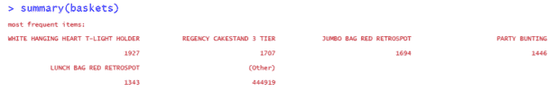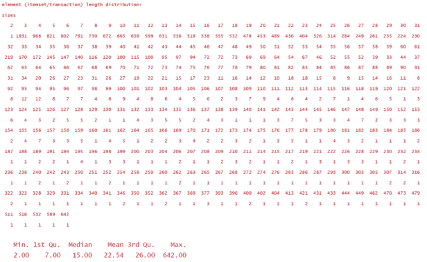

我们可以在上面看到哪些是最常购买的项目，以及项目集长度分布和基本统计数据。挺有用的！人们平均购买 23 件商品。

看看前 15 本畅销书可能会很有意思。可以改变 *topN* 参数或将*类型*切换到“相对”状态。

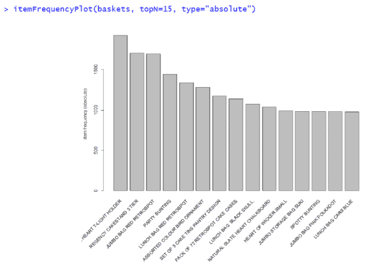

接下来，使用*先验*函数，我们能够生成规则。我们将支持度设置为 0.005，它应该很小，因为我们有一个大的数据集，否则我们可能会得到很少的规则。置信度设置为 75%。总共生成了 678 条规则:

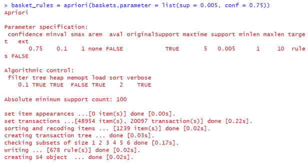

这些规则已经按照可信度降序排列，在下面的总结中，我们可以看到规则的长度分布(从 2 到 6)。我们也看到最小和最大的支持、信心和提升。我们看到最大升力接近 122%。最小值是 8.691%，这表明这些项目出现的频率比预期的少得多。这两个信息在 MBA 中都非常有用——非常小的提升不应该被忽略！

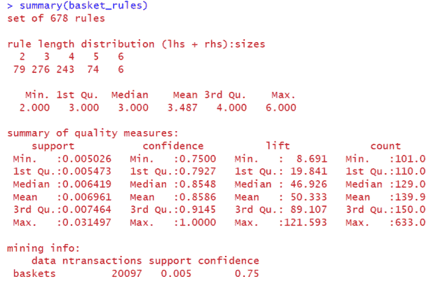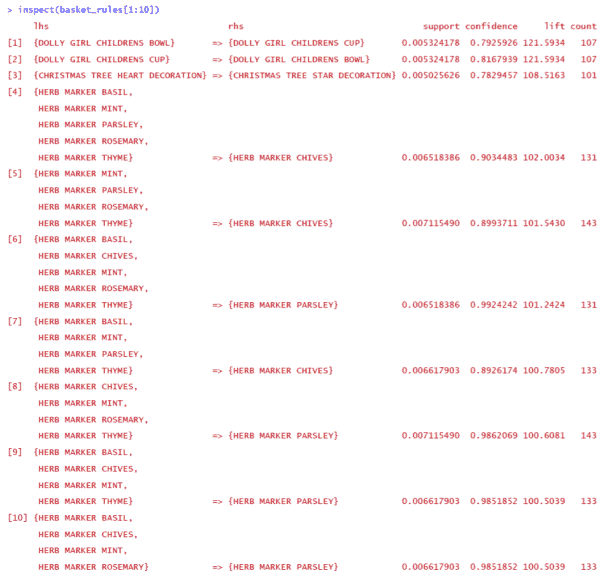

arulesViz 软件包让我们能够可视化我们的发现。我们在下面看到我们所有规则的散点图。暗红色的点表示高度提升。那些规则往往有较高的可信度，但支持度较低。

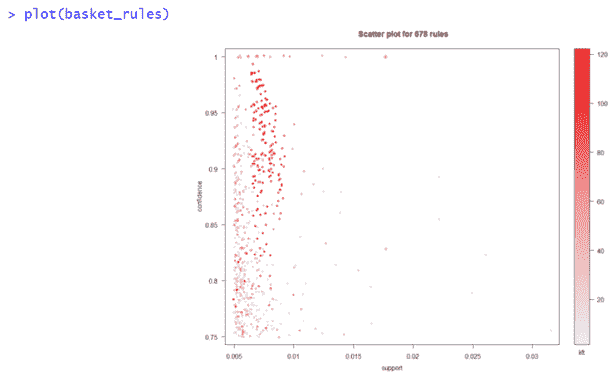

我们可以通过在*先验*函数中指定 *maxlen* 来轻松控制规则的最大长度。这是在创建 *basket_rules2* 时完成的。当我们希望规则简洁时，这非常有用。在这种情况下， *maxlen* 被设置为 3。

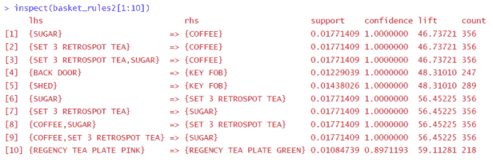

另一种可视化规则的方式是下图。我们在图表中看到一些圆圈。圆圈越大，支撑越大。圆圈的颜色与升力有关。大圆圈代表支持度高的规则。

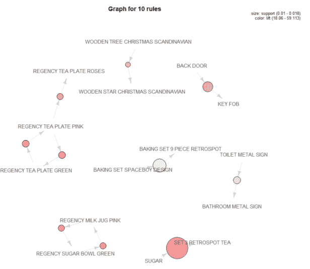

也可以将项目作为目标来生成规则。例如，我们可能对顾客在喝咖啡之前可能会买什么感兴趣。在*先验*函数中，我们将*外观*设置为带有 *default = "lhs"* (左手边)和 *rhs = "COFFEE"* 的列表。我们发现了 5 种通常与咖啡搭配的食物。

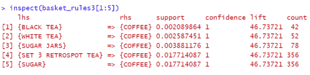

糖之后顾客可能会买什么？让我们来了解一下！

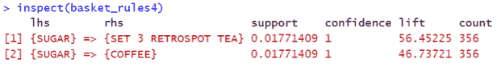

当然是咖啡！:)

MBA 吸引了众多零售公司的目光。零售业本质上是高度以客户为中心的，零售商正在不遗余力地寻找新的方法来更好地了解他们的客户。利用 MBA，零售商不仅可以确定目标市场，还可以通过创造、提供和交流卓越的客户体验来扩大客户群。MBA 允许零售商快速查看客户购物篮的大小、结构、数量和质量，以了解购买产品的模式。然而，MBA 给零售业从业者带来的好处要多得多。

完整的 R 代码，请访问我的 [GitHub 简介。](https://github.com/dinajankovic/Market-Basket-Analysis-Online-Retail)