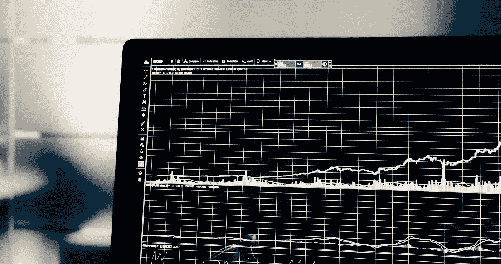
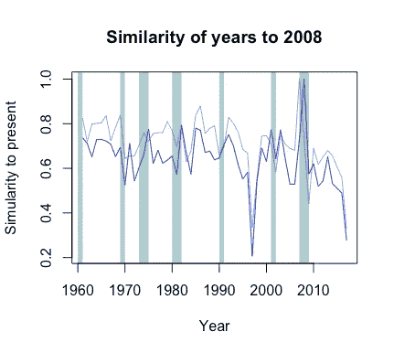
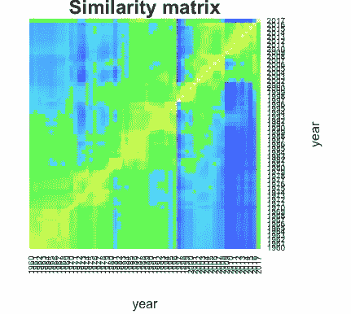
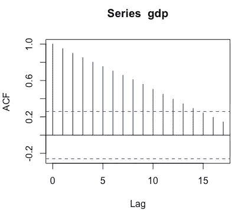
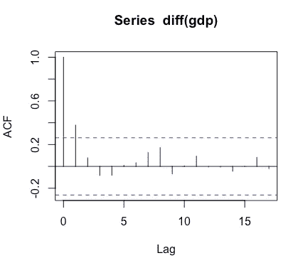

# 用相似方法进行市场评估

> 原文：<https://towardsdatascience.com/market-evaluation-with-similarity-methods-e50eacca34b9?source=collection_archive---------7----------------------->

探索当前市场状况的一个方法是将今天与历史上类似的时期进行比较，然后观察在那个时期什么成功了，什么失败了。尽管小样本和不断变化的世界存在明显的缺陷，但这种方式的分析仍然是政策、投资和社会努力的有趣起点。

探索这一点的一个策略是收集过去几十年中一系列指标的数据，以表明这两年有多相似，至少在感兴趣的指标方面是如此。国际货币基金组织提供了大量的时间序列数据——这里我只关注美国和国内的数据来源。仅这一项就为国家的金融、宏观经济和社会状况提供了 1500 多项指标，可以通过应用一些启发法来缩小范围:

*   仅包括以通货膨胀调整值或百分比表示的变量。
*   不要为同一个概念包含多个变量，以避免多重共线性和特定指标的权重过大。

这些变量被归一化以消除比例效应。宏观经济变量的一个问题是，它们通常是非平稳的，这是一种奇特的说法，即它们受到前几年价值的严重影响。一个明显的例子是国内生产总值，我们预计国内生产总值将只是一个小的(希望是积极的)不同于去年的国内生产总值。一种方法是只考虑 GDP 的变化量，或者一年和前一年的 GDP 差异。这种转换也适用于所有使用的指标。

每个经过处理的指标在给定年份的值被表示为一个向量。

基本上，向量定义了空间中的一个点。为了评估两个点有多相似，我们可以测量这两个点有多接近。通过将指标存储为向量，我们可以使用基于向量的距离度量，例如欧几里德距离，来评估两个向量有多相似。

评估每一对年份之间的相似性可以让我们绘制出相似性如何随时间演变的图表，如下图所示的 2008 年。值得注意的是，其他衰退年份显示出与 2008 年的高度相似性，2008 年本身就是一个衰退年。

或者，我们可以绘制一个相似性热图，尽管这很难解释。

# 技术札记

## 变量的非平稳性

变量的非平稳性可以通过变量的自相关来检测，自相关测量变量与不同年份前的过去值的相关程度，其*滞后*。

GDP showing significant autocorrelation, indicative of non-stationarity

差异 GDP 变量的自相关如下所示，其快速下降表明非平稳性已被消除。这使得它的积分阶为 1，即 I(1)。

