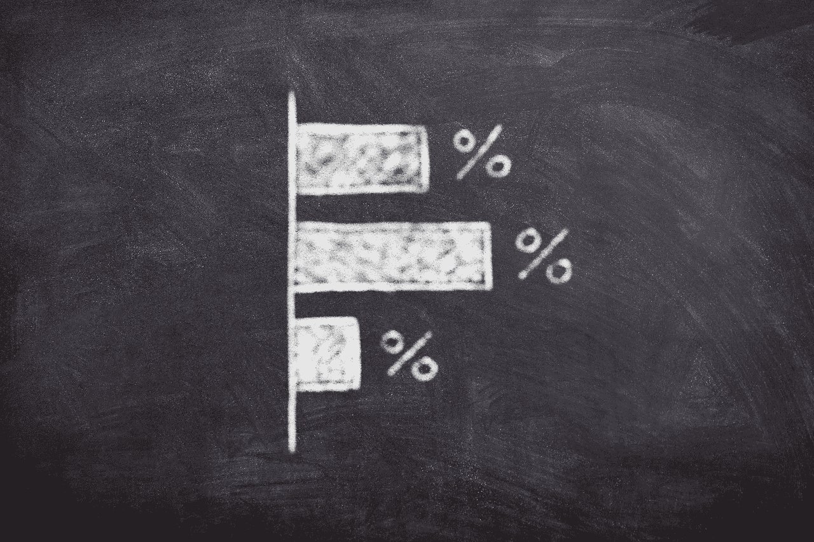
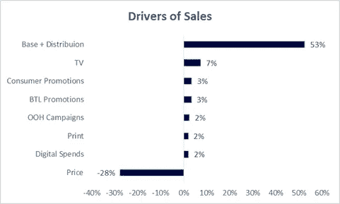
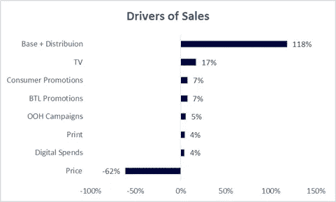

# 市场组合建模 101 —第二部分(贡献图)

> 原文：<https://towardsdatascience.com/market-mix-modeling-101-part-2-95c5e147c8a3?source=collection_archive---------4----------------------->

Source: [Pixabay](https://pixabay.com/en/board-chalk-finance-graphic-chart-3704099/)

大家好。新年快乐！

在我的上一篇文章中，我已经向您介绍了市场组合建模的概念。如果您想要复习，请点击下面的链接:

[https://towards data science . com/market-mix-modeling-mmm-101-3d 094 df 976 f 9](/market-mix-modeling-mmm-101-3d094df976f9)

在这篇文章中，我将解释如何解读贡献图，以及应该避免哪些常见的陷阱。

## **那么，什么是贡献图呢？**

贡献图是一种直观的方式来表示哪些营销投入推动了销售，以及每个营销投入的影响有多大。**以视觉方式展现市场现实，总是有助于减轻时间紧迫的客户的认知负担。**

## **贡献图表的类型:**

贡献图通常以两种方式绘制:

1.总计为 100 的绝对贡献

2.总计为 100 的非绝对贡献

1.  **总计为 100 的绝对贡献**

为了解释上面的贡献图，我们假设已经销售了 100 个单位的产品。

在售出的 100 个单位中，即使营销人员不投资任何形式的广告，也会售出 53 个单位。基本上，这 53 个单位的销售是因为品牌在市场上的资产和它在过去在客户心目中创造的意识。类似地，通过电视广告售出 7 台，通过消费者促销和 BTL 促销各售出 3 台。

正确解释价格是理解 MMM 贡献的关键。很多时候，人们被误导了，因为当提到代表价格的负号时。请注意，当我们用价格上的负号对上图中的贡献进行求和时，总和是 44 而不是 100。

如果我们忽略价格上的负号，贡献的总和将是 100。因为大多数品牌的销量和价格呈负相关(该死的苹果！)，价格贡献用负号表示，以表示它可能导致的销售损失量。

此处，价格的负号表示由于价格上涨，损失了 28 个销售单位。这是一个概念性的概念，描述了如果价格没有增加，可以获得 28 个额外的销售单位。

除了价格之外，出于同样的原因，竞争对手的活动在贡献上也用负号表示。

**2。** **非绝对贡献总和为 100**

第一种解释贡献的方法对一些人或客户来说有点混乱。因此，有另一种方法可以用来解释结果。

在上面的图表中，我们可以看到总贡献总和为 100%，负号保持不变。

因此，从这张图表中我们可以看出，该品牌售出了 162 件(所有积极贡献的总和)。在售出的 162 个单元中，118 个单元的销售来自基础和分销。电视广告等推动了 17 台的销售。由于价格上涨，已经失去了 62 个销售单位。因此，总销售量为 100 台。

## **解释贡献图时要避免的陷阱:**

**1。** **仅仅依靠捐款:**

市场组合模型用整体方法解释。仅仅使用贡献百分比不是解决市场组合建模问题的正确方法。贡献图之后是计算投资回报率。

可能会有某个变量显示贡献与使用的数据一致，但会显示不稳定的 ROI 数字。在这种情况下，贡献被调整以获得所有的结果。

**2。** **不将贡献与基准进行比较**

建议将模型的贡献与类似品牌/类别的基准数据进行比较，以衡量贡献结果的准确性。这有助于在到达 ROI 计算阶段之前验证结果。从领域的角度来看，可以调整模型以使结果更加准确。

**3。** **平衡统计和域:**

一些 MMM 模型在统计上是稳健的，但可能没有商业意义，反之亦然。领域知识应该与统计数据结合使用，以利用业务洞察力。

所以，这些是在 MMM 上工作时需要考虑的一些事情。当然，MMM 是一个很大的话题，并且有进一步的细微差别。我希望在不久的将来写更多关于这个话题的文章。

如果你喜欢我的文章，给它一些掌声，或者更好地与你的朋友或同事分享。

最近，很多人问我是否做市场组合建模/营销分析方面的咨询。

答案是肯定的。您可以将您的咨询问题发送到[https://www.arymalabs.com](https://www.arymalabs.com/)

领英:[https://www.linkedin.com/in/ridhima-kumar7/](https://www.linkedin.com/in/ridhima-kumar7/)

推特: [@kumar_ridhima](https://twitter.com/kumar_ridhima)

**版权所有 2018**[**www.ridhimakumar.com**](http://www.ridhimakumar.com)**版权所有。**