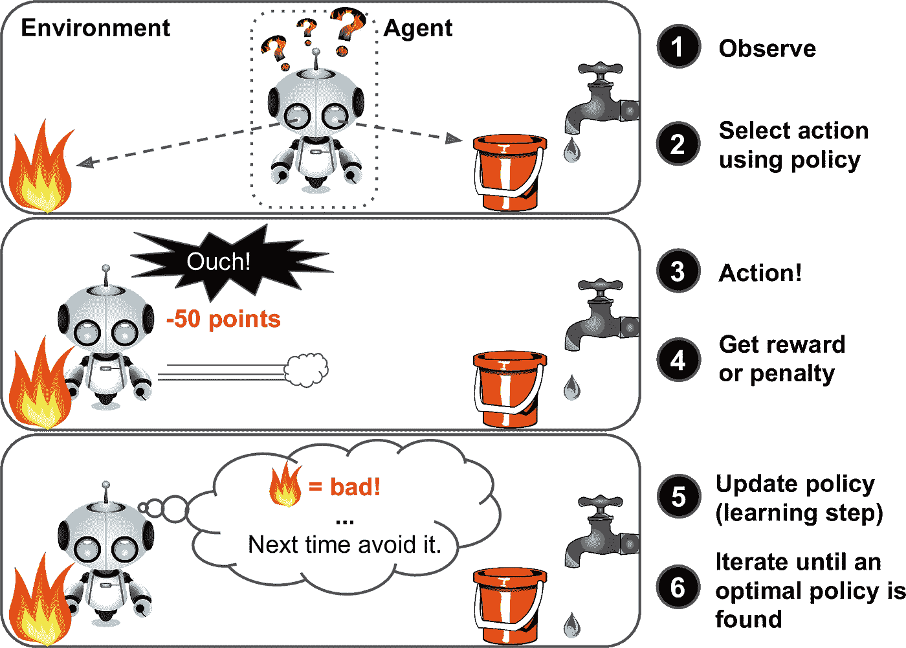
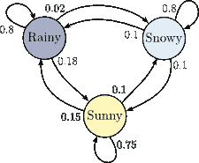
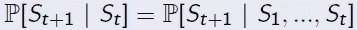

# 马尔可夫链——对生活的一种理解

> 原文：<https://towardsdatascience.com/markov-chains-a-take-on-life-35614859c99c?source=collection_archive---------0----------------------->

给定现在，未来独立于过去

在我最近上的另一堂课的第 24 张幻灯片中，有一句看似无关紧要的话，却完全揭示了我们是如何思考和行动的(至少我是这样思考和行动的)。在我开始之前，让我给你简单介绍一下我是如何偶然发现这句话的。我还将冒昧地提供一个小窥视模型的工作原理，其标语可能价值数百万美元。

最近我开始看[这些](https://www.youtube.com/playlist?list=PLHOg3HfW_teiYiq8yndRVwQ95LLPVUDJe)关于[强化学习](https://en.wikipedia.org/wiki/Reinforcement_learning)的讲座，由[谷歌 deep mind](https://deepmind.com/)alpha go 团队的首席程序员大卫·西尔弗主讲。对于外行人来说，*强化学习是机器学习的一个子领域，它处理基于代理人收到的奖励做出决策的过程*。请允许我更清楚地说明这一点:代理人可以实现的任何目标都可以用期望累积报酬的最大化来描述。通俗地说，如果一个代理想要完成它的目标，那么与它为达到目标所采取的行动相关的回报将会最大化。

An example of RL for the robot agent. Image from [Safaribooksonline](https://www.safaribooksonline.com/library/view/hands-on-machine-learning/9781491962282/ch01.html)

举个例子，考虑让一个人形机器人学会走路的过程；正奖励可能由机器人到达目的地(或在目的地的方向上迈出每一步)构成，而负奖励可能与机器人摔倒的动作相关联，或采取使其远离目标的动作相关联(这是一个天真的例子，因为如果机器人正在探索更好的全局路径以达到目标，则它可能实际上在远离目标时获得正奖励)。正是通过这些积极和消极奖励的结合，机器人最终学会了如何到达它的潜在目的地。

这种过程可以很容易地通过代理人处于某个状态，并通过考虑所有立即可获得的未来状态的回报并朝着回报最大的状态移动而采取行动来可视化(是的，这听起来有点不真实，但相信我这不是)。不难分析，一个贪婪的代理人会采取一种行动，这种行动对应于从当前状态可能获得的最高回报。

马尔可夫链是强化学习的支柱，因为它们以一种非常简单的方式帮助建立决策的概念；代理已经处于的状态的整个序列可以归结为它的当前状态，即，下一个可到达的状态可以由代理的当前状态来预测，而不管代理已经处于的状态的历史序列。下图简洁地说明了这个想法:

A simple Markov Model

边上的标签表示从当前状态移动到下一个状态的概率。例如，如果今天下雨，明天下雪的概率是 0.02，下雨的概率是 0.8 等等。

另一个解释马尔可夫链的简单例子是:假设你正在访问一个群岛，有桥连接着这些岛屿。这些桥代表了从一个岛移动到另一个岛的可能性。你明天要去的岛是由你今天所在的岛决定的，你以前的职位与这个决定无关。

对于面向数学的，马尔可夫模型的公式可以描述为:

一个状态 *S_t+1* 是**马尔可夫**当且仅当(原谅没有下标) :

解释:在给定代理处于[RHS]的整个状态序列的情况下，移动到下一个状态的概率等于在给定当前状态[LHS]的情况下，移动到下一个状态的概率。换句话说，由于过去状态的所有信息已经浓缩在代理的当前状态中，我们可以假设从当前状态到下一个状态的转移概率完全取决于当前状态。

这也可以表述为:

*鉴于现在，未来独立于过去。*

正是第一堂课幻灯片中的这一行，让我意识到这句话不仅适用于马尔可夫模型，也适用于我们所有人的生活。塑造我们未来的决定完全取决于我们在当前心态下做出的选择；我们过去的所有经历都隐含在我们现在的状态中，因为它们引导我们走到了今天。

对过去的选择感到遗憾不会改变宇宙中事情将如何发展的更大计划，哀叹只会让我们付出代价，并模糊我们未来的决策过程。所以，让我们试着通过充分利用我们此刻所处的状态来放下过去。

让我们通过分析给定我们当前情况下所有可能行动的回报，来模拟一个理性主体做出最优决策。还有什么比人类一直做出理性决策更好的 AI，我说的对吗！；-)