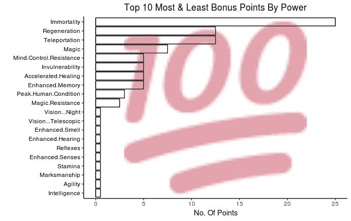
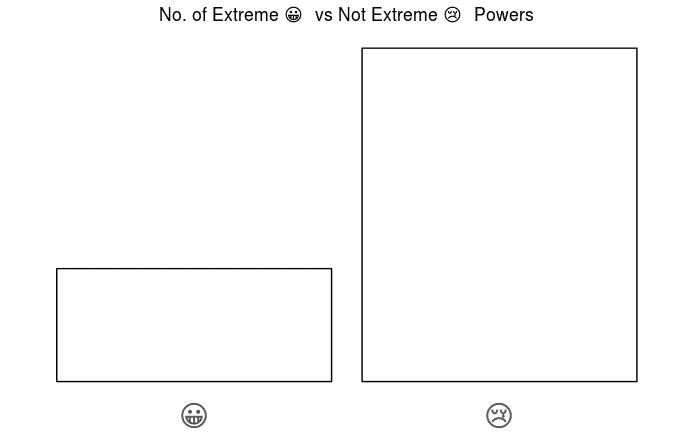
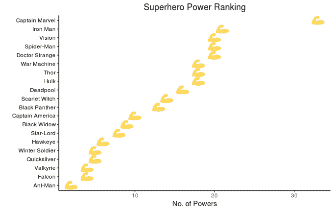
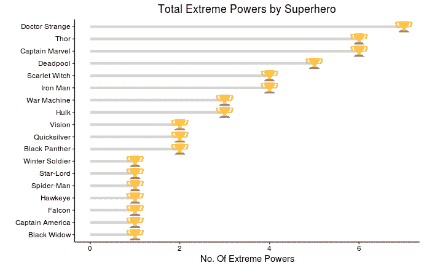
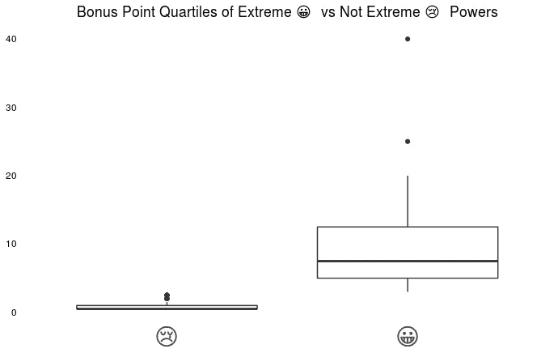
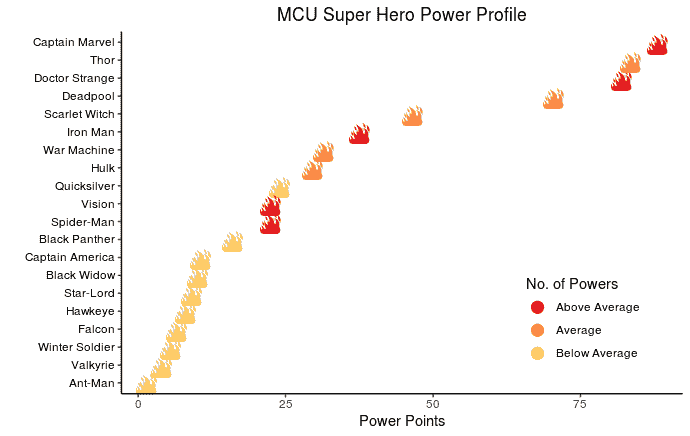

# 漫威电影宇宙超级英雄排名:表情可视化

> 原文：<https://towardsdatascience.com/marvel-cinematic-universe-exploratory-data-analysis-an-emoji-visualisation-of-superhero-powers-e815821066d4?source=collection_archive---------11----------------------->

我和其他人一样喜欢好的超级英雄电影。动作场面真正构成了这些电影的大部分。

Photo by [Raj Eiamworakul](https://unsplash.com/photos/o4c2zoVhjSw?utm_source=unsplash&utm_medium=referral&utm_content=creditCopyText) on [Unsplash](https://unsplash.com/search/photos/marvel?utm_source=unsplash&utm_medium=referral&utm_content=creditCopyText)

> 没有超能力的超级英雄算什么？

有两个主要的超级英雄电影系列:漫威电影宇宙(MCU)和 DC 扩展宇宙(DC 扩展宇宙)。可以说， [MCU 正在赢得](https://www.forbes.com/sites/markhughes/2018/02/08/how-marvel-studios-movies-and-dc-extended-universe-films-stack-up-at-the-box-office/#70d4a504604e)票房和整体营销游戏。另外，我喜欢《死侍》,我为惊奇队长感到非常兴奋。因此，尽管我欣赏黑暗和坚韧不拔的 DC 扩展宇宙风格，单片机是我目前的最爱。

当我看 MCU 电影，尤其是复仇者联盟电影时，有一个问题一直困扰着我——谁是最强大的 MCU 超级英雄？

当超级英雄面对灭霸时，基于性格和力量的分析并没有太大意义。力量胜过一切，所以最好的超级英雄也应该是最强大的超级英雄。但更大的问题是——权力的数量重要还是权力的类型更重要？

我们来看数据。

# 一.数据

这个分析使用了上传到 Kaggle 上的[超级英雄数据集](https://www.kaggle.com/claudiodavi/superhero-set)。[这是分析和可视化的代码](https://github.com/schopra1989/marvel-superhero-ranking/blob/master/MCU_Ranking.R)。数据是 2017 年 7 月从[超级英雄 DB](https://www.superherodb.com/) 刮来的。这项分析将超级英雄的力量列为 20 个最受欢迎的 MCU 超级英雄之一。我已经使用[这篇文章](https://www.businessinsider.in/the-top-18-marvel-cinematic-universe-superheroes-ranked-from-worst-to-best/articleshow/63763934.cms)作为参考排名，看看我是否可以根据数据提出一个替代方案。文章从最好到最差对以下 18 位超级英雄进行了排名:

1.  美国队长
2.  黑豹
3.  托尔
4.  奇异博士
5.  绿巨人
6.  蚁人
7.  瓦尔基里
8.  视力
9.  冬季士兵
10.  猎鹰
11.  绯红女巫
12.  蜘蛛侠
13.  星际领主
14.  黑寡妇
15.  战争机器
16.  鹰眼
17.  钢铁侠
18.  汞

这份分析中的排名包括了文章中的全部 18 位以及死池和惊奇队长。

# 二。分析

# 1.能力

本文中的 20 个超级英雄总共拥有 46 种不同的能力。权力具有以下特征:

1.  每种能力都有一个奖励点
2.  他们可能是“极端的”

## 奖励积分

永生的奖励点数最高，智力和反应能力的奖励点数最低。超级英雄的标准绝对很高，因此我更爱他们。

## 极端权力

有更少的极端力量，这很好，因为不是所有的超级英雄都是平等的。我的猜测是，拥有最极端力量的超级英雄在战斗中会比那些拥有较少极端力量的超级英雄做得更好。

# 2.超级英雄和他们的力量

## 幂的数量

惊奇队长拥有迄今为止最多的权力…

…但是在拥有“极端”力量的超级英雄中，奇异博士拥有最多的“极端”力量。惊奇队长跌至第三，钢铁侠跌至第六。

> 我们看到钢铁侠在《无限战争》中被摧毁，而雷神继续战斗，所以我同意极端力量比任何力量都重要的假设。

# 3.超级英雄和奖励积分

每种威能都有加分。如果极端力量是最好的力量，他们应该有更多的加分。让我们来看看极端与非极端奖金点四分位数。

超能力者比非超能力者得分更多。我相信分数是超级英雄整体实力的排名方式。

# 三。最终排名

从最好到最差，以下超级英雄根据与其能力相关的奖励点数总数进行排名(括号内为参考文章排名):

1.  《惊奇队长》
2.  雷神(#3)
3.  奇异博士(排名第四)
4.  《死侍》
5.  猩红女巫(#11)
6.  钢铁侠(#17)
7.  战争机器(#15)
8.  绿巨人(#5)
9.  水银(#18)
10.  愿景(#8)
11.  蜘蛛侠(#12)
12.  黑豹(排名第二)
13.  美国队长(#1)
14.  黑寡妇(第 14 位)
15.  星际领主(#13)
16.  鹰眼(#16)
17.  猎鹰(#10)
18.  冬日战士(#9)
19.  瓦尔基里(排名第七)
20.  蚁人(排名第六)

索尔和奇异博士各上升一位，而《美国队长》和《黑豹》则下降了。

> 这主要是因为如果一个超级英雄主要拥有像“智力”和“敏捷”这样的无用能力，那么大量的能力并不意味着什么。

此外，在下面的情节中，很明显，像雷神这样的超级英雄与其他 19 个超级英雄相比，只拥有平均数量的力量，但在战斗中，wayyy 比其他人更强大。

令人惊讶的是，浩克的排名在《战争机器》之后。这是因为虽然他们都有相同数量的极端力量，战争机器有更多的力量。所以，极端的权力比简单的更多权力要好。但是如果极端力量相等，拥有更多力量的超级英雄获胜。

# 四。结论

很多人都在谈论惊奇队长是迄今为止最强的复仇者。虽然根据这个排名这是真的，但如果超级英雄是根据他们的力量值来评分的话，惊奇队长并不比雷神强大多少。但最终，只有当他们面对灭霸时，我们才会知道谁是最强的复仇者。