# 了不起的女人

> 原文：<https://towardsdatascience.com/marvelous-women-b9a64745fe3b?source=collection_archive---------6----------------------->

## 关于漫威妇女的机器学习案例研究

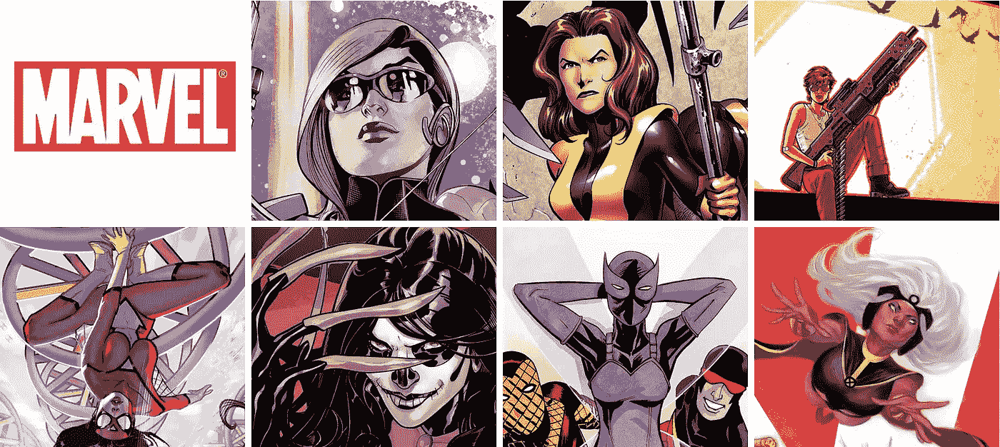

权力是个有趣的东西。当考虑谁是特定漫画世界中最强大的时候，我们通常会想到原始力量、神秘能力或宇宙能量。大多数时候，我们在这些对话中也会想到男人。但是，正如我们都逐渐认识到的那样，有许多不同种类的权力和许多不同形式的赋权。

漫威宇宙一直是一个让不可能成为可能的地方，在这里，力量以无数种形式出现，并被用于无数不同的目的。但是我们不要忘记，在一个充满无敌铁人和幻想先生的世界里，616 中一些最强大的生物是女性。

当漫威在 20 世纪 70 年代迅速扩张时，女性超级英雄往往是事后诸葛亮，被冷嘲热讽地创造为品牌延伸:蜘蛛侠诞生了蜘蛛侠，绿巨人诞生了女巨人，等等。

畅销书[漫威漫画:不为人知的故事](http://www.nytimes.com/2012/11/18/books/review/marvel-comics-the-untold-story-by-sean-howe.html)的作者肖恩·豪说:“这是亚当的肋骨效应。“这不仅仅是因为这些角色没有男性角色考虑周全；他们实际上是从他们受欢迎的财产中获得的。”

事实上，一场地震剧变正在发生。新的 Thor(是的，你必须叫她 Thor)比她的前任多卖了 30%——她的公司也不错。三年前，作家凯莉·苏·德康尼克将前漫威女士卡罗尔·丹弗斯提升为[惊奇队长](http://marvel.com/characters/9/captain_marvel)，她的冒险经历吸引了一批忠实的粉丝，他们被称为[卡罗尔军团](http://carol-corps.wikia.com/wiki/Carol_Corps_Wiki)。查尔斯·索尔在一个机智的系列中重塑了她，探索了她作为律师的日常工作。最重要的是，有 G Willow Wilson 的新漫威女士，一个叫 Kamala Khan 的 16 岁巴基斯坦裔美国穆斯林。这本书已经成为一种文化现象，被 CNN、《纽约时报》和《科尔伯特报告》报道，并受到旧金山反伊斯兰恐惧症运动者的欢迎，他们在反穆斯林的公交车广告上贴满了卡玛拉贴纸。威尔逊目前正在与玛格丽特·贝内特(Marguerite Bennett)合写一本全女性的《复仇者联盟》(A-Force)。

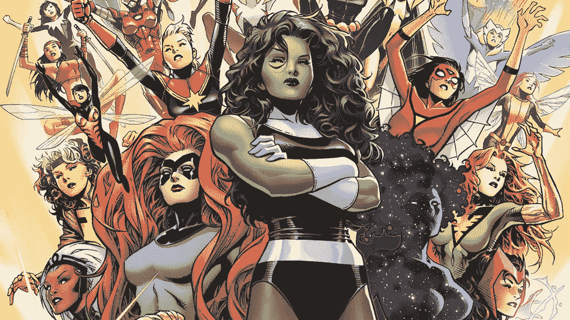

The A-Force. Courtesy of Marvel.

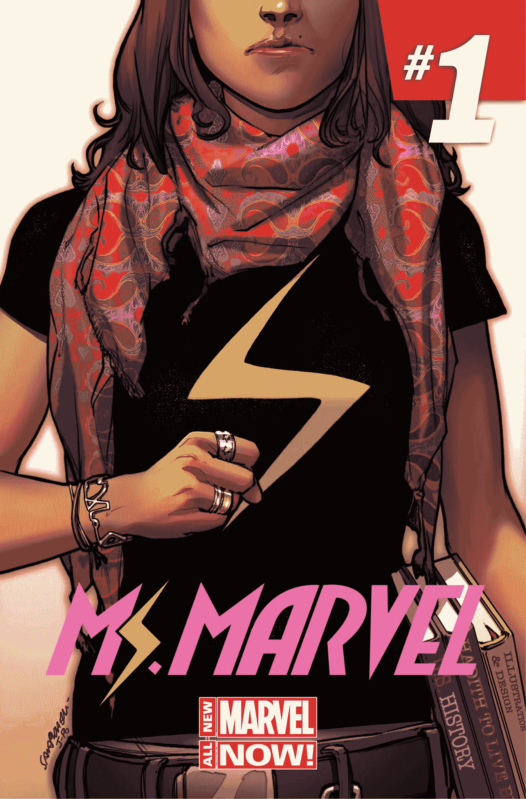

Ms. Marvel Issue #1\. Courtesy of Marvel.

与此同时，漫威的竞争对手 DC Comics 更新了老女性角色，如蝙蝠女侠、蝙蝠女侠、猫女、神奇女侠和有争议的反英雄哈利·奎因。在传统上更加进步的独立漫画世界中，有各种各样的热门系列，如《传奇》、《老鼠皇后》、《伐木工人》和《恶人+神》。

现在超级英雄接管了夏季票房，漫画中发生的事情对主流文化产生了重大影响。这些都是孩子成长过程中的特征。最近几部电影的大男子主义阵容(自 10 年前《猫女》和《埃莱克特拉》失败以来，没有女性主演过漫画电影)使这种类型的电影看起来永远是男性的，但华纳兄弟制作了 DC 原创的女权主义犯罪斗士神奇女侠的精彩展示(如此精彩，我已经看过六遍)，而漫威已经计划在 2018 年上映一部惊奇队长电影。也有新的电视节目致力于美国队长的战时同事佩吉·卡特，超能力私人侦探杰西卡·琼斯和超女。

变化的速度甚至让编剧们感到惊讶。Wilson 是一名穆斯林皈依者，他记得当《漫威》的编辑 Sana Amanat 和 Stephen Wacker 找到她要写《漫威女士》时。“[他们说:‘我们想创造一个新的青少年女性美国穆斯林超级英雄，让她出现在自己的书里。’]我想，‘你疯了。你需要雇一个实习生来打开恐吓信。所以当突然之间，每个人都在谈论它的时候，我惊呆了。我相信，如果我们在五年前尝试做完全相同的书，反应会非常不同。它出现在美国漫画史上一个非常特殊的时期。"

# 惊人的数据

我被迫使用我的编码能力来分解漫威宇宙中的英雄形象，看看这个宇宙是否反映了美国漫画的这种变化。我不仅想按性别，还想按种族、教育程度等来划分代表性。我从漫威的 API 中收集了所有漫威角色的数据。他们的数据库包括 1402 个角色，包括英雄、反派和团队！在把所有的东西汇编成一个数据框架后，我了解到这个数据集包括了 89 个不同的栏目，包括他们的国籍、教育程度、头发颜色、眼睛颜色等等。

像在任何数据集中一样，在某个地方总会有空数据，所以我不得不做更多的清理工作。重新整理数据后，我只剩下 1332 个字符。

为了避免进一步的问题，我去掉了那些没有信息的字符。科学家喜欢拥有大量的数据，这样他们就可以做大量的实验，并得到尽可能准确的结论。但是，经验告诉我们，大多数时候我们无法通过*大数据*来进行*机器学习*。我从数据中选择了以下几列:id、姓名、描述、教育、体重、身高、简历、头发颜色、眼睛颜色、国籍和出生地。我只剩下 762 个字符。

```
'wiki.hair', 'wiki.weight', 'wiki.height', 'wiki.eyes', 'wiki.place_of_birth', 'wiki.education', 'wiki.citizenship', 'wiki.occupation', 'wiki.bio', 'wiki.bio_text', 'wiki.categories', 'name', 'comics.available'
```

它们可能会提供有用信息，而且它们似乎比我试图使用的其他工具拥有更多的可用数据。

以下是新数据框的一些照片:

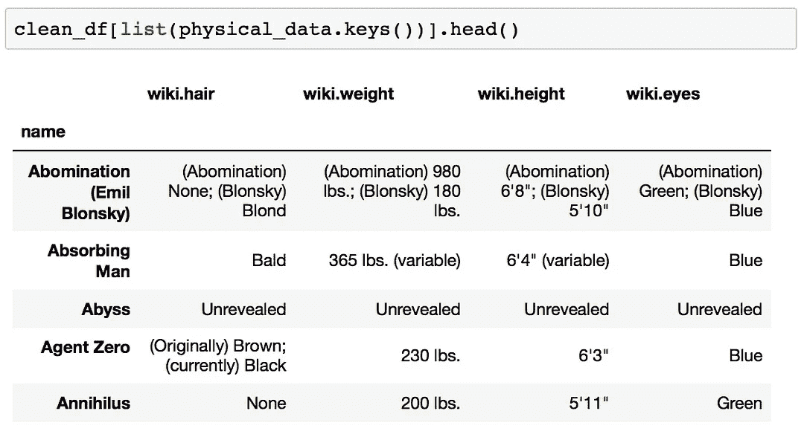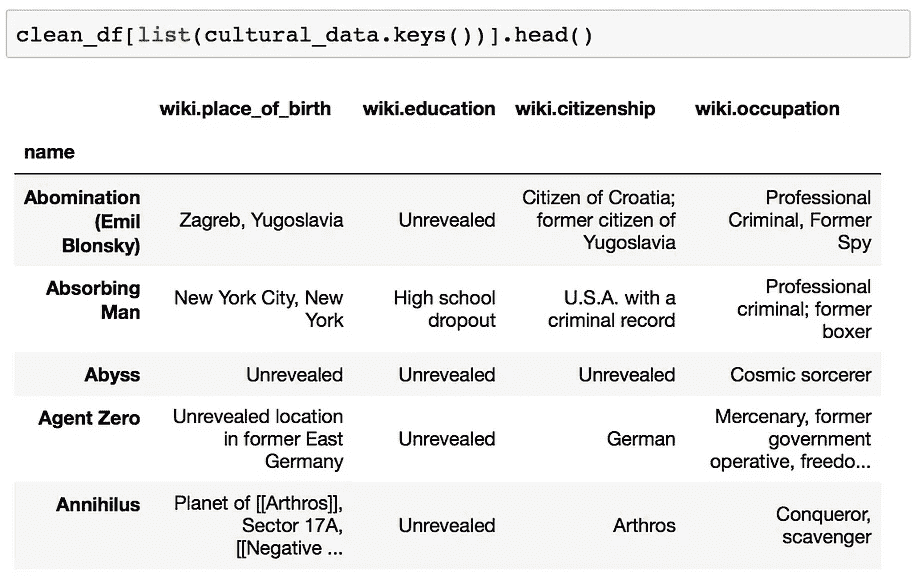

First 5 entries of physical data and cultural data

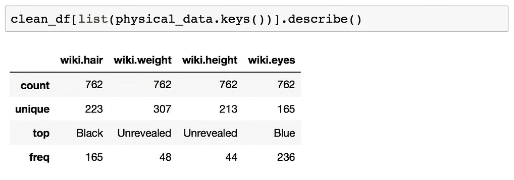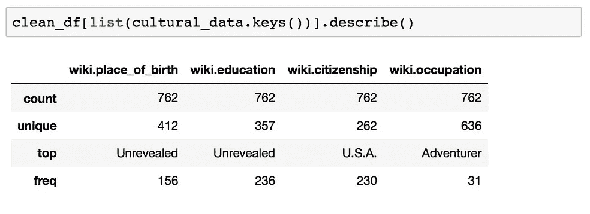

Summaries of physical data and cultural data

基于此，漫威超级英雄的原型是一个来自美国的黑头发、蓝眼睛的冒险家。

有一些有趣的信息。我决定检查一下，看看是否能找到任何女性或非白人的角色——像奈克拉、漫威女士等。原来他们确实有性别分类，也有从属分类(英雄或恶棍)，团队分类，等等，但是没有肤色分类。我认为在 API 中性别不是它自己的属性很有趣，但是这是一个开始。为了更好地理解这些信息，我用数据创建了两个新列。

*   女人:如果角色是女人，则为真，否则为假
*   恶棍:如果角色是恶棍，则为真，否则为假

经过更多的整形后，我了解到有 199 名女性和 563 名男性识别为男性或女性(我确实用最初的 1402 名进行了复查)。这些女性角色占数据框的 26%(类似于我学校的比例)

如果我们把他们分成英雄和恶棍，有 362 个男英雄，201 个男恶棍，169 个女英雄，30 个女恶棍。

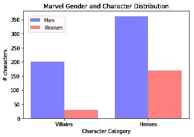

Created with matplotlib

# 奇妙的机器学习

由于新的女性角色正在崛起，我创建了一个 knn 模型来预测漫威世界的趋势，重点是身体属性和教育。我关注的是身高和体重，因为这两个类别的 NaN 最少。

## 物理性质

有成群的男人和女人表明他们保持了现实的比例。然而，男性的体重在 150 到 500 磅之间，而女性的最高体重在 250 磅左右。男性角色有更多的身高和体重异常值，而大多数女性角色坚持更现实的比例。

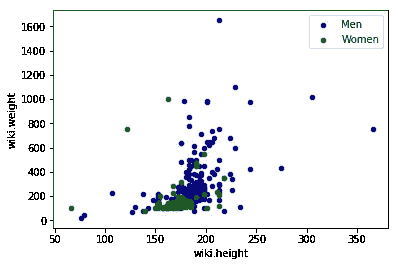

Scatterplot of height (in.) and weight (lbs) between male and female characters

根据训练模型及其数据，下面的散点图预测漫威女性将坚持现实比例。它甚至开始消除男性和女性角色中的异常值，因为有些人重达 1000 磅:

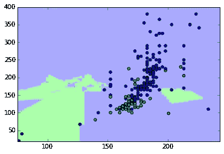

ML vis of height (in.) and weight (lbs) between male and female characters

## 公民权和教育

那里有很多不同的教育背景，但看到我从我最喜欢的漫威角色中认出的那些是很有趣的！每种教育背景都有，从像 She-Hulk 一样获得 Berkely 的通信学位，到像 [Loa](https://marvel.com/universe/Loa) 和新的漫威女士这样的高中水平课程，从像[螳螂](https://marvel.com/universe/Mantis)这样的帕马牧师的[培训，到像](https://marvel.com/universe/Priests_of_Pama) [Meggan](https://marvel.com/universe/Meggan) 这样通过电视自学，我将他们分为 9 个不同的类别:大学，基础(小学到中学)，辅导，高级(研究生学位)，军事，特殊(非传统学校环境)，未完成，和自学。

第一张图表显示了基于国籍的人物教育水平。标记越不透明，越多的字符接受这种形式的教育。纵观国际角色，很少有角色完成了大学学业，接受了特殊教育，也没有自学成才。然而，在美国，很少有女性完成本科学业，然而更多的女性获得了博士后学位。

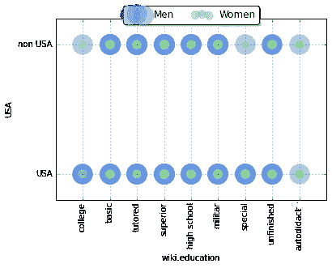

Chart showing the education levels of the characters

根据培训模型及其数据，更多的非美国公民漫威女性更有可能获得本科学位、参军、持有高中文凭或接受某种形式的特殊教育。然而，美国公民更有可能拥有高中文凭或接受过某种形式的基础教育。

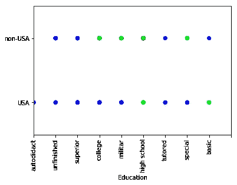

Chart showing the trends in education based on citizenship

# 结论

输入两个模型的角色和故事池预测，非美国女性角色更有可能获得高等教育学位，或更有可能获得小学和中学以外的任何其他形式的教育，所有女性角色都可能保持现实的比例。这些预测的结果反映了我们所认为的漫画故事的行业模式:关于富有冒险精神的黑头发、蓝眼睛、受过良好教育的美国男人的故事。

女性角色有潜力创造动态的故事，而不需要 gimickey 的表现。像漫威女士和惊奇队长这样的漫威人物的成功与身份政治没有什么关系，一切都与伟大的故事讲述有关。然而，新的漫威女士是一个普通的青少年，正在与父母和学校以及超级大国的责任进行斗争，这本身仍然很有共鸣。

威尔逊说:“我们不想要一本模范的少数民族书籍，它的全部目的是四处走动，展示在美国的南亚穆斯林是什么样子的。”。"卡玛拉的旅程与任何曾经是青少年的人都有关联。"

这些漫画远非说教，而是以脱离黑发蓝眼冒险家模式的英雄女主角为特色，体现了漫威的一些基本原则。在 20 世纪 60 年代，像蜘蛛侠这样的超级英雄拥有丰富的、不受束缚的生活，有金钱的烦恼和浪漫的焦虑，这让 DC 的超人和蝙蝠侠相形见绌。当神秘的 x 战警在 80 年代初成为一种现象时，克里斯·克雷蒙用反变异的偏执来比喻种族主义和同性恋恐惧症。这些英雄都有不同的感受。几十年后，引入更多的 LGBT 角色和有色人种的超级英雄才有叙事意义。因为超级英雄漫画行业很大程度上依赖于不断重塑几十年前创造的人物，所以它在反映社会变化方面处于独特的有利地位。

“有一点追赶正在进行中，”豪说。“然而，当你看到像《漫威女士》这样的作品时，你会发现漫画也能提升人们超越现状的态度。我很高兴漫威电影没有在漫威漫画充斥着丰胸缩臀的时代找到自己最大的成功。”

“人们在寻找新的故事，”威尔逊说。“像漫威女士这样的书已经改变了工业数学。他们已经改变了女性角色不卖，少数民族角色不卖，新角色不卖的行业教条。我认为这将改变所有层面的思维。我真的很想知道接下来会发生什么。”

上面的结果可能表明，但从绿巨人到漫威女士和新的女性雷神，新一代的英雄正在彻底改变漫画世界，并将性别化的刻板印象历史化。就像威尔逊一样，我很期待接下来会发生什么。

*该项目的代码和数据可以在* [*这里*](https://github.com/bethyd/Marvelous-Women/blob/master/marvel_women.ipynb) *找到。*