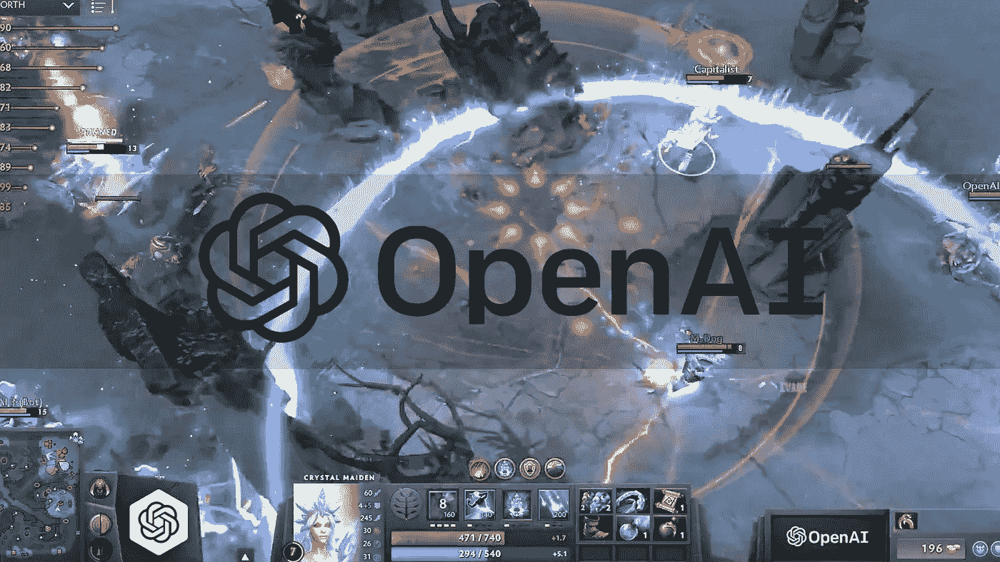
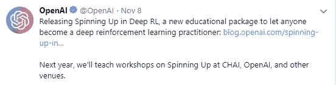

# 使用 OpenAI 的新“在深度 RL 中旋转”包掌握深度强化学习

> 原文：<https://towardsdatascience.com/mastering-deep-reinforcement-learning-with-openais-new-spinning-up-in-deep-rl-package-b86b61ab6e54?source=collection_archive---------8----------------------->

OpenAI Five

[***强化学习***](https://en.wikipedia.org/wiki/Reinforcement_learning) 是一种机器学习方法，用于教会智能体如何通过试错来解决任务。 ***深度*** ***强化学习*** 是指强化学习与深度学习的结合。

[***open ai***](https://twitter.com/OpenAI)于 2018 年 11 月 8 日*在 Deep RL* 发布了他们的深度强化学习教育包 [***。他们的发布声明似乎对我很有吸引力，其中写道:***](https://blog.openai.com/spinning-up-in-deep-rl/)

*“在*[*open AI*](https://twitter.com/OpenAI)*上，我们相信深度学习总体上——特别是深度强化学习——将在强大的人工智能技术的发展中发挥核心作用。虽然有许多资源可以让人们快速进入深度学习，但深度强化学习更具挑战性。我们设计了 Spinning Up 来帮助人们学习使用这些技术，并发展对它们的直觉。我们还看到，在 RL 中胜任可以帮助人们参与跨学科的研究领域，如*[*【AI 安全*](https://blog.openai.com/concrete-ai-safety-problems/) *，这涉及强化学习和其他技能的混合。很多人向我们寻求从头开始学习 RL 的指导，因此我们决定将我们提供的非正式建议正式化。”*

Release tweet by OpenAI.

因此，我决定快速浏览整个包，这里有一个简短的游览和对那些希望浏览完整包的人的一点建议。

# 到底什么是'**在深 RL 中向上旋转'**？

> “我们观察到，如果为他们提供正确的指导和资源，对机器学习经验很少或没有经验的人来说，快速成为实践者是可能的。Deep RL 中的 Spinning Up 正是基于这一需求而构建的。”

在深 RL 包装中旋转的*整体包括:*

## RL 简介:

用短视频和适度详细的短笔记简单介绍强化学习。涵盖的主题有 RL 、 ***RL 算法*** 和 ***中的*****概念【策略优化简介*** 。***

***我发现对于初学者来说，整个学习材料有点难以理解。关于强化学习基础知识有什么疑问，可以随时参考大卫·西尔弗的 RL [**课程**](http://www0.cs.ucl.ac.uk/staff/d.silver/web/Teaching.html) 和讲座系列。***

## ***Deep-RL 研究论文:***

***这一领域的一些顶级研究论文是按主题排列的，进一步分为子主题。论文的整体安排是按照一个非常合适的顺序进行的，任何初学者都可以一篇接一篇地轻松阅读。***

## ***算法:***

***一些顶级算法，如普通策略梯度和深度确定性策略梯度，已经在这个包中实现并准备使用。它们都是用 MLP(非递归)演员-评论家实现的，使它们适合于完全观察的、非基于图像的 RL 环境。这些算法的完整文档可以在 [**这里**](https://spinningup.openai.com/en/latest/user/algorithms.html) 找到。***

## ***实验和环境:***

***各种实验和 OpenAI 环境都包含在这个包中。还为超参数调谐提供了一个实验网格。整个实验和环境的交互大部分可以通过命令行(Shell)来控制。***

## ***练习:***

***一旦你完成了教材中面向学习的内容，最后会有几个*问题集*来测试你的技能。值得注意的是，还有一个为 OpenAI 的长期研究请求做贡献的选项。***

## *****其他实用程序:*****

***像*记录器*和*绘图仪*这样的实用程序随软件包提供，以便更好地监控和研究实验的输出和结果。***

# ***参考资料:***

***这里的 **可以参考官方文档 [**。**](https://spinningup.openai.com/en/latest/index.html)*****

***这个包的 GitHub 库可以在 [**这里**](https://github.com/openai/spinningup) 找到。***

# ***建议:***

***这个包展示了高质量的学习内容，对你成为一个活跃的 RL 社区成员来说是绰绰有余的，主要是应用方面。但是对于强化学习和深度学习领域的初学者来说，其学习内容的许多部分(如研究论文和算法的实现)可能有点难以理解。在开始使用 OpenAI 的 Deep RL 包中的这个*之前，最好至少对这些领域的一些基本概念有一点了解。****

***我希望你能从 OpenAI 的这个惊人的资源中开始你的深度强化学习之旅。如果你想为 Deep RL 推荐任何其他同样好或更好的学习资源，欢迎在下面的评论中提出来。***