# 强化学习背后的数学，简单的方法

> 原文：<https://towardsdatascience.com/math-behind-reinforcement-learning-the-easy-way-1b7ed0c030f4?source=collection_archive---------2----------------------->

Photo by [JESHOOTS.COM](https://unsplash.com/@jeshoots?utm_source=medium&utm_medium=referral) on [Unsplash](https://unsplash.com?utm_source=medium&utm_medium=referral)

更新:学习和练习强化学习的最佳方式是去[http://rl-lab.com](http://rl-lab.com)

看看这个等式:

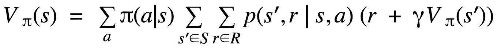

Value function of Reinforcement Learning

如果它没有吓倒你，那么你是一个数学通，阅读这篇文章是没有意义的:)

这篇文章不是关于教授强化学习(RL)的，而是关于解释它背后的数学原理。因此，它假设你已经知道什么是 RL，但在理解数学方程时有一些困难。

如果你不知道 RL，你最好在回到本文之前阅读一下。

我们将一步一步地探究上述等式是如何以及为什么会出现的。

## 状态和奖励

让我们考虑一系列的国家 S1，S2，…，Sn 每个国家都有某种奖励 R1，R2，…，Rn。我们知道一个代理人(例如:机器人)的工作是最大化其总报酬。这意味着它将经过提供最大奖励的州。

假设代理人在 S1 州立大学，应该有办法让它知道什么是最大化其回报的最佳途径。考虑到代理人没有看到其紧邻国家以外的地方。

为此，除了每个状态 ***s*** 的奖励之外，我们还将存储另一个值 V，它代表每个状态所连接的其他状态的奖励。
例如，V1 代表与 S1 相连的所有州的总奖励。奖励 R1 不是 V1 的一部分。但是 S2 的 R2 是 S1 的 V1 的一部分。

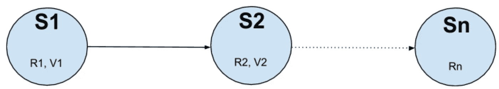

这样，通过简单地查看下一个状态，代理将知道后面是什么。

存储在状态 ***s*** 的值 V(s)是从一个称为“值函数”的函数中计算出来的。价值函数计算未来的回报。
注意，最终状态(也称为终端状态)没有值 V (V = 0 ),因为没有未来状态和未来奖励。

价值函数在计算未来奖励时也使用折旧。
这与金融业的情况类似，你两年后获得的 1000 美元不如你今天获得的 1000 美元有价值。为了表达这个想法，我们将 1000 美元乘以某个折扣因子𝛄 (0≤𝛄 ≤1)的幂 ***t*** 其中 ***t*** 是收到付款之前的时间步数。

例如，如果您预计两年后有 1000 美元，贴现因子为 0.9，那么这 1000 美元的今天价值就是 1000 * 0.9 = 810 美元

为什么这在 RL 中很重要？

假设最终状态 S(n)具有 R(n) = 1，并且所有中间状态 S(i)具有 R(i)= 0，将每个状态上的 R(n)乘以𝛄的幂 ***t*** 将给出比前一状态更低的 v。这将创建一个从起点到终点递增 V 的序列，这构成了对代理的一个提示，即哪个方向的回报最大化。

因此，到目前为止，我们已经确定每个状态都有一个奖励 R(可能为零)和一个代表未来奖励的值 V。换句话说，V(s)是来自其他州的未来回报的函数。

数学上它被写成

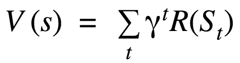

其中 St 是所有与 s 直接或间接相连的状态。

然而，用下一个状态来表示 V(s)比仅用回报 R 来表示更容易，这具有当我们知道下一个状态的 V 时计算当前状态的 V 的优点，而不是对所有未来状态的所有回报求和。

公式变成***v(s)= r+𝛄* v(s’)***

到目前为止，我们已经假设所有的状态都是按顺序连接的，但是很少出现这种情况，每个状态都可以连接到代理可能移动到的多个其他状态。

假设 S1 连接到 S2、S3、S4 和 S5，S1 的 V 值应该反映这种情况。

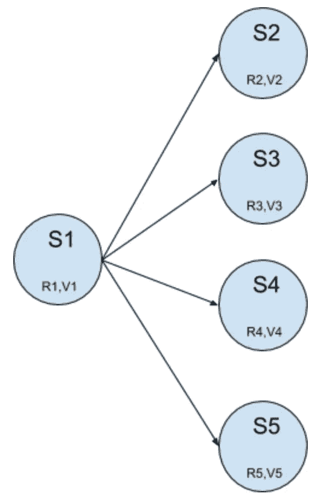

***v(S1)=(R2+R3+R4+r5+𝛄*(v2+v3+v4+V5))/4*。**
我们这里说的是 V(S1)是它所连接的状态的所有值的平均值。请记住，每个 V 都包含未来回报的值，因此通过对邻居进行平均，我们还可以了解他们之后会发生什么。

这个公式表明，我们可以从 S1 到 S2、S3、S4 和 S5，而没有任何对任何特定州的偏好，然而这是不准确的，因为我们知道有一定的概率去每个相邻州，并且这些概率可能不相同。例如，可能有 50%的机会去 S2，30%的机会去 S3，10%的机会去 S4 和 S5。
让我们分别称这些概率为 p2，p3，p4，p5。

于是 V(S1)就变成了***v(S1)= p2 * R2+P3 * R3+P4 * R4+P5 * r5+𝛄*(p2 * v2+P3 * v3+P4 * v4+P5 * V5)***。不出所料，这些概率被称为转移概率，因为它们表示从一种状态转移到另一种状态的可能性。

我们也可以把它们表示为一个矩阵 ***P*** 其中 ***Pij*** 是从一个状态 ***i*** 到一个状态 ***j*** 的跃迁概率。当没有可能的转换时， ***Pij*** 将为零。

让我们把公式安排得更有感染力一点:
**v(S1)= p2 *(R2+𝛄*v2)+p3*(r3+𝛄*v3)+p4(r4+𝛄*v4)+P5 *(r5+𝛄*v5).**

或者采用以下形式:

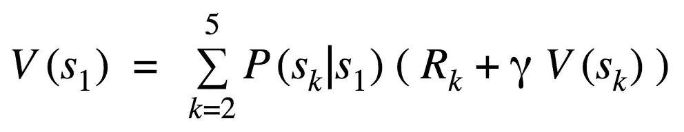

其中 ***P(Sk|S)*** 是到达状态 ***Sk*** 已知我们处于 ***S1*** 的概率。

在一般形式下，我们可以把它写成:

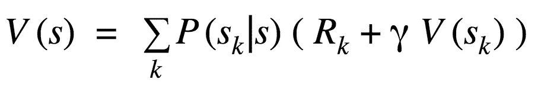

注意 ***k*** 经过所有状态，这意味着我们在**对**所有状态求和！如果你感到惊讶，不要。正如我们之前所说，转移概率是一个矩阵，它给出了从一个状态转移到另一个状态的概率。因为不是所有的状态都与其他状态相连，所以这个矩阵是稀疏的，包含许多零。

示例让我们考虑前面的示例，其中 s 1 连接到 S2、S3、S4 和 S5，还让我们假设州的总数是 100，所以我们有 S1 到 s 100。做***∑(p(sk | s)*(r(k)+𝛄* v(sk))***其中 ***k*** 从 2 到 100，与做 sum 从 ***k = 2 到 5*** 是一样的，因为对于所有的 ***k ≥ 6 P(Sk|S)=0。***

## 随机奖励

现在深呼吸，因为我们将增加一层新的复杂性！
奖励本身是不确定的，这意味着你不能假设 **R** 在每个状态下都是精确已知的。事实上，它是概率性的，可以取不同的值。

为了说明这一事实，假设你是一名射手，你正在瞄准一个目标，我们将假设只有三种状态，S1(瞄准)、S2(击中)、S3(未中)。你肯定知道目标是一串同心圆，你击中的内圈越多，你得到的奖励就越多。

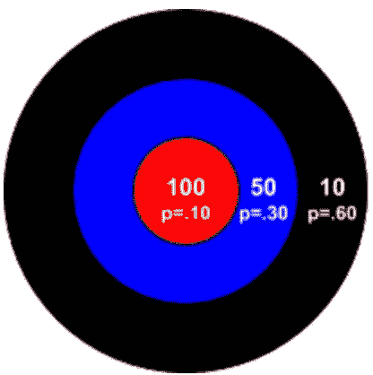

假设你是一个相当好的弓箭手，你有 80%的机会击中目标，所以你有 20%的风险错过它。击中中心的奖励是 100，外圈是 50，最外圈奖励是 10。击中中心的概率是 10%，击中外圈的概率是 30%，击中最外侧的概率是 60%。最后，我们还将假设完全错过目标将导致-50。

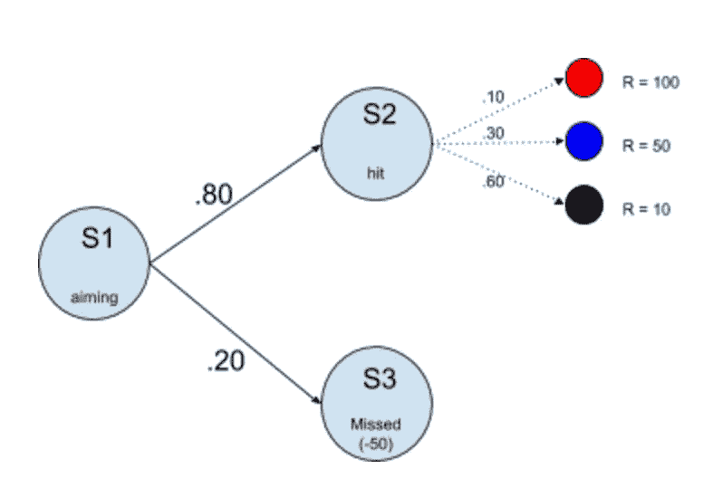

所以状态 S1 的值将是:
***v(S1)= . 8 *(0.1 * 100+. 3 * 50+. 6 * 10+𝛄* v(S2))+. 2 *(1 *-50+𝛄* v(S3))***

由于 S2 和 S3 是终态，那么 V(S1)和 V(S2)都是零，但上面提到它们是为了不断提醒一般公式。
你可以清楚地看到，每个状态下的奖励都乘以各自的概率，然后求和，例如:(***. 1 * 100+. 3 * 50+. 6 * 10)***和 ***(1*-50)*** ，每个状态都乘以导致它的转移概率例如:***. 8 *(1 * 100+. 3 * 50+. 6 * 10+𝛄* v(S2))***

从上面我们可以推导出通式:

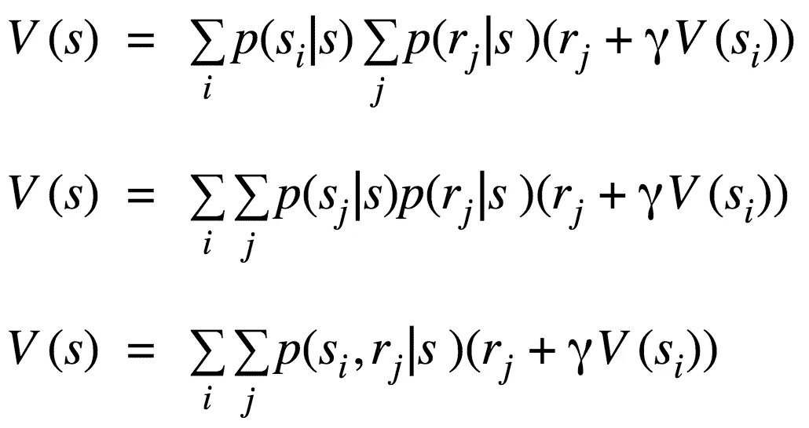

值得澄清的是，表达式 ***p(si，rj | s)***读作从状态 ***s*** 过渡到 ***si*** 并带有奖励 ***rj*** 的概率。
例如 ***p(S2，100|S1)*** 读作假设我们在 S1 状态，奖励 100(击中中心)去 S2(击中状态)的概率。答案是. 8 * .1 = .08 (8%)。

如果你还没有注意到，这构成了初始公式的第二部分(在页面的顶部)。
只需将 **S** 中的 ***si、rj*** 替换为*S’*，将 **R** 中的 ***r*** 替换为**R**即可得到:

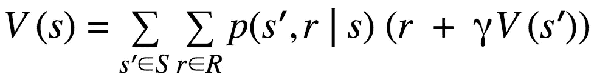

**S** 是所有状态的集合 **R** 是所有奖励的集合。
我们接下来将讨论行动*和政策 **𝜋** 。*

## *行动和政策*

*到目前为止，我们已经说过，我们是随机地在状态之间转换的。例如，我们有 80%的机会从 S1 转移到 S2，20%的机会从 S1 转移到 S3。但是我们没有说这是怎么做到的！是什么引发了这种转变？答案很简单，就是代理在某个状态下做的某个动作。这个动作可能不是唯一的，在给定的状态下可能有几个可用的动作。到目前为止，我们假设有一个被称为“前进”或“做某事”的隐含动作，它以一定的概率将我们从一个状态带到另一个状态。*

*似乎随机的奖励是不够的，而且行动是不确定的！你无法保证如果你执行一项行动，你会 100%成功。
我们以弓箭手为例，你的目标是击中正中，得到 100 分，那么你瞄准正中，射出这一箭。然而，有很多因素可能会导致你错过。可能是你不够专注，或者是你放箭的时候手在抖，或者是风太大了。所有这些因素都会影响箭的轨迹。所以你可能会击中中心，或者其中一个外圈，或者你可能会完全错过目标！*

*让我们考虑另一个例子，你在网格上控制一个机器人。假设你用遥控器命令机器人前进。
动作是“向前移动”，预期状态是机器人前面的方块。然而，遥控器可能坏了，或者可能有一些干扰，或者机器人轮子的位置不正确，机器人不是向前移动，而是向右、向左或向后移动。*

*底线，在执行动作*后，从状态 ***s*** 到状态***s’***并获得奖励 ***r*** 的概率不是 100%。这就是为什么我们写 ***p(s '，r|s，a)*** 这是在给定一个状态***s****a*** 和一个动作**的情况下，跃迁到状态 ***s'*** 的概率。**

**如前所述，每个状态都有几种可用的操作。例如，机器人可能在每个状态(或方块)中都有“向前”、“向左”、“向右”、“向后”。一个猎人在狩猎一个猎物时可能会有不同的动作，比如“开枪”、“射箭”或“投掷长矛”，这些动作中的每一个都会有不同的奖励。指示在特定状态下使用哪个动作的策略被称为策略𝜋。**

**你猜怎么着！
也是概率性的！我知道生活很艰难:)**

**所以一个猎人有一些概率使用他的枪，另一个概率使用他的弓，第三个概率使用他的矛。对于一个机器人来说也是一样，它有一定的概率去“前进”，“向左”，“向右”，“向后”。**

**像往常一样，我们通过对所有这些可能性进行平均，在 V(s)中对此进行量化。
给出以下内容:**

**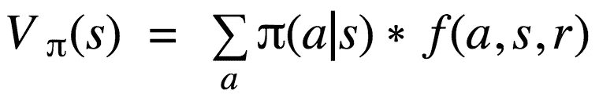**

*****【𝜋(a|s】***是使用动作 ***a*** 遵循策略 **𝜋** 假设我们处于状态 ***s.
V𝜋 (s)*** 是应用***t22】策略 **𝜋.时状态 ***s*** 的值
*f(a，s，r)*** 在这里是我们在**随机回报**部分建立的价值函数 V(s)的简写，另外使用 ***p(s '，r|s，a)*** 以反映对动作*的依赖。
使用 ***f(a，s，r)*** 只是为了减轻复杂性，强调***【𝜋(a|s】***的作用。******

**所以最后在展开 ***f(a，s，r)*** 之后，我们得到了这篇冗长文章的主题的初始公式:**

****

**Value function of Reinforcement Learning**

## **结论**

**希望这篇文章能够揭开强化学习中价值函数背后的数学之谜。**

**作为本文的一个收获，您可以将状态 ***s*** 的价值函数 V(s)理解为在该状态 ***s*** (由于某种策略***【𝜋***)下可用的动作所提供的平均奖励，其中每个动作都有一定的概率将代理转换到状态****

## ***相关文章***

*   ***[理解强化学习数学，面向开发者](/understanding-reinforcement-learning-math-for-developers-b538b6ef921a)***
*   ***[面向开发人员的强化学习政策](https://medium.com/@zsalloum/revisiting-policy-in-reinforcement-learning-for-developers-43cd2b713182)***
*   ***[Q vs V 在强化学习中，最简单的方法](https://medium.com/p/9350e1523031)***
*   ***[数学背后的强化学习，最简单的方法](https://medium.com/p/1b7ed0c030f4)***
*   ***[动态编程在强化学习中的简便方法](https://medium.com/@zsalloum/dynamic-programming-in-reinforcement-learning-the-easy-way-359c7791d0ac)***
*   ***[蒙特卡洛强化学习中的简单方法](https://medium.com/@zsalloum/monte-carlo-in-reinforcement-learning-the-easy-way-564c53010511)***
*   ***[TD 在强化学习中，最简单的方法](/td-in-reinforcement-learning-the-easy-way-f92ecfa9f3ce)***