# Python 中从头开始的神经网络

> 原文：<https://towardsdatascience.com/math-neural-network-from-scratch-in-python-d6da9f29ce65?source=collection_archive---------1----------------------->

## 制作自己的机器学习库。


Photo by [Mathew Schwartz](https://unsplash.com/@cadop?utm_source=medium&utm_medium=referral) on [Unsplash](https://unsplash.com?utm_source=medium&utm_medium=referral)

在这篇文章中，我们将从头开始学习机器学习的数学和代码，用 Python，一个小型库来构建具有各种层(全连接、卷积等)的神经网络。).最终，我们将能够以模块化的方式创建网络:

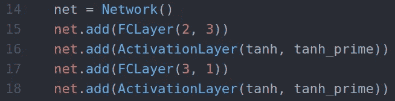

3-layer neural network

我假设你已经有了一些关于神经网络的知识。这里的目的不是解释我们为什么制作这些模型，而是向**展示如何进行适当的实现**。

# 一层层地

我们需要记住这里的大局:

1.  我们将**输入**的数据输入神经网络。
2.  数据从层**流向层**，直到我们有了**输出**。
3.  一旦我们有了输出，我们就可以计算**误差**，它是一个**标量**。
4.  最后，我们可以通过减去相对于参数本身的误差的**导数**来调整给定的参数(权重或偏差)。
5.  我们重复这个过程。

最重要的一步是第四步。我们希望能够拥有任意多的层，并且是任意类型的。但是，如果我们修改/添加/删除网络中的一层，网络的输出将会改变，这将改变误差，这将改变误差相对于参数的导数。我们需要能够计算导数，不管网络结构如何，不管激活函数如何，不管我们使用的损耗如何。

为了实现这一点，我们必须分别实现**每一层**。

# 每一层应该实现什么

我们可能创建的每一层(全连接、卷积、最大池、丢弃等。)至少有 2 个共同点:**输入**和**输出**数据。

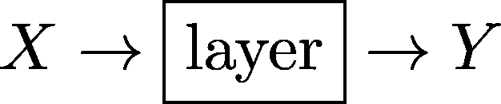

## **正向传播**

我们已经可以强调一个要点，那就是:**一层的输出是下一层的输入**。

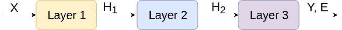

这被称为**正向传播。本质上，我们给第一层输入数据，然后每一层的输出成为下一层的输入，直到我们到达网络的末端。通过比较网络的结果(Y)和期望的输出(假设 Y*)，我们可以计算 en 误差 **E** 。目标是**通过改变网络中的参数来最小化**该误差。也就是反向传播(backpropagation)。**

## 梯度下降

这是一个快速的**提醒**，如果你需要学习更多关于梯度下降的知识，互联网上有大量的资源。

基本上，我们想要改变网络中的某个参数(称之为 **w** ，以便总误差 **E 减小**。有一个聪明的方法可以做到这一点(不是随机的)，如下所示:

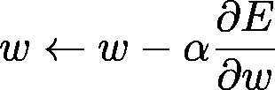

其中 **α** 是我们设置的范围【0，1】内的参数，称为**学习率**。无论如何，这里重要的是**∂e/∂w**(e 相对于 w 的导数)。**我们需要能够为网络的任何参数找到该表达式的值，而不管其架构如何。**

## 反向传播

假设我们给一个层误差相对于其输出 (∂E/∂Y)的**导数，那么它必须能够提供误差相对于其输入** (∂E/∂X).)的**导数**


记住`E`是一个**标量**(一个数)**T22`X`和`Y`是**矩阵**。**

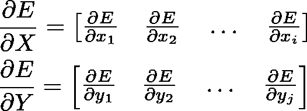

让我们暂时忘掉∂E/∂X 吧。这里的诀窍是，如果我们可以访问∂E/∂Y，我们可以非常容易地计算∂E/∂W(如果该层有任何可训练的参数)**而无需了解任何网络架构！**我们简单地使用链式法则:

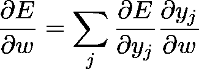

未知的是 **∂y_j/∂w** ，这完全取决于该层如何计算其输出。因此，如果每一层都可以访问∂E/∂Y，其中 y 是它自己的输出，那么我们可以更新我们的参数！

## 但是为什么是∂E/∂X 呢？

别忘了，一层的输出是下一层的输入。这意味着一层的∂E/∂X 是前一层的∂E/∂Y！就是这样！这只是传播错误的一种巧妙方式！同样，我们可以使用链式法则:

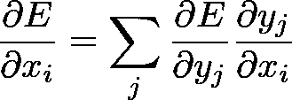

这*非常*重要，是理解反向传播的*关键*！在那之后，我们马上就能从头开始编写一个深度卷积神经网络了！

## 用于理解反向传播的图表

这就是我之前描述的。第 3 层将使用∂E/∂Y 更新其参数，然后将∂E/∂H2 传递给上一层，即它自己的“∂E/∂Y".”第二层也会这样做，以此类推。

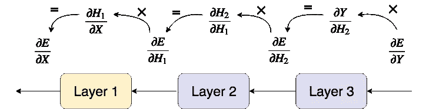

这在这里可能看起来很抽象，但是当我们将它应用到一个特定类型的层时，它会变得非常清晰。说到*摘要*，现在是写我们第一个 python 类的好时机。

## 抽象基类:层

所有其他层将继承的抽象类*层*处理简单的属性，即一个**输入**，一个**输出**，以及一个**向前**和**向后**方法。

3-layer neural network

如你所见，`backward_propagation`中还有一个我没有提到的额外参数，那就是`learning_rate`。这个参数应该类似于更新策略，或者像 Keras 中所说的优化器，但是为了简单起见，我们将简单地传递一个学习率，并使用梯度下降来更新我们的参数。

# 全连接层

现在让我们定义和实现第一种类型的层:全连接层或 FC 层。FC 层是最基本的层，因为每个输入神经元都连接到每个输出神经元。

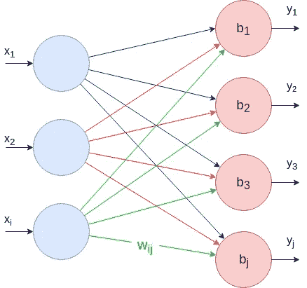

## 正向传播

每个输出神经元的值可以计算如下:

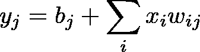

使用矩阵，我们可以使用**点积**一次性计算每个输出神经元的公式:

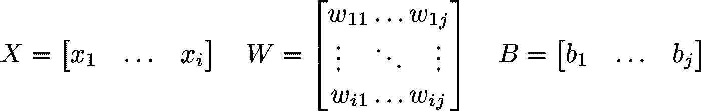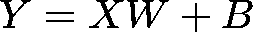

我们完成了向前传球。现在我们来做 FC 层的后向传递。

请注意，我还没有使用任何激活函数，因为我们将在一个单独的层中实现它！

## 反向传播

如前所述，假设我们有一个矩阵，其中包含误差相对于该层输出的导数(∂E/∂Y).)我们需要:

1.  误差相对于参数的导数(∂E/∂W，∂E/∂B)
2.  误差相对于输入的导数(∂E/∂X)

我们来计算∂E/∂W.这个矩阵的大小应该和 w 本身一样:`ixj`其中`i`是输入神经元的数量`j`是输出神经元的数量。我们需要**一个梯度对应一个重量**:

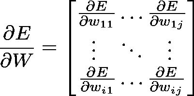

使用前面陈述的链式法则，我们可以写出:

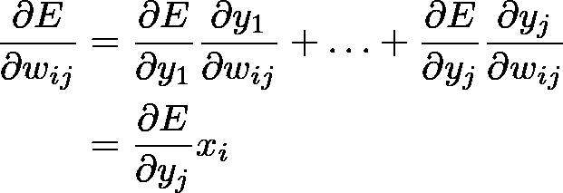

因此，


就这样，我们有了更新权重的第一个公式！现在让我们来计算∂E/∂B.

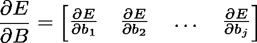

同样，∂E/∂B 需要和 b 本身一样大，每个偏差一个梯度。我们可以再次使用链式法则:

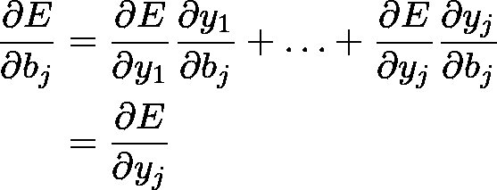

并得出结论，

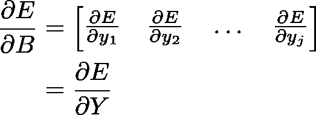

现在我们已经有了 **∂E/∂W** 和 **∂E/∂B** 、我们只剩下 **∂E/∂X** 这是**非常重要的**，因为它将“充当”前一层的∂E/∂Y。

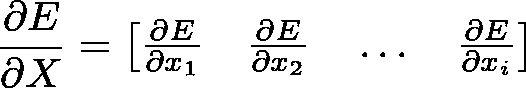

再次使用链式法则，

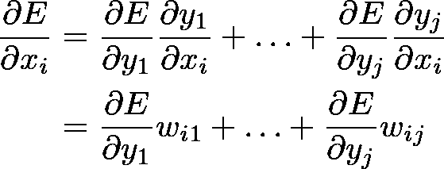

最后，我们可以写出整个矩阵:

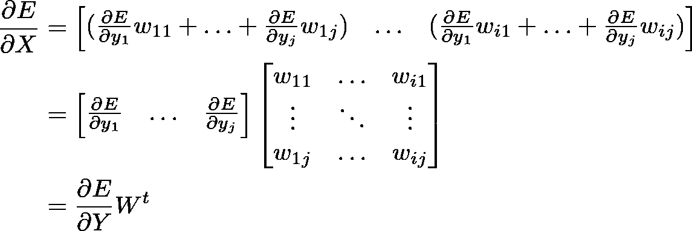

就是这样！我们已经有了 FC 层所需的三个公式！

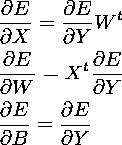

## 对全连接层进行编码

我们现在可以编写一些 python 代码来实现这种数学！

# 活化层

到目前为止，我们所做的所有计算都是完全线性的。用那种模式学东西是没希望的。我们需要通过将非线性函数应用于某些层的输出来将**非线性**添加到模型中。

现在我们需要为这个新类型的层重做整个过程！

[https://gph.is/21pKLjE](https://gph.is/21pKLjE)

别担心，这会快得多，因为没有可学习的参数。我们只需要计算 **∂E/∂X** 。

我们将分别称`f`和`f'`为激活函数及其导数。

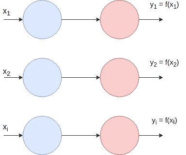

## 正向传播

正如您将看到的，这非常简单。对于给定的输入`X`，输出只是应用于`X`的每个元素的激活函数。也就是说**输入**和**输出**具有**相同的尺寸**。


## 反向传播

给定 **∂E/∂Y** ，我们要计算 **∂E/∂X** 。

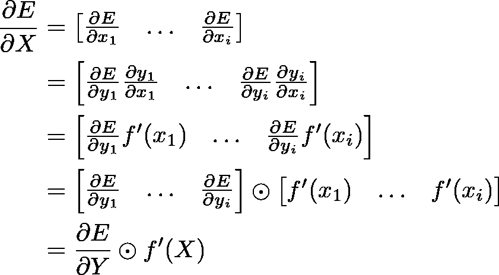

注意，这里我们使用了两个矩阵之间的**元素乘法**(而在上面的公式中，它是点积)。

## 激活层编码

激活层的代码非常简单。

你也可以在一个单独的文件中写一些激活函数和它们的导数。这些将被用来创建一个`ActivationLayer`。

# 损失函数

直到现在，对于一个给定的层，我们假设 **∂E/∂Y** 是给定的(由下一层给出)。但是最后一层会发生什么呢？它是如何得到 **∂E/∂Y** 的？我们简单地手动给出，这取决于我们如何定义误差。

网络的误差由 **you** 定义，它衡量网络对于给定输入数据的好坏。定义误差的方法有很多种，其中最广为人知的一种叫做**MSE——均方误差**。

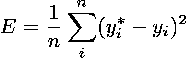

Mean Squared Error

其中`y*`和`y`分别表示**期望输出**和**实际输出**。你可以把这种损失想象成最后一层，它把所有的输出神经元挤压成一个神经元。我们现在需要的是，像其他层一样，定义∂E/∂Y。除了现在，我们终于到了`E`！

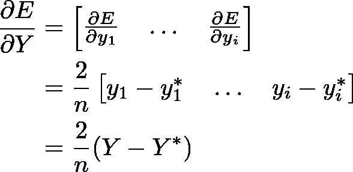

这只是两个 python 函数，可以放在一个单独的文件中。创建网络时会用到它们。

# 网络类

快好了！我们将制作一个`Network`类来创建神经网络，就像第一张图片一样简单！

我几乎注释了代码的每一部分，如果你掌握了前面的步骤，理解起来应该不会太复杂。不过，如果你有任何问题，请留下评论，我会很乐意回答！

# 构建神经网络

终于！我们可以使用我们的类来创建一个神经网络，我们想要多少层就有多少层！我们将构建两个神经网络:一个简单的**异或**和一个 **MNIST** 解算器。

## 求解异或

从 XOR 开始总是很重要的，因为这是一种简单的方法来判断网络是否正在学习任何东西。

很多东西我觉得不需要强调。只是要小心训练数据，你应该总是有**样本**维度**第一个**。例如这里，输入形状是 **(4，1，2)** 。

## 结果

```
**$ python xor.py** 
epoch 1/1000 error=0.322980
epoch 2/1000 error=0.311174
epoch 3/1000 error=0.307195
...
epoch 998/1000 error=0.000243
epoch 999/1000 error=0.000242
epoch 1000/1000 error=0.000242[
    array([[ 0.00077435]]),
    array([[ 0.97760742]]),
    array([[ 0.97847793]]),
    array([[-0.00131305]])
]
```

很明显这是有效的，太好了！我们现在可以解决更有趣的事情了，让我们解决 MNIST 吧！

## 解决 MNIST

我们没有实现卷积层，但这不是问题。我们需要做的只是重塑我们的数据，以便它可以适合一个完全连接的层。

*MNIST 数据集由从 0 到 9 的数字图像组成，形状为 28x28x1。目标是预测图片上画的是什么数字。*

## 结果

```
**$** **python example_mnist_fc.py**
epoch 1/30   error=0.238658
epoch 2/30   error=0.093187
epoch 3/30   error=0.073039
...
epoch 28/30   error=0.011636
epoch 29/30   error=0.011306
epoch 30/30   error=0.010901**predicted values :** 
[
    array([[ 0.119,  0.084 , -0.081,  0.084, -0.068, 0.011,  0.057,  **0.976**, -0.042, -0.0462]]),
    array([[ 0.071,  0.211,  **0.501** ,  0.058, -0.020, 0.175,  0.057 ,  0.037,  0.020,  0.107]]),
    array([[ 1.197e-01,  **8.794e-01**, -4.410e-04, 4.407e-02, -4.213e-02,  5.300e-02, 5.581e-02,  8.255e-02, -1.182e-01, 9.888e-02]])
]
**true values :** 
[[0\. 0\. 0\. 0\. 0\. 0\. 0\. 1\. 0\. 0.]
 [0\. 0\. 1\. 0\. 0\. 0\. 0\. 0\. 0\. 0.]
 [0\. 1\. 0\. 0\. 0\. 0\. 0\. 0\. 0\. 0.]]
```

这是完美的工作！太神奇了:)

[https://gph.is/2jzemp3](https://gph.is/2jzemp3)

# GitHub 知识库和 Google Colab

您可以在下面的 GitHub 资源库和 Google Colab 文件中找到本文使用的全部工作代码。它还包含其他层的代码，如**卷积**或**展平**。

[](https://github.com/OmarAflak/Medium-Python-Neural-Network) [## OmarAflak/Medium-Python-神经网络

### 通过在 GitHub 上创建一个帐户，为 OmarAflak/Medium-Python-Neural-Network 开发做出贡献。

github.com](https://github.com/OmarAflak/Medium-Python-Neural-Network) [](https://colab.research.google.com/drive/10y6glU28-sa-OtkeL8BtAtRlOITGMnMw) [## Python 中从头开始的神经网络

### 请随时联系我

colab.research.google.com](https://colab.research.google.com/drive/10y6glU28-sa-OtkeL8BtAtRlOITGMnMw) 

我最近把那篇文章的内容放到了一个精美的动画视频里。你可以在 YouTube 上看看。

Neural Network from Scratch | Mathematics & Python Code — The Independent Code

Convolutional Neural Network from Scratch | Mathematics & Python Code — The Independent Code

# **如果你喜欢这篇文章——如果你按下鼓掌按钮，我会非常感激**👏这对我帮助很大。和平！😎