# Q 学习的数学——Python

> 原文：<https://towardsdatascience.com/math-of-q-learning-python-code-5dcbdc49b6f6?source=collection_archive---------5----------------------->

## 理解贝尔曼方程的由来

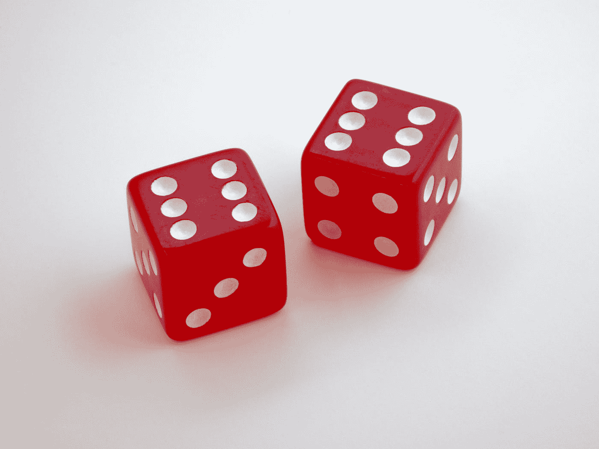

Photo by [Brett Jordan](https://unsplash.com/@brett_jordan?utm_source=medium&utm_medium=referral) on [Unsplash](https://unsplash.com?utm_source=medium&utm_medium=referral)

# q 学习

*Q-Learning* 是一种 ***强化学习*** 是一种*机器学习*。强化学习最近(通常)被用来教一个 AI 玩游戏(谷歌 DeepMind Atari 等)。我们的目标是理解称为 Q-Learning 的强化学习的简单版本，并编写一个将学习如何玩简单“游戏”的程序。让我们开始吧！

# 马尔可夫链

马尔可夫链是一种数学模型，它经历具有概率规则的状态转换。

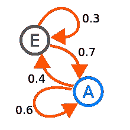

Markov chain — Wikipedia

这里我们有两个状态 **E** 和 **A** ，以及从一个状态到另一个状态的概率(例如，从状态 E 开始，有 70%的机会到达状态 A)。

# 马尔可夫决策过程

马尔可夫决策过程(MDP)是马尔可夫链的扩展，用于模拟更复杂的环境。在这个扩展中，我们增加了在每个状态下做出选择的可能性，这被称为**动作**。我们还添加了一个**奖励**，这是从一个状态到另一个状态采取一个行动的环境反馈。

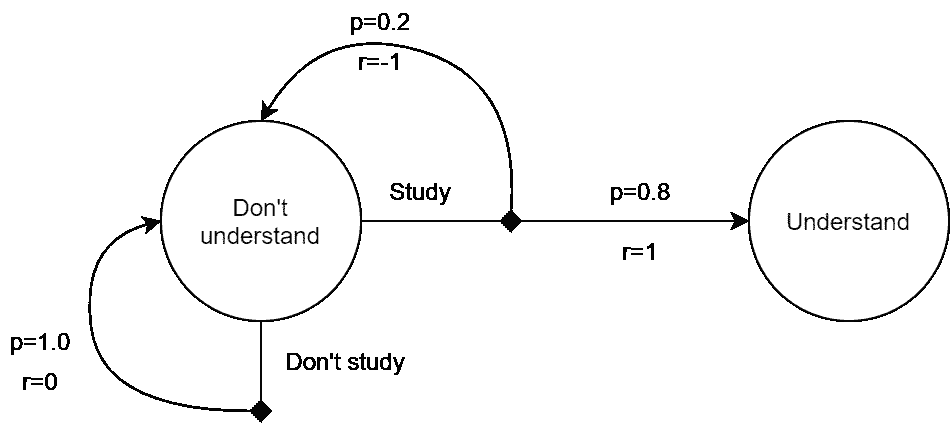

Image by Author

在上图中，我们处于初始状态 ***不懂*** *，*在这里我们有两种可能的行动， ***学习*** 和 ***不学习*** 。对于*研究*动作，根据一个概率规则，我们可能以不同的状态结束。这就是我们所说的**随机**环境(random)，也就是说，对于在同一状态下采取的同一动作，我们可能会有不同的结果( ***理解*** 而 ***不理解*** )。

*在强化学习中，这是我们如何模拟一个游戏或环境，我们的目标将是最大化我们从那个环境中获得的* ***奖励*** *。*

# 报酬

回报是来自环境的反馈，它告诉我们做得有多好。例如，它可以是你在游戏中获得的硬币数量。我们的目标是最大化总回报。因此，我们需要把它写下来。


这是我们在某个时间点*开始可以得到的总奖励。*

*例如，如果我们使用上面提到的 MDP。我们最初处于 ***不了解****的状态，我们采取了***学习*** 的行动，从而把我们随机带到了**不了解的状态。因此我们经历了报酬 r(t+1)=-1。现在我们可以决定采取另一个行动，这个行动将给出 r(t+2)等等。总回报是我们在环境中采取行动所获得的所有直接回报的总和。****

***以这种方式定义奖励会导致两个主要问题:***

*   ***这个和有可能达到无穷大，这没有意义，因为我们想最大化它。***
*   ***我们对未来回报的考虑和对眼前回报的考虑一样多。***

***解决这些问题的一个方法是对未来的奖励使用递减因子。***

***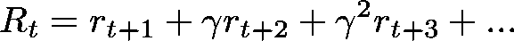***

***设置 **γ=1** 让我们回到第一个表达式，这里每个奖励都是同等重要的。设置 **γ=0** 导致只寻找直接的回报(总是为最佳的下一步行动)。将 **γ** 设置在 **0** 和 **1** 之间是一种折衷，更多地寻求眼前的回报，但仍然考虑未来的回报。***

***我们可以用递归的方式重写这个表达式，这在以后会很方便。***

***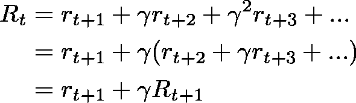***

# ***政策***

***策略是一种功能，它告诉在特定状态下采取什么操作。该函数通常表示为 **π(s，a)** ，并产生在状态 **s** 下采取行动 **a** 的概率。我们要**找到最大化奖励**函数的政策。***

***如果我们回到以前的 MDP 为例，政策可以告诉你采取行动的概率**当你处于***不懂*** *的状态时。******

**此外，因为这是一个概率分布，所有可能行动的总和必须等于 1。**

**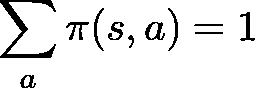**

# **记号**

**我们将开始摆弄一些方程，为此我们需要引入新的符号。**

**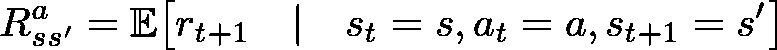**

**这是通过动作 **a** 从状态 **s** 到状态**s’**的预期**即时回报**。**

**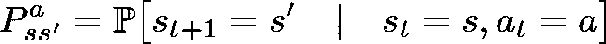**

**这是通过动作 **a** 从状态 **s** 到状态**s’**的**转移概率**。**

****

**Image by Author**

**在本例中:**

*   **从状态***不懂*** 到状态 ***不懂*** 通过行动 ***不学习*** 等于 **0** 。**
*   **从状态 ***不懂*** 到状态 ***懂*** 通过行动 ***学习*** 的概率等于 **80%** 。**

# ****价值函数****

**存在两种所谓的“价值函数”。**状态值**功能，以及**动作值**功能。这些功能是分别测量“值”或*某个状态有多好*或*某个动作有多好*的一种方式。**

## **状态值**

**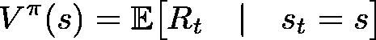**

**一个状态的*值*是我们从那个状态开始可以得到的预期总报酬。这取决于告诉我们如何做决定的政策。**

## **价值函数**

**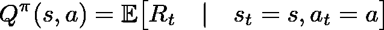**

**在某个状态下采取行动的*值*是我们从那个状态开始并采取行动所能得到的预期总回报。也要看政策。**

# **Q 学习的贝尔曼方程**

**既然我们已经解决了符号问题，我们终于可以开始玩数学了！在计算过程中查看下图可以帮助您理解。**

**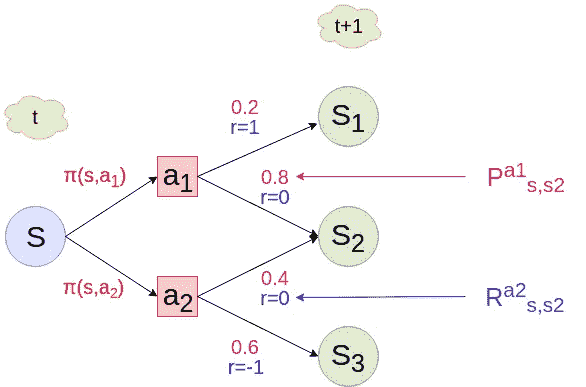**

**Image by Author**

**我们将从扩展状态值函数开始。 ***预期*** 操作符是 ***线性*** 。**

**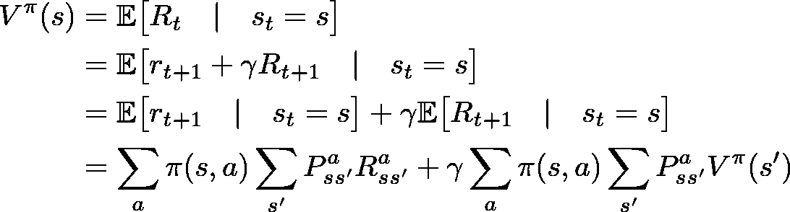**

**接下来，我们可以扩展动作值函数。**

**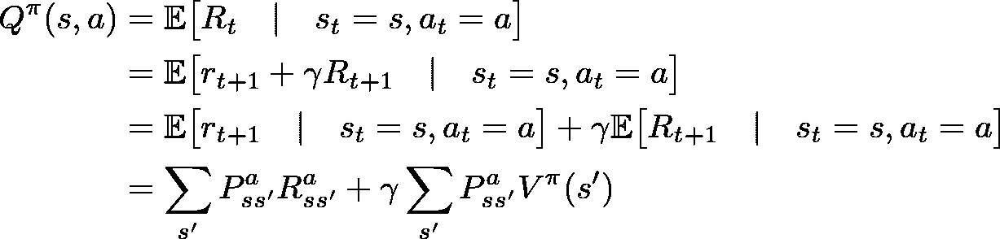**

**这种形式的 Q 值非常普遍。它处理随机环境，但是我们可以用确定性的**来写。也就是说，无论何时你采取行动，你总是在**相同的下一个状态**结束，并获得**相同的奖励**。在这种情况下，我们不需要对概率进行加权求和，等式变为:****

**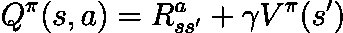**

**其中**s’**是您在状态 **s** 中采取行动 **a** 的最终状态。更正式地说，这是:**

**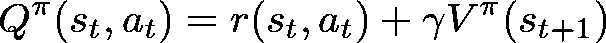**

## **贪婪的政策**

**你可能已经在网上读到过*贪婪政策*。贪婪策略是指你总是选择**最优下一步**的策略。**

**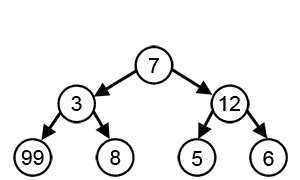**

**Greedy Algorithm — Wikipedia**

**在**贪婪策略上下文**中，我们可以写出状态值和动作值函数之间的关系。**

**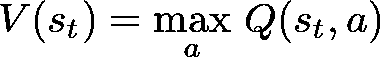**

**因此，将这个代入前面的等式，我们得到在确定性环境中遵循贪婪策略的(状态，动作)对的 Q 值。**

**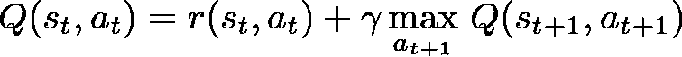**

**或者简单地说，**

**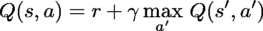**

**而这就是 Q-Learning 上下文中的**贝尔曼方程**！它告诉我们，在某个状态 **s** 下，一个动作 **a** 的值是你采取那个动作得到的**即时回报**，加上你在下一个状态下可以得到的**最大预期回报**。**

**当你想到它的时候，它实际上是有意义的。**

**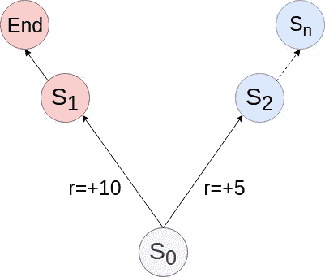**

**left or right ? — Image by Author**

**在这里，如果你只看**即时奖励**，你肯定会选择向左。不幸的是，游戏结束后，你不能得到更多的积分。**

**如果你加上**下一个状态**的**最大期望报酬**，那么你很可能会向右走，因为*的最大期望报酬等于零，而*的最大期望报酬很可能高于 10–5 = 5***。*******

**你也可以调整 **γ** 来指定*对下一个奖励有多重要。***

# **Python 代码**

**这是一个简单的环境，由一个 5 乘 5 的网格组成。一个宝藏(T)放在格子的右下角。代理(O)从网格的左上角开始。**

```
**O....
.....
.....
.....
....T**
```

**代理需要使用 4 个可用的动作到达宝藏:****右******上******下*** 。***

**如果代理采取了一个直接引导他到 T 的行动，他就得到 **1** 的奖励，否则得到 **0** 的奖励。**

**代码被很好地注释了，这就是我们刚刚讨论的内容。现在有趣的部分，Q 学习算法！**

**我几乎注释了这段代码的每一行，所以希望它容易理解！**

## **运行代码**

**将上述两个文件放在同一个目录中，并运行:**

```
**python3 medium_qlearning_rl.py**
```

**在纪元编号 ***40*** 左右，代理应该已经学会使用最短路径之一(8 步)到达宝藏。**

# **结论**

**我们已经看到了如何推导统计公式来找到贝尔曼方程，并使用它来教人工智能如何玩一个简单的游戏。请注意，在这个游戏中，可能状态的数量是有限的，这就是为什么构建 Q 表(离散值接近 Q 函数真实值的表)仍然是可管理的。图形游戏怎么样，比如 Flappy Bird，Mario Bros，或者 Call Of Duty？游戏显示的每一帧都可以认为是不同的状态。在这种情况下，不可能建立 Q 表，我们所做的是使用神经网络，其目标是学习 Q 函数。该神经网络通常将游戏的当前状态作为输入，并输出在该状态下可能采取的最佳行动。这被称为**深度 Q 学习**，也正是深蓝或阿尔法围棋这样的人工智能成功击败国际象棋或围棋世界冠军的原因。**

# **我希望你喜欢这篇文章！多待一会儿吧！😎**