# 数学基础:支持向量机+优化

> 原文：<https://towardsdatascience.com/mathematical-underpinnings-svms-optimisation-6495776215c3?source=collection_archive---------9----------------------->

本周我们将看到**拉格朗日乘数将如何帮助我们解决 SVM 最优化问题。因此，让我们提醒自己到目前为止已经涵盖了什么。**

在[第 1 周](https://medium.com/@emilymuller1991/mathematical-underpinnings-svms-89a1c786eff9)中，我们定义了学习模型参数的支持向量机 ***w*** 和 *b* ，它们最大化了从决策边界到特征空间中最近点的间隔。此外，我们假设我们的数据点是线性可分的，并且是正确分类的(约束)。

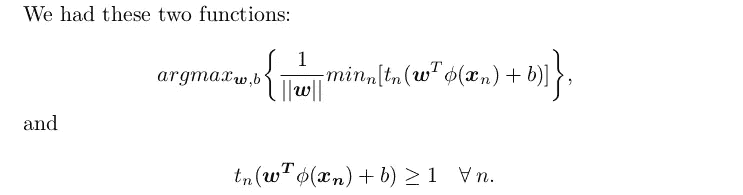

Week 1 optimisation equation and constraints.

然后在第 2 周的[中，我们揭示了拉格朗日乘子的原理，用于解决一个受不等式约束的优化问题。让我们回顾一下。](https://medium.com/@emilymuller1991/mathematical-underpinnings-svms-lagrange-multipliers-3fa057db30cb)

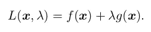

Week 2 Lagrange function.

偏导数 wrt 对 ***x*** 恢复平行法线约束，偏导数 wrt *λ* 恢复约束条件，*g(****x****)= 0*。还记得 KKT 条件吗？

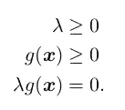

KKT conditions.

拉格朗日函数可以扩展到不止一个约束。

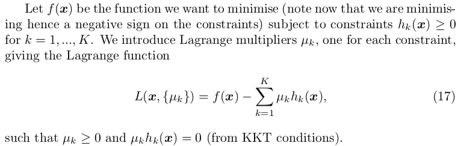

# 使用拉格朗日乘子的 SVM 优化

我们的优化函数是由|| ***w*** ||^-1.最大化的这反过来相当于最小化|| ***w*** ||。我们的约束条件保持不变。这是*二次规划*的一个实例；最小化受线性约束的二次函数。我们可以将拉格朗日函数表述如下

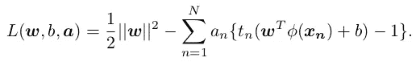

Lagrange Function

对 ***w*** 和 *b* 进行偏导数，我们得到

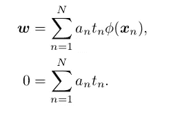

我们现在将优化拉格朗日对偶表示。

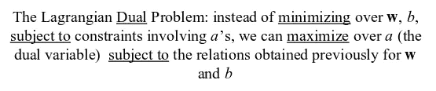

The Lagrangian Dual Problem from R. Berwick slides.

这来自于[对偶原理](https://en.wikipedia.org/wiki/Duality_(optimization))，该原理指出优化问题可以被视为原始的(在这种情况下，最小化超过 ***w*** 和 *b)* 或者对偶的(在这种情况下，最大化超过 ***a*** )。对于凸优化问题，原始和对偶有相同的最优解。

拉格朗日对偶表示(通过替换偏导数得到)是:

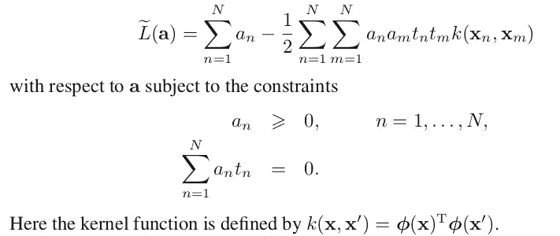

Dual Representation of the Lagrange function of SVM optimisation, [Bishop — MLPR].

我们现在有一个关于 ***和*** 的优化问题。要求核函数是正定的，这导致了凸优化问题，给出了与原始原始问题相同的解。

我们内核的内积起着非常重要的作用。为了深入了解，回想一下两个向量的点积返回它们之间角度的余弦值。可以算是一种*相似度*。现在，在两个向量完全不同的情况下，内积为 0，拉格朗日量没有增加任何东西。在两个向量相似且具有相同输出值的情况下，内积为 1，拉格朗日中的第二项将保持为正。这导致拉格朗日量减少，因此该算法降低了做出相同预测的相似向量的等级。在两个向量相似的情况下，预测不同的结果类别，第二项增加了拉格朗日，这些是我们感兴趣的点。**区分两个阶级的要点。**

稍后，核还将允许我们通过定义非线性核来对非线性可分的点进行分类。

在优化我们的拉格朗日乘数 ***a*** 之后，我们可以对新的数据点进行如下分类

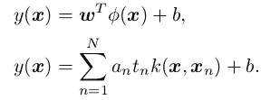

回想一下现在关于我们的 SVM 优化问题的 KKT 条件。

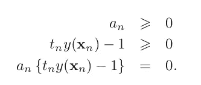

因此，我们要么让拉格朗日乘数等于零，要么不等于零。对于所有的零乘数，它们对*y(****)x****)*的总和没有贡献，因此在新点分类中不起作用。剩余的向量是支持向量，使得

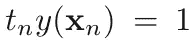

并且它们对应于位于最大边缘超平面上的向量，如下所示。

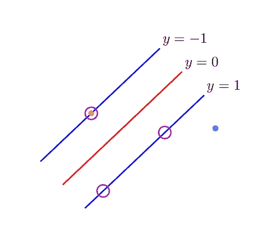

Support vectors shown in blue, [Bishop — MLPR].