# 机器学习的数学:线性回归和最小二乘回归

> 原文：<https://towardsdatascience.com/mathematics-for-machine-learning-linear-regression-least-square-regression-de09cf53757c?source=collection_archive---------1----------------------->

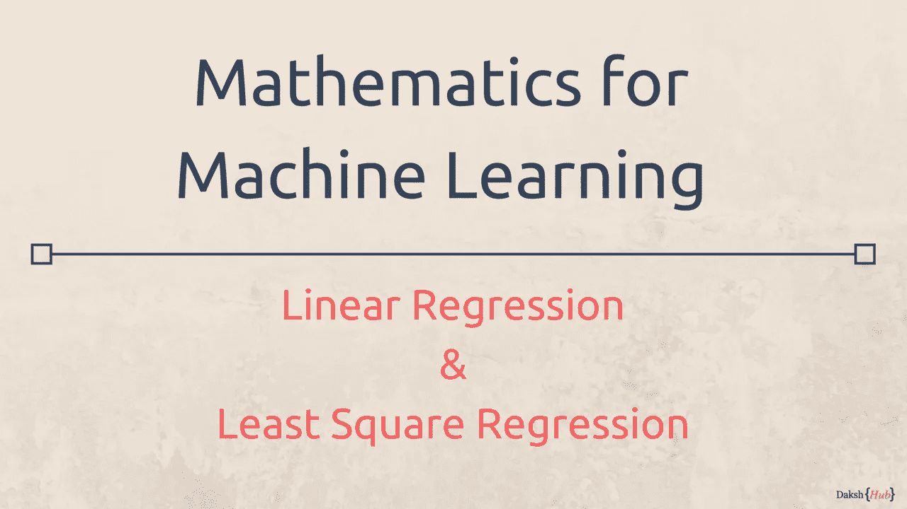

Mathematics for Machine Learning

机器学习完全是关于数学的，虽然现在有很多库可以通过函数调用来应用复杂的公式，但无论如何都需要学习至少关于它的基础知识，以便更好地理解它。

让我们试着用简单的方法来理解线性回归和最小二乘回归。

## 什么是线性回归？

> 线性回归是一种预测算法，它提供了 ***预测*** (称之为***【Y’***)和**输入**(称之为***【X’***)之间的线性关系。

正如我们从基础数学中所知，如果我们绘制一个**‘X’，‘Y’**图形，线性关系总会出现一条直线。例如，如果我们画出这些值的图表

```
(Input) X = 1,2,3,4,5
(Prediction) Y = 1,2,3,4,5
```

这将是一条完美的直线

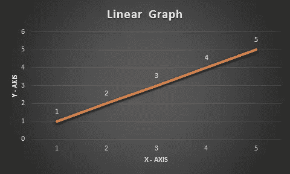

Linear Straight Line graph

> 在进一步深入之前，让我们了解一个事实，即在现实生活中，我们不会在输入和预测之间获得如此完美的关系，这就是为什么我们需要机器学习算法

## 两点间的直线方程

使用`y = mx + b`写出直线方程，其中`m`是斜率(梯度)`b`是 Y 轴截距(直线与 Y 轴相交的地方)。

一旦我们以`y = mx + b`格式从空间中的 2 个点得到一条直线的方程，我们可以使用相同的方程来预测产生一条直线的`x`的不同值的点。

在这个公式中，`m`是斜率，`b`是 y 截距。

> 线性回归是一种预测未知输入值`'X'`的`'Y'`值的方法，如`1.5, 0.4, 3.6, 5.7`甚至`-1, -5, 10`等。

让我们以一个真实世界的例子来演示线性回归的用法和最小二乘法的用法来减少误差

## 线性回归与现实世界的例子

让我们举一个真实世界的例子来说明农产品的价格，以及它是如何随着销售地点的不同而变化的。直接从农民手里买的价格会很低，从市区带来的价格会很高。

给定这个数据集，我们可以预测中间位置的产品价格

> 当数据集用于预测时，它也称为训练数据集

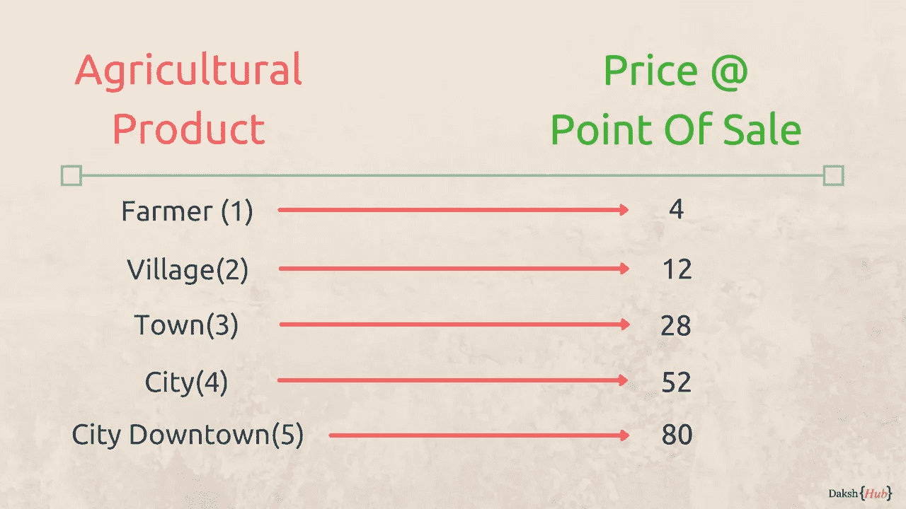

Agricultural Product and its price at point of sale

在本例中，如果我们将输入`'X — Axis'`视为销售地点，将`'Y — Axis'`视为价格(想想你熟悉的任何货币)，我们可以将图表绘制为

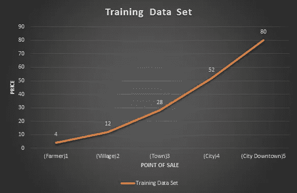

Graph: Agricultural Product and its price at point of sale

## 问题陈述

> 给定此数据集，预测农产品的价格，如果它是在农户住宅和市中心之间的中间位置销售的

## 训练数据集

上面提供的数据集可以被视为上述问题陈述的训练数据集，如果我们将这些输入视为模型的训练数据，我们可以使用该模型来预测以下位置的价格

*   农民之家——村庄
*   村庄-城镇
*   城镇—城市
*   城市—市中心

我们的目标是，当我们使用直线方程绘制直线时，得到一条直线，使训练数据和预测模型之间的误差最小化。

## 直线方程(y = mx + b)

数学允许我们在二维图形中的任意两点之间得到一条直线。对于这个例子，让我们把农民的家和价格作为起点，把城市中心作为终点。

起点和终点的坐标将是

```
(x1,y1) = (1, 4) 
(x2,y2) = (5, 80)
```

> 其中`x`代表位置，`y`代表价格。

第一步是以`y = mx + b`的形式提出一个公式，其中`x`是一个已知值，`y`是预测值。

为了计算任何输入值`x`的预测值`y`，我们有两个未知数`m = slope(Gradient)`和`b = y-intercept(also called bias)`

## 斜率(m =的变化/x 的变化)

线的斜率计算为`y`的变化除以`x,`的变化，因此计算结果如下

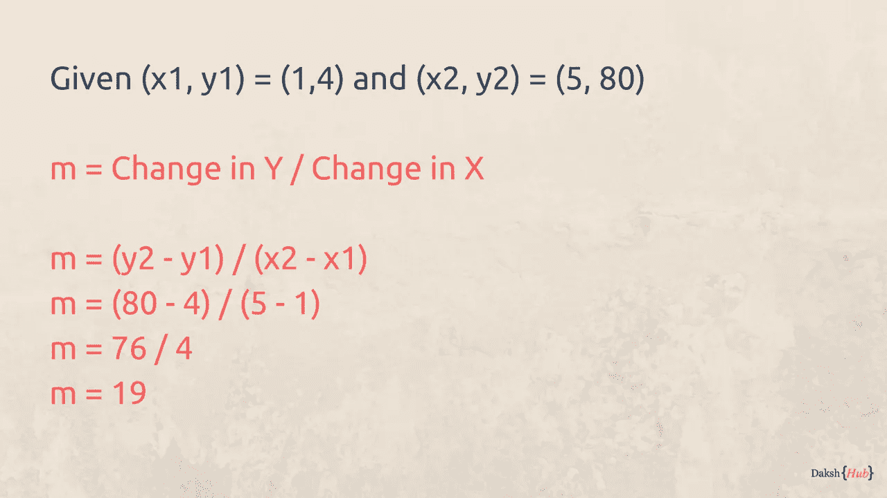

Calculating m = Change in Y / Change in X

应使用公式`y-y1 = m(x-x1)`计算 y 轴截距/偏差

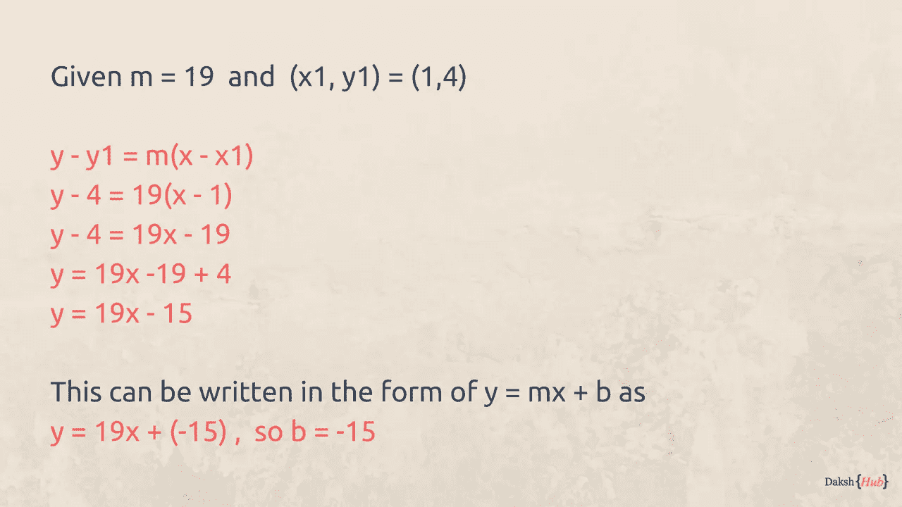

Finding y = mx + b

一旦我们得到了我们的公式，我们可以通过用`x`代替用于计算公式的起点和终点来验证它，因为它应该提供相同的`y`值。

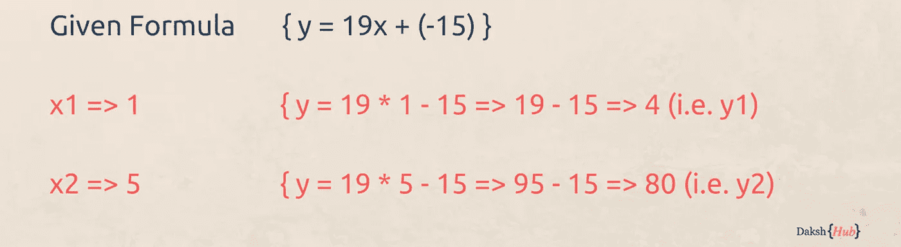

Verifying y = mx + b

现在我们知道我们的公式是正确的，因为我们通过替换`x`值得到了相同的`y`值，但是在中间的`x`的其他值如何呢，也就是`2,3,4`，让我们找出答案

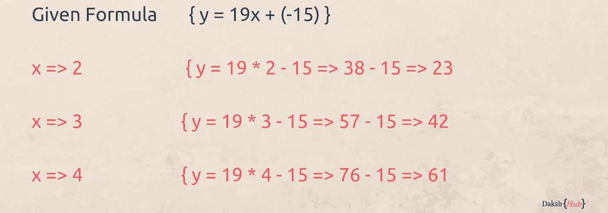

Predicting Y values for unknown X values

这些值与训练集中实际存在的值不同(可以理解为原始图形不是直线)，如果我们对照原始图形绘制此`(x,y)`图形，则直线将远离`x=2,3, and 4`图形中的原始点。

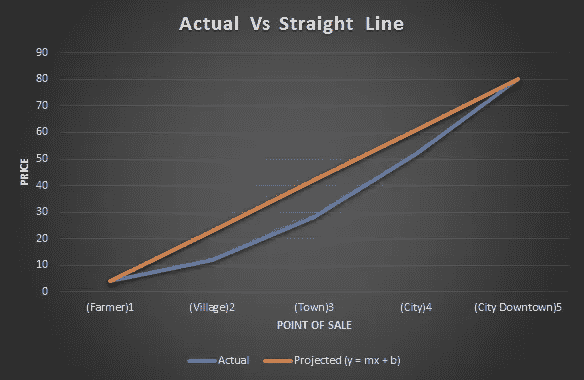

Graph: Actual Line Vs Projected Straight Line

> 然而，第一步是成功的，因为我们成功地预测了未知值`X`的`Y`

## 最小化误差

误差被定义为实际点和直线上的点之间的差值)。理想情况下。我们希望有一条直线，在这条直线上所有点的误差最小。

> 有许多数学方法可以做到这一点，其中一种方法叫做最小二乘回归

## 最小平方回归

最小平方回归是一种最小化误差的方法，其方式是最小化所有平方误差的总和。以下是计算最小二乘回归的步骤。

首先，计算`m = slope`的公式是


Calculating slope(m) for least squre

***注:**2 表示正方形，一个 python 语法***

所以让我们计算得出斜率(m)所需的所有值，首先从用`x`计算值开始

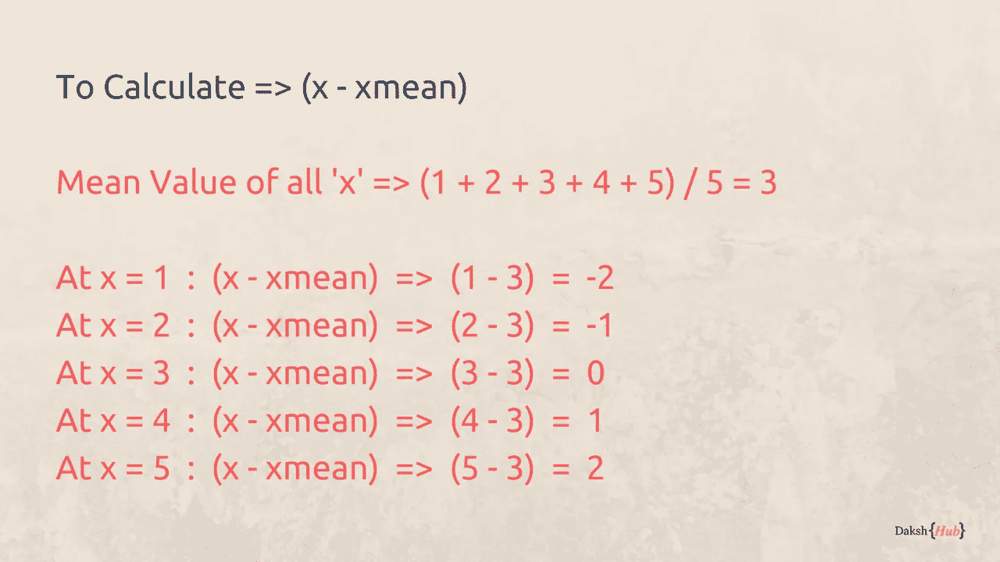

Calculating x — xmean for all X values

现在让我们用`y`来计算数值

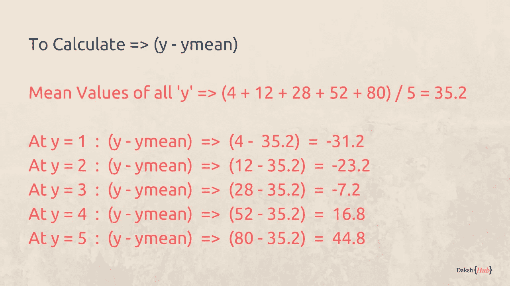

Calculating y— ymean for all Yvalues

这些值的可用性允许我们计算所有

`(x — xmean)*(y — ymean)`

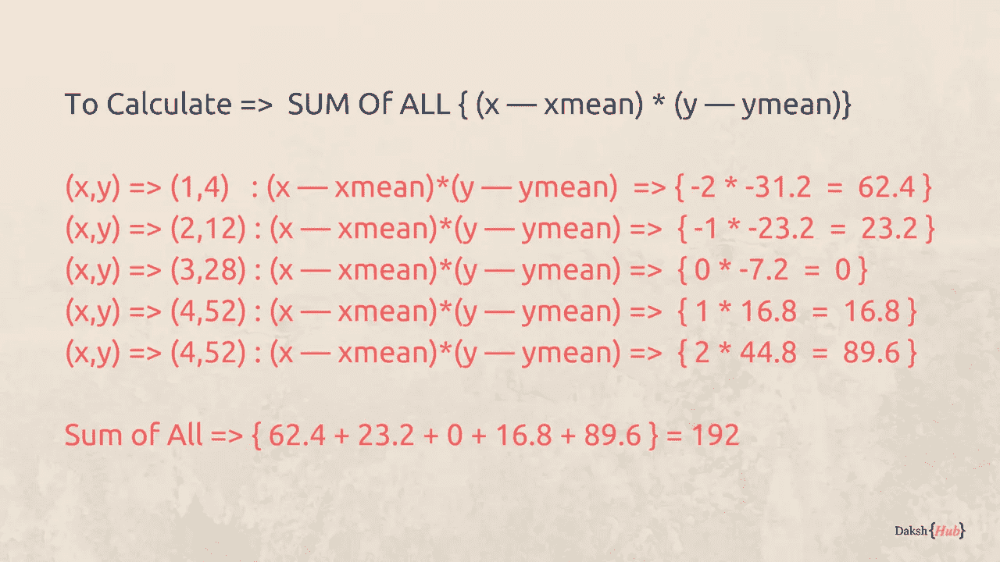

Calculating Sum of All `(x — xmean)*(y — ymean)`

现在让我们来计算等式的分母部分，即

`Sum of (x — xmean)**2`

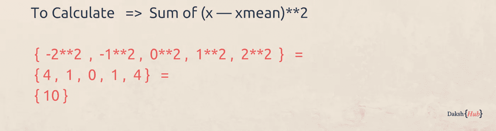

Calculating Sum Of (x — xmean) square

所以总的计算结果是

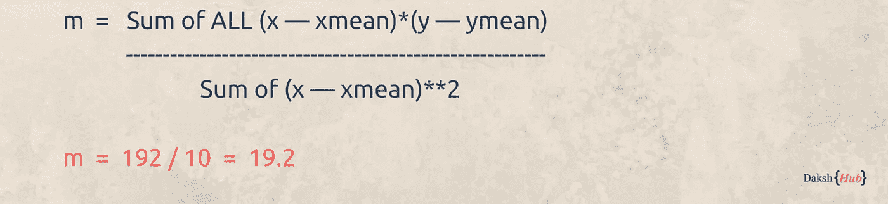

Calculating the slope

**y 轴截距的计算**

使用公式`b = ymean — m * xmean`计算 y 轴截距

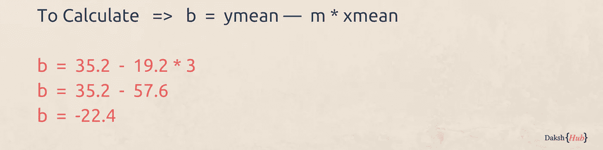

Getting the y-intercept value

总体公式现在可以用`y = mx + b`的形式写成

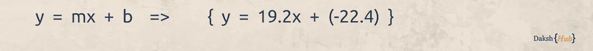

Getting y = mx + b

## 对 X，Y 值使用最小二乘回归

让我们看看当我们对所有 x 值应用`y = 19.2x + (-22.4)`时，预测`y`如何变化。

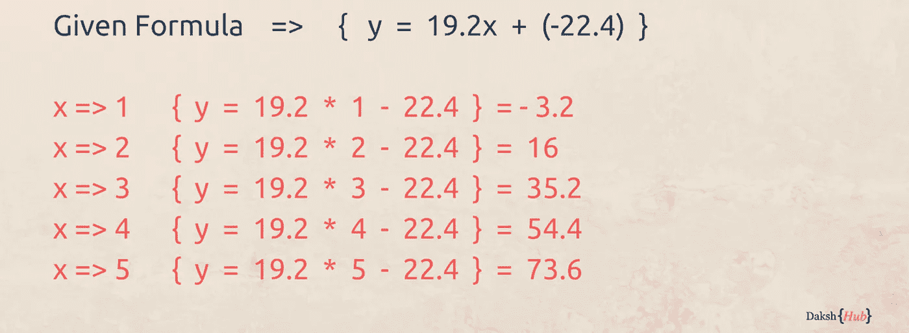

Predicting Y for all X using Least Square

让我们对照标准值绘制这个特殊的直线图。

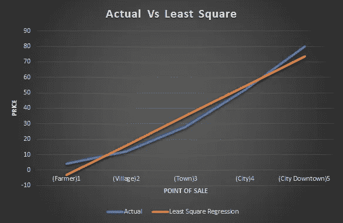

Graph: Comparing Actual Vs Least Square

我们可以看到，与起点和终点之间的直线值相比，这些值更接近实际的直线。如果我们将它与直线图进行比较，我们就能看到不同之处

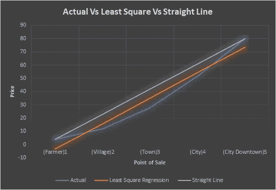

Graph: Comparing Actual Vs Least Square Vs Straight Line

## 为什么这种方法叫最小二乘回归？

该方法旨在减少所有误差值的平方和。误差越小，与原点的整体偏差就越小。我们可以将其与直线产生的误差以及最小二乘回归进行比较


Calculating Sum Square Error of Straight line

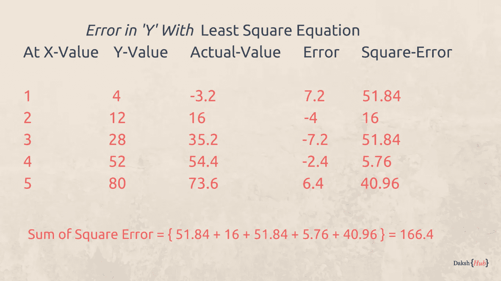

Calculating Sum square error of least square

正如我们所看到的，最小二乘法提供了比两点之间的直线计算更好的结果。

最小二乘法并不是机器学习中改进模型的唯一方法，还有其他方法，我会在后面的文章中谈到

感谢阅读…！！！

达克什