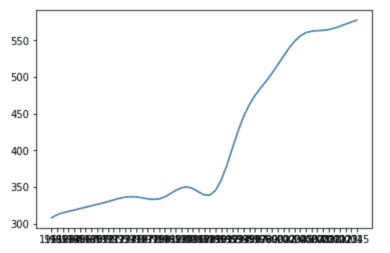
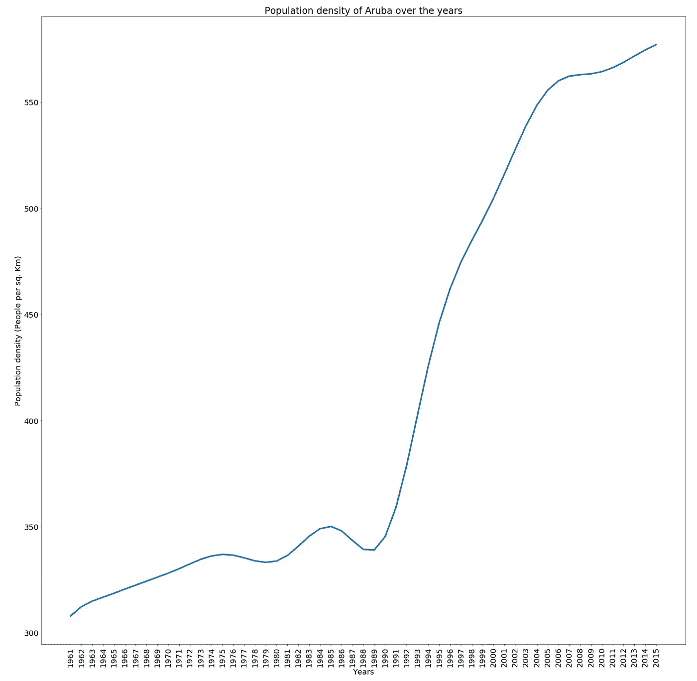
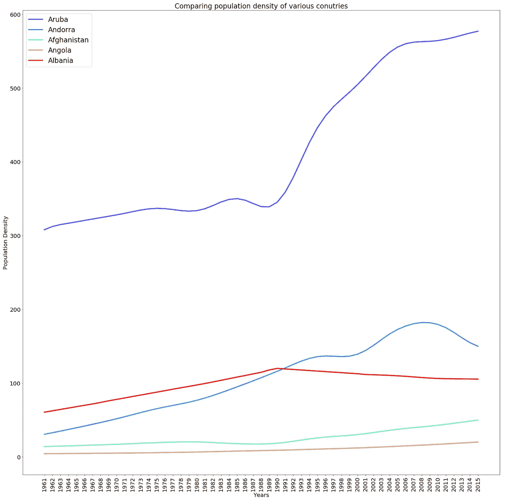
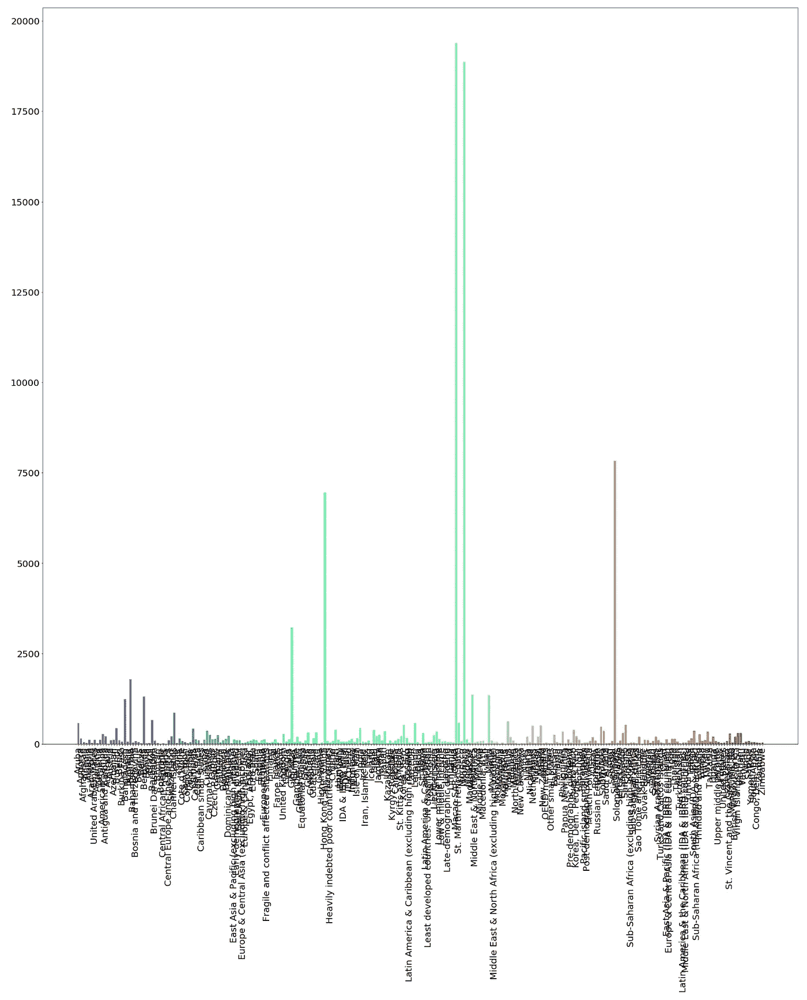
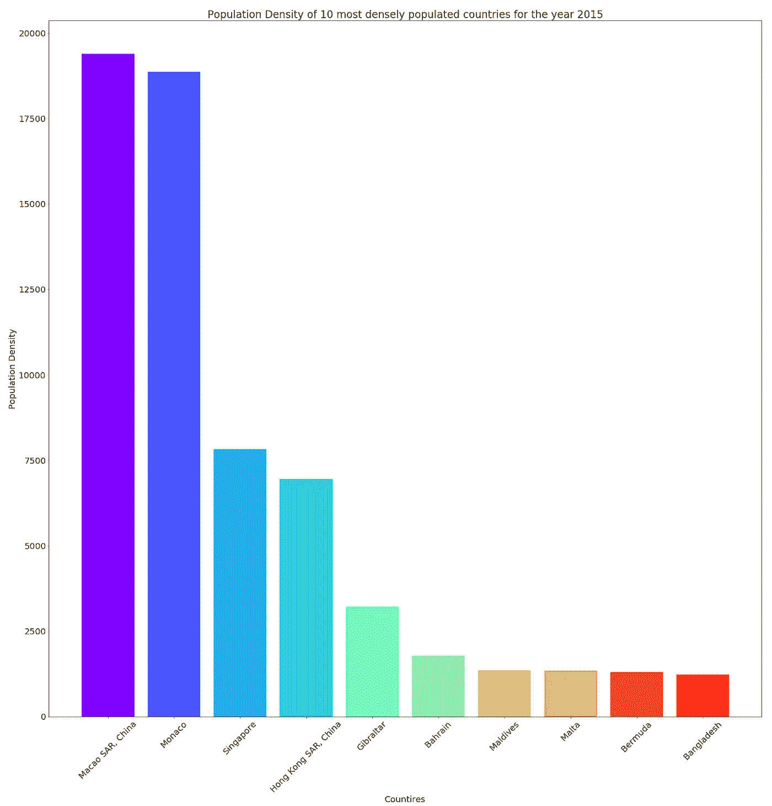
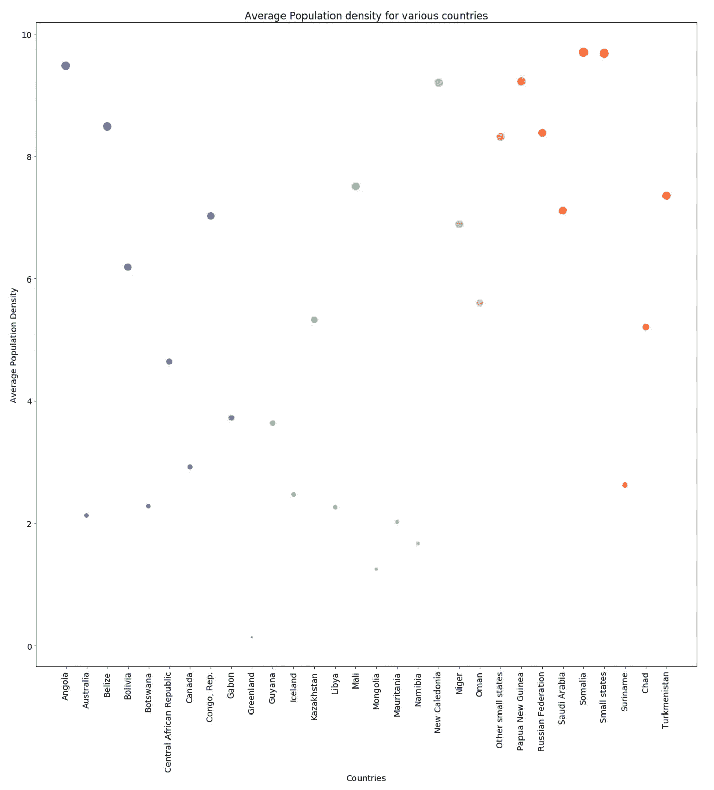
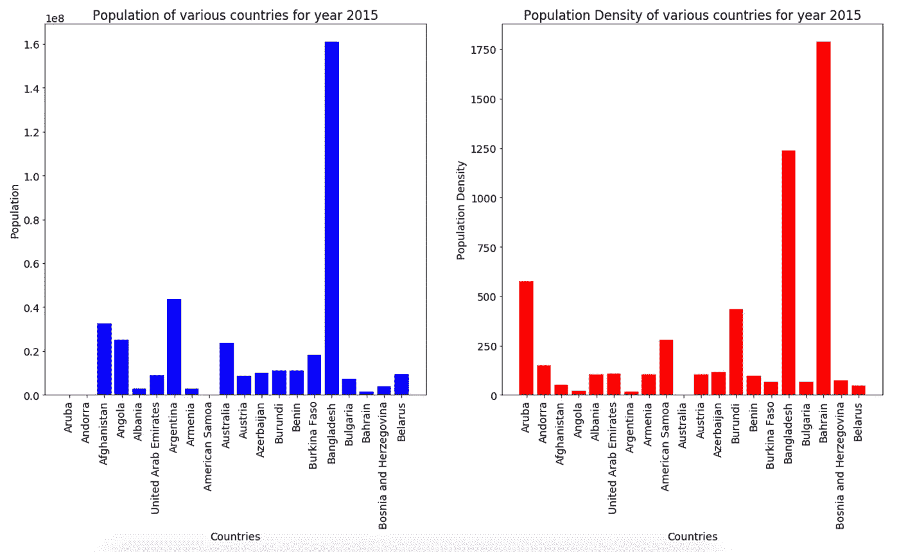

# matplotlib——让数据可视化变得有趣

> 原文：<https://towardsdatascience.com/matplotlib-making-data-visualization-interesting-8bac1eb3d25c?source=collection_archive---------8----------------------->

Photo by [Alex Litvin](https://unsplash.com/@alexlitvin?utm_source=medium&utm_medium=referral) on [Unsplash](https://unsplash.com?utm_source=medium&utm_medium=referral)

数据可视化是理解数据集并从中进行推断的关键步骤。虽然人们总是可以一行一行、一个单元一个单元地仔细检查数据，但这通常是一项单调乏味的任务，并且不能突出显示全局。另一方面，视觉效果以一种只需看一眼就能理解的形式定义数据，并保持观众的参与。

> Matplotlib 是一个 Python 2D 绘图库，它以各种硬拷贝格式和跨平台的交互式环境生成出版物质量数字。—[matplotlib.org](https://matplotlib.org/)

Matplotlib 是一个基本的库，它为各种绘图提供了选项，并以标签、标题、字体大小等形式提供了广泛的定制。我观看了大量的视频，并在网上阅读了可视化的文章。为了更好地理解 Matplotlib，我从 [Kaggle](https://www.kaggle.com/walla2ae/world-population) 获取了人口密度数据集，并开始创建自己的可视化效果。本文重点介绍了我绘制的图表，包括我从数据中得出的定制和推论。

完整的工作以 GitHub 知识库的形式呈现，作为使用 Matplotlib 的[可视化，以便快速参考。我们开始吧！](https://github.com/kb22/Visualization-using-Matplotlib)

# 导入库

和往常一样，我们首先需要导入所有必需的库。我们导入`Numpy`和`Pandas`库进行数据处理。然后我们导入`matplotlib`，用它的模块`pyplot`绘制数据，用`cm`绘制调色板。语句`%matplotlib inline`确保所有图形在笔记本中内嵌显示。

# 导入数据集

不需要文件`dataset.csv`的前四行，所以我们可以跳过前四行，将数据导入变量`dataset`。然后我们使用`head(5)`来检查数据。

我们会立即看到一些与我们无关的栏目。首先，我们可以保留`Country Name`，但可以删除`Country Code`。因为我们知道我们正在处理人口密度，我们可以删除列`Indicator Name`和`Indicator Code`。接下来，年份`1960`和`2016`的列具有`NaN`值。`NaN`代表的不是数字，我们应该删除这些列，因为它们不提供任何信息。最后，有一个未命名的列也有`NaN`值，所以我们也可以删除`Unnamed: 61`。

我们使用`dropna`方法删除所有可能有空值或 null 值的行，并使用`dataset.isnull().sum()`检查是否所有列都没有 null 值。我们看到所有都显示空值。

我们现在准备可视化我们的数据。

# (英)可视化(= visualization)

Photo by [rawpixel](https://unsplash.com/@rawpixel?utm_source=medium&utm_medium=referral) on [Unsplash](https://unsplash.com?utm_source=medium&utm_medium=referral)

现在，我们将使用 Matplotlib 来创建我们的图，并使用可视化来得出有意义的结论。

## 线形图

我们首先用线图分析`Aruba`这些年的人口密度。我们沿 x 轴取年份，沿 y 轴取人口密度。

我们选择 x 值为`dataset.columns[1:]`，这将选择除第一列之外的所有列，因为我们只需要年份，而不需要`Country Name`列。接下来，我们选择 y 值作为选择第一列的`dataset.iloc[0][1:]`，即国家`Aruba`和除第一列之外的所有列。可以使用`dataset[0][0]`获得国家名称。为了绘制图表，我们只需使用`plot`函数，并将 x 轴和 y 轴的参数分别定义为 x 和 y。

恭喜你！！我们的第一个情节准备好了！！

First Plot

是的，它起了作用，但是很难理解。没有标签，轴值重叠。这就是 matplotlib 的定制能力派上用场的地方。让我们把它变得更容易理解一点。

`rcParams`允许我们修改图形大小、字体大小等等。然后我们添加一个标题，xlabel 和 ylabel。`xticks`允许我们定义文本的旋转角度，我们将其设置为 90 度。然后我们再次绘图，并将线的宽度定义为`4`。

Updated Plot

我们现在可以看到，该图更具描述性，只是做了一些修改。

> 从上面的图中，我们可以看到人口密度在 20 世纪 80 年代之前一直在稳步上升。从 20 世纪 90 年代开始，密度急剧上升，并继续保持同样的增长，直到 2000 年代中期趋于稳定。

我们也可以使用折线图来观察不同国家的趋势。我们选取前 5 个国家，比较它们的人口密度增长。由于我们现在要处理单个图表上的多条线，我们应该为每个国家使用不同的颜色，并且还要定义一个图例，为每个国家分配一种独特的颜色。

这里，我们遍历数据集的前 5 行，并将这些值绘制成线图。我们使用`matplotlib`的`cm`包及其`rainbow`方法来选择颜色。在绘图方法中，我们必须指定`label`参数，因为它确保当图例被启用时，图例名称被显示。使用方法`legend()`启用图例，其中我指定了一个属性，即`24`的大小。

Comparing 5 countries based on their Population Density

我们可以看到，阿鲁巴、安道尔、阿富汗、安哥拉和阿尔巴尼亚这五个国家的人口密度都有所上升。

> 现在，我们已经在一个单独的地块上绘制了所有的线图，很容易看出，与其他 4 个国家相比，阿鲁巴的人口密度一直较高。

## 条形图

使用带有相关参数的方法`bar()`可以轻松创建条形图。我们从绘制 2015 年所有国家的人口密度开始。

Bar Plot for Population Density of all countries for 2015

虽然情节确实试图在同一时间提供大量信息，但出于同样的原因，它缺乏提供任何有用的信息。x 轴标签中有太多的重叠，以至于整个绘图变得毫无用处。我们不仅需要可视化我们的数据集，还需要巧妙地可视化数据集的重要部分。如果把密度最大的前 10 个国家排序一下，看一看就更好了。

我们首先使用`sort_values`方法，根据`2015`年的人口密度，按照`descending`的顺序对国家进行排序。然后，我们使用`head(10)`方法选择前 10 名。然后，我们用这些新数据绘制柱状图。

Top 10 most densely populated countries for 2015

现在信息非常清楚了。数据是等间距的，并用不同的颜色清楚地表示出来。

> 在 2015 年的数据集中，澳门特区和摩纳哥的人口密度在所有其他可用国家中最高。

## 散点图

散点图是将数据显示为开放空间中的点的图。散点图非常有用，因为我们可以根据某个值指定每个数据点的大小，并且数据本身可以表示它与其他点的区别。

我们现在分析所有年份平均人口密度低于每平方公里土地面积 10 人的国家。

首先，我使用`dataset.sum(axis = 1)`对每一行的所有数据求和，然后使用`lambda`方法对每个最终值除以列数得到平均值。然后，我将这个值与小于或等于 10 的值进行比较，并将其用作数据集的索引。结果是平均人口密度小于或等于 10 的所有国家。我现在再次计算这个值，这次将它存储在变量`consolidated_data`中。绘制散点图的方法与其他图相似，但有一点小小的变化。我们现在可以使用参数`s`定义每个数据点的大小。我一直保持大小相当于人口密度。由于值很小，我将每个值乘以 20，这样差异就更明显了。

Countries with average Population Density less than equal to 10

您可以看到，每个数据点都根据其密度值以自己的大小显示在图表上。

> 在数据集中的所有国家中，格陵兰的平均人口密度似乎最小。

# 深入分析

现在，我们将更深入地研究数据集，看看能否得出更多结论。

## 描述性分析

我们可以看到全世界的最大和最小密度值是否有任何变化。因此，我们需要计算值的范围。

我们使用`min()`和`max()`方法来计算除`Country Name`之外的每一列的最小值和最大值。然后我们在变量`diff`中找到范围。然后，我们计算每列最大值的最小值，并将其保存到`minOfMax`。当我们绘制条形图时，我们将从所有范围中减去该值，这将确保我们将所有范围与最小范围年份进行比较。这是通过在柱状图中使用`apply(lambda x: x-minOfMax)`方法来确保的。

Range of Population Density

> 我们看到，2001 年，人口密度最大的国家和人口密度最小的国家之间的差距最大，然后在 2002 年急剧下降。

## 人口与人口密度

探索人口密度是否确实是一个好的衡量标准，以及它是否也反映了一个国家的人口数量，这将是令人惊讶的。由于这个数据集没有人口或面积，我们需要从其他来源获取它。在这里，我们将使用 BeautifulSoup 从[维基百科页面](https://en.wikipedia.org/wiki/List_of_countries_and_dependencies_by_area)中提取土地面积，并使用它来计算人口。然后我们会比较人口和人口密度。你可以参考[我关于网络抓取的文章](/dataset-creation-and-cleaning-web-scraping-using-python-part-1-33afbf360b6b)来快速启动。

最后一组包括 170 个国家，我们有完整的可用信息，包括以公里为单位的土地面积。但是由于一次理解和解释这么多国家是很困难的，我们先来看看前 20 个国家。

我们现在通过并排绘制柱状图来比较 20 个国家的人口和人口密度。我们通过将 2015 年的人口密度乘以`area`得到`Population`。我们可以把画布分成多个支线剧情。方法`subplot(rows, columns, index)`用于定义一个支线剧情。这里，我们创建了一个由 2 行 2 列标识的 4 个图组成的画布。第三个参数告诉我们这里指的是哪个图。我们将 20 个国家的数据绘制在索引为 1 和 2 的两个图表中。

Population vs Population Density

我们可以看到`Population Density`并不总是描述一个国家`Population`的正确尺度，比如国家`Bahrain`。

> 尽管人口密度很高，但孟加拉国的人口比巴林高得多。

# 结论

在这里，我们使用`matplotlib`包来设计和创建图，这有助于我们更好地理解我们的数据集。

希望你喜欢我的作品。请分享你的想法和建议。