# Seaborn 实际上非常适合数据可视化

> 原文：<https://towardsdatascience.com/matplotlib-seaborn-basics-2bd7b66dbee2?source=collection_archive---------6----------------------->

Seaborn 是一个基于 matplotlib 的 Python 数据可视化库(它是 Python 中绘图的常用库)。Seaborn 提供了一个高级界面，用于绘制有吸引力和信息丰富的统计图形。

## 1.导入

```
%matplotlib inlineimport matplotlib.pyplot as plt
import seaborn as sns
```

## 2.应用默认的 seaborn 主题、缩放和调色板。

```
sns.set()
```

您还可以自定义 seaborn 主题或使用默认主题的六种变体之一。它们被称为深色、浅色、浅色、亮色、深色和色盲。

```
# Plot color palette
def plot_color_palette(palette: str):
    figure = sns.palplot(sns.color_palette())
    plt.xlabel("Color palette: " + palette)
    plt.show(figure)

palettes = ["deep", "muted", "pastel", "bright", "dark", "colorblind"]
for palette in palettes:
    sns.set(palette=palette)
    plot_color_palette(palette)
```


使用这个 [**colab 文件**](https://colab.research.google.com/drive/1o6MijFkNHiTPeS8Y5n59j2cH4-Mf2wX3) 可以按照自己的步调学习下面的例子。谷歌的合作实验室是一个免费的 Jupyter 笔记本环境，不需要设置，完全在云中运行。

## 3.加载数据集

我们将在这里使用 tips 数据集，它将帮助我们浏览一些真实的示例。

```
tips = sns.load_dataset("tips")
tips.head()
```

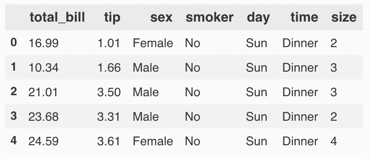

## 4.绘图数据

让我们从使用多个语义变量的散点图开始，来可视化我们正在处理的数据集。

```
sns.relplot(x="total_bill", y="tip", 
            col="time", # Categorical variables that will determine the faceting of the grid.
            hue="smoker", # Grouping variable that will produce elements with different colors.
            style="smoker", # Grouping variable that will produce elements with different styles.
            size="size", # Grouping variable that will produce elements with different sizes.
            data=tips)
```

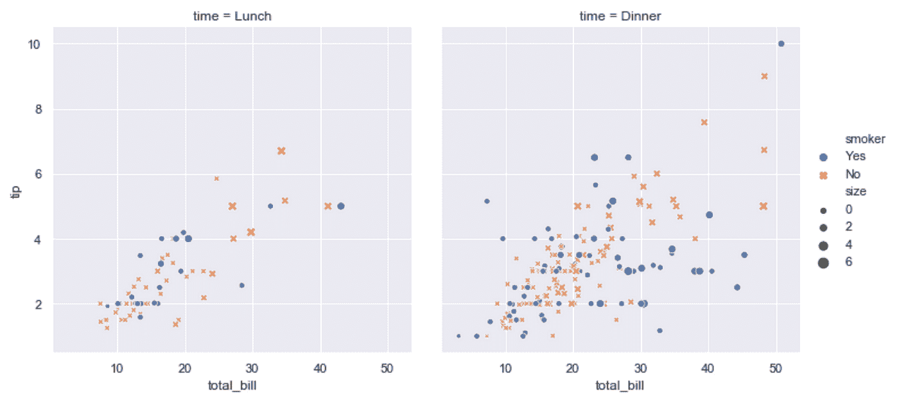

seaborn 中有几种专门的绘图类型，它们针对不同变量(数值和分类)之间的可视化关系进行了优化。可以通过`[relplot](https://seaborn.pydata.org/generated/seaborn.relplot.html)`访问它们。

我们还可以使用`lmplot`绘制线性回归模型。

```
sns.lmplot(x="total_bill", y="tip", 
           col="time", # Categorical variables that will determine the faceting of the grid.
           hue="smoker", # Grouping variable that will produce elements with different colors.
           data=tips)
```

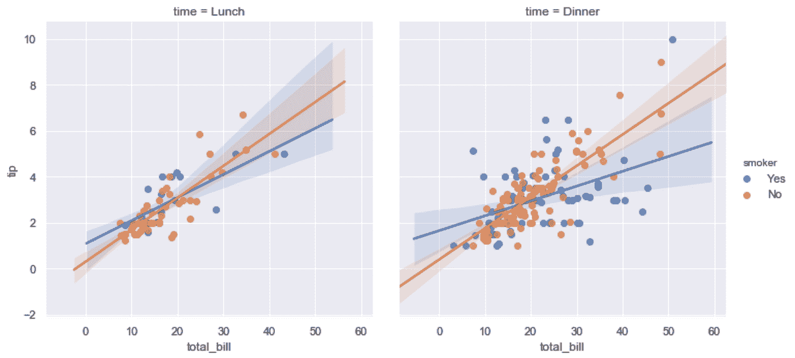

或者简单地说:

```
sns.lmplot(x="total_bill", y="tip", data=tips)
```

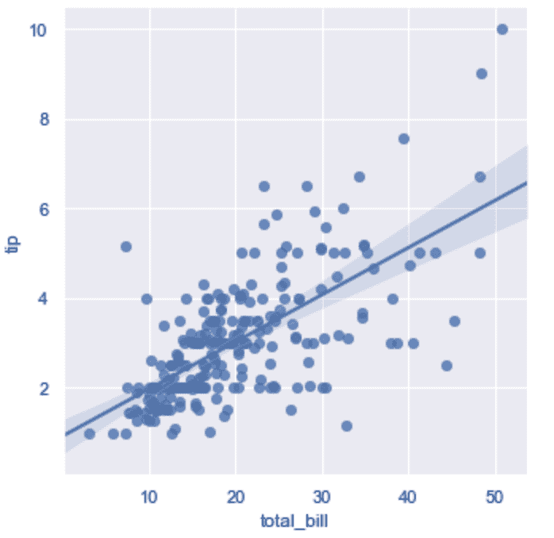

```
sns.lmplot(x="size", y="tip", data=tips)
```

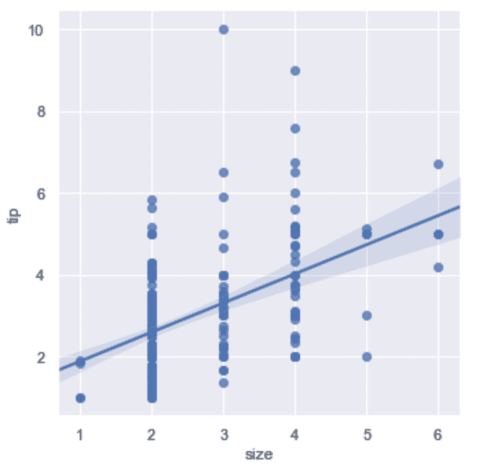

```
sns.lmplot(x="size", y="tip", data=tips, x_estimator=np.mean)
```

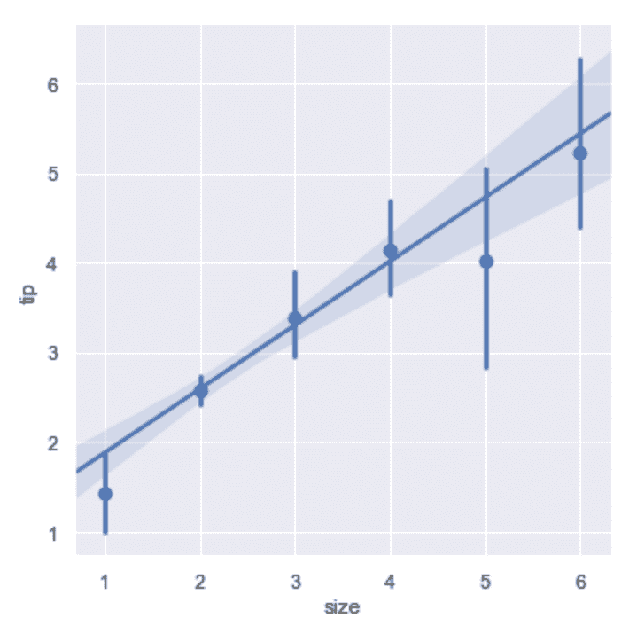

```
tips["big_tip"] = (tips.tip / tips.total_bill) > .15
sns.lmplot(x="total_bill", y="big_tip",
           y_jitter=.03, 
           logistic=True, 
           data=tips)
```

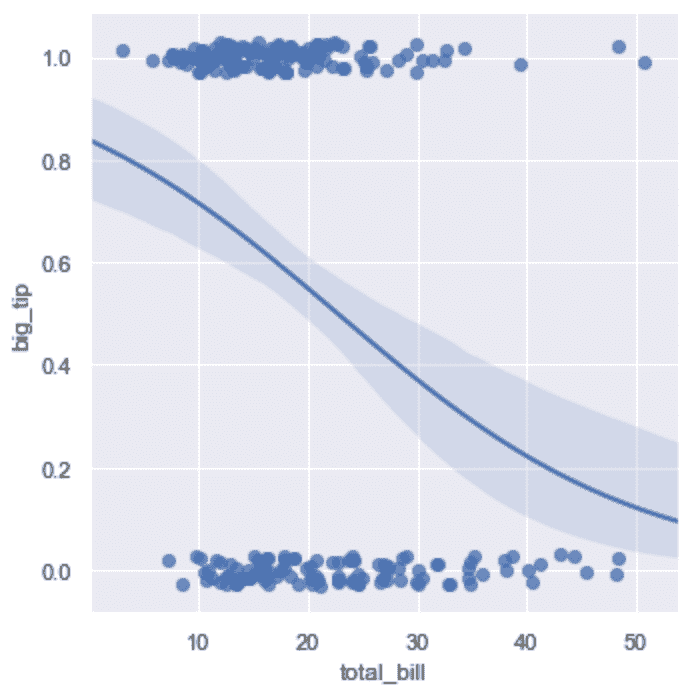

seaborn 中还有其他几种专门的绘图类型，它们针对可视化分类变量进行了优化。他们可以通过`catplot`访问。

```
sns.catplot(x="day", y="total_bill", 
            hue="smoker", # Grouping variable that will produce elements with different colors.
            kind="swarm", # Options are: "point", "bar", "strip", "swarm", "box", "violin", or "boxen"
            data=tips)
```

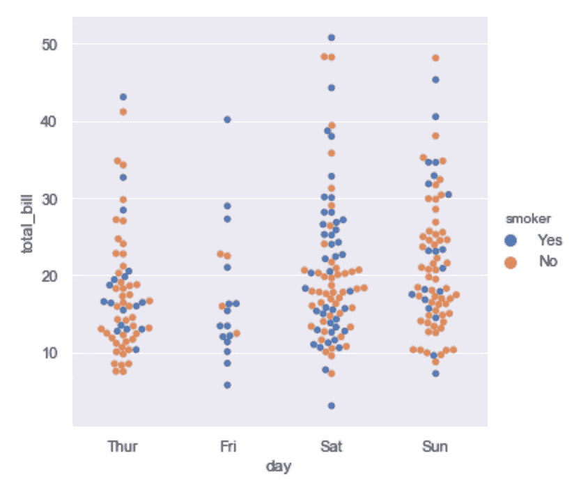

或者，我们可以使用核密度估计来表示采样点的基本分布。

```
sns.catplot(x="day", y="total_bill", 
            hue="smoker", # Grouping variable that will produce elements with different colors.
            kind="violin", # Options are: "point", "bar", "strip", "swarm", "box", "violin", or "boxen"
            split=True, 
            data=tips)
```


或者您可以显示每个嵌套类别中的唯一平均值及其置信区间。

```
sns.catplot(x="day", y="total_bill", 
            hue="smoker", # Grouping variable that will produce elements with different colors.
            kind="bar", # Options are: "point", "bar", "strip", "swarm", "box", "violin", or "boxen"
            data=tips)
```

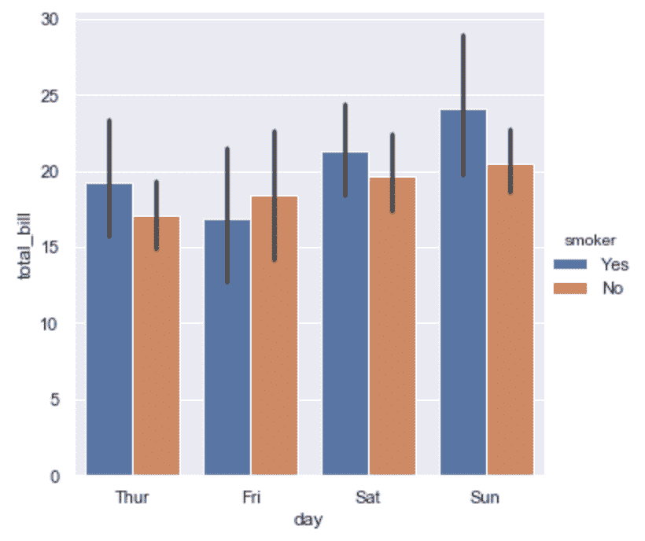

`jointplot`和`pairplot`使多情节可视化成为可能。`jointplot`关注单个关系，而`pairplot`从更广的角度来看，显示所有成对关系和边际分布，可选地以分类变量为条件。

```
sns.jointplot(x="total_bill", y="tip", 
              kind="reg", # Options are "scatter", "reg", "resid", "kde", "hex"
              data=tips)
```

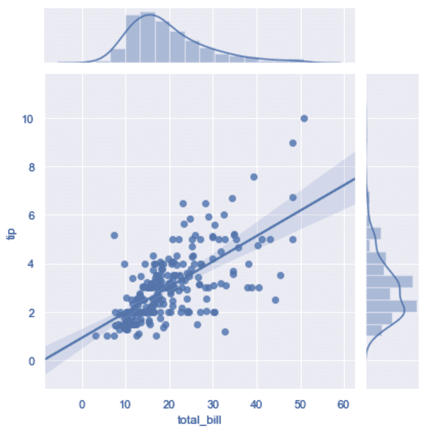

```
sns.pairplot(hue="smoker", # Grouping variable that will produce elements with different colors.
             data=tips)
```

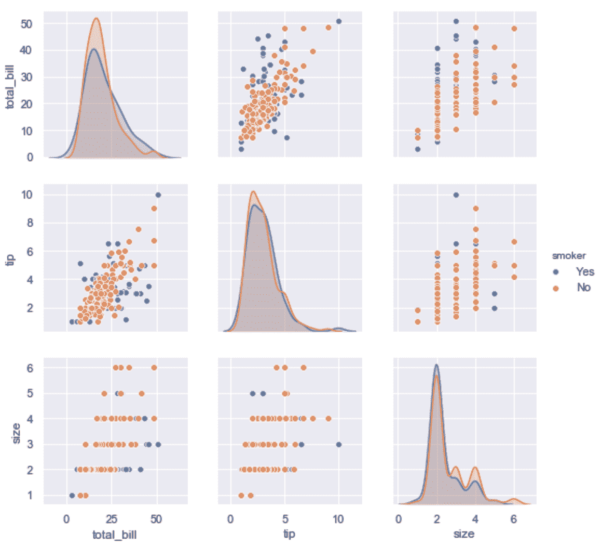

并排绘制两幅图像

```
figure = plt.figure()
figure.add_subplot(1, 2, 1)
plt.imshow(image_grey, cmap='gray'), plt.axis("off")
figure.add_subplot(1, 2, 2)
plt.imshow(image_binarized, cmap='gray'), plt.axis("off")
plt.show()
```


您甚至可以绘制更复杂的网格，例如:

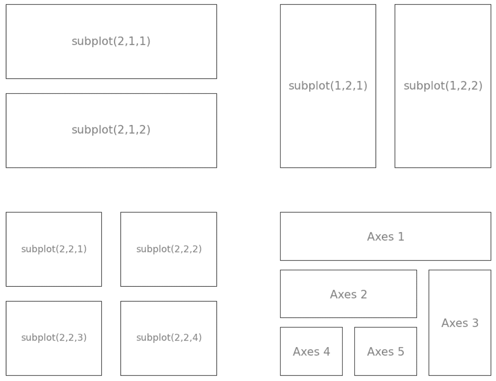

Subplots. Credit: [labri.fr](https://www.labri.fr/perso/nrougier/teaching/matplotlib/#figures-subplots-axes-and-ticks)

# 参考资料:

1.  [https://seaborn.pydata.org/tutorial.html](https://seaborn.pydata.org/tutorial.html)
2.  [https://seaborn.pydata.org/introduction.html](https://seaborn.pydata.org/introduction.html)

看看这个故事 [**colab 文件**](https://colab.research.google.com/drive/1o6MijFkNHiTPeS8Y5n59j2cH4-Mf2wX3) ，做些修改，如果觉得有帮助就分享吧。

最后，我创建了一个 3 分钟的调查，以帮助收集您在机器学习项目中最常用的工具和技术的数据。一旦收集到数据(如果您选择与我分享您的电子邮件),我们会与您分享这些数据，目的是确定趋势和最佳实践。

这项调查有助于确定现有工作流程中的改进领域和难点。

请花点时间填写这份调查【http://bit.ly/ml-survey-2019 T4