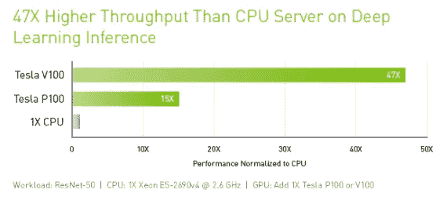
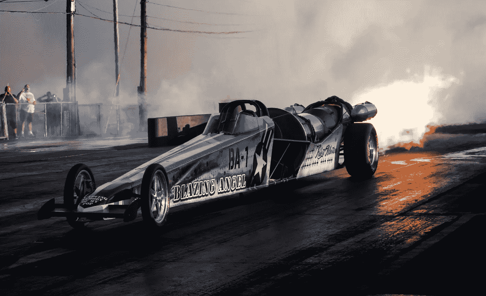
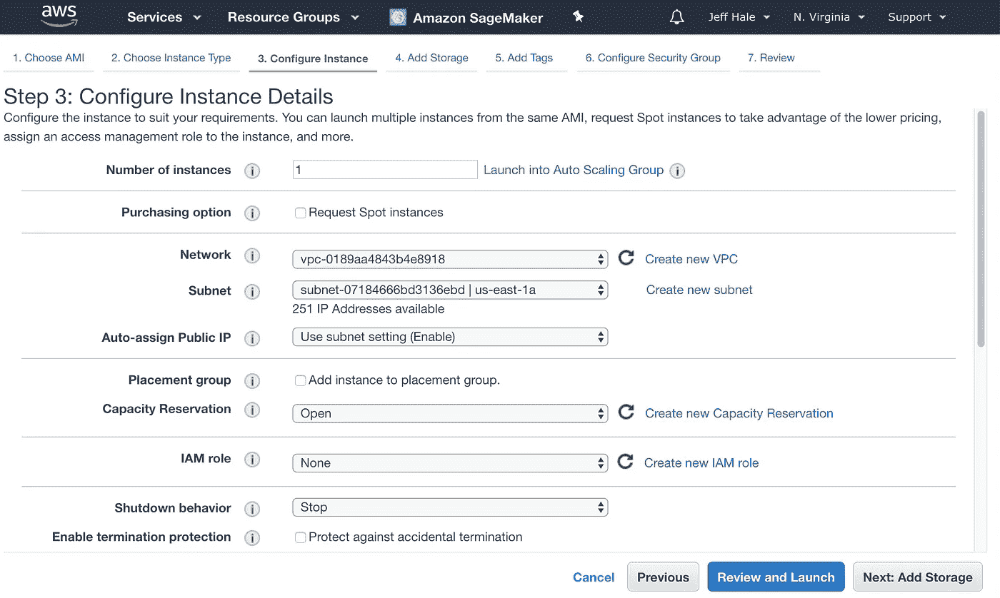
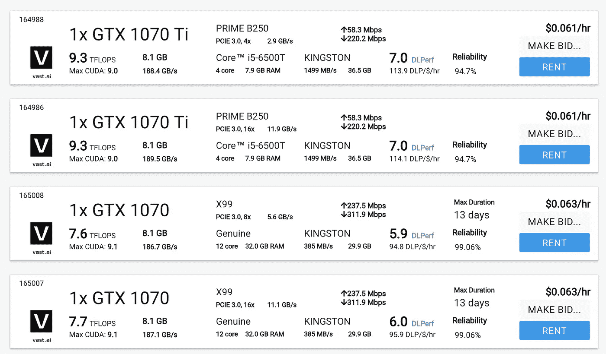
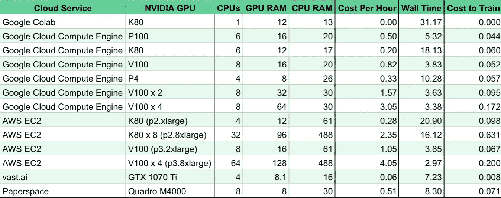
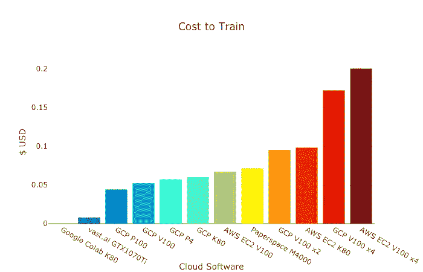
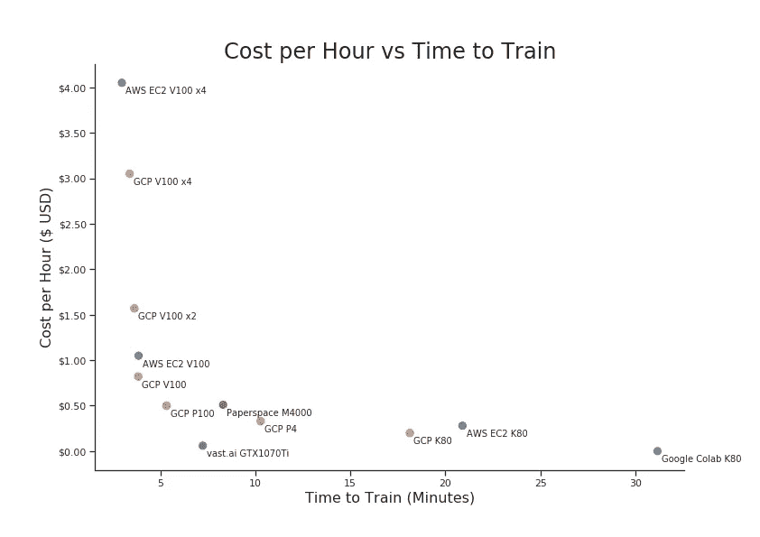
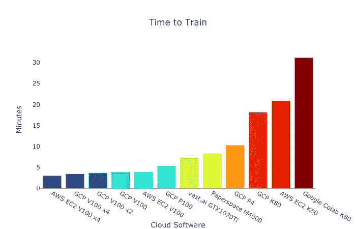

# 深度学习云提供商的最佳交易

> 原文：<https://towardsdatascience.com/maximize-your-gpu-dollars-a9133f4e546a?source=collection_archive---------0----------------------->

## AWS、谷歌、Paperspace、vast.ai 等等

我想知道我应该在哪里以最低的成本和最少的麻烦在线训练我的深度学习模型。我没能找到一个比较好的 GPU 云服务提供商，所以我决定自己做一个。

如果你对 GPU 和 TPU 了如指掌，只想要结果，请随意[跳到漂亮的图表](#41d3)。

在本文中，我没有考虑服务模型，但是将来我可能会考虑。跟着我，确保你不会错过。

# 深度学习芯片选项

我们简单看一下可用于深度学习的芯片类型。我将通过与福特汽车进行比较来简化主要产品。

光靠 CPU 做深度学习真的很慢。你不想用它们。它们对许多机器学习任务都很好，只是不适合深度学习。CPU 是深度学习的马车。

Horse and Buggy

对于大多数深度学习计算，GPU 比 CPU 快得多。NVDIA 制造了市场上的大多数 GPU。接下来我们要讨论的几款芯片是 NVDIA GPUs。

一个 NVIDIA K80 大约是你开始深度学习所需的最低要求，并且不会有极其缓慢的训练时间。K80 就像福特 A 型车——一种全新的出行方式。

Ford Model A

英伟达 P4s 比 K80s 快。它们就像福特嘉年华。绝对是对 a 型车的改进。它们并不常见。

Ford Fiesta. Credit; By Rudolf Stricker CC-BY-SA-3.0 ([http://creativecommons.org/licenses/by-sa/3.0/](http://creativecommons.org/licenses/by-sa/3.0/)), from Wikimedia Commons

P100 是嘉年华的升级版。这是一个相当快的芯片。对于大多数深度学习应用程序来说完全没问题。

Ford Taurus. Credit: ford.com

NVDIA 还制造了许多消费级 GPU，经常用于游戏或加密货币挖掘。这些 GPU 通常工作正常，但在云服务提供商中并不常见。

目前市场上最快的 NVDIA GPU 是特斯拉 V100——与特斯拉汽车公司无关。V100 大约比 P100 快 3 倍。

[https://www.nvidia.com/en-us/data-center/tesla-v100/](https://www.nvidia.com/en-us/data-center/tesla-v100/)

V100 就像福特野马:速度很快。如果你现在正在使用 PyTorch，这是你最好的选择。

Ford Mustang. Credit: Ford.com

如果你在谷歌云上使用 TensorFlow/Keras，你也可以使用张量处理单元——[TPUs](https://cloud.google.com/tpu/docs/tpus)。Google Cloud、Google Colab 和 PaperSpace(使用 Google Cloud 的机器)都有 TPU v2。它们就像矩阵计算中的福特 GT 赛车。

Ford GT. Credit: Ford.com

TPU 的 v3 仅在谷歌云上对公众开放。TPU v3 是你今天能找到的最快的深度学习芯片。它们非常适合训练 Keras/TensorFlow 深度学习模型。它们就像一辆喷气式汽车。

Jet car. Credit: By Gt diesel — Own work, CC BY-SA 3.0, https://commons.wikimedia.org/w/index.php?curid=30853801

如果想加快训练速度，可以增加多个 GPU 或者 TPU。然而，当你增加数量的时候，你将支付更多。

# 结构

深度学习框架有几种选择。我在这里写了一篇关于哪些最受欢迎和最受欢迎的文章:

 [## 深度学习框架 Power Scores 2018

### 谁在使用、兴趣和受欢迎程度上领先？

towardsdatascience.com](/deep-learning-framework-power-scores-2018-23607ddf297a) 

TensorFlow 的市场份额最大。Keras 是由 Google 开发的高级 API，运行在 TensorFlow 和其他几个框架上。PyTorch 是 pythonic，脸书支持的酷小子。FastAI 是 PyTorch 的高级 API，它使得用几行代码训练世界级的模型变得很容易。

使用 PyTorch v1.0 预览版和 FastAI 1.0 对模型进行训练。PyTorch v1.0 Preview 和 FastAI v1.0 是最前沿的，但允许你非常快速地做真正酷的事情。

# 参赛者们

我测试了配备 GPU 的云提供商，他们对大量深度学习实践者有很强的价值主张。纳入要求:

*   按小时或更小的增量付费。
*   安装配置不能差。尽管如此，我还是将 AWS 包括在内，因为它们拥有如此大的市场份额。

事不宜迟，如果你开始深度学习，这里是你需要知道的云提供商。

## Google Colab

[Google Colab](https://colab.research.google.com/) 免费。这是一个带有漂亮 UX 的 Jupyter 笔记本系统。它集成了 GitHub 和 Google Drive。Colab 还允许合作者在笔记本上留下评论。

对于 Keras 或 TensorFlow 来说，Colab 上手速度非常快，这并不奇怪，因为这些开源库都是谷歌自己开发的。Pytorch v1.0 预览版需要进行一些配置，并且有些问题。当使用 Resnet50 和适当大小的分辨率图像时，我不得不关闭 FastAI v1 的并行性以节省内存。

## 2019 年 1 月 15 日更新。PyTorch 位于 V1，Google Colab 增加了 Docker 容器的共享内存。您现在可以并行运行这个测试了。

Colab 既有 GPU 也有 TPU。在撰写本文时，您不能将 TPUs 与 PyTorch 一起使用。然而，TPU 对 PyTorch(以及 FastAI) [的支持正在进行中](https://cloud.google.com/blog/products/ai-machine-learning/introducing-pytorch-across-google-cloud)——谷歌工程师正在制作原型——截至 2018 年 10 月 25 日。

## 谷歌云

[谷歌云](https://cloud.google.com/products/ai/)计算引擎是比 Colab 更强大、更可定制的云选项。像 AWS 一样，它需要一些配置，令人沮丧的配额增加，总账单有点难以估计。与 AWS 不同，Google Cloud 接口更容易使用，更容易配置，TPU 可用于 TensorFlow/Keras 项目。

Pricing changes as you change Google Cloud instance settings

可抢占的实例节省了很多钱，但是有被打断的风险——它们对大多数学习任务来说都很好。

如果你有资格获得 [$300 初始信用](https://cloud.google.com/free/docs/frequently-asked-questions)并且不介意一些配置，谷歌云是一个进行深度学习的好地方。如果您进行扩展，他们的价格、安全性、服务器选项和易用性使他们成为领先者。

**AWS**

[AWS](https://aws.amazon.com/ec2/) EC2 并不是最容易配置的东西，但它太受欢迎了，每个深度学习从业者都应该在某个时候经历配置的阵痛。在我的文章《寻找数据科学家工作列表中最受欢迎的工具》中，AWS 位列前十。

 [## 数据科学家最需要的技能

### 雇主在寻找什么？

towardsdatascience.com](/the-most-in-demand-skills-for-data-scientists-4a4a8db896db) 

AWS 的入门级 GPU 产品是 p2 . x large——AWS 称之为具有 4 个 CPU 和 61 个 RAM 的 NVDIA Tesla K80。截至 2018 年 10 月下旬，您可以通过每小时 0.28 美元的现货定价节省资金。尽管存在没有实例可用的风险。几乎每次我尝试以略高于最近的价格购买现货时，都会收到一个。

AWS instance configuration fun

AWS 是可伸缩的、安全的和可靠的。它运行着互联网的大部分。不幸的是，这也是一个痛苦的设置。我建议你不要用 AWS 开始你的深度学习之旅，除非你已经熟悉这项服务，或者是一名经验丰富的程序员。

## 图纸空间

让 Jupyter 笔记本在[纸张空间](https://www.paperspace.com/)渐变上运行非常快。用 FastAI v1.0 版设置 PyTorch v1.0 版预览版也很容易。

Paperspace 有谷歌的 TPUv2s，这是除了谷歌之外唯一一家有能力租用它们的公司。这里有一篇关于这个功能的好文章。与谷歌云相比，TPU 的价格有点贵，为 6.50 美元——在谷歌云上，你可以用不到一半的价格买到可抢占的 TPUs。

Paperspace 的网站表明他们非常重视安全性。他们有 SLA。总部位于纽约的 Y-combinator alum 公司最近筹集了 1300 万美元。Paperspace 有自己的服务器，也使用其他人的服务器。他们是合法的。

## vast.ai

[vast.ai](https://vast.ai/) 是 GPU 共享经济选项。这是一个为需要 GPU 的人和在 vast.ai 上列出他们机器的第三方个人匹配的市场。它有一个非常好的仪表板和非常好的价格。

理论上，你使用的第三方机器可以获取你的数据，尽管实际上这并不容易。这里见讨论[。](https://vast.ai/faq/#Security)

此外，正常运行时间可能会低于云基础架构公司。例如，电源或互联网可能会在源头中断，这可能是某个人的房子。对猫狗分类没问题，对病人病历没问题。

Vast.ai 在仪表盘上显示的机器技术规格信息比我从其他任何云提供商那里看到的都多。我用了一台 GTX 1070 Ti，每小时收费 0.065 美元，预计正常运行时间约为 99.5%。那就是每小时 6.5 美分！安装最新的 PyTorch 版本很快。我不建议以更低的价格竞标，只要以当前价格租赁，否则你很可能会失去你的机器。

vast.ai Options

除了 Kaggle 和 Google Colab 有限的免费选项，vast.ai 是获得体面性能的最低成本选项。

## 其他选项

我看了很多其他的 GPU 选项。我没有测试我的[已知 GPU 云提供商列表](/list-of-deep-learning-cloud-service-providers-579f2c769ed6)上的每一项服务——因为其中许多服务要么不容易快速设置，要么在成本上没有竞争力。

如果你正在学习机器学习，那么你应该花些时间在 [Kaggle](https://www.kaggle.com) 上。它有一个很棒的学习社区，有教程、竞赛和大量数据集。Kaggle 提供免费的 K80 GPUs，12GB VRAM，2 个 CPU 内核，6GB RAM，[最长 12 小时](https://www.kaggle.com/dansbecker/running-kaggle-kernels-with-a-gpu)。我发现这个网站很落后，他们的笔记本没有 Jupyter 笔记本通常有的快捷方式。

此外，在 Kaggle 上上传定制包和处理文件也很困难。我建议你不要用 Kaggle 进行深度学习训练，但要用它做很多其他机器学习的事情。

我试着用了 IBM Watson 和微软 Azure。他们都悲惨地没有通过简单设置测试。我花了 30 分钟和他们每个人在一起，然后决定这已经足够了。当有更好的选择时，生命太短暂了，不必要的复杂。他们也是

许多快速部署的服务有良好的客户服务和良好的 UX，但甚至不提数据安全或数据隐私。VectorDash 和[蝾螈](https://salamander.ai/)都可以快速部署，而且相当划算。 [Crestle](https://www.crestle.com/) 部署迅速，但价格较高。FloydHub 要贵得多，K80 每小时的成本超过 1 美元。基本机器的价格不到 0.10 美元，但我在启动时不断出错，聊天帮助在两天后没有回应(尽管他们很快回应了之前的一个问题)。

[Amazon SageMaker](https://aws.amazon.com/sagemaker/) 比 AWS EC2 更加用户友好，但与列表中的其他选项相比没有成本竞争力。像 p2.xlarge 这样的基本 K80 GPU 设置需要花费 1.26 美元！我发现，它还需要增加配额才能使用，这可能需要几天时间。

每个云公司都应该突出讨论安全性、SLA 和数据隐私。谷歌、AWS 和 PaperSpace 做到了这一点，但许多较小的新公司却没有。

# 实验

我在 Jupyter 笔记本上使用 [FastAI v1.0](http://www.fast.ai/2018/10/02/fastai-ai/) 在流行的猫与狗图像分类任务上训练了一个深度学习模型。该测试提供了云提供商实例之间有意义的时间差异。我使用 FastAI 是因为它能够用很少的代码快速训练模型达到非常好的验证集精度(一般约 99.5%)。

我使用 *%%time* 魔法命令来测量时间。比较 Wall time 是因为那是 Google Colab 会输出的时间。对三种操作的壁时间求和:用 fit_one_cycle 训练，用 fit_one_cycle 解冻并再次拟合，以及用测试时间增加预测。 [ResNet50](https://arxiv.org/pdf/1512.03385.pdf) 用于迁移学习。请注意，初始训练的时间是在第二次运行时进行的，因此下载 ResNet50 的时间不会包括在时间计算中。我用来训练模型的代码改编自 FastAI 的文档，可在这里[获得](https://gist.github.com/discdiver/af5ba12bcb1202bc893b3b5af035d263)。

# 结果

这里有一个图表，显示了机器规格的实例结果。

数据和图表可以在 Kaggle 的这个 Jupyter 笔记本中找到。以下是以图形方式显示的培训成本结果。GCP 是谷歌云平台的简称。

Google Colab 是免费的，但是很慢。那些需要花钱训练的人。vast.ai 是迄今为止性价比最高的。

我花了几天时间查看了 vast.ai 的定价，类似规格的机器一般都能买到。有一天，我测试了一台类似的机器，第一台机器的培训成本为 0.01 美元，而第二台机器的培训成本为 0.008 美元，所以结果非常相似。如果 vast.ai 看到用户需求大幅增长，而用户主机没有类似的大幅增长，价格预计会上涨。

让我们画出每小时的花费和训练时间的关系图。

左下角是您想要的位置—优化成本和培训时间。vast.ai、谷歌云的单一 P100 和谷歌云的单一 V100 是强有力的选择。

如果你真的想要速度，AWS 的 V100 x4 是最快的选择。它的培训成本也是最高的。

如果你真的不想花钱，谷歌 Colab 的 K80 可以完成这项工作，但速度很慢。同样，并行化对于 Colab 来说是不可能的。据推测，这将得到解决，其性能将接近 20 分钟，其中谷歌云的 K80 和 AWS 的 K80 进来。Colab 将是一个更好的选择，但仍然很慢。一旦 TPUs 与 PyTorch Colab 配合使用，对 PyTorch 用户来说应该会更好。

在效率方面，Paperspace 比其他选择稍贵，但它减少了许多设置上的麻烦。Paperspace 也有一个非常非常基本的[标准 GPU](https://www.paperspace.com/pricing) ，起价每小时 0.07 美元，但规格如此之低(即 512 MB GPU RAM)，以至于它不太适合深度学习。Google Colab 有一个更好的免费选择。

远离有效边界的期权被排除在最终图表之外。例如，AWS 的 p2.8xlarge 将位于每小时成本与训练时间图表的中上部分，训练时间超过 16 分钟，spot 实例为每小时 4.05 美元。这不是一个好的值。

如果映像上没有最新的软件包版本，则本实验中报告的时间并不反映 SSH 和安装这些版本的时间。AWS 花了一段时间——至少 10 分钟才能得到一个运行中的 Jupyter 笔记本，即使在我为这个项目做了很多次之后。

Google Cloud 的运行速度要快得多，部分原因是 PyTorch v1.0 预览版和 FastAI V1.0 版的图像是可用的。

vast.ai 需要几分钟的时间来旋转，但随后只需点击一下，你就可以进入一个 vast.ai 在线 Jupyter 笔记本，这非常容易使用。

这项研究的一个限制是，图像分类任务只是一个使用。然而，其他深度学习训练可能会显示类似的结果。

# 推荐

如果你是这整个领域的新手，想学习深度学习，我建议你先学习 Python，Numpy，Pandas，和 Scikit-learn。我对学习工具的建议在[这篇文章](/the-most-in-demand-skills-for-data-scientists-4a4a8db896db)中。

如果你已经是一个熟练的程序员，知道如何处理新代码中的 bug，我建议你用 [FastAI v1.0](http://www.fast.ai/2017/09/08/introducing-pytorch-for-fastai/) 开始深度学习。可运行的[文档](https://docs.fast.ai/)现已发布。

如果你正在学习 Keras/TensorFlow，Google Colab 是一个很好的起点。它是免费的。如果 Colab 开始提供更好的 PyTorch v1.0 支持，如果您正在学习 FastAI 或 PyTorch，它也可能是一个很好的起点。

## 2019 年 1 月 15 日更新。PyTorch 位于 V1，Google Colab 增加了 Docker 容器的共享内存。根据 FastAI 的内置时钟，用 FastAI 1.0.40.dev0 训练和测试模型用了 20:10。这将节省超过 1/3 的时间。

如果你正在用 FastAI 或 PyTorch v1.0 构建，并且不需要数据隐私，并且你不是使用 Google Cloud 或 AWS 的专业人士，我建议你从 **vast.ai** 开始。它的性能很好，非常便宜，而且相对容易设置。我在这里写了一篇用 FastAI [使用 vast.ai 的指南。](https://github.com/fastai/course-v3/blob/master/docs/start_vastai.md)

如果你在扩展，使用**谷歌云**。这是一个价格合理、安全可靠的完整产品包。UX 和配置复杂度优于 AWS。GPU、CPU 和 TPU 的定价很容易估算，不会随需求而变化。然而，存储和辅助费用可能很难破译。此外，如果您计划运行更强大的 GPU 或 TPU，您将需要请求增加配额。

法律免责声明:如果你忘记关闭你的实例，不保存你的进度，或者被黑客攻击，我不负任何责任😦。

我希望这篇文章能为您节省一些时间🕐还有钱💵当你建立深度学习模型的时候。

## 如果你觉得这很有趣，请通过分享来帮助其他人找到这篇文章。

## [如果你喜欢数据科学、机器学习和深度学习，请关注我。](https://medium.com/@jeffhale)