# 最大似然估计:工作原理及在 Python 中的实现

> 原文：<https://towardsdatascience.com/maximum-likelihood-estimation-how-it-works-and-implementing-in-python-b0eb2efb360f?source=collection_archive---------5----------------------->


之前，我写了一篇关于使用[非参数估计量](/estimating-distributions-nonparametric-713ccf0647b)来估计分布的文章，其中我讨论了估计从未知分布生成的数据的统计属性的各种方法。本文介绍了一种在给定数据的情况下估计概率分布参数的非常有效的方法，称为最大似然估计。

这篇文章是研究投资组合优化的数学框架的系列文章的一部分，并解释了在 [OptimalPortfolio](https://github.com/VivekPa/OptimalPortfolio) 中看到的它的实现。

## 极大似然估计量

我们首先了解什么是最大似然估计量(MLE ),以及如何用它来估计数据的分布。当特定的分布被指定时，极大似然估计量被认为是参数估计量。

本质上，MLE 的目标是在给定一组概率分布参数的情况下，最大化每个数据点出现的概率。换句话说，找到使数据点的概率(可能性)最大化的概率分布的一组参数。形式上，这可以表示为

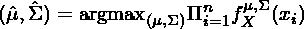

优化这个概率和的问题是，它通常涉及参数的非常讨厌的指数，这使得找到最优值更加困难。因此，引入了对数似然的概念。对数似然基本上是数据点出现的概率的对数。形式上，

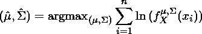

使用对数似然的好处有两方面:

1.  概率密度函数中的指数变得更易于管理和优化。
2.  概率的乘积变成一个和，这使得单个分量最大化，而不是使用 n 个概率密度函数的乘积。

MLE 的概念出奇的简单。困难在于如何有效地应用这种方法来估计给定数据的概率分布参数。在我们讨论实现之前，我们应该开发一些数学基础，看看 MLE 是否在所有情况下都有效。为此，请考虑以下因素:

让

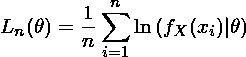

该函数将被最大化以找到参数。1/n 的附加因子显然不影响最大值，但对我们的证明是必要的。考虑:

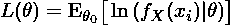

这是真实参数下对数似然的期望值。换句话说，在某种意义上这是我们的目标对数可能性。大数定律(LLN)指出，当数据点的数量趋于无穷大时，同独立(iid)随机变量的算术平均值收敛于随机变量的期望值。因此，我们可以证明:

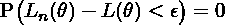

这意味着在给定足够数据的情况下，MLE 是一致的，并且收敛于参数的真值。

## 学生的最大似然估计

由于最大似然估计的通常介绍性例子总是高斯分布，我想用一个稍微复杂一点的分布来解释，即 Student-t 分布。这也是我的 [OptimalPortfolio](https://github.com/VivekPa/OptimalPortfolio) 实现中使用的发行版。使用高斯分布和 Student-t 分布的区别在于，Student-t 分布不会产生 MLE 的解析解。因此，我们需要研究某种形式的优化算法来解决它。它为我们提供了一个学习期望最大化算法的机会。

## EM 算法

EM 算法本质上是在给定数据和参数的先验分布的情况下计算对数似然的期望值，然后在给定这些参数的情况下计算对数似然函数的该期望值的最大值。一般来说，第一步是:

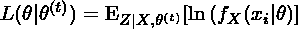

然后:

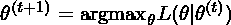

重复这一过程，直到参数值收敛或达到给定的精度阈值。该算法可以相对容易地应用于 Student-t 分布。重要的事实是注意到 Student-t 分布的参数来自 Gamma 分布，因此，在第一步中计算的期望值如下:

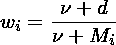

其中 d 为随机变量的维数，M 为马氏距离，定义如下:

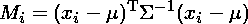

一旦计算出来，我们就可以计算 Student-t 分布的对数似然的最大值，它有一个解析解，即:

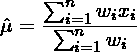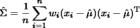

这个估计和期望值的计算可以迭代直到收敛。在 python 中，它看起来像这样:

```
import pandas as pd
import numpy as np

def expectation_max(data, max_iter=1000):
    data = pd.DataFrame(data)
    mu0 = data.mean()
    c0 = data.cov()

    for j in range(max_iter):
        w = []
        # perform the E part of algorithm
        for i in data:
            wk = (5 + len(data))/(5 + np.dot(np.dot(np.transpose(i - mu0), np.linalg.inv(c0)), (i - mu0)))
            w.append(wk)
            w = np.array(w)

        # perform the M part of the algorithm
        mu = (np.dot(w, data))/(np.sum(w))

        c = 0
        for i in range(len(data)):
            c += w[i] * np.dot((data[i] - mu0), (np.transpose(data[i] - mu0)))
        cov = c/len(data)

        mu0 = mu
        c0 = cov

    return mu0, c0
```

## 结论

分布参数的估计是数据统计建模的核心。这是任何数据科学家和定量分析师的必备技能。对于那些感兴趣的人来说， [OptimalPortfolio](https://github.com/VivekPa/OptimalPortfolio) 是对这些方法如何结合起来优化投资组合的阐述。