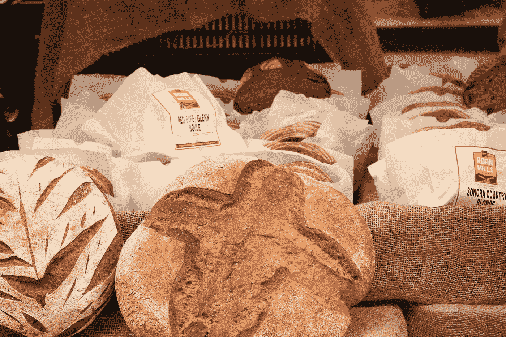
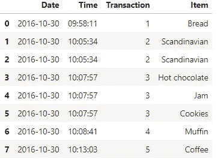
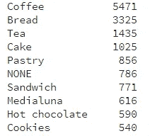
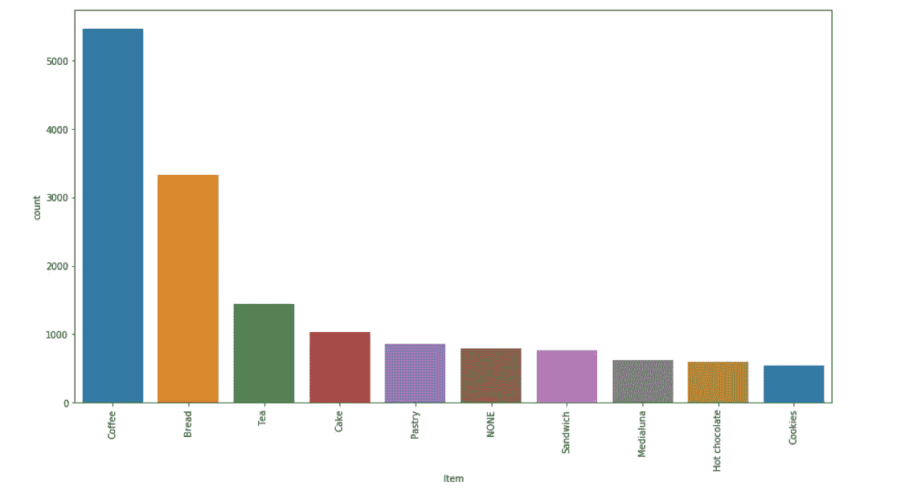
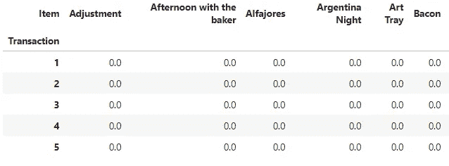
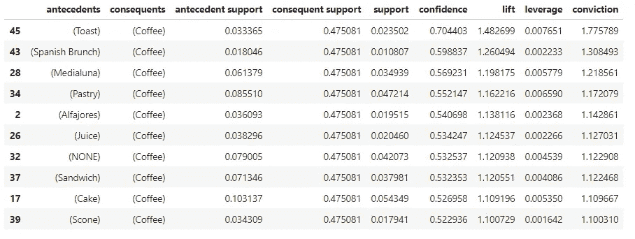
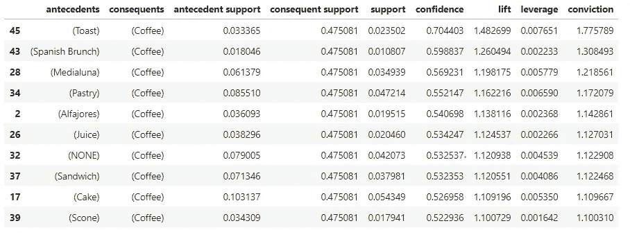

# 早餐 MBA 市场篮子分析的简单指南

> 原文：<https://towardsdatascience.com/mba-for-breakfast-4c18164ef82b?source=collection_archive---------7----------------------->



Photo by [Liene Vitamante](https://unsplash.com/photos/PO2GsmeN8hU?utm_source=unsplash&utm_medium=referral&utm_content=creditCopyText) on [Unsplash](https://unsplash.com/search/photos/pastry-store?utm_source=unsplash&utm_medium=referral&utm_content=creditCopyText)

所以最近，我很幸运地参与了一个涉及市场篮子分析的项目，但显然我不能在媒体上讨论我的工作。因此，我试着在 Kaggle.com 的 T2 寻找合适的数据集。我设法在这里找到了一个，并且应用了我所知道的一切来实现它！同时也要感谢[李苏珊](https://medium.com/u/731d8566944a?source=post_page-----4c18164ef82b--------------------------------)在 MBA 上的出色表现，点击[这里](/a-gentle-introduction-on-market-basket-analysis-association-rules-fa4b986a40ce)！

那么什么是市场篮子分析呢？根据本书[数据库营销](https://www.springer.com/gp/book/9780387725789):

> 市场购物篮分析仔细检查客户倾向于一起购买的产品，并使用这些信息来决定哪些产品应该交叉销售或一起促销。这个词源于购物者在购物过程中装满的购物车。

顺便说一下， **Market Basket** 也是美国新罕布什尔州、马萨诸塞州和缅因州的 79 家连锁超市，总部设在马萨诸塞州的图克斯伯里(维基百科)。

通常 MBA 是从销售系统的角度在客户层面上对交易数据进行的。我们可以利用 MBA 从数据中提取产品之间的有趣关联。因此，它的输出由一系列产品关联规则组成:例如，如果客户购买产品 A，他们也会倾向于购买产品 b。我们将遵循三个最流行的标准来评估关联规则的质量或强度(稍后将回到这一点)。

获得正确的包(Python):

```
import pandas as pd
import numpy as np 
import seaborn as sns
import matplotlib.pyplot as plt
from mlxtend.frequent_patterns import apriori
from mlxtend.frequent_patterns import association_rules
import mlxtend as ml
```

## 让我们来看看我们的面包篮的数据:

```
bread = pd.read_csv(r"D:\Downloads\BreadBasket_DMS.csv")
bread.head(8)
```



“数据集包含来自一家面包店的 15'010 次观察和超过 6，000 次交易。关于变量的更多信息可以在[图](https://www.kaggle.com/xvivancos/transactions-from-a-bakery)中找到。

面包篮有哪些“热门”商品？

```
sns.countplot(x = 'Item', data = bread, order = bread['Item'].value_counts().iloc[:10].index)
plt.xticks(rotation=90)
```



Lit items at BreadBasket



咖啡似乎是数据集中最热门的项目，我猜每个人都想在早上喝杯热咖啡。

## 每天售出多少件商品？

是时候进入 MBA 本身了！克里斯·莫菲特使用 [python](http://pbpython.com/market-basket-analysis.html) 编写了令人敬畏的 MBA 指南和教程，值得称赞。

我们将使用 MLxtend 库的 [Apriori 算法](http://rasbt.github.io/mlxtend/user_guide/frequent_patterns/apriori/)来提取频繁项集以供进一步分析。`apriori`函数期望数据在一个热编码的 pandas 数据帧中。因此，您的数据帧应该如下所示:



首先，我们将相应地对`bread`数据帧进行分组，并显示商品的数量，然后我们需要将商品合并为每行 1 个交易，每个商品 [1 个热编码](http://pbpython.com/categorical-encoding.html)。这将导致上表！

```
df = bread.groupby(['Transaction','Item']).size().reset_index(name='count')basket = (df.groupby(['Transaction', 'Item'])['count']
          .sum().unstack().reset_index().fillna(0)
          .set_index('Transaction'))#The encoding function
def encode_units(x):
    if x <= 0:
        return 0
    if x >= 1:
        return 1basket_sets = basket.applymap(encode_units)
```

之后，我们将生成最低支持度至少为 1%的频繁项目集，因为这是一个更有利的支持度，可以向我们显示更多的结果。

```
frequent_itemsets = apriori(basket_sets, min_support=0.01, use_colnames=True)
rules = association_rules(frequent_itemsets, metric="lift")
rules.sort_values('confidence', ascending = False, inplace = True)
rules.head(10)
```



Final output

## 结束了

记得我告诉过你们，我们会回到三个最流行的标准，来评估关联规则的质量和强度。有**支撑、信心**和**提升** :
1。支持度是包含特定项目组合的事务相对于数据库中事务总数的百分比。对组合 A 和 B 的支持是，

> 个人 A 的 P(AB)或 P(A)

2.置信度衡量结果(项目)对
前因(项目)的依赖程度。换句话说，置信度是给定前因后果的条件概率，

> 专业人员
> 
> 其中 P(B|A) = P(AB)/P(A)

3.提升(也称为改善或影响)是一种通过支持和信心来克服
问题的措施。Lift 被认为是度量规则的置信度和预期置信度之间的差异——用比率来度量。考虑关联规则“if A then B”。该规则的提升被定义为

> P(B|A)/P(B)或 P(AB)/[P(A)P(B)]。

如公式所示，lift 是对称的，因为“如果 A 那么 B”的 lift 与“如果 B 那么 A”的 lift 相同。每个标准都有其优点和缺点，但一般来说，我们喜欢具有高可信度、高支持度和高升力的关联规则。

作为总结，

> 置信度= P(B|A)
> 
> 支持= P(AB)
> 
> 升力= P(B|A)/P(B)



从输出来看，关联规则“if Toast then Coffee”的提升是 1.48，因为置信度是 70%。这意味着购买烤面包的消费者比随机选择的消费者购买咖啡的可能性高 1.48 倍。更大的升力意味着更有趣的规则。高支持度的关联规则是潜在有趣的规则。类似地，高可信度的规则也是有趣的规则。

*参考:*

*Kaggle 数据集:*[*【https://www.kaggle.com/xvivancos/transactions-from-a-bakery】*](https://www.kaggle.com/xvivancos/transactions-from-a-bakery)

*苏珊李的菜篮子分析:*[https://towards data science . com/a-gentle-introduction-on-Market-Basket-Analysis-association-rules-fa 4b 986 a40 ce](/a-gentle-introduction-on-market-basket-analysis-association-rules-fa4b986a40ce)

*数据库营销书籍:*[*https://www.springer.com/gp/book/9780387725789*](https://www.springer.com/gp/book/9780387725789)

*Apriori 算法:*[*http://rasbt . github . io/mlx tend/user _ guide/frequent _ patterns/Apriori/*](http://rasbt.github.io/mlxtend/user_guide/frequent_patterns/apriori/)

*克里斯莫菲特使用 Python 进行市场篮子分析:*[*http://pbpython.com/market-basket-analysis.html*](http://pbpython.com/market-basket-analysis.html)

*Kao dim . com:*[*https://www.kaodim.com/*](https://www.kaodim.com/)

源代码在 **Jupyter 笔记本**这里！