# 麦卡洛克-皮茨神经元——人类第一个生物神经元的数学模型

> 原文：<https://towardsdatascience.com/mcculloch-pitts-model-5fdf65ac5dd1?source=collection_archive---------0----------------------->

众所周知，深度神经网络的最基本单元被称为*人工神经元/感知器*。但是走向我们今天使用的*感知机*的第一步是由麦卡洛克和皮茨在 1943 年通过模仿生物神经元的功能迈出的。

*注:这篇文章的概念、内容和结构都直接来自于*[***Mitesh m . Khapra***](https://www.cse.iitm.ac.in/~miteshk/)*教授关于*[*NPTEL*](http://nptel.ac.in)*的* [*深度学习*](https://onlinecourses.nptel.ac.in/noc18_cs41/preview) *课程的精彩讲座和材料。看看吧！*

# 生物神经元:一个过于简化的例证

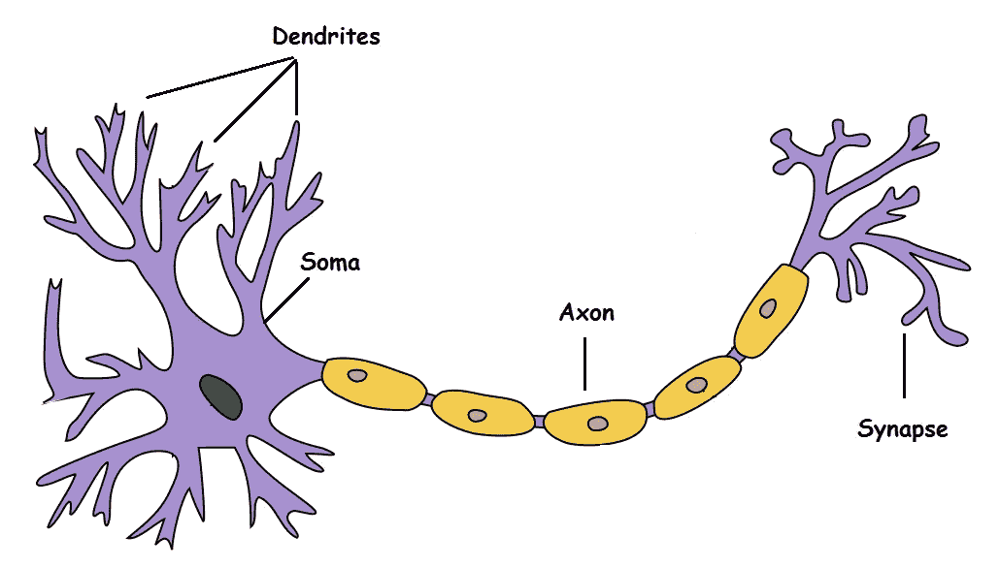

**A Biological Neuron** — [Wikipedia](https://en.wikipedia.org/wiki/Neuron)

**树突**:接收来自其他神经元的信号

体细胞:处理信息

**轴突**:传递该神经元的输出

**突触**:与其他神经元的连接点

基本上，一个神经元接受一个输入信号(树突)，像 CPU (soma)一样处理它，通过一个类似电缆的结构将输出传递给其他连接的神经元(轴突到突触到其他神经元的树突)。现在，这可能在生物学上不准确，因为外面发生了更多的事情，但在更高的层面上，这是我们大脑中的神经元正在发生的事情——接受输入，处理输入，输出输出。

我们的感觉器官与外部世界互动，并将视觉和声音信息发送给神经元。假设你在看《老友记》。现在，你的大脑接收到的信息被“笑或不笑”的神经元接收，这将帮助你决定是否笑。每个神经元只有在其各自的标准(稍后将详细介绍)得到满足时才会被激发/激活，如下所示。

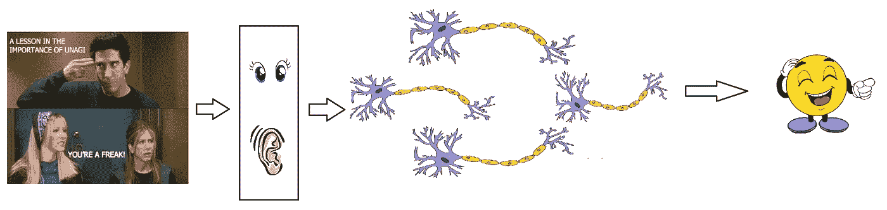

Not real.

当然，这并不完全正确。事实上，不仅仅是几个神经元在做决策。在我们的大脑中有一个由 10 个神经元(1000 亿个)组成的大规模并行互联网络，它们的连接并不像我上面给你展示的那样简单。它可能看起来像这样:

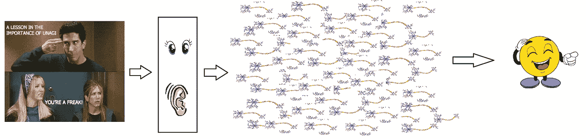

Still not real but closer.

现在，感觉器官将信息传递给第一层/最底层的神经元进行处理。这个过程的输出以分层的方式传递到下一层，一些神经元会激活，一些不会，这个过程继续下去，直到它产生最终的反应——在这种情况下，就是笑。

这种大规模并行的网络也确保了分工。每个神经元仅在满足其预期标准时触发，即，神经元可以对特定刺激执行特定角色，如下所示。

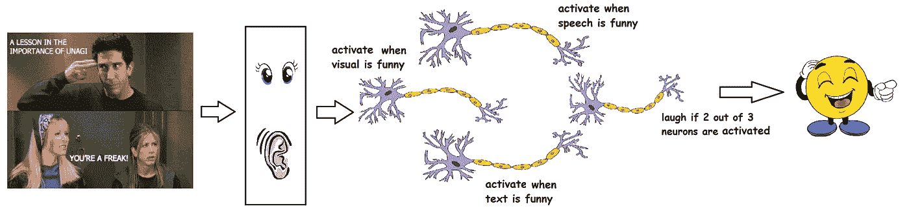

Division of work

据信，神经元以分层的方式排列(然而，科学家提出了许多有实验支持的可信替代方案)，每一层都有自己的角色和责任。为了检测一张脸，大脑可能依赖于整个网络，而不是单一的一层。

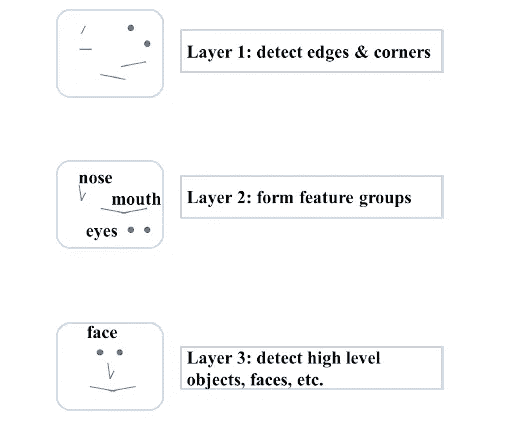

Sample illustration of hierarchical processing. **Credits:** Mitesh M. Khapra’s lecture slides

既然我们已经确定了生物神经元是如何工作的，让我们看看麦卡洛克和皮茨提供了什么。

注意:我对大脑如何工作的了解非常非常有限。以上插图过于简化。

# 麦卡洛克-皮茨神经元

第一个神经元计算模型是由 Warren MuCulloch(神经科学家)和 Walter Pitts(逻辑学家)在 1943 年提出的。

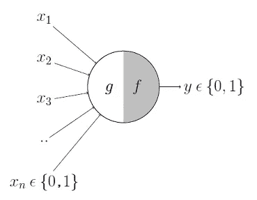

This is where it all began..

它可以分为两部分。第一部分， ***g*** 接受一个输入(咳咳树突咳咳)，执行聚合并基于聚合值第二部分， ***f*** 做出决定。

假设我想预测自己的决定，是看一场随机的足球比赛还是不看电视。输入都是布尔型的，即{0，1}，我的输出变量也是布尔型的{0:会看，1:不会看}。

*   所以， ***x_1*** 可能是*ispremierlegueon*(我更喜欢英超)
*   ***x_2*** 可能是 *isItAFriendlyGame* (我倾向于不太关心友谊赛)
*   ***x_3*** 可能是 *isNotHome* (跑腿的时候不能看。我可以吗？)
*   ***x_4*** 可能是*ismanunitedplay***(我是大个子曼联球迷。GGMU！)等等。**

**这些输入可以是兴奋性的*或抑制性的*。抑制性输入是那些对决策产生最大影响的输入，与其他输入无关，即，如果 ***x_3*** 为 1(非原位)，那么我的输出将始终为 0，即，神经元将永远不会触发，因此 ***x_3*** 是抑制性输入。兴奋性输入并不会让神经元自己放电，但当它们结合在一起时可能会放电。从形式上看，事情是这样的:**

**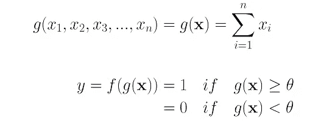**

**我们可以看到 ***g* (x)** 只是在做输入的求和——简单的聚合。而这里的***θ***称为阈值参数。例如，如果我总是在总和变成 2 或更多时观看比赛，那么这里的 ***theta*** 是 2。这被称为阈值逻辑。**

# **使用 M-P 神经元的布尔函数**

**到目前为止，我们已经看到了 M-P 神经元是如何工作的。现在让我们看看这个神经元是如何被用来表示一些布尔函数的。请注意，我们的输入都是布尔的，输出也是布尔的，所以本质上，神经元只是试图学习一个布尔函数。基于适当的输入变量，许多布尔决策问题都可以转化为这个问题——比如是否继续阅读这篇文章，读完这篇文章后是否观看《老友记》等等。可以用 M-P 神经元来表示。**

## **M-P 神经元:一种简洁的表示**

****

**这种表示只是表示，对于布尔输入 ***x_1*** ， ***x_2*** 和 ***x_3*** 如果 ***g* (x)** 即**sum****≥****theta**，则神经元会触发，否则不会。**

## ****和功能****

**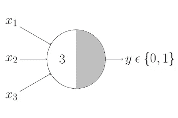**

**“与”功能神经元只有在所有输入都打开时才会触发，即这里的 ***g* (x)** ≥ 3。**

## ****或功能****

**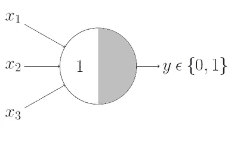**

**我相信这是不言自明的，因为我们知道，如果任何输入打开，或功能神经元就会激活，即这里的 ***g* (x)** ≥ 1。**

## ****具有抑制输入的功能****

**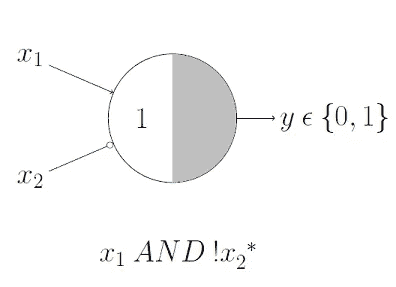**

**这看起来可能有点棘手，但其实不然。这里，我们有一个抑制输入，即 ***x_2*** ，所以每当 ***x_2*** 为 1 时，输出将为0。记住这一点，我们知道 ***x_1 和！只有当 ***x_1*** 为 1 并且 ***x_2*** 为 0 时，x _ 2***才会输出 1，因此很明显阈值参数应该为 1。**

**让我们验证一下， ***g* (x)** 即***x _ 1***+***x _ 2***仅在三种情况下≥ 1:**

**情况 1:当***x1***为 1、***x2***为 0
情况 2:当***x1***为 1、***x2***为 1
情况 3:当***x1***为 0、***x2*****

**但是在情况 2 和情况 3 中，我们知道输出将是 0，因为 ***x_2*** 在两者中都是 1，感谢抑制。而且我们还知道 ***x_1 和！x_2*****

## ****或非功能****

**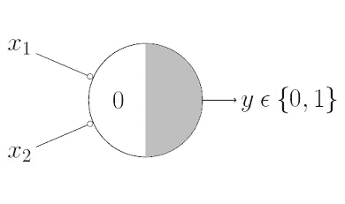**

**对于要激发的 NOR 神经元，我们希望所有的输入都为 0，因此阈值参数也应该为 0，并且我们将它们都作为抑制性输入。**

## ****非功能****

**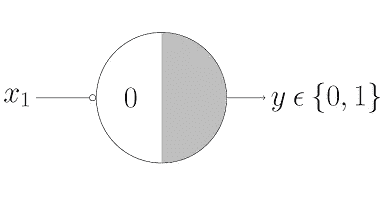**

**对于非神经元，1 输出 0，0 输出 1。因此，我们将该输入作为抑制输入，并将阈值参数设置为 0。有用！**

**任何布尔函数都可以用 M-P 神经元来表示吗？在你回答这个问题之前，让我们先了解 M-P 神经元在几何上做什么。**

# **M-P 神经元的几何解释**

**在我看来，这是这篇文章最精彩的部分。让我们从 OR 函数开始。**

## **或功能**

**由于显而易见的原因，我们已经讨论过 OR 函数的阈值参数***θ****为 1。输入显然是布尔型的，所以只有 4 种可能的组合— (0，0)、(0，1)、(1，0)和(1，1)。现在将它们绘制在 2D 图上，并利用 OR 函数的聚合方程
即***x1+x2*≥*1****，使用该方程我们可以绘制决策边界，如下图所示。再次提醒你，这不是一个实数图。****

****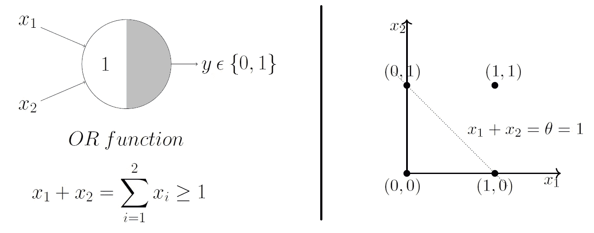****

****我们刚刚使用了聚合方程，即***x1+x2 =*1**，以图形方式显示了当通过 OR 函数 M-P 神经元时，其输出位于该线之上或之上的所有输入，以及位于该线之下的所有输入点将输出 0。****

****瞧啊。！M-P 神经元刚刚学习了一个线性决策边界！M-P 神经元将输入集分成两类——阳性和阴性。正的(输出 1)是位于决策边界上或之上的那些，负的(输出 0)是位于决策边界之下的那些。****

****让我们通过看更多的例子来说服自己，M-P 单元对所有的布尔函数都是一样的(如果从数学上还不清楚的话)。****

## ****与酌****

****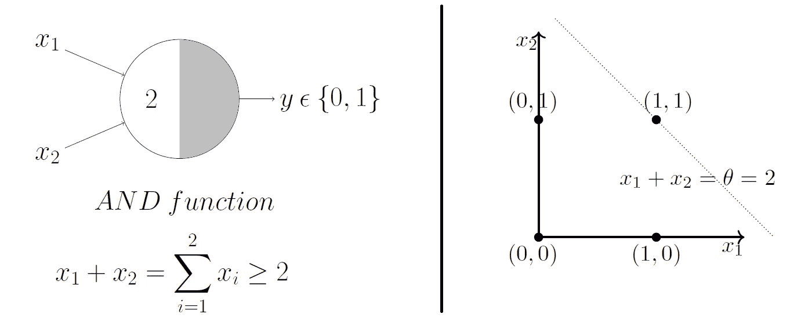****

****在这种情况下，决策边界方程为***x1+x2 =*2**。这里，位于(1，1)之上或之上的所有输入点在通过 AND 函数 M-P 神经元时输出 1。很合适！决策边界起作用了！****

## ******同义反复******

****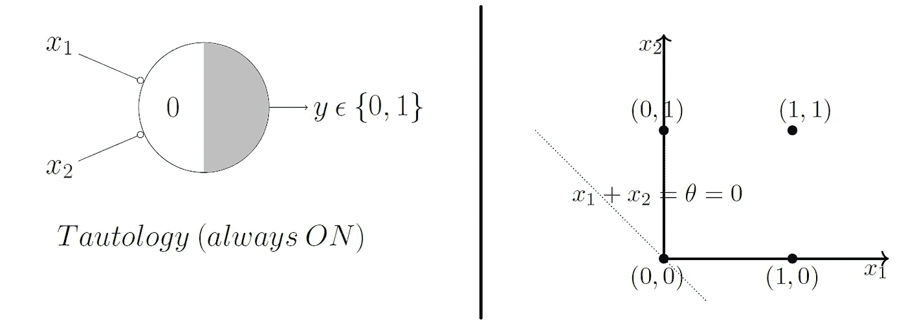****

****Too easy, right?****

****我想你现在明白了，但是如果我们有两个以上的输入呢？****

## ****或具有 3 个输入的功能****

****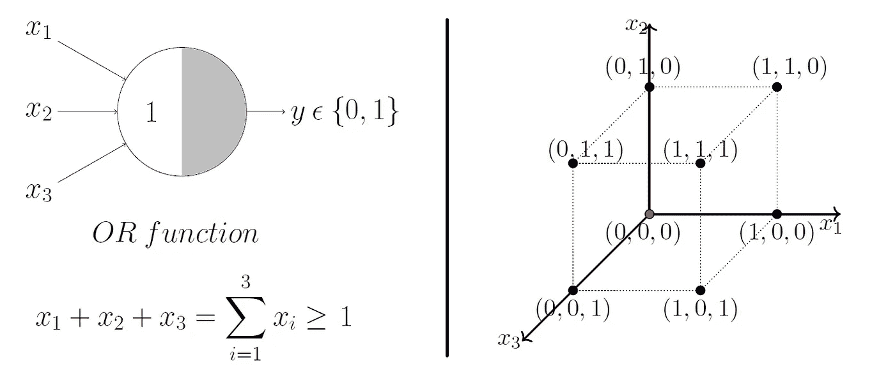****

****让我们通过观察一个 3 输入或功能 M-P 单元来概括这一点。在这种情况下，可能的输入是 8 个点— (0，0，0)，(0，0，1)，(1，0，0)，(1，0，1)，…你得到了点。我们可以将这些绘制在 3D 图上，这次我们绘制一个三维的决策边界。****

> ****“是一只鸟吗？是飞机吗？”****

****没错，是飞机！****

****满足判定边界方程 ***x_1 + x_2 + x_3 =* 1** 的平面如下所示:****

****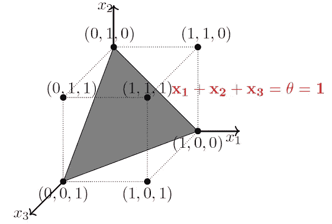****

****慢慢来，通过查看上面的图来说服自己，当通过 or 函数 M-P 单元时，位于该平面上或上方(正半空间)的所有点将产生输出 1，而位于该平面下方(负半空间)的所有点将产生输出 0。****

****仅通过手工编码阈值参数，M-P 神经元就能够方便地表示线性可分的布尔函数。****

*****线性可分性(用于布尔函数):存在一条线(平面)，使得产生 1 的所有输入位于该线(平面)的一侧，产生 0 的所有输入位于该线(平面)的另一侧。*****

# ****M-P 神经元的局限性****

*   ****非布尔(比如说，实数)输入呢？****
*   ****我们总是需要手工编码阈值吗？****
*   ****所有的投入都是相等的吗？如果我们想赋予一些输入更多的重要性呢？****
*   ****不是线性可分的函数呢？说 XOR 函数。****

****我希望现在清楚了为什么我们今天不使用 M-P 神经元。1958 年，美国心理学家弗兰克·罗森布拉特克服了 M-P 神经元的局限性，提出了经典的感知模型——强大的人工神经元。它是比麦卡洛克-皮茨神经元更一般化的计算模型，其中权重和阈值可以随着时间的推移而学习。****

****更多关于*感知器*以及它如何学习权重和阈值等。在我以后的帖子里。****

# ****结论****

****在这篇文章中，我们简要地看了一下生物神经元。然后我们建立了 MuCulloch-Pitts 神经元的概念，这是第一个生物神经元的数学模型。我们用 M-P 神经元表示了一系列布尔函数。我们还试图通过 3D 绘图获得模型的几何直觉。最后，我们还建立了一个更一般化模型的动机，唯一的*人工神经元/感知器*模型。****

****感谢您阅读文章。
自己活也让别人活！
答****