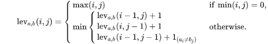
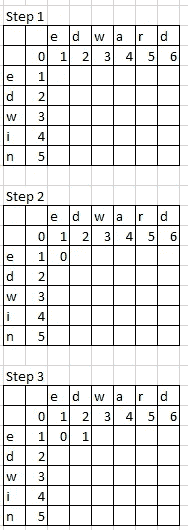
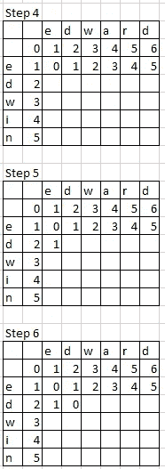
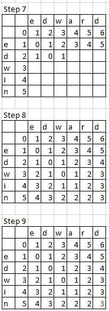
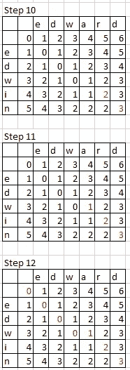

# 通过简单的计算测量两个单词之间的距离

> 原文：<https://towardsdatascience.com/measure-distance-between-2-words-by-simple-calculation-a97cf4993305?source=collection_archive---------2----------------------->


“brown rail train” by [Johannes Plenio](https://unsplash.com/@jplenio?utm_source=medium&utm_medium=referral) on [Unsplash](https://unsplash.com?utm_source=medium&utm_medium=referral)

在 NLP 中计算单词距离是一项常规任务。每当你想找到最近的单词或度量标准时，单词距离是实现它的方法之一。

在我之前的项目中，从 OCR 结果中识别目标信号是关键部分。为了获取更多有价值的信息，我必须容忍 OCR 结果中的微小误差。否则，我会错过许多重要的信号。

与之前的[单词嵌入之间的距离](/word-distance-between-word-embeddings-cc3e9cf1d632)不同，字符串距离是计算从一个单词改变到另一个单词所需的删除、插入或替换的最小数量。有许多方法来计算距离，而我在这次分享中将集中于两个测量。

看完这篇文章，你会明白:

*   莱文斯坦距离
*   最长公共子序列距离
*   拿走

# 莱文斯坦距离


“black electrical tower” by [Shane Rounce](https://unsplash.com/@shanerounce?utm_source=medium&utm_medium=referral) on [Unsplash](https://unsplash.com?utm_source=medium&utm_medium=referral)

这种方法是 Vladimir Levenshtein 在 1965 年发明的。该值指的是从一个单词转换到另一个单词所需的最小动作数(删除、插入和替换)。



From [https://en.wikipedia.org/wiki/Levenshtein_distance](https://en.wikipedia.org/wiki/Levenshtein_distance)

为了计算 Levenshtein 距离，我们必须遍历每一个单词，并使用来自

*   (i-1，j):表示左框(删除)
*   (I，j-1):表示上盒(插入)
*   (i-1，j-1):表示左上框(替换)

在下面的例子中，我将把“edward”转换成“edwin ”,并计算 Levenshtein 距离。



第一步:从 0 到两个单词对应的数字

第二步:由于“e”等于“e”，所以值为 0

第三步:“d”不等于“e”，所以从左(删除)、对角线(替换)、上(插入)求最小数。所以是 0 + 1 = 1



第 4 步:对下面一行重复第 3 步

第五步:“e”不等于“d”，所以从左(删除)、对角线(替换)、上(插入)求最小数。所以是 0 + 1 = 1

第六步:因为“d”等于“d”，所以复制对角线值为 0



第 7 步:对下面一行重复第 3 步

步骤 8:对盒子的其余部分重复步骤 3

步骤 9: Levenshtein 距离是 3(用红色突出显示)，这是这个矩阵的最后一个

步骤 10:之后，e 可以向左(删除)或对角(替换)，因为两个值都是 2。这次我选对角线。

步骤 11:同样，我们可以向左(删除)或对角(替换)，因为两个值相同，都是 1。这次我选对角线。

第 12 步:这一次，最小值是 0(删除)

根据上面的公式，我们通过以下操作将“edward”转换为“edwin”

1.  用“d”代替“n”
2.  用“r”代替“I”
3.  删除“a”

```
import editdistancedata = ['edward', 'Edward']for record in data:
    dist = editdistance.eval(record, 'edwin')
    print('Edit Distance for %s and %s is %d' % (record, 'edwin', dist))
```

输出

```
Edit Distance for edward and edwin is 3
Edit Distance for Edward and edwin is 4
```

# 最长公共子序列距离

简而言之，这是 LCS 距离。它与 Levenshtein 距离非常相似，只是 LCS 不包括替换操作。

因此，将“edward”转换为“edwin”时，该值为 5。操作是删除“a”、“r”、“d”，插入“I”和“n”。

# 拿走

要访问项目模板，您可以访问这个 [github](https://github.com/makcedward/nlp/blob/master/sample/nlp-distance-edit_distance.ipynb) repo。

*   编辑距离是一种简单有效的测量两个单词之间换位的**方式。**
*   这是**区分大小写**。
*   编辑距离可以**应用于纠正拼写错误或 OCR 错误**。
*   在我这里，**容差误差是 2** 。如果真正的标签是“edward”，如果是“edweed”，我还是会接受 OCR 结果。

# 关于我

我是湾区的数据科学家。专注于数据科学、人工智能，尤其是 NLP 和平台相关领域的最新发展。你可以通过[媒体博客](http://medium.com/@makcedward/)、 [LinkedIn](https://www.linkedin.com/in/edwardma1026) 或 [Github](https://github.com/makcedward) 联系我。

# 参考

克里斯托弗 D. M .、普拉巴卡尔 r .、欣里奇 S. [信息检索导论](https://nlp.stanford.edu/IR-book/html/htmledition/edit-distance-1.html)。