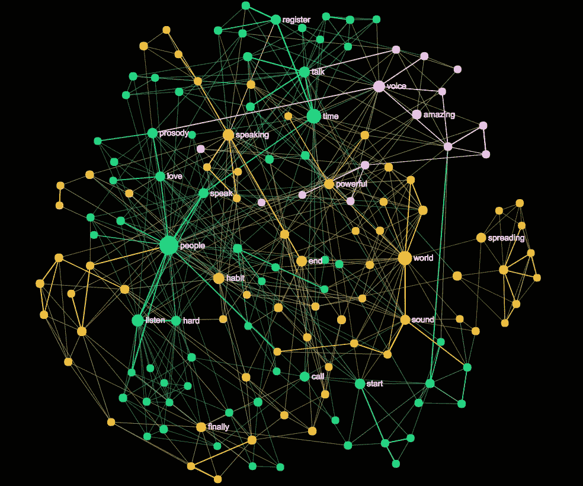
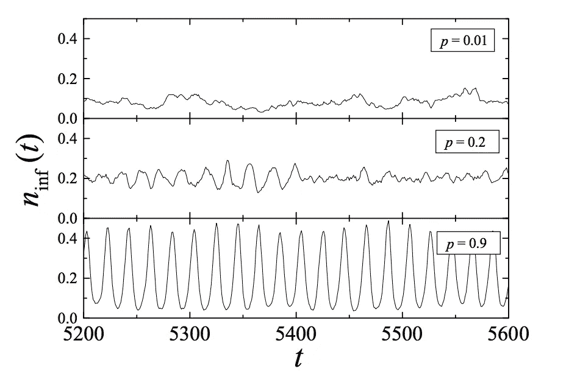
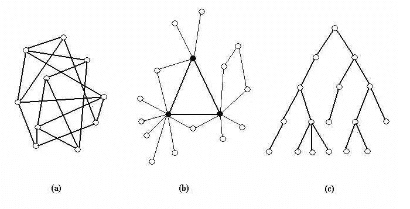
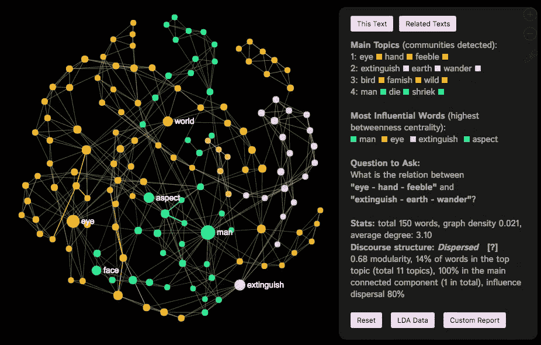
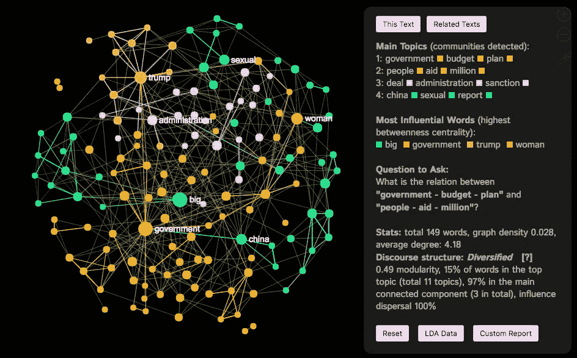
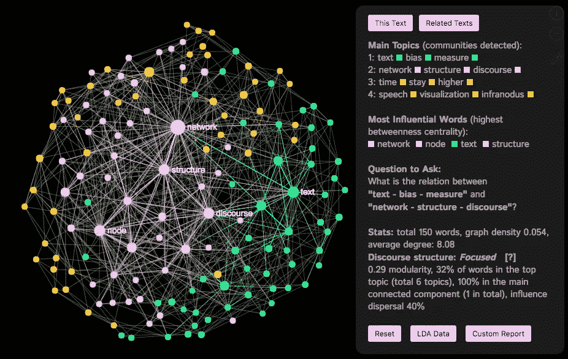
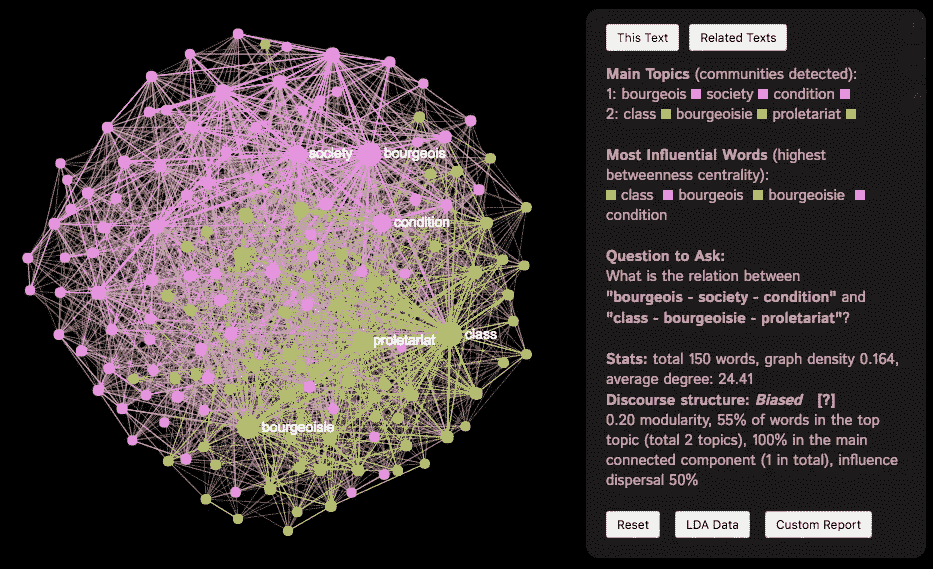

# 利用文本网络分析测量话语偏见

> 原文：<https://towardsdatascience.com/measuring-discourse-bias-using-text-network-analysis-9f251be5f6f3?source=collection_archive---------7----------------------->

在这篇文章中，我提出了一种基于文本网络分析的方法和工具来衡量话语中的偏见水平。该度量基于文本的结构，并使用文本图的定量和定性参数来识别其有多强的偏向性。因此，它可以被人类使用，也可以被实现到各种 API 和 AI 中，以执行自动偏差分析。

# 偏见:好的和坏的

偏见通常被理解为对某种观点的倾向或偏见。有偏见的话语或文本可能有特定的议程或促进特定的意识形态。

在“假新闻”、极端意识形态和各种错误信息技术兴起的时代，重要的是能够识别话语中的偏见程度:无论是社交网络帖子、报纸文章还是政治演讲。

偏见不一定是坏事。有时，它可以使一个意图变得更强，推进一个议程，提出一个观点，说服，劝阻和转变。偏见是变革的动力，然而，当偏见太多的时候，它也可能是破坏性的。当我们衡量偏见时，我们衡量的是一篇文章在意识形态上有多强烈，它有多想提出某种观点。在某些情况下——比如小说或高度激烈的政治演讲——强烈的偏见可能更受青睐。在其他一些情况下——比如新闻和非小说——强烈的偏见可能揭示了一个议程。

目前还没有工具可以测量一篇文章的倾向性。各种[文本挖掘 API](https://noduslabs.com/portfolio/text-mining-software-web-api-applications/)根据文本的内容和情感对文本进行分类，但没有任何仪器可以测量文本中对某个观点的倾向程度。本文提出的工具和方法可以作为这方面的第一步。我开发的用于[文本网络分析的开源在线工具](https://infranodus.com)已经可以基于这种方法测量偏见，所以欢迎你在你自己的文本上尝试一下，看看它是如何工作的。下面我描述了偏向指数的工作原理和一些技术细节。

# 作为动态网络的话语结构

任何话语都可以表示为一个网络:单词是节点，它们的共现是它们之间的连接。由此产生的图表描绘了意义循环的路径。我们可以通过将连接更紧密的节点群集(force-atlas 算法)排列成用特定颜色标记的不同组来使其更具可读性。我们还可以使图中更有影响力的节点变大(具有高介数中心性的节点)。你可以在这篇关于文本网络分析的白皮书中了解更多技术细节。

例如，这里有一个由 Julian Treasure [制作的 TED 演讲的可视化，名为“如何说话让人们愿意听”](https://www.youtube.com/watch?v=eIho2S0ZahI)用这种方法制作。如果你有兴趣看实际的交互图，你可以[在这里](https://infranodus.com/tedtalks/eIho2S0ZahI?background=dark&most_influential=bc)打开它。

从这个图表中，我们可以清楚地看到，主要的概念是

> “人”、“时间”、“世界”、“听”、“声音”等。

这些概念是特定话语中意义循环的连接点。它们连接不同的节点社区(用不同的颜色表示)。

该算法以模拟人类感知的方式工作(遵循[横向阅读模型](https://www.researchgate.net/profile/Michael_Young7/publication/308309047_Van_den_Broek_Young_Tzeng_Linderholm_1999_The_construction_of_mental_representations_during_reading/links/57e023ac08aece48e9e1ee60.pdf)，语义启动的思想，也是常识):如果单词在同一上下文中被频繁提及，它们将在图中形成一个社区。如果它们出现在不同的语境中，就会被彼此推开。如果单词经常被用来连接不同的上下文，它们在图表中会显得更大。

因此，**一个文本网络图的结构可以告诉我们很多关于话语结构的信息。**

例如，如果图形具有明显的社区结构(几个不同的单词社区)，则话语也具有几个不同的主题，这些主题在文本中表达。在我们的示例中，我们至少有 4 个主要主题:

> 人—听—说(深绿色)
> 时间—说话—登记(浅绿色)
> 世界—声音—有力(橙色)
> 惊艳—声音(粉色)

如果我们以同样的方式分析其他文本，我们会看到产生的图形结构是不同的。例如，这是《夸兰》第一章的图像:

Text network visualization of Quaran made using [InfraNodus](https://infranodus.com). The structure of the graph is less diversified and more centralized. There are only a few main concepts, the discourse circulates around them, the rest of the text supports the main concepts.

可以看出它具有不同的网络结构。它更集中，更不多样化。有几个主要概念:

> “神”、“人”、“信”、“主”、“给”

整个论述围绕着这些概念展开。所有其他观点都是为了支持主要观点。

我们对 1969 年至 2013 年美国总统的就职演说进行了类似的分析，并可视化了他们的叙事随时间变化的方式:

Visualization of the US presidents’ inauguration speeches made using [InfraNodus](http://infranodus.com) (TNA) and [Gephi](http://gephi.org) (visualization). It can be seen that over time the structure stays more or less the same, however, Obama’s speeches seem to have more distinct influential terms, indicating a more diversified discourse.

可以看出，虽然这些年来话语的结构或多或少保持不变，但每次演讲所强调的概念都发生了变化。这可能表明修辞策略保持不变，而内容多年来发生了变化。奥巴马的演讲似乎具有更高数量的明显有影响力的节点，这可能表明话语更加多元化。

# 偏见是网络中意识形态的管道

既然我们已经展示了如何将话语表现为一个网络结构，我们可以在网络科学的背景下讨论偏见的概念。我们将使用一些流行病学的概念来演示网络的拓扑结构如何影响信息在节点间的传播速度。

一个网络可以被看作是一段时间内发生的相互作用的表现，一个动态过程留下的轨迹图。如果我们研究一个网络的拓扑结构，我们可以得到许多关于它所代表的动态过程的本质的见解。

在社会科学和医疗保健的背景下,**关于网络结构的信息可以为流行病学提供有价值的见解:**疾病(病毒、观点或任何其他(错误)信息)传播的速度，传播的距离，最佳免疫策略可能是什么。

已经论证([艾布拉姆森&库伯曼 2001](https://arxiv.org/pdf/nlin/0010012.pdf)；[pastorras&Vespignani 2001](https://arxiv.org/pdf/cond-mat/0010317.pdf))认为，随着网络结构变得更加随机化，其流行病学阈值降低。疾病、病毒、错误信息可以传播得更快，传播到更多的节点。换句话说，**随着网络的社区结构越来越不明显，连接的数量增加，网络将信息传播到更多的节点**，并且这种传播以非常明显的振荡(感染/未感染)发生。

A figure from the study by [Abramson & Kuperman (2001)](https://arxiv.org/pdf/nlin/0010012.pdf) where they have shown the fraction of infected elements (n) in relation to time (t) for networks with a different degree of disorder (p). The higher the degree of disorder, the more elements get infected, the oscillations get more and more intensified,, but also the time-span of the infection is relatively short.

与此同时，当网络相对互联(小世界网络)时，社区结构明显，节点的“口袋”有助于在网络中更长时间地维持流行病。换句话说，较少的节点可能被感染，但是感染可能持续更长时间(流行状态)。

Representation of network structures: [a] random, [b] scale-free (better pronounced communities) and, [c] hierarchical (less global connectivity) (from [Stocker et al. 2001](http://jasss.soc.surrey.ac.uk/5/4/3.html#stocker2001))

在对各种社会网络进行的另一项研究中([斯托克，考恩福斯&博索迈尔 2002](http://jasss.soc.surrey.ac.uk/5/4/3.html) )表明，等级扁平网络(即无序网络)不如无标度网络(即具有更明显社区结构的网络)稳定。换句话说，等级制度可能有利于传递秩序，但无尺度结构更有利于维持某种世界观。

正如我们所看到的，没有一种网络拓扑可以被认为是优先的。事实上，这取决于意图、背景和情况。在某些情况下，如果一个网络能够相对快速地将信息传播到它的所有元素，这可能是件好事。在其他一些情况下，稳定性可能更优先。

总的来说**，一个网络的拓扑结构反映了它传播信息的能力，它对新思想的敏感度，新思想是会在短时间内占据整个网络还是会持续更长时间。**

当我们研究偏见时，可以采用同样的方法。这里的假设是**话语网络是一种传播思想的结构。**

如果**话语结构以几个有影响力的节点**为中心，并且**没有明显的社区结构，**这意味着话语相当同质，这些节点周围的想法会比外围的想法传播得更好。我们把这样的话语称为**有偏见的**。

另一方面，如果**话语网络由几个不同的词/节点社区**(无标度小世界网络)组成，这意味着**文本**中有几个不同的主题，每个主题在话语中被赋予同等的重要性。我们称这样的话语**多样化**。

网络社区结构不仅可以使用图形可视化进行定性识别，还可以通过模块性测量进行识别(参见 [Blondel et al 2008](https://arxiv.org/abs/0803.0476) )。模块化程度越高(通常在 0.4 以上)，社群结构越明显。

另一个重要的标准是**影响力**(通过最有影响力的词/节点)在不同社区的分布。为了使话语多样化，最有影响力的节点应该分布在不同的社区之间。我们使用**熵**来衡量图中影响的分散程度，并在确定偏差水平时考虑到这一点。我们还检查顶部社区是否包括不成比例的高数量的节点，在这种情况下，多样化分数降低，并且图中的组件数量减少。

因此，我们可以确定**我们可以用三个主要标准来确定话语中的偏见程度:**

*   **社区结构:**它们的不同程度以及属于顶级社区的节点的百分比；
*   **影响力分布:**最具影响力的节点/词如何在不同话题/图社区间传播；
*   **图形组件数量:**话语的连接程度；

# 基于语篇结构的倾向性指数

基于上述命题和标准，我们提出了偏倚指数，该指数考虑了语篇结构，具有四个主要参数:

*   **分散**(非偏置)
*   **多样化**(局部偏向)
*   **聚焦**(略偏)
*   **偏置**(高度偏置)

第一个价值，**分散的**，是一个具有高度显著的社区结构(几个不同的主题)的话语，这些社区结构没有很好的联系或者有几个组成部分(因此**没有偏见**)。我们的测试表明，这种图表通常用于诗歌、个人笔记、精神分裂症患者的推文以及其他各种创造性活动。例如，下面是拜伦的[诗《黑暗》](https://www.poetryfoundation.org/poems/43825/darkness-56d222aeeee1b)(你也可以查看 InfraNodus 上的[交互图):](https://infranodus.com/texts/byronnospace?background=dark&&most_influential=bc&)

Visualization of Lord Byron’s “Darkness” made using [InfraNodus](http://infranodus.com). The discourse structure is identified as Dispersed (see the Analytics pane to the right) because of the high modularity (0.68) and high influence dispersal (the most influential words are spread among the different communities and only 14% of the words are in the top community).

正如我们从图表中看到的，它在视觉上非常稀疏，我们的工具已经将话语结构识别为分散的，因为模块性度量非常高(发音为社区/主题)，并且有影响力的节点/词在主要主题中分布非常均匀(80%的分散，顶部社区/主题中只有 14%的词)。如果你阅读这首诗本身，你会发现它有相当丰富的词汇，它唤起了许多不同的形象，而不是试图推动一个特定的议程(也许只是通过诗歌，而不是修辞手段)。

下一个价值，**多样化**，是一个话语，有一个明显的社区结构，但那里的社区联系良好。通常它表示一种反映几种不同观点的话语，并在全球层面上给予它们或多或少的平等地位(**地方偏见**)。许多旨在提出若干观点的文章和谈话、研究笔记、报纸标题(取自各种来源)和非小说类文章都有这种结构。例如，这是 2018 年 10 月 4 日的新闻标题(带预告)的可视化效果(请参见此处的[交互式可视化效果](https://infranodus.com/texts/news181004?background=dark&&most_influential=bc&)):

Visualization of the news headlines and teasers (via RSS) made using [InfraNodus](http://infranodus.com) for the 4th of October 2018 taken from NYT, WSJ, FT, The Guardian and Washington Post. As we can see the selection of news is ranked as Diversified as the modularity measure is relatively high and yet the topics are also connected to each other. The most influential words are spread among the main topical clusters / communities, which indicates that the selection of news was quite diverse.

我们可以看到，话语结构被归类为多样化，这意味着在这个话语中有几个不同的主题，但它们在全球层面上是联系在一起的。

第三个值，**聚焦**，表示话语对某个主题有**软偏向**。这通常意味着话语提出了几个观点，但只关注一个，并进一步发展。具有聚焦分数的话语结构是报纸文章、散文、报告的特征，其被设计来提供对某一观点的清晰和简明的表达。例如，下面是本文前三部分的可视化:

The previous three sections of this article visualized as a text graph using [InfraNodus](http://infranodus.com). We can see that the discourse structure is ranked as Focused, indicating a slight bias. The community structure is present, but they are not very distinct. Almost all the most influential words are concentrated in one community / topic: “network / structure / discourse” and then there’s a smaller topic with “text / bias / measure”.

最后，第四种类型的话语结构是**偏向的**，这是具有低社区结构或没有社区结构的文本的特征。主要观点集中在一起，文中使用的所有其他概念都是为了支持主要议程。这种话语结构通常可以在高度意识形态化的文本、政治演讲以及任何其他文本中观察到，它们诉诸修辞来说服人们采取行动。例如，这里有一个共产党宣言的可视化:

Text network visualization of the Communist Manifesto made using [InfraNodus](http://infranodus.com). The community structure is not pronounced and the most influential words belong to the two main topics and are highly interconnected. The rest of the discourse is subjugated towards the main agenda (class struggle).

# 编后记

在这篇文章中，我提出了一种基于文本网络可视化结构和从图形分析中获得的各种参数的话语偏见的测量方法。

重要的是要注意，我并不声称(还)我提出的命题是科学合理的。对一个更大的数据语料库的全面研究正在进行中(欢迎你加入)。

我的经验表明，这个索引在研究文本时非常有用，并且已经作为一个工作特性在 [InfraNodus 文本网络分析和可视化工具](https://infranodus.com)中实现。

因此，我邀请您亲自尝试一下，并将您可能有的任何反馈、建议和提议发送给我。请不要客气，在这里留下任何评论，我很想知道你的想法和我们如何进一步发展它。InfraNodus 是一个[开源工具](http://github.com/noduslabs/infranodus)，所以非常欢迎你加入并实现你作为一个代码可能有的任何主张。

*Dmitry Paranyushkin 是拥有*[*Nodus Labs*](http://noduslabs.com)*的研究员，也是文字网络可视化工具*[*InfraNodus*](http://infranodus.com)*的创造者。*

*你可以通过*[*@ Nodus Labs*](http://twitter.com/noduslabs)*或通过*[*Nodus Labs*](http://noduslabs.com)*关注我并联系我。*