# 测量模型的良好性—第 1 部分

> 原文：<https://towardsdatascience.com/measuring-model-goodness-part-1-a24ed4d62f71?source=collection_archive---------11----------------------->

> 你的模型有多好并不重要。一点也不。朱莉娅·埃文斯

数据和人工智能正在改变世界各地的商业，从金融、制造和零售到医疗保健、电信和教育。这种转变的核心是将原始数据转化为信息和有用的、可操作的见解的能力。这就是数据科学和机器学习的用武之地。

Machine Learning [[Source](https://xkcd.com/1838/)]

上面的方法虽然滑稽，但肯定是构建机器学习系统的一种方式。然而，如果它需要良好和可靠，我们应该更有条理一点:

*   了解业务需求
*   获取和处理相关数据
*   准确地表述问题
*   使用正确的机器学习算法构建模型
*   评估模型，以及
*   在最终部署之前，验证现实世界中的性能

整个过程被记录为微软的[团队数据科学过程(TDSP)](https://docs.microsoft.com/en-us/azure/machine-learning/team-data-science-process/overview) ，如下图所示。

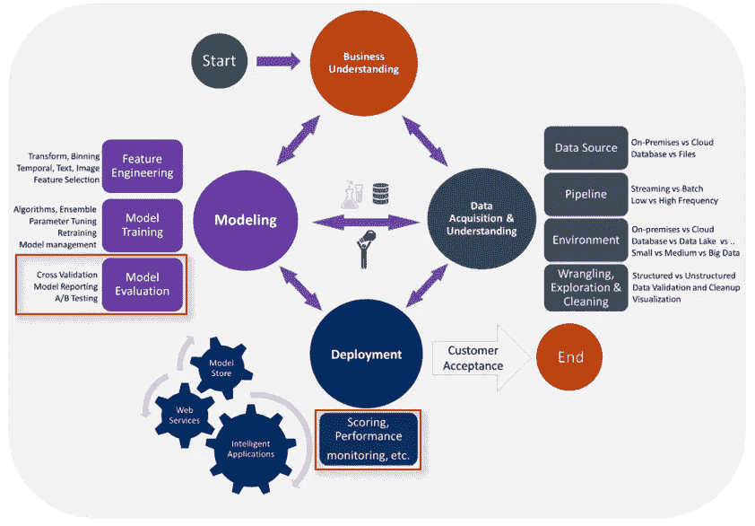

TDSP [[source](https://docs.microsoft.com/en-us/azure/machine-learning/team-data-science-process/overview)]

这篇文章是由两部分组成的系列文章的一部分，主要关注模型的良好性，特别是量化商业价值和转换典型的机器学习性能指标(如精度、召回率、RMSE 等)。)到业务指标。这是模型在现实世界中被验证和接受的典型方式。在上图中，流程的相关阶段以红色突出显示。度量模型的良好性还包括将模型性能与合理的基线进行比较，这也将在本文中讨论。为了说明所有这一切，将考察两大类机器学习问题:

*   分类:包含在第 1 部分中
*   回归:包含在[第二部分](https://blogs.msdn.microsoft.com/data_insights_global_practice/2018/09/04/measuring-model-goodness-part-2/)(2018 年 9 月 4 日更新)

# 分类

分类是预测定性或分类反应的过程[ [来源](https://web.stanford.edu/~hastie/ElemStatLearn/) ]。这是一种受监督的机器学习技术，它将新的观察结果分类到一组离散的类别中。这是基于包含已知类别的观察值的训练数据来完成的。分类问题可以是有两个目标类别的**二元**或有两个以上互斥目标类别的**多类**。

A Binary Classification Problem

在这篇文章中，我将以乳腺癌检测为例来研究二元分类问题。我将使用威斯康星开放乳腺癌数据集进行建模和评估。下面讨论的技术可以很容易地扩展到其他二元和多类分类问题。所有用于构建和评估模型的源代码都可以在 Github [这里](https://github.com/thampiman/msdn-digp-blog/tree/master/measuring_model_goodness)找到。

让我们首先了解业务上下文和数据。乳腺癌是女性最常见的癌症，也是女性癌症死亡的主要原因[ [来源](https://www.nature.com/articles/s41598-018-22437-z) ]。癌症类型的早期检测——无论是良性还是恶性——可以通过选择适当的治疗策略来帮助挽救生命。在该数据集中，总共有 569 个病例，其中 357 个是良性的(62.6%)，212 个是恶性的(37.4%)。总共有 30 个特征，是从乳腺肿块活检的数字化图像计算出来的。这些特征描述了细胞核的特征，如半径、纹理、周长、光滑度等。癌症类型的检测目前由放射科医师完成，这是耗时的，并且商业需求是加速诊断过程，以便可以尽早开始适当的治疗。在深入建模阶段之前，我们需要了解做出正确/错误预测的价值/成本。该信息可以使用如下所示的**价值-成本矩阵**来表示:

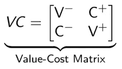

矩阵中的行表示实际类别，列表示预测类别。第一行/列代表阴性类别(在这种情况下为良性)，第二行/列代表阳性类别(在这种情况下为恶性)。以下是矩阵中每个元素所代表的含义:

*   第 0 行，第 0 列:正确预测负类的值
*   第 0 行，第 1 列:错误预测正类的成本
*   第 1 行，第 0 列:错误预测负类的成本
*   第 1 行，第 1 列:正确预测正类的值

对于乳腺癌检测，我们可以将价值-成本矩阵定义如下:

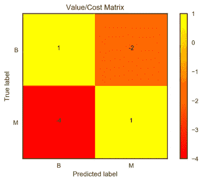

*   正确检测良性和恶性病例具有同等的积极价值。尽管恶性肿瘤对患者来说是最糟糕的情况，但目标是早期诊断，开始治疗并治愈这两种类型的癌症。因此，从治疗的角度来看，准确检测这两种情况具有同等的价值。
*   将恶性病例标记为良性(假阴性)的成本比将良性病例标记为恶性(假阳性)的成本要高得多。因此，假阴性的成本为-4，假阳性的成本为-2。

另一个业务需求是尽可能多地自动化流程。做到这一点的一种方式是使用机器学习模型作为过滤器，以自动检测较简单的良性病例，并且仅标记可能的恶性病例供放射科医师查看。如下图所示。我们可以通过查看需要手工评审的 **%的案例**(在图中表示为 *x* )来量化这个业务需求。理想情况下，我们希望一切都自动化，而不需要人参与。这意味着模型应该具有 100%的准确性，并且 *x* 应该等于正类的实际比例。

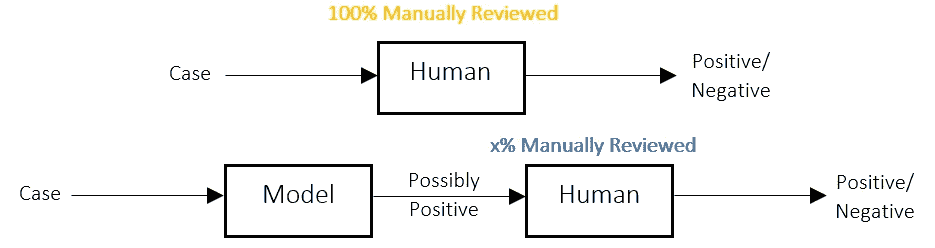

正确量化业务需求后，下一步是定义**合理的基线**来比较我们的模型。

*   基线 1:随机决定癌症类型是良性还是恶性的随机分类器。
*   基线 2:多数类分类器，总是挑选多数类。在这种情况下，多数阶级是良性的。如果这些阶层高度不平衡，这种策略会更有意义。

我们可以添加第三个基准*,这是放射科医师或企业当前部署的任何其他模型的性能。但是在这个例子中，这个信息是未知的，所以这个基线被删除了。*

现在是构建模型的有趣部分。我将在这里掩饰很多细节，因为可能需要一整篇文章来进行探索性分析、建模技术和最佳实践。我使用了一个由特征缩放器、用于特征缩减的 PCA 和最后的**随机森林(RF)分类器**组成的流水线。进行 5 重交叉验证和网格搜索以确定最佳超参数。完整的源代码可以在[这里](https://github.com/thampiman/msdn-digp-blog/blob/master/measuring_model_goodness/Classification.ipynb)找到。

一旦模型被训练，下一步就是评估它们。有各种各样的性能指标可以使用，但在这篇文章中，我将回顾以下 6 个指标，因为它们很容易解释、可视化并转化为业务指标。

*   **真阳性(TP)** / **真阳性率(TPR)** :假设实际类别为阳性，正确的阳性预测数/预测为阳性的概率
*   **假阴性(FN)** / **假阴性率(FNR)** :假设实际类别为阳性，则错误的阴性预测数/预测为阴性的概率
*   **真阴性(TN)** / **真阴性率(TNR)** :假设实际类别为阴性，则正确的阴性预测数/预测为阴性的概率
*   **假阳性(FP)** / **假阳性率(FPR)** :假设实际类别为阴性，则错误阳性预测的数量/预测阳性的概率
*   **精度(P)** :预测阳性正确的比例
*   **Recall (R)** :实际捕获的阳性比例

所有这些指标都是相互关联的。使用 [ROC 曲线](https://en.wikipedia.org/wiki/Receiver_operating_characteristic)和[混淆矩阵](https://en.wikipedia.org/wiki/Confusion_matrix)可以很容易地看到前四个。最后两个可以使用[精确回忆](https://en.wikipedia.org/wiki/Precision_and_recall) (PR)曲线来可视化。让我们首先使用 ROC 和 PR 曲线来可视化模型和基线的性能。

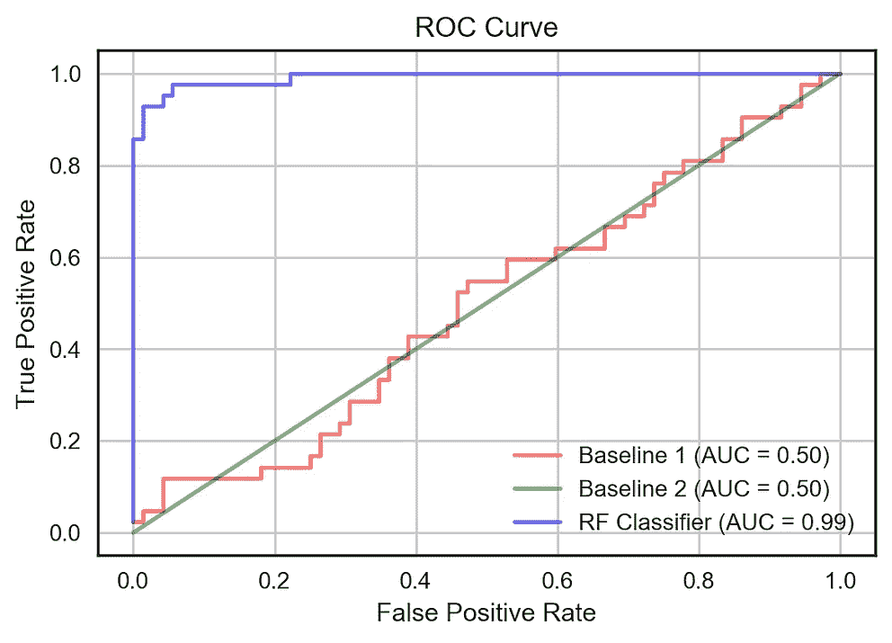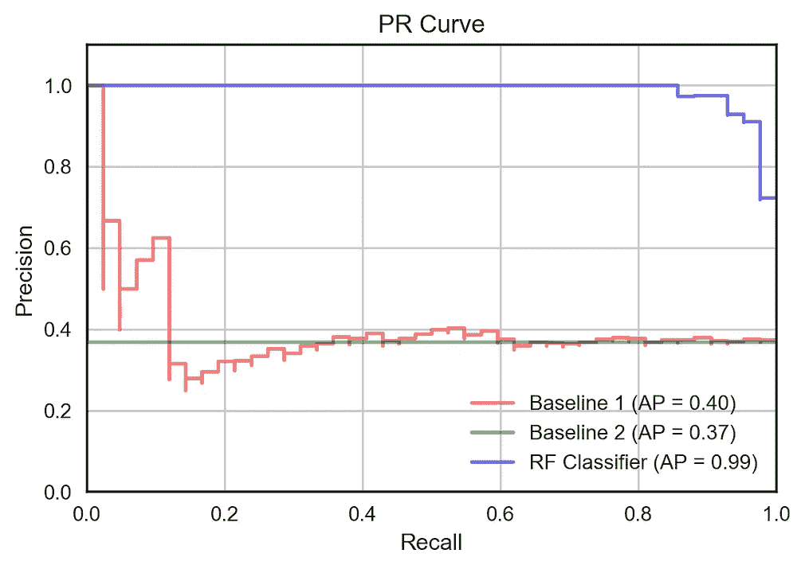

两个图都显示了使用各种阈值来确定正类和负类的模型的性能。可以看出，RF 分类器在各个方面都优于基线。一旦选择了合适的阈值，我们就可以绘制标准化的混淆矩阵，如下所示。这些矩阵显示了给定实际值时预测值的条件概率。我们可以看到基线表现很差，特别是在预测阳性类别时，假阴性率很高。另一方面，RF 分类器似乎获得了更多的正面和负面类别预测，达到了 93%的 TPR 和 97%的 TNR。

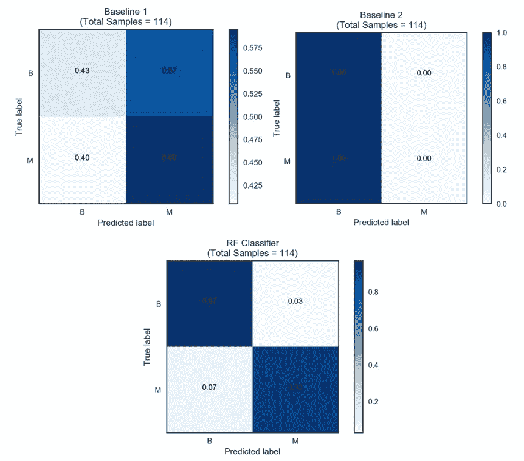

既然我们已经确定新的射频模型优于基线，我们仍然需要确保它符合我们的业务目标。即高的正业务价值和更少的手动审查案例。因此，我们需要将上述性能指标转化为以下内容:

*   模型的总预期价值/成本
*   需要手动审查的案例百分比

第一个业务指标可以通过取展平的混淆矩阵(通过样本总数标准化， *S* )与展平的价值成本矩阵的点积来计算。如下所示。

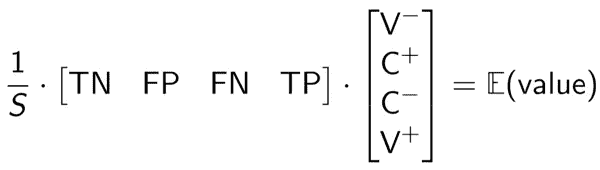

注意 *S* 是一个标量，等于 TN + FP + FN + TP。期望值实质上是价值/成本的加权平均值，其中权重是预测正类和负类的概率[ [来源](http://www.data-science-for-biz.com/DSB/Home.html)。

第二个业务指标可以使用 precision 和 recall 来计算，如下所示。

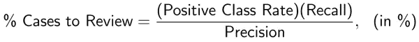

正类率是从用于评估模型的数据，即测试集得知的。根据业务需求，我们需要决定我们必须准确确定多少正类，即召回。如果我们想检测出所有的阳性病例，目标召回率应该是 100%。然后，我们可以从 PR 曲线中找到相应的精度(和阈值)。对于具有 100%精度和召回率的理想模型，要检查的正面案例的比例将等于实际的正面分类率。这意味着理论上我们可以实现 100%的自动化。

接下来的两个图显示了根据两个关键业务度量对模型良好性的最终评估。

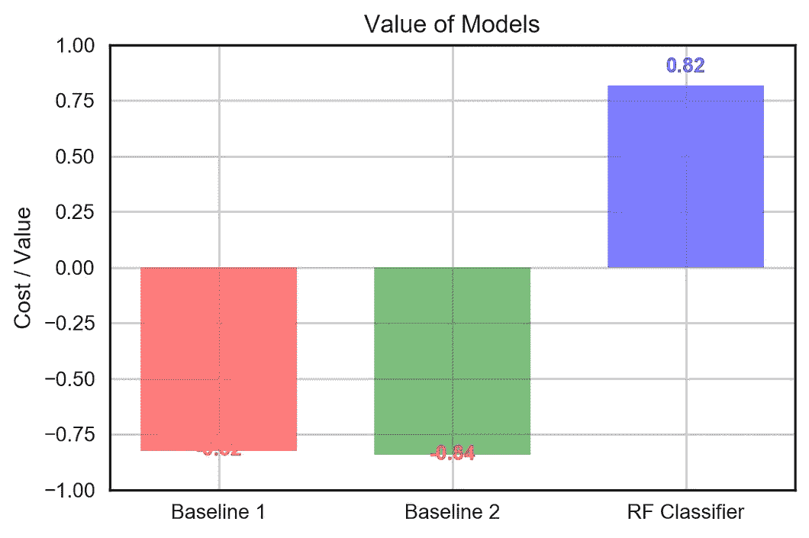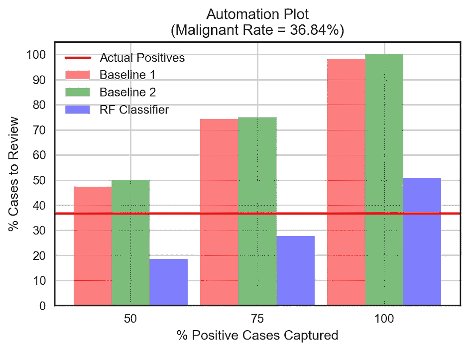

观察结果:

*   由于高假阴性，两种基线模型都有相当大的成本。随机森林分类器通过获得大量正确的正反例而具有良好的正价值。
*   对于乳腺癌检测的情况，我们希望捕获所有阳性/恶性病例，即 100%召回。在这个例子中，着眼于 50%或 75%的召回是没有意义的，因为不治疗恶性病例的成本很高。对于其他二元分类问题，例如欺诈检测，只要模型能够标记出高成本节约的欺诈案例，较低的召回率可能是可以接受的。无论如何，我们可以看到随机森林分类器在自动化方面也优于基线。为了捕获 100%的恶性病例，放射科医师只需要检查所有病例的大约 50%，即 13%的额外假阳性，而他/她必须使用基线模型检查几乎所有的病例。

总之，本系列的第一部分已经从业务的角度考察了度量模型的良好性，特别是考察了分类类型的问题。关于这个主题的更多细节，下面的书是很好的参考。在本系列的[第二部分也是最后一部分](https://blogs.msdn.microsoft.com/data_insights_global_practice/2018/09/04/measuring-model-goodness-part-2/)中，我将介绍回归，这需要查看稍微不同的度量标准。

# 进一步阅读

*   [统计学习的要素](https://web.stanford.edu/~hastie/ElemStatLearn/)，作者 Trevor Hastie，Robert Tibshirani，Jerome Friedman
*   [福斯特·普罗沃斯特和汤姆·福西特的《商业数据科学》](http://www.data-science-for-biz.com/DSB/Home.html)
*   [用 Scikit-Learn 和 Tensorflow 进行机器实践学习](http://shop.oreilly.com/product/0636920052289.do)，作者 Aurélien Géron

这是回归系列的第二部分[。](http://ajaythampi.com/blog/2018/9/6/measuring-model-goodness-part-2)

*这是从 MSDN 数据洞察博客* [*这里*](https://blogs.msdn.microsoft.com/data_insights_global_practice/) *交叉发布的。*