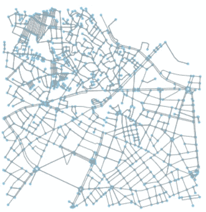
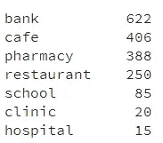
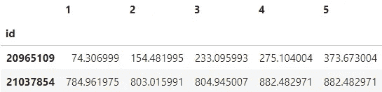
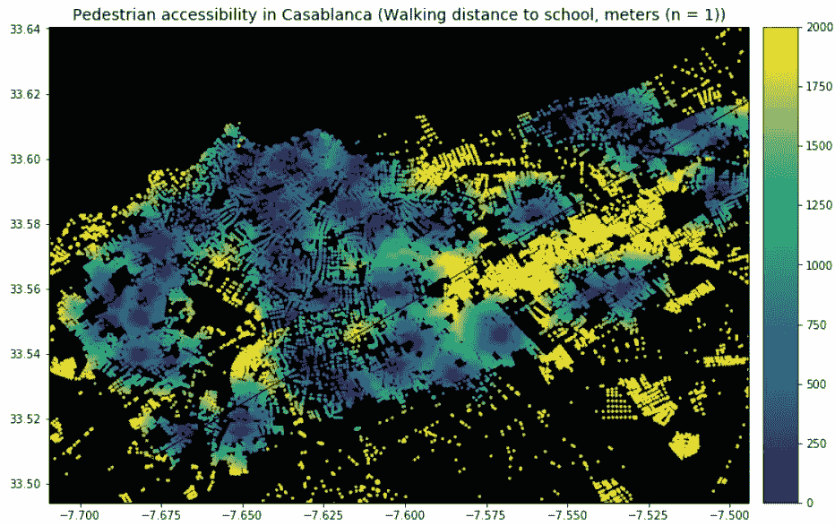
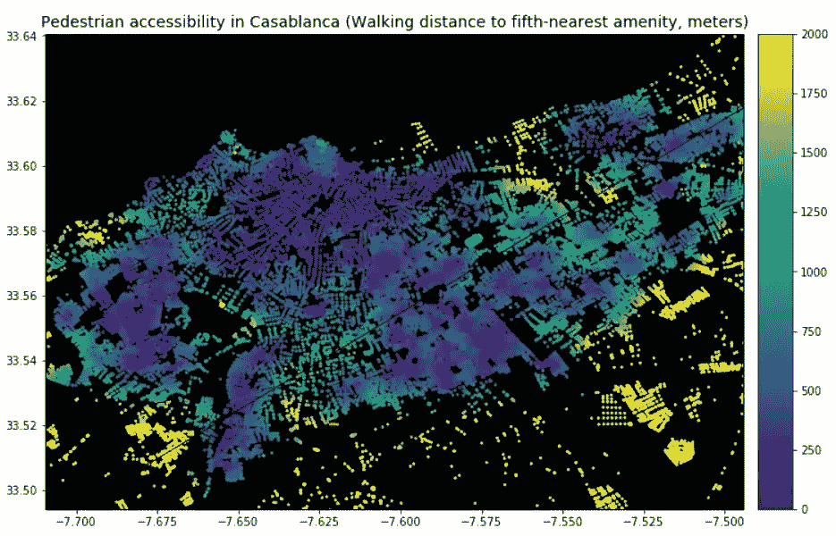
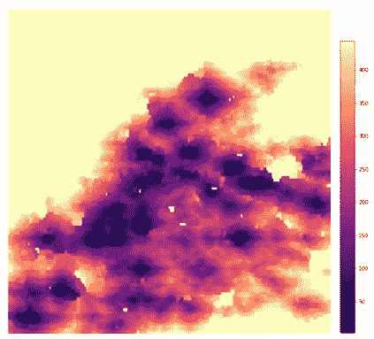
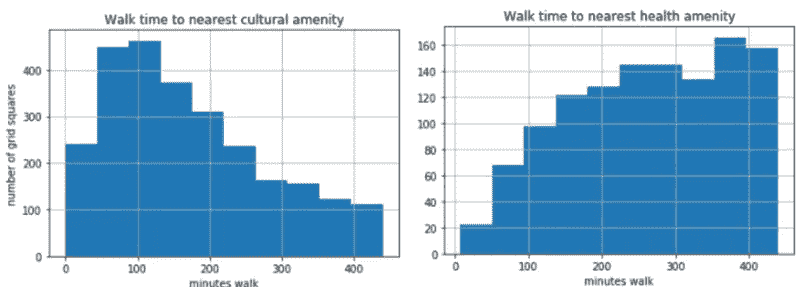

# 测量行人可达性

> 原文：<https://towardsdatascience.com/measuring-pedestrian-accessibility-97900f9e4d56?source=collection_archive---------11----------------------->

适宜步行的社区有利于健康、幸福和经济增长。世界各地想要吸引有才华的年轻劳动力的城市越来越注重创造良好的步行体验。我们如何使用数据科学工具来测量和绘制步行性？

这篇博客提出了一种借鉴 Pandana(由 Fletcher Foti 开发的优秀 Python 库)的方法。

## **这能回答什么问题？**

我们将处理沿道路网络的邻近分析。测量商店、办公室和公交车站等设施的密度“直线距离”是微不足道的；密度图可以在地理信息系统软件中制作。但是，如何绘制从城市的每个部分到最近的设施的步行或开车时间呢？或者更好的是，回答诸如“大多数日常差事可以步行完成吗？”为此，我们需要网络约束距离:沿着城市街道到达目的地的米数。

## **第一步:创建街道网络对象**

网络数学的一个分支，图论，是由 Leonard Euler 在试图模拟穿过 Konigsburg 七座桥的路线时发展起来的。我们可以使用相同的节点(在我们的例子中是街道交叉口)和边(街道)术语来模拟道路网络。

由于几位研究人员，特别是 Foti 和 Geoff Boeing，创建了将 OpenStreetMap (OSM)道路转换为有效图形对象的自动化方法，Python 中的道路网络分析变得更加容易。他们的工具 Pandana 和 [OSMNx](https://geoffboeing.com/2016/11/osmnx-python-street-networks/) 都通过像[删除不代表实际交叉点的点](https://github.com/gboeing/osmnx-examples/blob/master/notebooks/04-example-simplify-network.ipynb)这样的步骤下载和清理 OSM 道路数据(因此在图论意义上不是节点)。

让我们来看看摩洛哥卡萨布兰卡的街道网络:



Network object for central Casablanca

# **第二步:定位感兴趣的对象**

比方说，我们正在开发一个医疗保健项目，希望了解哪些社区缺少获得初级医疗服务的诊所。我们需要所有这些地点的列表，以及它们的位置。让我们列出诊所以及其他一些感兴趣的对象:


Points of interest downloaded from OpenStreetMap for Casablanca (first five records)



Number of POIs by category, downloaded from OSM

# 第三步:计算距离

这就是用 Python 进行地理分析真正出彩的地方，而不是坐在 GIS 包前。Pandana 是为速度而生的。首先，我们将传递给它一个最大搜索距离。这是加快未来查询速度的关键一步:Pandana 将建立一个网络的精简表示(用 C++实现)，允许在每个节点的定义半径内进行快速计算。我们将构建一个从几个交叉点到最近的 5 个兴趣点的距离表。



Distance in meters to five nearest amenities (two sample intersections).

这样，不同选定设施的无障碍分析可以在一秒钟内完成。(在引擎盖下，两种算法使这成为可能:[收缩层次结构](https://en.wikipedia.org/wiki/Contraction_hierarchies)和 [kd 树](https://blog.mapbox.com/a-dive-into-spatial-search-algorithms-ebd0c5e39d2a)。)

# 第四:制作无障碍地图

接下来，我们可以制作可达性地图。让我们做一些！



正如你所看到的，有些区域你必须步行 2 公里以上才能到达最近的学校，而卡萨布兰卡市中心的平均步行距离不到 400 米。

不过，这只是针对学校的。我们可以为诊所、银行或其他在 OSM 标记的设施画出同样的图。

但是什么抓住了“可步行性”的整体概念呢？对我来说，这又回到了“我能步行完成大多数日常任务吗”的问题。解开什么是最有资格的日常任务是一个复杂的问题:我们可以根据生活设施对日常生活的重要性建立一个加权指数(例如，获得医疗保健比获得夜生活更重要)；或者我们可以使用人们最常去的娱乐设施的经验数据。

不管怎样，我们使用 Pandana 的工作流程解决了这个问题。简单地列出你感兴趣的事物，并为它们建立一个加权指数。事实上，WalkScore 公司使用了类似的方法来提供美国各地社区质量的基准(你可以在浏览 Zillow 时看到)。

可访问性分数可以很快地被构建来回答一个给定的问题:是获得基本服务，还是吸引年轻工作者的适合步行的社区。现在，让我们平等地衡量所有的便利设施，并想象到第五个最近的便利设施的距离。

```
plot_nearest_amenity('all',5)
```



## 从网络距离到步行时间

让我们为第二个城市做同样的输出:明尼阿波利斯-圣保罗。(那里的人很好，网格状的街道也很直观。)


在这里，我们看到绘制一个可达性的复合测量值(到第五个最近设施的距离)比只绘制到单一最近文化设施(咖啡馆、餐馆或学校)的距离更清楚地显示了哪些社区最适合步行。

为了使结果更易于解释，让我们在道路网络后面构建一个 250 平方米的像元网格，将每个像元连接到其最近的节点，并将距离转换为步行、驾驶或公共交通时间。明尼阿波利斯不是一个非常适合步行的城市，尽管一些市中心街区的情况不错。



Minneapolis: Minutes walk to fifth-nearest amenity



# 扩展ˌ扩张

这里使用的图书馆是作为加州大学伯克利分校 UrbanSIM 项目的一部分开发的，支持一系列城市规划和房地产用例。可以使用高质量的本地生成的 GIS 数据来代替 OSM(这确实是更好的选择)。

一个重要的扩展:这种方法是房地产价格建模或建筑级预测模型的重要输入。举例来说，特征价格模型假设，购房者支付更多的钱来购买一栋可以方便地步行去星巴克或开车去医院的房子。将税收地块边界(或 OSM 建筑覆盖区)捕捉到网络，就像我们刚才将网格正方形附加到网络上一样，这使我们可以为任何给定的属性获取此数据。

同样，预测犯罪或火灾风险的机器学习模型需要尽可能多的属性来表征每栋建筑在城市结构中的位置。

通过这种框架的快速网络约束查询可以回答许多问题——从上面讨论的可步行性度量开始。