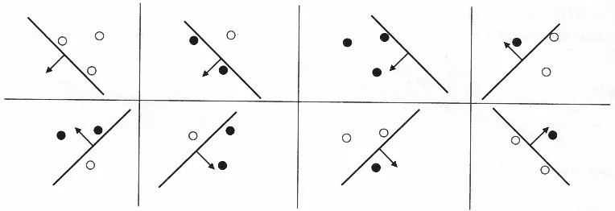
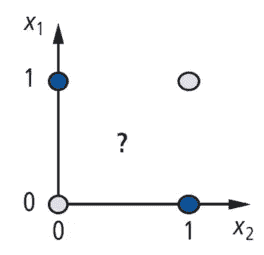
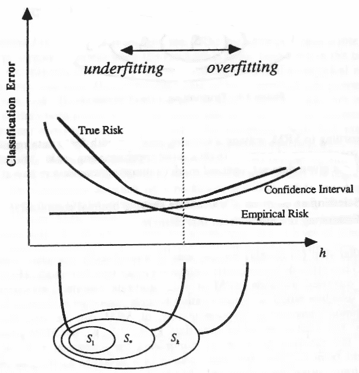

# 用 VC 维度量分类器的能力

> 原文：<https://towardsdatascience.com/measuring-the-power-of-a-classifier-c765a7446c1c?source=collection_archive---------3----------------------->

## 用 VC 维度量算法的表达能力

为数据选择分类器时，一个显而易见的问题是“这个分类器可以分类什么类型的数据？”。例如，如果您知道您的点可以很容易地由一条直线分隔，您可能会选择简单的线性分类器，而如果您知道您的点将在许多独立的组中，您可能会选择更强大的分类器，如随机森林或多层感知器。这个基本问题可以使用分类器的 **VC 维度**来回答，这是计算学习理论中的一个概念，它正式量化了分类算法的能力。

分类器的 VC 维由 Vapnik 和 Chervonenkis 定义为分类算法可以**粉碎** [ [1](https://epubs.siam.org/doi/10.1137/1116025) 的最大点集的基数(大小)。这似乎是一个简单的定义，但很容易被误解，所以我现在将在这里更详细地解释定义中的关键术语。为了简单起见，我们将使用 2-D 例子，但是这些想法推广到任何数量的维度。

## 打碎一组点

平面上的 **N** 点的配置就是 **N** 点的任意放置。为了使*的 VC 维数至少为* **N** ，分类器必须能够粉碎 **N** 点的*单个*配置。为了**粉碎**点的配置，分类器必须能够针对点的正负的每一种可能的**分配**，完美地划分平面，使得正点与负点分离。对于一个有 **N** 个点的配置，有**个 2^N** 个可能的正或负赋值，因此分类器必须能够正确地分离每个点。

在下面的例子中，我们展示了线性分类器的 VC 维至少是 3，因为它可以粉碎这种 3 点的配置。在肯定和否定的 2 = 8 个可能赋值的每一个中，分类器能够完美地分离两个类别。

现在，我们表明线性分类器比 4 低。在这种 4 点配置中，分类器不能在至少一个赋值中分割正类和负类。在这种情况下，需要两条线来分隔这两个类。我们实际上需要证明*不存在*一个可以被粉碎的 4 点构型，但是同样的逻辑适用于其他构型，所以，为了简洁起见，这个例子已经足够好了。

既然我们现在已经表明线性分类器的 VC 维数是*至少是* 3，并且*低于* 4，我们可以最终得出结论，它的 VC 维数是*正好是* 3。再次记住，为了有一个 VC 维度为 **N** ，分类器必须只粉碎*N 个点的单个*配置——可能会有许多分类器不能粉碎的 **N** 个点的其他配置。

## VC 维的应用

既然你已经知道什么是风险资本维度，以及如何找到它，那么理解它的实际含义也是很重要的。在大多数情况下，一个分类器的确切 VC 维并不重要。更确切地说，它更多地用于根据算法的复杂性对不同类型的算法进行分类；例如，简单分类器类可以包括基本形状，如直线、圆形或矩形，而复杂分类器类可以包括诸如多层感知器、提升树或其他非线性分类器的分类器。分类算法的复杂度与其 VC 维直接相关，与偏差和方差之间的权衡相关。

在这张图片中，我们看到了模型复杂性的影响。在底部，每个 **S_i** 代表一组在 VC 维度或复杂度上相似的模型。在上图中，VC 尺寸在 x 轴上测量为 **h** 。观察到随着复杂性的增加，你从适应不足过渡到适应过度；增加复杂性直到某一点都是好的，在这之后，你开始过度适应训练数据。

另一种思考方式是通过偏差和方差。低复杂度模型将具有高偏差和低方差；虽然它的表达能力低，导致高偏差，但它也非常简单，因此它具有非常可预测的性能，导致低方差。相反，复杂的模型将具有较低的偏差，因为它具有更多的表达能力，但是将具有较高的方差，因为基于样本训练数据有更多的参数要调整。通常，具有较高 VC 维度的模型将需要更多的训练数据来正确训练，但将能够识别数据中更复杂的关系。

在模型的某种复杂程度上，偏差和方差之间会存在一个理想的平衡，用垂直虚线表示，在这个水平上，你对你的数据既不会欠拟合也不会过拟合。换句话说，你应该选择一个分类器，它的复杂程度对于你的分类任务来说*刚好*足够——少了会导致欠拟合，多了会导致过拟合。