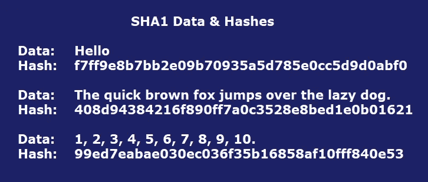
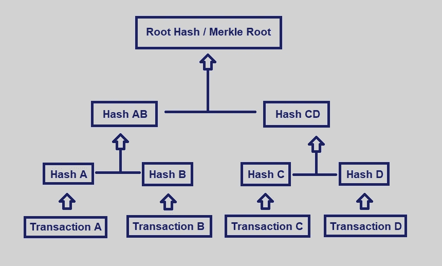
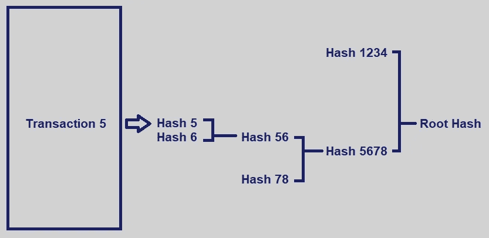

# 区块链安全机制

> 原文：<https://towardsdatascience.com/mechanisms-securing-blockchain-data-9e762513ae28?source=collection_archive---------5----------------------->

密码哈希和 Merkle 树保持了公共和私有区块链数据的完整性。

# 密码散列法

哈希函数是网络安全和比特币等几种主要加密货币协议的重要组成部分。

**什么是哈希？**

哈希是一种加密方法，可以将任何形式的数据转换为唯一的文本字符串。任何数据都可以被散列，无论其大小或类型如何。在传统的散列法中，不管数据的大小、类型或长度如何，任何数据产生的散列总是相同的长度。哈希旨在充当单向函数，您可以将数据放入哈希算法并获得唯一的字符串，但如果您遇到新的哈希，您将无法破译它所代表的输入数据。一条唯一的数据将总是产生相同的散列。

**它是如何工作的？**

哈希是一种数学运算，易于执行，但极难逆转。(哈希和加密的区别在于，加密可以使用特定的密钥进行反转或解密。)最广泛使用的散列函数是 MD5、SHA1 和 SHA-256。一些散列过程比其他过程更难破解。例如，SHA1 比 bcrypt 更容易破解。

Some examples of data run through SHA1 hashes. The SHA1 hashes will always be the same for this data.

**谁使用哈希算法？**

普通用户每天都会遇到密码散列。例如，当您创建电子邮件地址和密码时，您的电子邮件提供商可能不会保存您的密码。相反，提供商通过哈希算法运行密码，并保存密码的哈希。每次您尝试登录您的电子邮件时，电子邮件提供商都会对您输入的密码进行哈希处理，并将该哈希与它保存的哈希进行比较。只有当两个哈希值匹配时，你才有权访问你的电子邮件。

**加密货币中的散列法**

在比特币区块链中，“挖掘”本质上是通过运行一系列 SHA-256 哈希函数来进行的。在今天的加密货币区块链中，散列被用于写入新的交易，给它们加时间戳，并最终在前一个块中添加对它们的引用。当一组交易被添加到区块链中，并且在不同节点的操作者之间达成共识(验证他们都具有整个分类帐的正确和真实版本)时，由于任何试图篡改区块链的人都需要巨大的计算能力，以及散列的单向性质，所以几乎不可能撤销交易。因此，哈希对于维护区块链的加密完整性至关重要。

**哈希和网络安全**

当一个组织发现一个平台的密码已经被破坏，这通常意味着黑客已经获得了代表密码的散列。然后，黑客运行常用词的散列和常用词与数字的组合来破译用户保存的一些密码。网络安全行业现在使用一种叫做“加盐”的机制。Salting 包括在哈希之前向密码添加随机数据，然后将“salt 值”与哈希一起存储。这一过程使得黑客更难使用预计算技术和破解他们获得的散列数据的密码。

The Merkle Root is derived from hashing each transaction pair in a block until it is down to a single hash.

# Merkle 树

Merkle 树是区块链技术的基础部分。merkle 树是一种允许对大量数据中的内容进行高效和安全验证的结构。这种结构有助于验证数据的一致性和内容。比特币和以太坊都使用 Merkle 树。

Merkle 树是如何工作的？

Merkle 树通过产生整个事务集的数字指纹来汇总块中的所有事务，从而使用户能够验证块中是否包括事务。

Merkle 树是通过重复散列节点对直到只剩下一个散列(这个散列被称为根散列或 Merkle 根)来创建的。它们是自底向上构造的，由单个事务的散列(称为事务 id)构成。

每个叶节点是事务数据的散列，每个非叶节点是其先前散列的散列。Merkle 树是二进制的，因此需要偶数个叶节点。如果事务的数量是奇数，最后一个散列将被复制一次，以创建偶数个叶节点。

The Merkle Tree of transactions A, B, C & D.

让我们来看一个块中有四个事务的示例:A、B、C 和 D。每个事务都经过哈希处理，哈希存储在每个叶节点中，产生哈希 A、B、C 和 D。然后，连续的叶节点对在父节点中汇总，哈希 A 和哈希 B 产生哈希 AB，哈希 C 和哈希 D 分别产生哈希 CD。这两个散列(散列 AB 和散列 CD)然后被再次散列以产生根散列(Merkle 根)。

这个过程也可以在更大的数据集上进行:可以对连续的块进行哈希运算，直到顶部只有一个节点。哈希通常使用 SHA-2 加密哈希函数进行，尽管也可以使用其他函数。

Merkle 根汇总相关事务中的所有数据，并存储在块头中。它维护数据的完整性。如果任何事务中的一个细节或事务的顺序发生变化，Merkle Root 也会发生变化。使用 Merkle 树可以快速简单地测试特定交易是否包含在集合中。

The entire dataset doesn’t need to be downloaded to verify the integrity of Transaction 5.

Merkle 树与哈希表的不同之处在于，使用 Merkle 树，一次可以下载一个分支，并且可以立即验证每个分支的完整性，即使树的其余部分还不可用。这是有利的，因为文件可以被分割成非常小的数据块，使得如果原始版本被损坏，只需要再次下载小的数据块。

**用途**

使用 Merkle 树可以显著减少可信机构为了验证目的而必须维护的数据量。它将数据的验证与数据本身分开。Merkle 树可以位于本地，也可以位于分布式系统上。

Merkle 树有三大好处:

1.它们提供了一种证明数据完整性和有效性的方法

2.它们需要很少的内存或磁盘空间，因为证明在计算上是容易和快速的

3.他们的证明和管理只需要通过网络传输极少量的信息

证明日志完整且一致的能力对于区块链技术和总账概念至关重要。Merkle 树有助于验证日志的较新版本是否包含早期版本的所有内容，以及所有数据是否按时间顺序记录和显示。要证明日志是一致的，需要表明以前的记录没有被添加、更改或篡改，并且日志从未被分支或分叉。

Merkle 树使区块链的矿工和用户受益。当挖掘器从对等体接收事务时，挖掘器可以渐进地计算散列。用户可以单独验证块的各个部分，并且可以使用树的其他分支的散列来检查各个事务。

**简化支付验证(SPV)**

简化支付验证(SPV)是一种验证特定交易是否包含在一个块中而无需下载整个块的方法。Merkle 树被 SPV 节点广泛使用。

SPV 节点没有来自块中所有事务的数据。他们只下载块头。Merkle 树使区块链上的 SPV 节点能够检查挖掘者是否已经验证了块中的事务，而无需下载块中的所有事务。这种方法目前被一些轻量级的比特币客户端使用。

**以太坊**

以太坊在每个块中使用三个不同的 Merkle 根:

1.第一个根是块中的事务

2.第二个词根代表州

3.第三个词根是交易收据

以太坊使用一种特殊类型的哈希树，称为“ [Merkle Patricia 树](https://github.com/ethereum/wiki/wiki/Patricia-Tree)

**区块链上不可或缺的工具**

许可区块链等创新将进一步提高数据安全性和可访问性。在许可的区块链中，网络的参与者有能力限制谁可以参与区块链的共识机制。此外，许可区块链允许用户分配谁可以访问其数字身份数据的权限。

加密哈希技术长期以来一直在网络安全中发挥着作用，现在已经准备好为即将到来的区块链应用浪潮提供动力。Merkle 树对于区块链的矿工和用户来说是强大且不可或缺的工具。它们非常强大，是 BitTorrent、Git、比特币和以太坊等多个对等网络的核心。

—

[沙恩雷](http://www.shaanray.com/)

关注 [Lansaar Research](https://medium.com/lansaar) on Medium，了解最新的新兴技术和新的商业模式。

 [## 沙恩·雷

### 来自 Shaan Ray 的最新推文(@ShaanRay)。创造新价值和探索新兴技术| ENTJ | #科学…

twitter.com](https://twitter.com/shaanray) 

**资源**

在线哈希生成器。您可以在此处对您的数据运行 MD5、SHA1、SHA-256 和其他散列函数:

*   [http://onlinemd5.com](http://onlinemd5.com)
*   [http://www.sha1-online.com](http://www.sha1-online.com)

默克尔帕特丽夏树:[https://github.com/ethereum/wiki/wiki/Patricia-Tree](https://github.com/ethereum/wiki/wiki/Patricia-Tree)

***来自《走向数据科学》编辑的提示:*** *虽然我们允许独立作者根据我们的* [*规则和指导方针*](/questions-96667b06af5) *发表文章，但我们并不认可每个作者的贡献。你不应该在没有寻求专业建议的情况下依赖一个作者的作品。详见我们的* [*读者术语*](/readers-terms-b5d780a700a4) *。*