# 医学图像分割[第一部分] — UNet:交互式编码卷积网络

> 原文：<https://towardsdatascience.com/medical-image-segmentation-part-1-unet-convolutional-networks-with-interactive-code-70f0f17f46c6?source=collection_archive---------0----------------------->

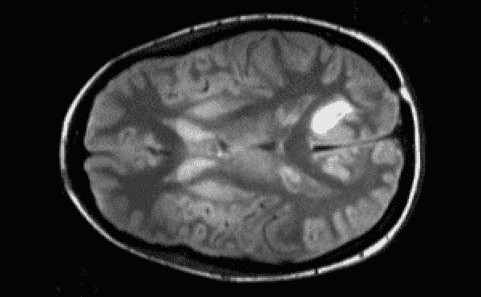

Gif from this [website](https://giphy.com/gifs/computer-vision-zs7mLIVB5vNlK/download)

最后，我开始了这个系列，医学图像分割。关于这个主题，我的第一篇文章是实现众所周知的体系结构，UNet。如果你想看原文，请点击[这里](https://arxiv.org/abs/1505.04597)。(或者我也把它链接到下面)。请注意，今天我觉得有点懒，只想使用自动微分。也许在不久的将来，我可以回来为这个网络做人工反向传播。

**网络架构(图形/ OOP 形式)**

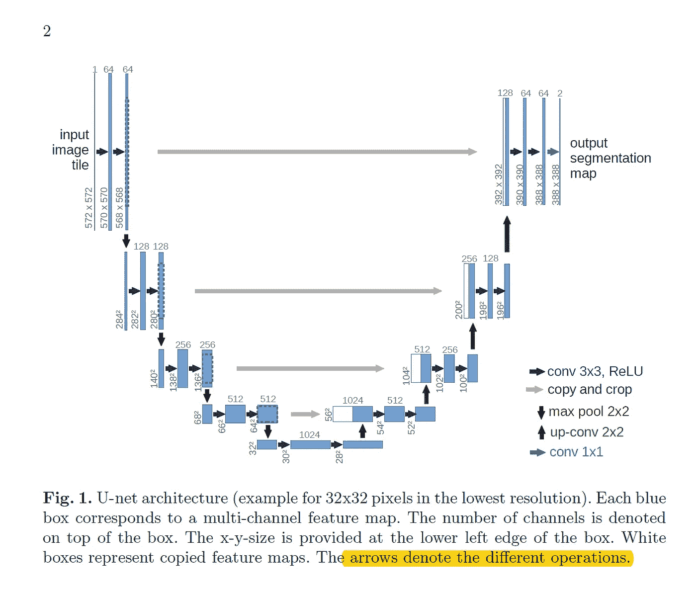

这篇论文在解释网络体系结构方面做得非常出色。我们可以看到网络由卷积运算、最大池、[、ReLU 激活](https://en.wikipedia.org/wiki/Rectifier_(neural_networks))、级联和上采样层组成。现在，我知道有些人可能对如何对原始图像进行上采样感到困惑，这可以通过使用转置卷积运算来实现。我不会深入讨论这个材料，但是这篇博文[做了一件令人惊奇的工作，解释了我们如何使用它来上采样图像。还有，这里是我们可以使用的](/up-sampling-with-transposed-convolution-9ae4f2df52d0) [Tensorflow API](https://www.tensorflow.org/api_docs/python/tf/nn/conv2d_transpose) 。

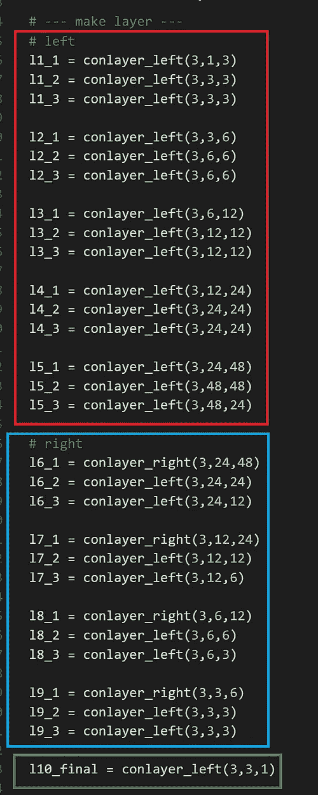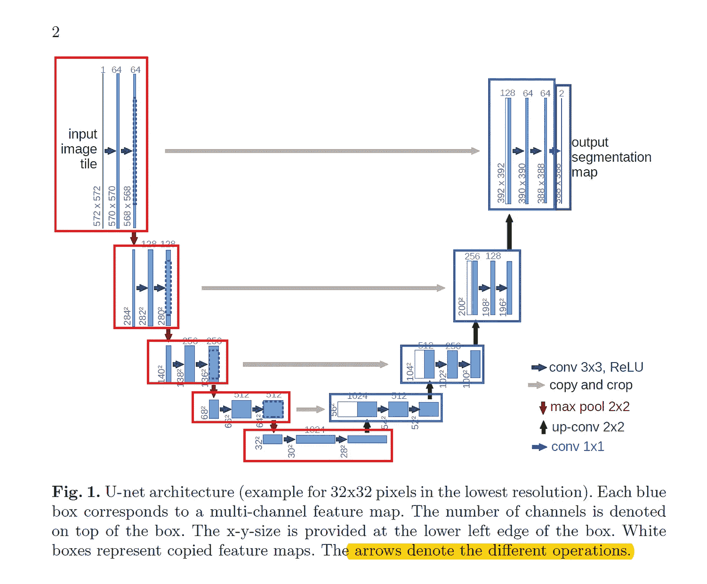

**红框** →代表 U 网左侧
**蓝框** →代表 U 网右侧
**绿框** →最终瓶颈层。

从实现的角度来看，它非常简单，只需要几个卷积层，再加上最大池和 ReLu()激活。

**实验设置/与论文的差异**

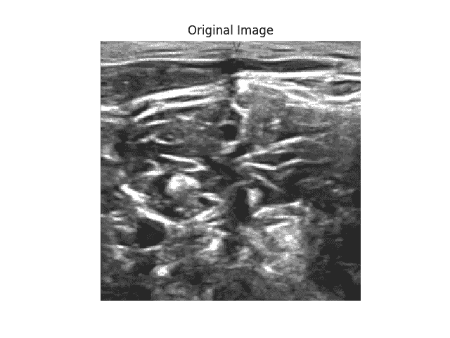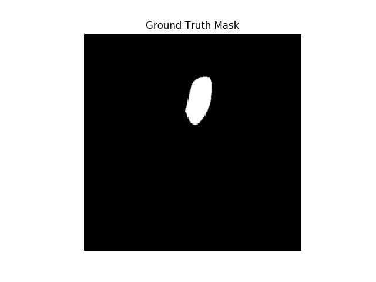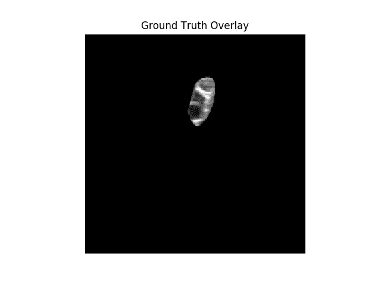

**右图** →原图
**中图** →地面真实二值蒙版
**左图** →地面真实蒙版叠加原图

这个网络的实验设置非常简单，我们将使用 Kaggle Challenge [*超声神经分割*](https://www.kaggle.com/c/ultrasound-nerve-segmentation/leaderboard) *的公开可用数据集。我们将看看我们的模型是否能够从图像中分割出特定的部分。但是，请注意，与原文有三处不同。*

1.  ***使用了较小的特征图尺寸*** →这是由于硬件的限制，我使用的特征图数量是(1、3、6、12、24 和 48)。
2.  ***使用了不同的代价函数*** →如下图所示，原纸已经使用了[带交叉熵损失函数的 softmax】。](https://deepnotes.io/softmax-crossentropy)

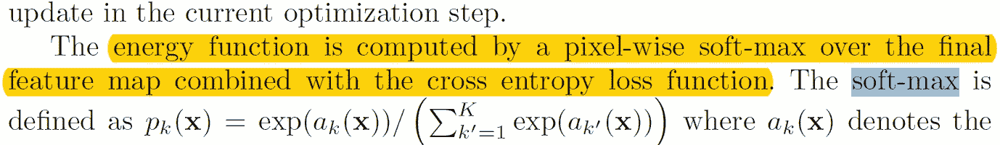

然而，我使用了一个[均方损失函数](https://en.wikipedia.org/wiki/Mean_squared_error)，激活了 ReLu()。

3 ***。用了不同的优化器*** →如下图所示，原论文用的是[随机梯度下降优化器](https://en.wikipedia.org/wiki/Stochastic_gradient_descent)，我只是用了一个 [Adam 优化器](https://machinelearningmastery.com/adam-optimization-algorithm-for-deep-learning/)。

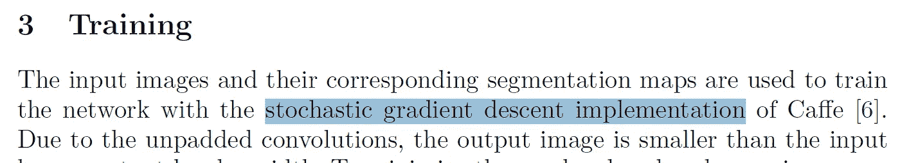

**结果**

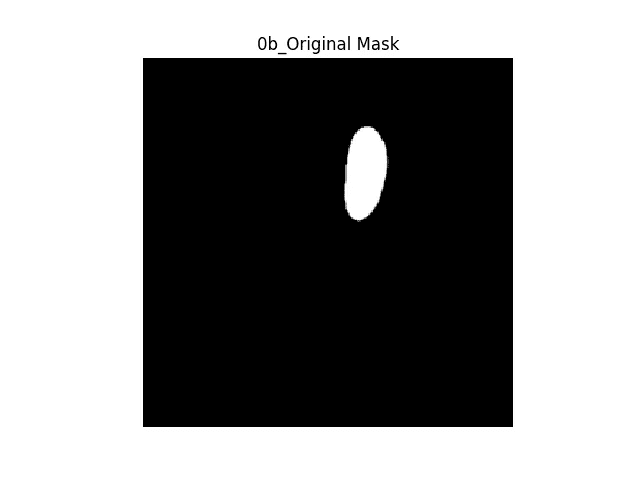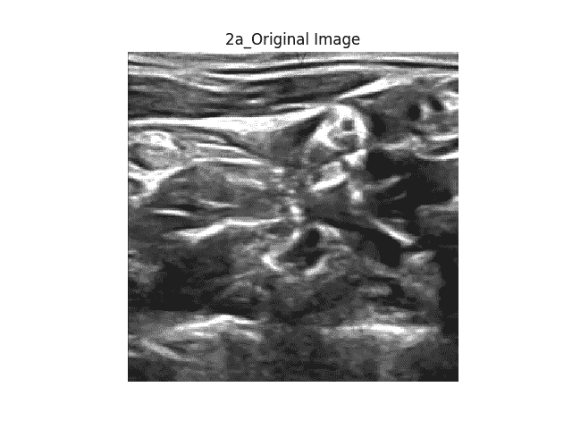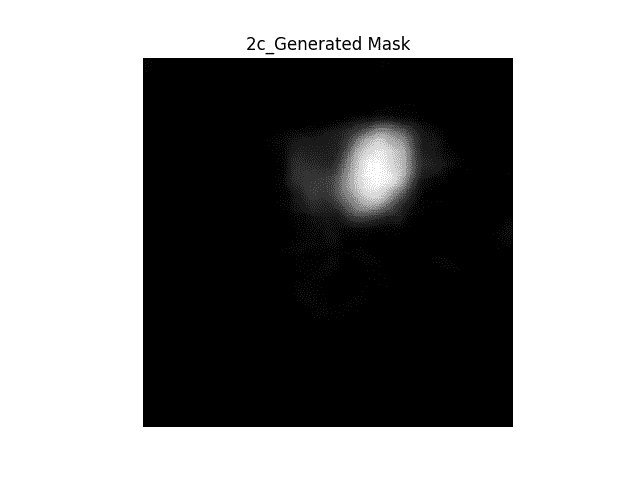

**右图** →原图
**中图** →二值掩码
**左图** →从网络生成二值掩码

总的来说，与地面真实二进制掩码相比，网络做得令人惊讶地好，网络似乎正确地分割了它周围的区域。下面是在原始图像上叠加地面真实蒙版或生成蒙版时的一些图像。

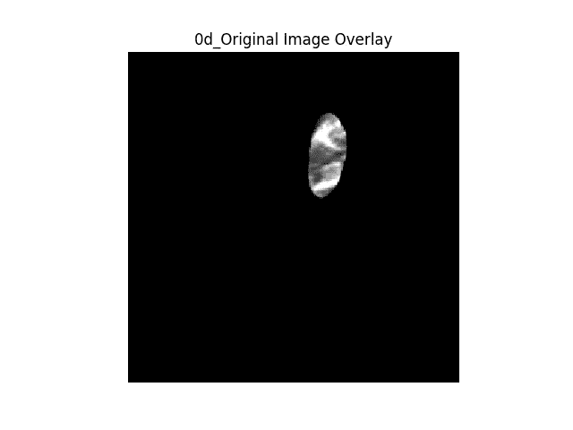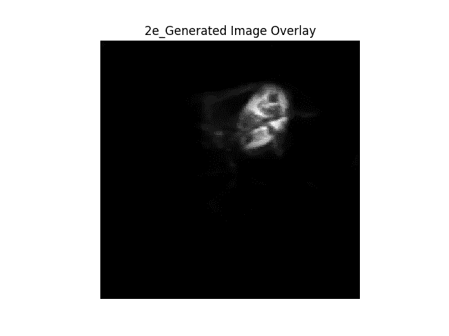

**GIF 格式的结果**

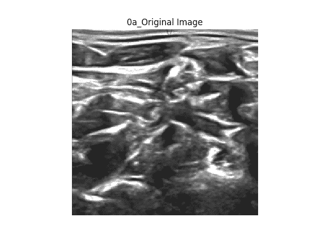

**显示图像的顺序** → 1。原图→ 2。地面真实二进制掩码→ 3。生成的二进制掩码→ 4。原始图像上的地面真实遮罩叠加→ 5。原始图像上生成的蒙版覆盖。

以上是我根据分割结果制作的 GIF，请注意观看 GIF 的顺序，以下是网络如何加班的汇编。随着训练的持续(从 epoch 来看),我们可以看到生成的掩码变得更加精确。

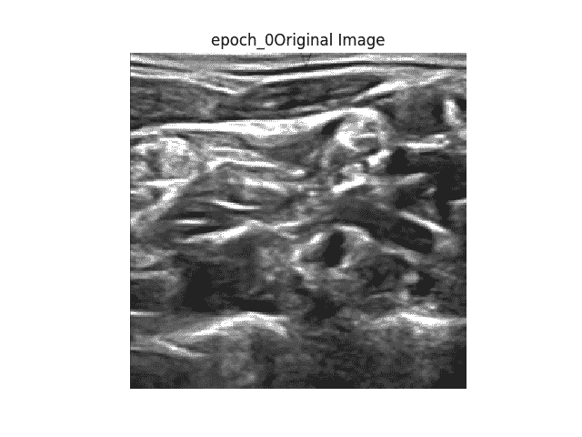

**互动代码/透明度**

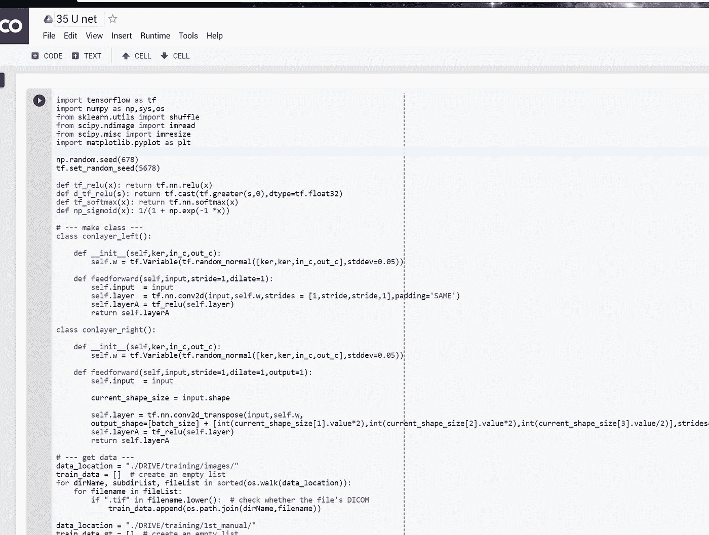

对于 Google Colab，你需要一个 Google 帐户来查看代码，而且你不能在 Google Colab 中运行只读脚本，所以在你的操场上做一个副本。最后，我永远不会请求允许访问你在 Google Drive 上的文件，仅供参考。编码快乐！

要访问 Google Colab 上的代码，[请点击此处](https://colab.research.google.com/drive/1BgCDxVdVc0MAe_kC0waMGUV9ShcWW0hM)。

*   *注**:我不想在 github 上托管 Kaggles 的数据，因为我可能会违反他们的数据使用政策。所以这段代码不能直接在线运行。
*   为了让这个实验更加透明，我把我所有的命令输出上传到了我的 github，如果你想看，请点击[这里](https://github.com/JaeDukSeo/Only_Numpy_Basic/blob/master/U-net/u-net.txt)。

**遗言**

我真的想将我的技能扩展到细分领域，我很高兴最终我能够做到这一点。

如果发现任何错误，请发电子邮件到 jae.duk.seo@gmail.com 给我，如果你希望看到我所有写作的列表，请[在这里查看我的网站](https://jaedukseo.me/)。

同时，在我的推特[这里](https://twitter.com/JaeDukSeo)关注我，并访问[我的网站](https://jaedukseo.me/)，或我的 [Youtube 频道](https://www.youtube.com/c/JaeDukSeo)了解更多内容。如果你感兴趣的话，我还做了解耦神经网络的比较。

**参考**

1.  罗尼伯格，o .，菲舍尔，p .，& Brox，T. (2015 年 10 月)。生物医学图像分割的卷积网络。在*医学图像计算和计算机辅助介入国际会议上*(第 234-241 页)。斯普林格，查姆。
2.  超声波神经分割| Kaggle。(2018).Kaggle.com。检索于 2018 年 4 月 2 日，来自[https://www.kaggle.com/c/ultrasound-nerve-segmentation](https://www.kaggle.com/c/ultrasound-nerve-segmentation)
3.  整流器(神经网络)。(2018).En.wikipedia.org。检索于 2018 年 4 月 2 日，来自[https://en . Wikipedia . org/wiki/Rectifier _(neural _ networks)](https://en.wikipedia.org/wiki/Rectifier_(neural_networks))
4.  面向数据科学的转置卷积上采样。(2017).走向数据科学。检索于 2018 年 4 月 2 日，来自[https://towards data science . com/up-sampling-with-transposed-convolution-9 AE 4 F2 df 52d 0](/up-sampling-with-transposed-convolution-9ae4f2df52d0)
5.  TF . nn . conv 2d _ transpose | tensor flow。(2018).张量流。检索于 2018 年 4 月 2 日，来自[https://www . tensor flow . org/API _ docs/python/TF/nn/conv2d _ transpose](https://www.tensorflow.org/api_docs/python/tf/nn/conv2d_transpose)
6.  达哈尔，P. (2017 年)。分类和损失评估— Softmax 和交叉熵损失。深度笔记。2018 年 4 月 2 日检索，来自[https://deepnotes.io/softmax-crossentropy](https://deepnotes.io/softmax-crossentropy)
7.  j . brown lee(2017 年)。深度学习的 Adam 优化算法的温和介绍-机器学习掌握。机器学习精通。检索于 2018 年 4 月 2 日，来自[https://machine learning mastery . com/Adam-optimization-algorithm-for-deep-learning/](https://machinelearningmastery.com/adam-optimization-algorithm-for-deep-learning/)
8.  随机梯度下降。(2018).En.wikipedia.org。检索于 2018 年 4 月 2 日，来自 https://en.wikipedia.org/wiki/Stochastic_gradient_descent
9.  Python 中的 DICOM:用 PyDICOM 和 VTK 将医学图像数据导入 NumPy。(2014).PyScience。2018 年 4 月 2 日检索，来自[https://pyscience . WordPress . com/2014/09/08/DICOM-in-python-importing-medical-image-data-into-numpy-with-pydicom-and-VTK/](https://pyscience.wordpress.com/2014/09/08/dicom-in-python-importing-medical-image-data-into-numpy-with-pydicom-and-vtk/)
10.  JaeDukSeo/Only_Numpy_Basic。(2018).GitHub。2018 年 4 月 2 日检索，来自[https://github . com/JaeDukSeo/Only _ Numpy _ Basic/blob/master/U-net/U-net . txt](https://github.com/JaeDukSeo/Only_Numpy_Basic/blob/master/U-net/u-net.txt)
11.  均方差。(2018).En.wikipedia.org。检索于 2018 年 4 月 2 日，来自[https://en.wikipedia.org/wiki/Mean_squared_error](https://en.wikipedia.org/wiki/Mean_squared_error)