# 医学图像分割[第二部分]——基于交互式编码的扩展全卷积网络的病理肺组织语义分割

> 原文：<https://towardsdatascience.com/medical-image-segmentation-part-2-semantic-segmentation-of-pathological-lung-tissue-with-24482942d65a?source=collection_archive---------4----------------------->

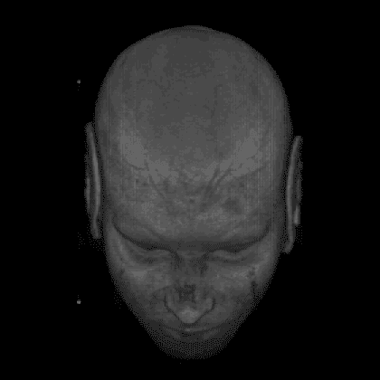

Gif from this [website](https://giphy.com/gifs/head-human-mri-iTMkwIgcovk6Q/download)

这是我关于医学图像分割的第二篇文章。今天我们将覆盖这篇论文“ [*【扩张全卷积网络的病理肺组织语义分割*](https://arxiv.org/pdf/1803.06167.pdf) ”。今天我又觉得有点懒，所以我就用自动微分来训练我的网络。

**网络架构(基本构建模块/完整架构)**

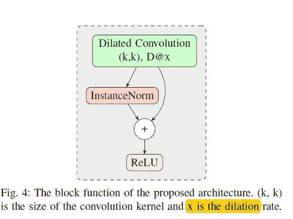

Image from [paper](https://arxiv.org/abs/1803.06167)

所以上图显示了这个网络的基本构建模块，它由卷积运算、归一化、加法和激活函数(ReLU)组成。既然我们已经看到了基本的构造块，那么让我们来看看完整的网络体系结构。

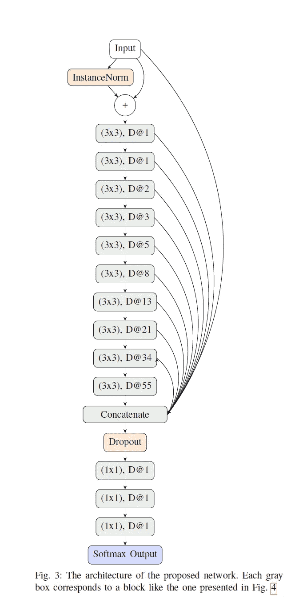

这篇文章确实很好地描述了整个体系结构，网络总共有 13 层，有各种级联层和丢弃层的组合。

**实验设置/与论文的差异**

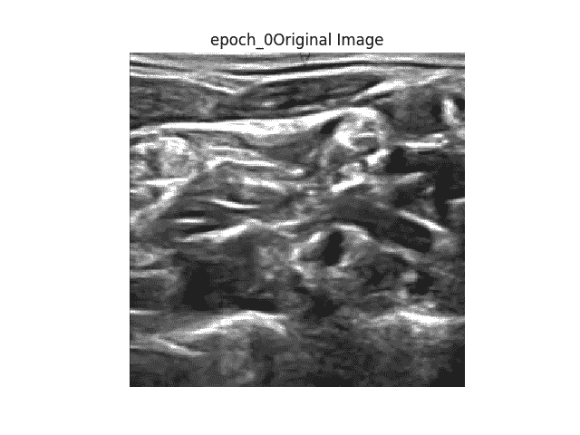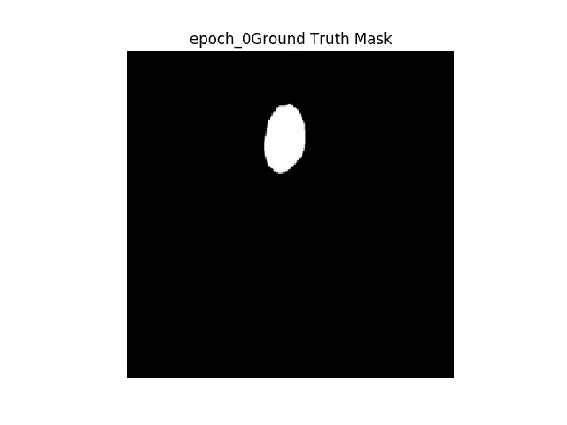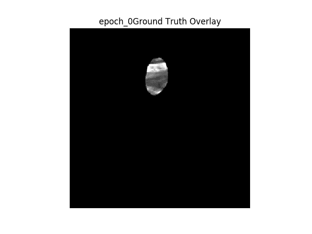

**右图像** →原始图像
**中间图像** →地面真实二值蒙版
**右图像→** 地面真实蒙版覆盖在原始图像之上

与原始论文有一些不同之处，这些不同之处是…..
*1。数据集*:我将使用来自 Kaggle " [超声神经分割](https://www.kaggle.com/c/ultrasound-nerve-segmentation)的分割数据

*2。归一化层/批量大小*:原论文使用[实例归一化](https://arxiv.org/abs/1607.08022)层，然而如下图所示，我将使用[批量归一化](https://arxiv.org/abs/1502.03167)。同样，原始纸张使用的批量大小为 1，我将使用批量大小为 2。

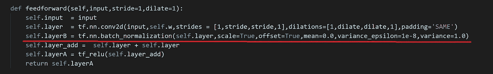

*3。不同数量的特征图:*原论文报道每层使用 32 个特征图，由于硬件限制我只使用 3 个特征图。(因此在连接操作中，我们将有 1 + 3 * 10 = 31 个特征地图)

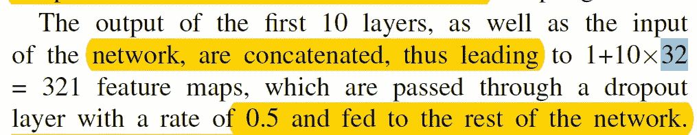

**成绩(原网)**

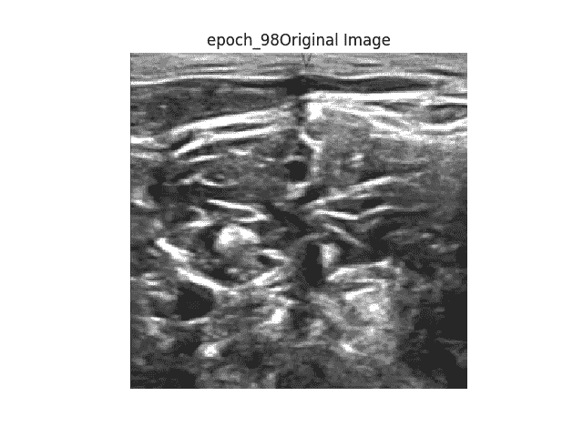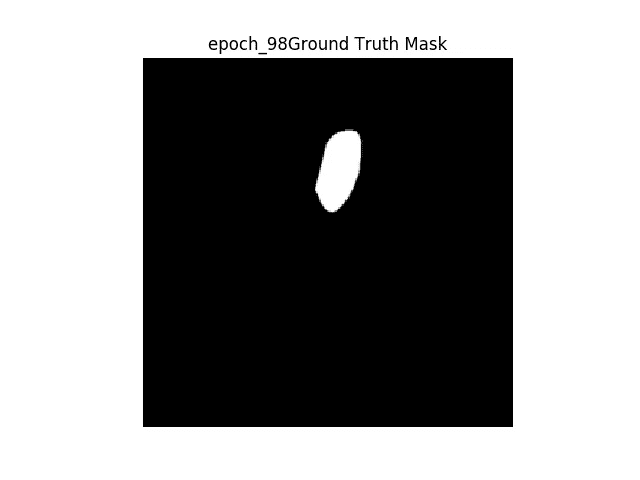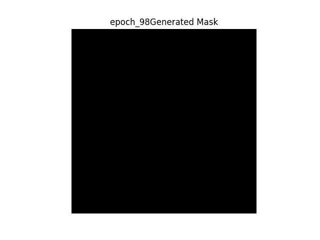

即使我用各种超参数训练原始网络，我也不能得到任何好的结果。生成的蒙版只是一个漆黑的图像。所以我决定对网络做三个改变。

**原网络改造**

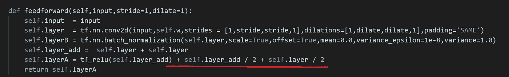

**红线** →每层增加剩余连接

我做的第一个改变是在每一层增加一个额外的剩余连接，以获得更流畅的信息流。

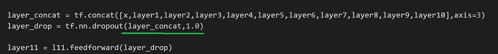

**绿线** →更改辍学率

我改变的第二件事是退学率，我决定不使用退学层。

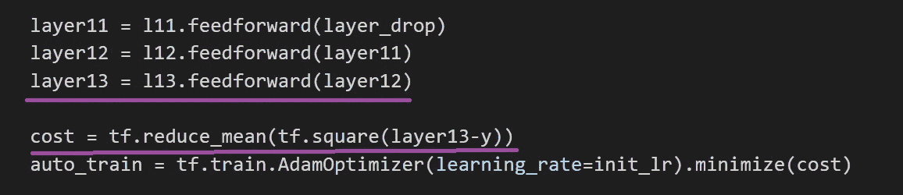

**紫线** →改变成本函数和直接连接

最终的改变是将最终图层直接链接到成本函数，并将成本函数更改为[均方误差函数](https://en.wikipedia.org/wiki/Mean_squared_error)。(本文使用了带交叉熵损失函数的 [softmax。](http://peterroelants.github.io/posts/neural_network_implementation_intermezzo02/)

**结果(修改后的网络)**

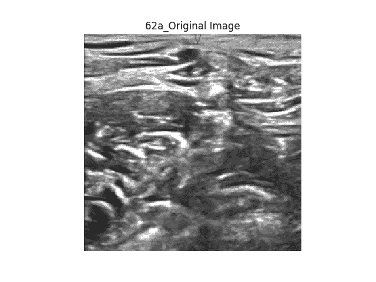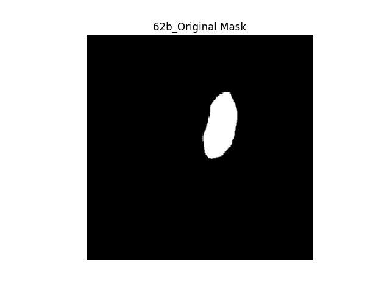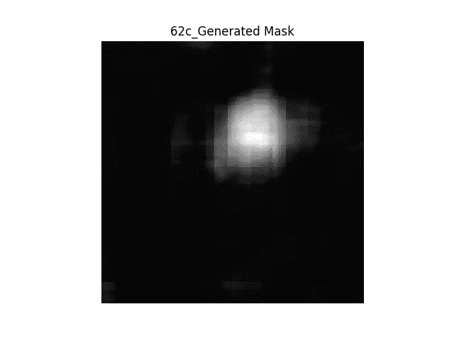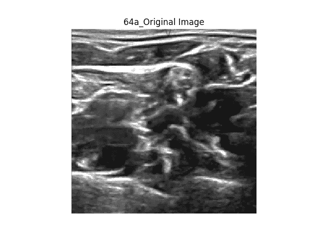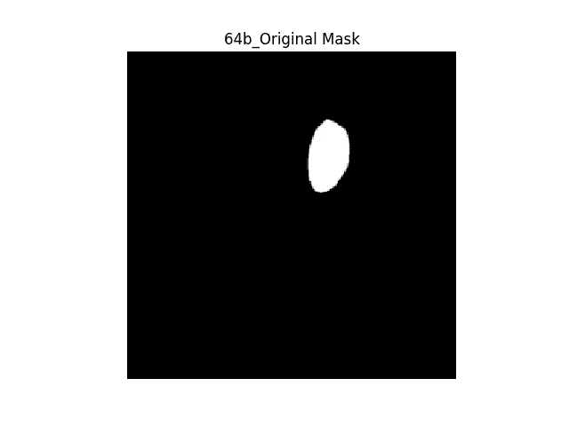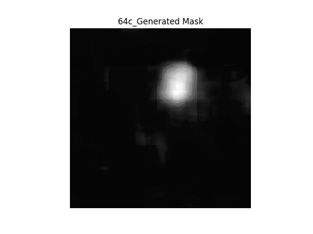

**右图** →原图
**中图** →二进制掩码
**左图** →从网络生成二进制掩码

网络很好地分割了感兴趣的区域。然而，我注意到的一件事是生成的蒙版中出现了看起来像正方形的伪像。众所周知，这种有时被称为棋盘状伪像的现象即使在使用去卷积操作时也会发生，本文对此进行了解释。下面是在原始图像上叠加地面真实蒙版或生成蒙版时的一些图像。

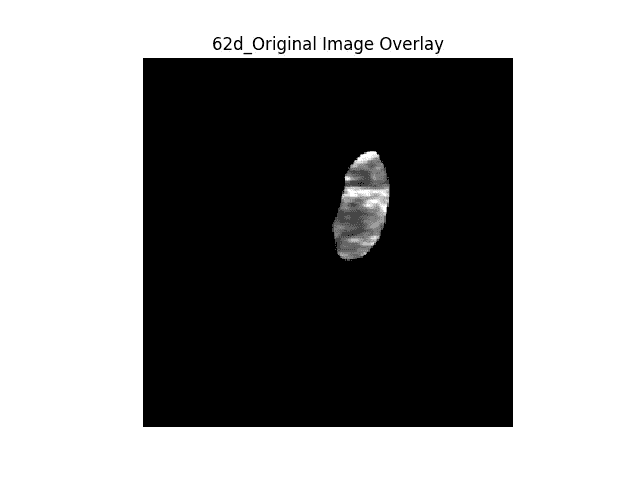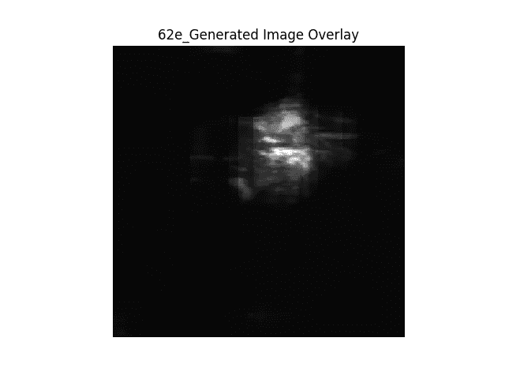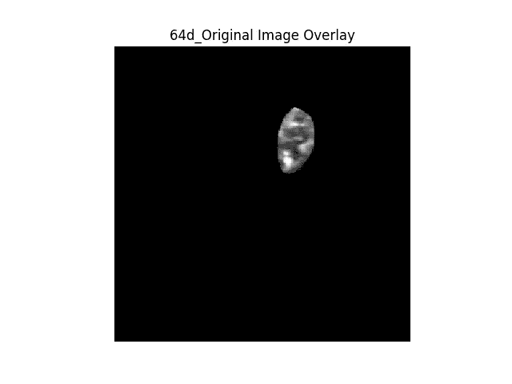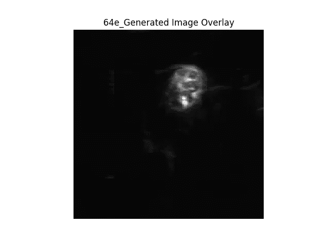

**GIF 格式的结果**

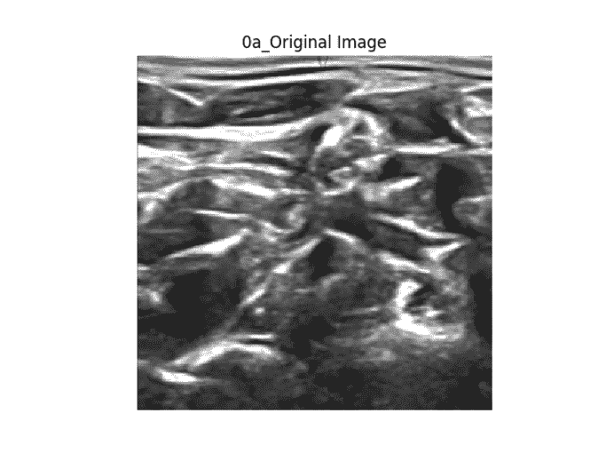

**显示图像的顺序** → 1。原图→ 2。地面真实二进制掩码→ 3。生成的二进制掩码→ 4。原始图像上的地面真实遮罩叠加→ 5。原始图像上生成的蒙版覆盖。

以上是我根据分割结果制作的 GIF，请注意观看 GIF 的顺序，以下是网络如何加班的汇编。随着训练的持续(从历元来看),我们可以看到生成的掩模变得更加精确，但是我们可以看到棋盘伪影总是存在。

**互动代码/透明度**

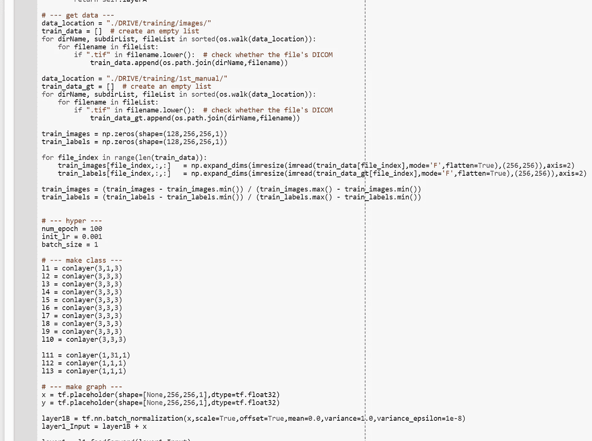

对于 Google Colab，你需要一个 Google 帐户来查看代码，而且你不能在 Google Colab 中运行只读脚本，所以在你的操场上复制一份。最后，我永远不会请求允许访问你在 Google Drive 上的文件，仅供参考。编码快乐！

要访问[原始型号的代码，请点击此处](https://colab.research.google.com/drive/1Y2CGAH0HLY4ryL90qwDXUHtDbnWcMad4)。
要访问[改装车型的代码，请点击此处](https://colab.research.google.com/drive/17OymGjjJ0GgClVj5SjZRRNW5qs_gQTXu)。

*   *注**:我不想在 github 上托管 Kaggles 的数据，因为我可能会违反他们的数据使用政策。所以这段代码不能直接在线运行。
*   为了让这个实验更加透明，我上传了我所有的命令输出到我的 github，如果你想看的话，请点击这里。

**最后的话**

我实现的原始网络要复杂得多。它甚至有 4D SoftMax 层。([点击这里](https://github.com/intact-project/LungNet/blob/master/custom_layers.py)如果你想查看 4D 软最大层。).他们在分割肺部区域方面做得非常出色。

如果发现任何错误，请发电子邮件到 jae.duk.seo@gmail.com 给我，如果你想看我所有写作的列表，请[在这里查看我的网站](https://jaedukseo.me/)。

同时，在我的 twitter [这里](https://twitter.com/JaeDukSeo)关注我，并访问[我的网站](https://jaedukseo.me/)，或我的 [Youtube 频道](https://www.youtube.com/c/JaeDukSeo)了解更多内容。如果你感兴趣的话，我还做了解耦神经网络的比较。

**参考**

1.  完整的-项目/LungNet。(2018).GitHub。于 2018 年 4 月 3 日检索，来自[https://github.com/intact-project/LungNet](https://github.com/intact-project/LungNet)
2.  Anthimopoulos，m .，Christodoulidis，s .，Ebner，l .，Geiser，t .，Christe，a .，和 Mougiakakou，S. (2018 年)。基于扩展全卷积网络的病理肺组织语义分割。arXiv 预印本 arXiv:1803.06167。
3.  超声波神经分割| Kaggle。(2018).Kaggle.com。2018 年 4 月 3 日检索，来自[https://www.kaggle.com/c/ultrasound-nerve-segmentation](https://www.kaggle.com/c/ultrasound-nerve-segmentation)
4.  Ioffe，s .，& Szegedy，C. (2015 年)。批量标准化:通过减少内部协变量转移加速深度网络训练。Arxiv.org。2018 年 4 月 3 日检索，来自[https://arxiv.org/abs/1502.03167](https://arxiv.org/abs/1502.03167)
5.  Ulyanov，d .，Vedaldi，a .，和 Lempitsky，V. (2016 年)。实例规范化:快速风格化缺少的要素。Arxiv.org。检索于 2018 年 4 月 3 日，来自[https://arxiv.org/abs/1607.08022](https://arxiv.org/abs/1607.08022)
6.  均方差。(2018).En.wikipedia.org。检索于 2018 年 4 月 3 日，来自 https://en.wikipedia.org/wiki/Mean_squared_error
7.  奥登纳，a .，杜穆林，v .，和奥拉，C. (2016 年)。去卷积和棋盘伪影。蒸馏，1(10)。doi:10.23915/蒸馏水
8.  Roelants，P. (2018 年)。彼得的笔记。peterroelants . github . io . 2018 年 4 月 3 日检索，来自[http://peterroelants . github . io/posts/neural _ network _ implementation _ intermezzo 02/](http://peterroelants.github.io/posts/neural_network_implementation_intermezzo02/)