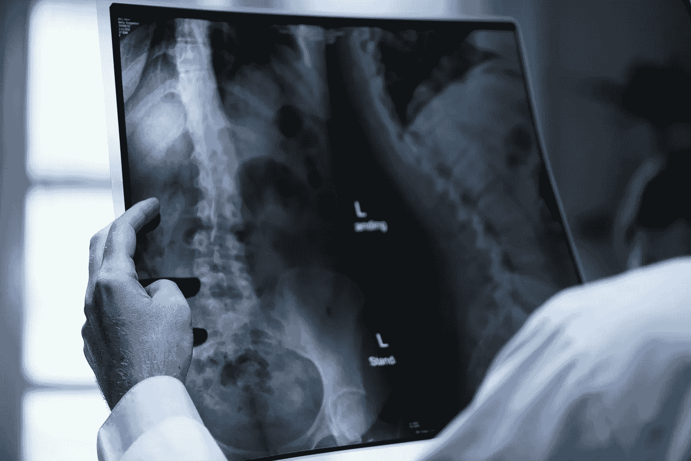
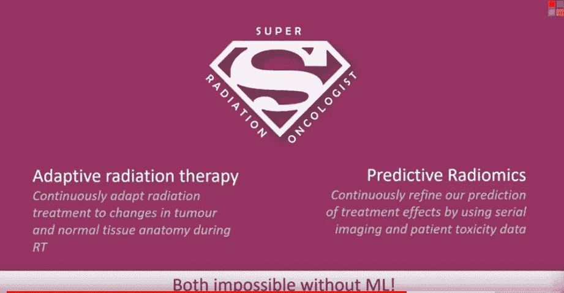
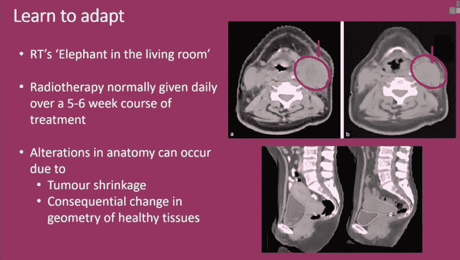
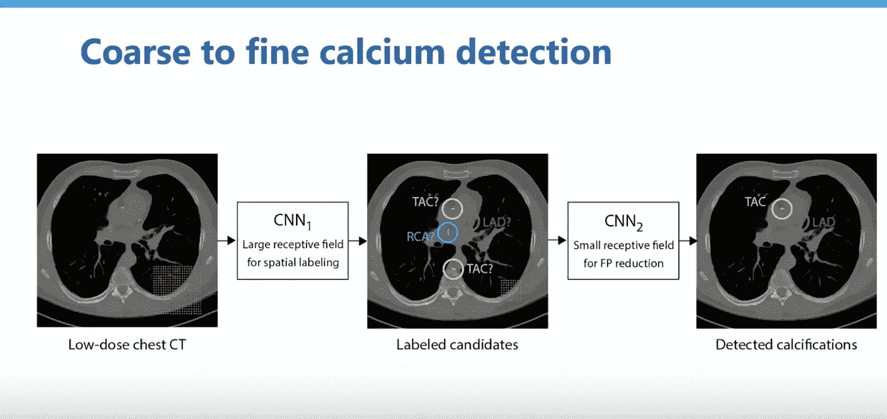
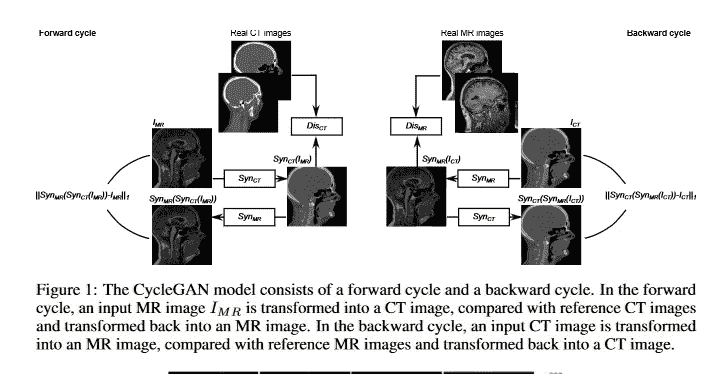
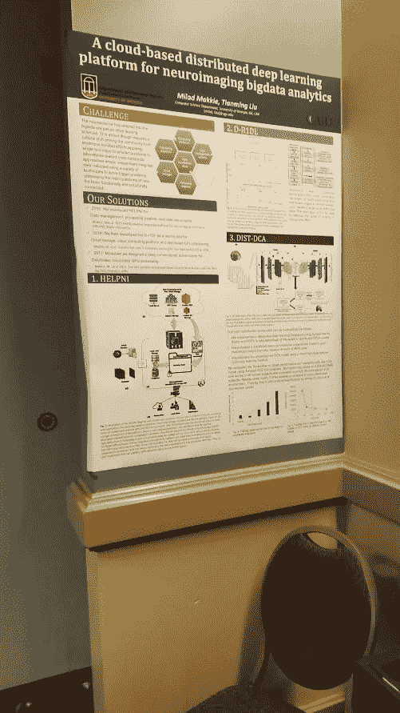

# 医学影像遭遇 NIPS:综述

> 原文：<https://towardsdatascience.com/medical-imaging-meets-nips-a-summary-43bf1b0d0c62?source=collection_archive---------6----------------------->

今年，我参加了[医学成像与 NIPs](https://sites.google.com/view/med-nips-2017) 研讨会，并展示了一张海报。该研讨会的重点是汇集来自医学成像和机器学习社区的专业人士。总共有十一个讲座和两个海报会议。在这里，我将回顾研讨会的一些亮点。演讲和海报通常讨论分割、分类和/或图像重建。

## **分割**

在参加这个研讨会之前，我必须承认我没有完全理解图像分割的价值。我的思维过程一直是这样的:为什么你只想勾勒出一幅图像中的某样东西，而不想对它进行分类？这个研讨会改变了我对细分价值的看法。

**放射疗法**

剑桥大学放射学家、微软研究员 Raj Jena 做了一个关于“[像素完美主义——机器学习和适应性放射治疗](https://www.youtube.com/watch?v=mxpkWxz3WFM)的演讲。在演讲中，他描述了机器学习如何帮助提供更好的治疗方法和优化工作流程。为了使患者接受适当的放射治疗，精确定位肿瘤的确切边界是很重要的。通过定位肿瘤和健康组织之间的精确边界，治疗可以提供更多的辐射，因为损伤健康组织的风险更小。然而，目前分割是由放射科医生手动完成的。这通常会导致不同放射科医生之间的差异，从而显著影响治疗结果。一致性在衡量与放射联合使用的药物的有效性方面也很重要，因为如果患者接受的放射不同，几乎不可能判断是药物还是更好的放射导致了改善。

机器学习提供了提供一致性和更准确分割的机会。其次，机器学习模型通常可以在几秒钟内运行，而放射科医生通常需要几个小时来手动分割图像。这些时间可以更好地用于规划治疗过程或看更多的病人。Jena 还描述了机器学习如何让他成为一名“超级放射肿瘤学家”

[Slide from Jena’s talk](https://youtu.be/mxpkWxz3WFM?t=17m18s). The “Super Radiation Oncologist” uses machine learning to constantly adapt therapy and predict effects of treatment.

[Slide from Jena’s talk](https://youtu.be/mxpkWxz3WFM?t=17m18s). Details adaptive radiation therapy.

ML 可以使肿瘤学家更好地使治疗适应健康组织的形状和大小的变化，并帮助肿瘤学家预测放射治疗可能的不利影响。例如，Jena 描述了他如何使用高斯过程等简单方法来预测辐射的潜在副作用。

这是整个研讨会中我最喜欢的演讲之一，我强烈建议大家看看 Jena 的[完整报告](https://www.youtube.com/watch?v=mxpkWxz3WFM)。

**构建质量数据集**

整个研讨会的一个共同主题是注释的质量和建立良好的医学成像数据集的困难。在分段任务中尤其如此，在这种任务中，模型只能和它的注释器一样好，而注释器本身必须是熟练的放射科医生。

加速注释过程的一种可能方式是通过主动学习。IBM 的 Tanveer Syeda-Mahmood 在讨论 IBM 在放射学方面的工作时简单地提到了这一点。对于主动学习，可以从一个小的带标签的数据集和几个专业的人类注释者开始。ML 算法很好地学习训练集，使得它可以自己注释简单的图像，而专家注释硬边缘情况。具体而言，分类器得分低于确定性阈值的图像随后被发送给人类进行人工注释。其中一张海报[(Girro 等人)还讨论了使用主动学习](https://www.doc.ic.ac.uk/~bglocker/public/mednips2017/med-nips_2017_paper_16.pdf)来帮助有效地训练语义图像分割网络。

主动学习可以解决部分问题，但不能完全解决质量问题。核心问题是，当连专家都不同意界限时，研究人员如何开发准确的数据集。关于这一点，Bjorne Menze 介绍了 [BraTS 数据集](http://braintumorsegmentation.org)的构建。BraTS 数据集是最大的脑成像数据集之一。他融合了来自几个不同注释者的数据，以创建“基础事实”自成立以来，BraTS 已经举办了几次不同的挑战。挑战之一是用机器学习算法分割所有肿瘤，最近的挑战集中在预测总生存期上。

## 定位、检测和分类

对医学图像中发现的疾病进行准确分类是研讨会的一个突出主题。在医学成像中，检测对象/ROI 并对其进行准确分类是一项具有挑战性的任务。这在很大程度上是由于医学图像(即，X 射线 MRI、CT、超声和声谱图)的各种形态(和维度)、图像的大小以及(与分割一样)有限的注释(有时是低质量的)训练数据。因此，演讲者展示了各种有趣的技术来克服这些障碍。

Ivana Igsum 讨论了心脏成像中的深度学习技术。特别是，她描述了自己在精确检测动脉钙化方面的工作。她描述了她和她的团队如何开发出自动计算钙含量并对心血管疾病风险进行分类的方法。为此，她的团队使用了多层 CNN 方法。

Slide from [Ivana’s talk](https://www.youtube.com/watch?v=xINIvnJDpy8&t=361s) (5:46)

当天晚些时候，Yaroslav Nikulin 介绍了数字乳腺摄影挑战赛的获奖方法。

**海报**

芝加哥大学的 Natalia Antropova，Benjamin Huynh 和 Maryellen Giger 有一张关于使用 LSTM 进行乳腺 DCI-MRI 分类的有趣海报。这包括在应用对比染料后输入多个时间步骤的 3d MRI 图像。然后，他们使用 CNN 从这些图像中提取特征，并将其传送给 LSTM，输出一个预测。总之，这张海报提供了一个 LSTM(和 CNN)处理“4d”医学成像数据的有趣应用。

我的海报重点介绍了我目前正在进行的工作，即使用物体探测器对胸部 X 射线中的多种情况进行精确定位和分类。我的主要目标是研究对象检测算法在有限数据集上的表现，而不是在整个数据集上训练的多标签分类 CNN。我认为，如果配置和训练得当，对象检测器在医学图像中定位和分类疾病/状况方面有很大潜力，但是它们受到缺乏标记包围盒数据的限制，这也是我觉得下面的海报非常有趣的原因之一。

Hiba Chougrad 和 Hamid Zouaki 有一张关于乳腺成像分类的迁移学习的有趣海报。在摘要[用于乳腺癌筛查的卷积神经网络:指数衰减的迁移学习中，](https://www.google.com/url?q=https%3A%2F%2Fwww.doc.ic.ac.uk%2F~bglocker%2Fpublic%2Fmednips2017%2Fmed-nips_2017_paper_20.pdf&sa=D&sntz=1&usg=AFQjCNH5eFBxG1TGwYBU4o_FY0BASvMrzg)他们描述了测试几种不同的迁移学习方法。例如，他们比较了微调和利用在 imagenet 上预先训练的 CNN 与随机初始化权重。最后，他们发现最佳技术是使用指数衰减学习率来微调各层。因此，对于底层(即最接近 softmax 的层)，学习速率最高，而对于上层，学习速率最低。这在直觉上很有意义，因为底层倾向于学习最相关的数据集特征。通过使用这些和相关技术，我们可以(有希望)在没有大型数据集的情况下开发精确的模型。

## 重建和生成

**心流**

我通常不会对那些吹捧他们的产品有多棒以及它将如何“革新[插入行业]”的产业宣传印象深刻不过 Heartflow 和他们的 DeepLumen 血管分割算法绝对让我印象深刻。该产品减少了 83%的不必要的血管造影，并获得 FDA 批准。我不会在这里深入讨论细节，但我认为 Heartflow 是机器学习在现实世界环境中产生影响的一个很好的例子。

其他两位演讲者也谈到了重建问题。Igsum 的演讲(前面提到过)讨论了一种从低剂量 CT 构建常规 CT 的方法。帝国理工学院的 Daniel Rueckert 描述了基于 ML 的重建如何在成像中启用更多的时间戳。

## 海报

我发现其中一个特别有趣的海报是[使用循环一致生成对抗网络的 MR-to-CT 合成](https://www.google.com/url?q=https%3A%2F%2Fwww.doc.ic.ac.uk%2F~bglocker%2Fpublic%2Fmednips2017%2Fmed-nips_2017_paper_8.pdf&sa=D&sntz=1&usg=AFQjCNGau_K5xpWTfdsN07DcebSF12O0FA)。在这项工作中，作者(Wolterink 等人)采用了流行的 CycleGAN 算法，并将其用于将 MRI 图像转换为 CT 图像。这是一个潜在的非常有用的应用，可以避免患者必须进行多次成像过程。此外，CT 使患者暴露在辐射中，因此这也有可能减少辐射暴露。

[Image from MR-to-CT synthesis article](https://www.doc.ic.ac.uk/~bglocker/public/mednips2017/med-nips_2017_paper_8.pdf)

还有一张由 Virdi 等人制作的海报，主题是来自双生成对抗网络的[合成医学图像](https://www.google.com/url?q=https%3A%2F%2Fwww.doc.ic.ac.uk%2F~bglocker%2Fpublic%2Fmednips2017%2Fmed-nips_2017_paper_5.pdf&sa=D&sntz=1&usg=AFQjCNHxoPhqg84PlR7-yEQA7kF3rwblmw)，以及 Mardani 等人制作的海报，主题是[用于压缩感知的深度生成对抗网络(GANCS)自动核磁共振成像](https://www.google.com/url?q=https%3A%2F%2Fwww.doc.ic.ac.uk%2F~bglocker%2Fpublic%2Fmednips2017%2Fmed-nips_2017_paper_7.pdf&sa=D&sntz=1&usg=AFQjCNGZiEcA16KyZfV98Mo-FGCPbQ5p7A)。

## 工具和平台

几位发言者谈到了旨在使临床医生和 ML 研究人员更容易利用机器学习进行医学图像分析的新工具。Jorge Cardoso 描述了 NiftyNet 以及它如何使研究人员更容易地开发医学成像模型。NiftyNet 建立在 Tensorflow 之上，它包括许多简单易用的模块来加载高维输入。

Poster from Makkie et al. on their neuroimaging platform

同样在工具方面，G. Varoquax 在 [NILearn，](http://nilearn.github.io)上展示了一个基于 scikit-learn 构建的用于神经成像数据的 Python 模块。正如 scikit-learn 寻求使具有基本编程技能的人能够使用 ML 一样，NILearn 的目标是在脑成像方面做同样的事情。唯一与系统相关的海报来自佐治亚大学的 Makkie 和刘。它专注于他们的大脑倡议平台，用于神经成像，以及它如何融合几种不同的技术，包括 Spark，AWS 和 Tensorflow。最后， [DLTK 工具包在大会上有了自己的海报](https://www.doc.ic.ac.uk/~bglocker/public/mednips2017/med-nips_2017_paper_15.pdf)。总之，有一些非常有趣的工具包和平台，应该有助于让每个人都更容易使用机器学习进行医学图像分析。

## 其他会谈

Wiro Nessen 在 T4 做了一个关于生物医学成像和基因数据融合的有趣演讲。在演讲中，他描述了如何将大型基因和成像数据集结合起来，试图检测图像中的生物标记。这两个领域的综合也有助于早期发现疾病，并找出更有针对性的治疗方法。

## 公告

*   在她的演讲结束时，Ivana Igsum 宣布第一届[医学成像深度学习或 MIDL](https://midl.amsterdam/) 活动将于 7 月在阿姆斯特丹举行。
*   我不断地在我的[机器学习医疗保健策划列表中添加新的论文、会议和工具。然而，这是一个大工程，所以今天就做一个公关并做出贡献吧！](https://github.com/isaacmg/healthcare_ml)
*   我正在开办一个新的 [Slack 频道](https://join.slack.com/t/curativeai/shared_invite/enQtMjk1MTI0MDI4NzEwLTI1M2YyMThlNzA3Y2RlN2IxOTJmMTllNWZlOGI5MTg1NjcwYjY2NGUzZTE2OTNhYThlZDZlZDBkM2E3NGUyODU)，致力于医疗保健领域的机器学习。所以如果你感兴趣，请随时加入。
*   我对 NIPs 的医疗保健机器学习或 ML4H 的总结将在未来几周内发表。这将涵盖从医院运营(如 LOS 预测和手部卫生)，到挖掘电子医疗记录，到药物研发，再到分析基因组数据的方方面面。敬请关注。

一如既往地欢迎评论和提问。