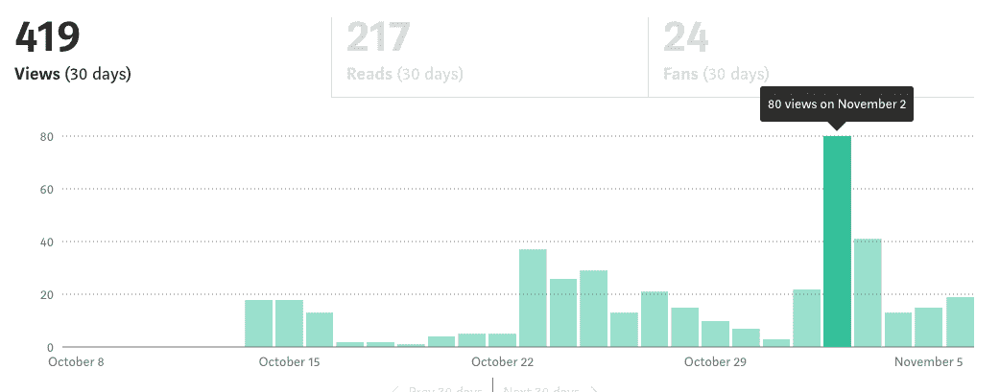
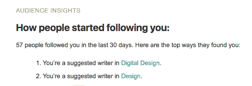

# 媒体分析:愿望清单

> 原文：<https://towardsdatascience.com/medium-analytics-a-wishlist-39120a8c27e9?source=collection_archive---------5----------------------->

慷慨地说，中等分析是简朴的。无论你是个人作家还是出版物，他们给你的信息很少，比如谁看过你的帖子，以及为什么他们成功或不成功。

作为一名作家和编辑，这降低了我对平台的忠诚度。我可以看到这样的事情:

Two weeks after publishing, a sudden 4x in daily views…

但是媒体让我无法发现为什么会这样，谁感兴趣，或者下次我能做些什么来增加我的收视率。我有所有的问题…但没有答案。

中，以下是我的要求:

# 帮我了解我的听众。

不管是关注者还是读者——或者两者都是——我希望我有更多关于谁在阅读我的作品的信息。我对人口统计数据很好奇——年龄、性别、职业——但也对我确信你有的行为统计数据很好奇。我的读者是活跃的媒体用户吗？我是否真的从使用你的平台中获得了动力，或者我只是通过在 LinkedIn 上发布我的文章来满足你的用户群？

我的读者还会读到什么或为之鼓掌吗？我的朋友读我的作品是因为他们喜欢我，还是我真的接触到了设计师和项目经理的观众？

我的读者中有多少是机器人？当我浏览我的出版物的关注者时，我看到一些空的个人资料。很难说这些人是新媒体用户还是推特式的填充者。

# **帮助我了解我在中观宇宙中的等级。**

环顾中型平台——看到一些点击量为 1.5K 的点击诱饵，以及拥有相同数量的经济学人——我很难理解我获得的关注量是赢还是输。我很想知道一个给定的故事相对于它的同行(具有相似的内容标签和阅读时间，或者由拥有相似粉丝数量的作者)表现如何……或者甚至它与我的历史出版作品相比表现如何。

我可以想出我自己的聪明的主题或图像或格式…我不需要看到什么是流行的媒体整体和试图游戏系统。但是我想知道我和我的写作同行相比如何，这样我可以随着时间的推移改进我的策略和风格。

# **告诉我媒体是如何帮助我的。**

当它第一次出现在我的收件箱时，我真的很兴奋:

…同样，当我点击链接却找不到自己，或者找不到关于人们如何出现在这个页面的解释时，我感到失望。由于如此多的媒介是经过策划的，我不知道这些被标记的页面应该告诉我什么。我的作品会呈现给对设计或数字设计感兴趣的人吗？我在设计标签的前一百篇文章中可见吗？Medium 实际上做了什么来将我的作品展示给其他人？

我相信你做了很多——这也是我写这封公开信的部分原因，我希望在你的策展和分享我的作品时有更多的透明度。

期待继续我们的读者-作者-出版商关系…如果你未来的分析项目需要一些测试人员…你知道在哪里可以找到我。