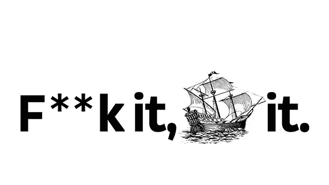

# 中型或:我如何学会停止担心，爱上博客

> 原文：<https://towardsdatascience.com/medium-or-how-i-learned-to-stop-worrying-and-love-the-blog-5d6de7a7a20e?source=collection_archive---------7----------------------->

## 第一个月在介质上写数据文章的经验和收获

Just about every weekend.

我一直想写一个博客，将想法在纸上(或屏幕上)具体化，并钻研短暂的兴趣。

尽管在许多场合，我的文章想法都得到了朋友们的认可，但我发现自己还是陷入了无所作为的状态。

但是后来，[发生了](https://medium.com/@finnqiao/product-vs-product-google-sheets-vs-airtable-386cb38a31fd)。

也许这是一种自信的提升。也许是最近长篇写作的热潮。或者可能是上个月我肩膀脱臼后腾出的时间。

不管怎样，在一个月的时间里，我写了四篇文章，我意识到我是多么享受尝试和写作不同主题的过程。

**这里有 5 个外卖:**

## 1.了解你的受众

> “写信只是为了取悦一个人。如果你打开一扇窗，向世界做爱，可以说，你的故事会得肺炎。”—库尔特·冯内古特

写完我的第一篇文章后，我不断地质疑内容是否太长，或者是否有人对在线电子表格感兴趣。

就在那时，一位朋友给我发来了上述库尔特·冯内古特的名言。

**写给一个人看。**

就像你为产品创建 UX 人物角色一样，也为你的目标读者创建一个。我的第一篇文章相当模糊，没有重点。所以对于我的下一篇关于数据争论的文章，我决定为一个对数据可视化感兴趣的刚毕业的学生写，他刚刚开始研究 Python 的功能和包。他/她也将从一个相对干净的数据集开始，该数据集来自一个著名的来源，如经合组织或世界银行。

通过关注你是为谁而写，文章自然会变得更简洁以迎合读者。反过来，听众也能更好地阐述为他们增加的价值。

## 2.小胜利很重要

> "追踪你的小成就，激发大成就."特蕾莎·阿马比尔

你有没有在完成一个个人项目或达到一个个人目标时，同时感到一阵兴奋和轻松？

每当我完成一篇文章时，同样的浪潮就会席卷我。对于我围绕数据分析项目的作品来说尤其如此。

然而，在我调试代码和写作的几周里，我的热情和动力总是下降。对于一个旷日持久的过程来说，这似乎总是一笔不常见的支出。

所以我把完成一篇文章的大“胜利”分解成代表小胜利的多个检查点。它可以像“完成介绍”或“调整正确的数据集”一样精细。

一个接一个的小胜利让我在整个写作过程中都沉浸在微量多巴胺的刺激中。更重要的是，通过积累小胜，我设法**建立势头，坚持一个常规，**并打破惯性的错觉。

又及——猫迷因的每一次机会都是一次小小的胜利。

## 3.抽时间

> “忙是一种选择。”—安·沃斯坎普

我一直用来证明拖延写作的借口是我很忙，没有时间。我工作很忙。我正忙着建立关系网。我在健身房很忙。

我逐渐意识到，你选择在某些事情上忙碌是因为它们对你很重要，你把它们看得比其他事情更重要。

从“我在做多少不同的事情？”到“我在做多少不同的事情”,这需要重新定义我的优先事项。到“对我来说什么是重要的？”这让我致力于我的第一篇文章。学习掌握新的想法，清楚地表达自己，澄清我的想法，并参与讨论对我来说很重要，这些都是我可以通过写作解决的问题。

所以我优先考虑。我挤出了时间。早餐前的几个小时，午餐后的工作间隙，以及回家的公交车都成了制作内容的宝贵时间。

## 4.只是运送它

> “做得比完美更好”——未知

你总是会回头看一篇发表的文章，看到一些可以改进的地方。

一直都是。

这并不是说任何草稿都应该不经过校对就发表。然而，到了一定程度，担心内容是否足够好或足够容易理解是一种毫无意义的练习。

在撰写一篇关于 P2P 贷款的[数据文章时，我确实有这种感觉。这个模型可以有更多的变量。我可以包含更多的外部数据集。我本可以通过特征工程制造出更多的变量。](/p2p-lending-for-home-flippers-and-minorities-ed9aba6da4cb)

一天结束时，我想到了三个问题:

1.  鉴于个人限制(时间、技能水平等)，我是否尽了最大努力？)?
2.  这是我的一个观众会觉得有价值的东西吗？
3.  我从写这篇文章中学到了什么吗？

三票通过。它上升了。

## 5.准备好惊喜吧

> “生活中几乎所有美好的事情都是我意想不到的，没有计划的。”—卡尔·桑德堡

作为一名新作家，我预计每天会有 10-20 次浏览，主要是朋友和我父亲的重复访问。

想象一下我的反应，一周后检查统计数据，看到总阅读数在一小时内翻了五倍。老实说，这主要是混乱，夹杂着些许惊讶和兴奋。

几天后，我的 CTO 转向我，说“嘿，这不是你在 Python 周刊上发表的文章吗？”。

对于一个写作和编码的新手来说，正是像这样的时刻和随后感谢我写这篇文章的信息提醒了我为什么要在 Medium 上写作。

如果你对出版犹豫不决，因为你怀疑你能提供什么或者你有多少时间来写作，我希望这篇文章能鼓励你迈出这一步。

感谢阅读！