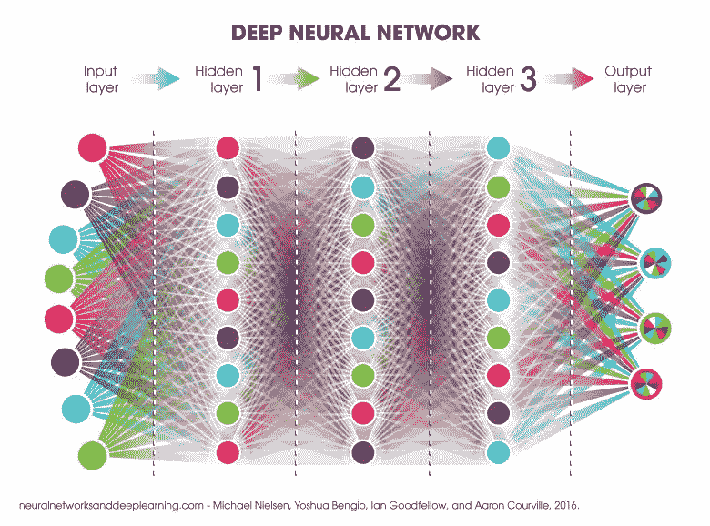
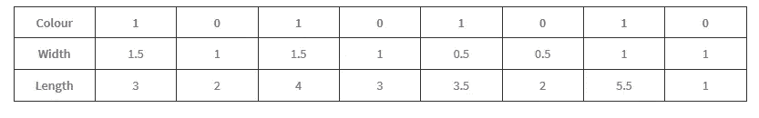
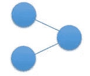
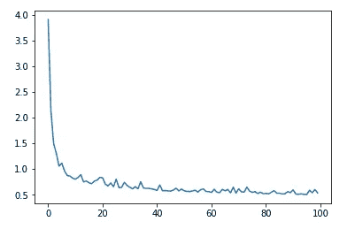

# 认识人工神经网络

> 原文：<https://towardsdatascience.com/meet-artificial-neural-networks-ae5939b1dd3a?source=collection_archive---------4----------------------->

[http://www.extremetech.com/wp-content/uploads/2015/07/neural-net-head.jpg](http://www.extremetech.com/wp-content/uploads/2015/07/neural-net-head.jpg)

当听到“神经”这个词时，我首先想到的是大脑中的神经元，这是决策过程的一部分。

这是人类区别于机器人(或常规计算机程序)的主要特征之一。人类可以看到事物，分析它们，并从中学习，以便下次做得更好。

另一方面，常规程序遵循同样的一套指令，它们不会发展自己。我们可以通过编程让它们完成特定的任务，根据它们被编程的方式，我们可以得到一个好的结果。

但是如果我们能让程序学习，我们可以做很多事情。然后他们会随着时间发展自己。这被称为“机器学习”，人工神经网络(ANN)是一种用于机器学习的计算模型，其工作方式类似于生物神经元。

当信息流经神经网络时，它会感知它们，并通过调整网络来学习，以生成一个好的解决方案。通过网络传递尽可能多的数据可以获得更准确的结果。这被称为对神经网络的**训练**。

在使用神经网络之前，我们需要对其进行训练和调整，以便做出正确的决策。为此，我们使用测试数据。它们由网络的输入和相应的预期输出组成。通过适当地喂养它们，我们可以教会网络，然后我们可以用它来对未知数据做出决定。

基本上，人工神经网络用于非线性统计数据建模，其中输入和输出之间存在复杂的关系。训练过程用于发现数据集中的复杂关系和模式。

> **人工神经网络**(**ann**)或[**connectionist**](https://en.wikipedia.org/wiki/Connectionism)**系统**是受构成动物大脑的[生物神经网络](https://en.wikipedia.org/wiki/Biological_neural_network)启发的计算系统。这种系统通过考虑例子来学习任务(逐步提高性能),通常不需要特定任务的编程——维基百科

在需要基于计算机的预测的地方，神经网络是非常常见的。通常，他们能够做出准确的预测。一些应用是股票市场趋势预测、手写识别、语音识别、滑坡预测等。此外，像脸书这样的社交媒体，像谷歌这样的搜索引擎也利用这些来提供丰富的用户体验。

存在许多类型的神经网络。

*   前馈
*   复发的
*   监管反馈
*   径向基
*   等等…

“前馈”网络是第一种也是最简单的类型。在这种类型中，数据从输入层传输到隐藏层，最后传输到输出层。没有数据传输的周期或循环。

Neural Network with multiple layers ([https://blog.ttro.com/wp-content/uploads/2017/01/TB010-Deep-Neural-Network.jpg](https://blog.ttro.com/wp-content/uploads/2017/01/TB010-Deep-Neural-Network.jpg))

另一方面，在“循环”网络中，数据向前和向后传播。递归网络输出也用作输入，当预测序列时，使用这种方法。

下面是我在 YouTube([https://www.youtube.com/watch?v=ZzWaow1Rvho](https://www.youtube.com/watch?v=ZzWaow1Rvho))上找到的一个简单的例子，这个例子非常有助于理解这个概念。有红色和蓝色两种花，我们已经给出了一些关于它们的宽度和长度的样本数据。需要使用这些给定的数据，并预测未知花朵的颜色。

Testing Data

这里我们将使用一个前馈神经网络来预测正确的花。我们将使用 Python 和 Numpy 库来实现。你可以通过安装“迷你康达”(【https://conda.io/miniconda.html】T2)来设置这些

我们简单的神经网络有 2 个输入，即花瓣长度和宽度，输出为 0 或 1，表示红色或蓝色。

Our simple neural network

由于网络的最终输出是 0 或 1，我们在这里使用一个特殊的函数，称为“ **Sigmoid** ，它将任何值压缩到 0，1 的范围内。基于它与 0 或 1 的接近程度，我们进行预测。

> **S 形函数**是具有“S”形曲线的数学函数(**S 形曲线**)。通常， *sigmoid 函数*是指[逻辑函数](https://ipfs.io/ipfs/QmXoypizjW3WknFiJnKLwHCnL72vedxjQkDDP1mXWo6uco/wiki/Logistic_function.html)的特例

Sigmoid function ([https://qph.ec.quoracdn.net/main-qimg-05edc1873d0103e36064862a45566dba](https://qph.ec.quoracdn.net/main-qimg-05edc1873d0103e36064862a45566dba))

我们试图通过 **w1 *长度+ w2 *宽度+ b** 对给定数据进行建模，其中 w1、w2 是两个权重，b 是一个偏差。这可用于发现数据中的任何非线性关系。

最初，我们将随机数分配给 w1、w2 和 b，在训练过程中，我们更改这些值，以使模型代表给定的测试数据。这是通过使用期望值和预测值来计算成本值，并尝试使用基本微积分理论来减少成本值来实现的。在训练过程的最后，我们将能够得到一个准确的模型，并且我们将能够使用它来预测未知的数据。

Sample source code

在本例中，我们所做的是，使用链式法则分别对 w1、w2 和 b 的成本函数进行微分，并找到使成本最小的常数。由于这是一个简单的微分手动进行。然而，有一些库可以自动完成这些任务。最后，他们找到了神秘的花的类型。

下图显示了培训结束后成本是如何降低的。它一步一步地减少，以作出更准确的预测。

Cost variation while learning

正如我之前说的，这个例子摘自一个很棒的 YouTube 系列，要了解更多信息，我强烈推荐你去看看这个！([https://www.youtube.com/watch?v=ZzWaow1Rvho](https://www.youtube.com/watch?v=ZzWaow1Rvho%20)

感谢阅读。

干杯！