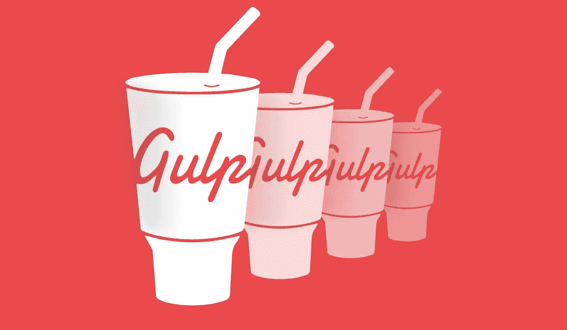
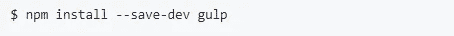
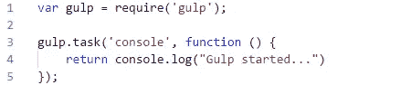
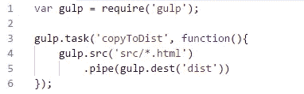
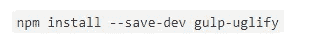
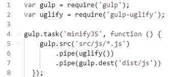
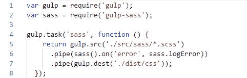
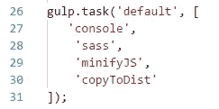
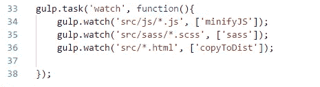

# 见见你的新朋友“大口”

> 原文：<https://towardsdatascience.com/meet-your-new-friend-gulp-b1f991a95616?source=collection_archive---------6----------------------->

# 什么是吞咽？

在开发应用程序时，你是否厌倦了重复做同样的事情？当我刚接触 JavaScript 框架的时候，我不得不做的最烦人的事情就是当一个改变完成时，一次又一次地重启服务器。后来我顺便找到了**【Nodemon】**；)

嗯，吞咽是解决这个问题的方法。不仅仅是因为这个。一饮而尽解决**的重复问题。**开发人员需要反复做的大多数任务都可以通过自动化来简化。因此，Gulp 可以被认为是一个 JavaScript 任务运行器，它可以让开发人员自动完成某些任务。

> GULP 是一个工具包，用于自动化开发工作流程中痛苦或耗时的任务

示例任务:

1.  更改文件时刷新浏览器
2.  缩小 JavaScript
3.  将 SASS/LESS 编译成 CSS
4.  单元测试
5.  将源代码部署到输出目录(例如:dist 文件夹)

Gulp 非常容易学习，使用它很有趣。你需要知道 Gulp API 中的 4 个基本函数。

*   **gulp.task —** 用于定义一个新的 gulp 任务
*   **gulp.src —** 用于指向任务的输入文件所在的位置
*   **gulp.dest —** 用于指出输出文件需要写入的位置
*   **gulp.watch —** 用于制作 gulp 来观察文件的变化

不要对这些感到困惑。我会引导你了解每一个人，最终你会完全理解他们。

你需要明白的另一件事是**管**在大口喝。有时候你需要在一项任务中做不止一件事。例如，您可能需要将几个 JavaScript 文件连接成一个文件并缩小它。在这种情况下，管道就派上了用场。使用管道，您可以通过利用流来链接多个任务。在上面的例子中，你需要链接连接和缩小。这些你在玩的时候会更清楚。

让我们动手做一些简单的例子来理解 Gulp 是如何工作的。

# 简单的吞咽例子

## 1.设置环境

首先，你需要在你的电脑上安装 **node.js** ，如果你没有，从[这里](https://nodejs.org/en/)安装。

这些例子将是完全跨平台的，你不需要担心你的平台。

准备好之后，使用命令全局安装 Gulp，

然后通过运行常规命令 **npm init** 初始化一个节点项目

导航到您的项目目录，并作为开发依赖项在本地安装 gulp

## 2.你的第一个任务是吞咽

现在在项目的根级别创建`gulpfile.js`。我们需要运行的所有任务都将包含在这个文件中。

注意，这个名字**“gulpfile . js”**是必不可少的，因为这个名字是用来检测文件的。否则，您将得到一个错误，指示 gulpfile 未找到。

现在让我们创建我们的第一个吞咽任务。在此任务中，我们将简单地创建一个控制台日志。

如果您熟悉 node.js，这里的一切都应该很清楚，因为它是不言自明的。首先，我们导入 gulp，因为我们正在创建一个新任务，所以使用了 gulp.task 函数。这里我们需要传递两个参数。首先是任务的名称，然后是定义任务的函数，包括应该执行什么。

要执行任务，在终端运行**大口控制台**。在命令中，需要执行的任务名称应该跟在 gulp 后面。

如果你的任务名是**‘default’**，只要在终端执行 gulp 就可以运行。这被称为大口执行**默认任务**。

## 3.将源文件复制到输出文件夹

现在让我们做一点更有用的工作。在将应用程序部署到服务器之前，我们需要将所有内容复制到输出目录中。

让我们创建一个 **src** 目录，并在那里添加一个基本的 HTML 文件。在部署我们非常简单的应用程序之前，我们需要将其复制到 dist 文件夹中。让我们用吞咽来做它。

在这个新任务中，我们需要告诉 gulp 输入文件的位置和复制位置。为了做到这一点，我们使用了 **gulp.src** 和 **gulp.dest.** 这里我们指向 src 目录中的所有 HTML 文件。

注意，我们在这里使用管道，因为我们处理从输入源读取和写入目的地。

像我们之前使用命令 **gulp copyToDist** 一样运行任务。您会注意到，将创建一个 dist 文件夹，其中包含 src 目录中的 HTML 文件。

## 4.缩小 JavaScript 文件

当缩小一个 JavaScript 文件时，所有的空格都将被删除，包括注释，以使文件更轻量级。

要做到这一点，我们需要安装另一个叫做“吞咽丑陋”的依赖项。首先，使用下面的命令安装它。

然后，在 **src** 目录下创建一个 **js** 目录，并添加一个包含一些控制台日志命令的 JavaScript 文件，这些命令由空格和一些注释分隔。现在让我们缩小它，并将其添加到 js 下的 dist 目录中。

这里的一切应该是不言自明的。 **uglify()** 函数来自我们的新依赖项。您将看到 dist 目录中的新 JavaScript 文件通过删除所有空格和注释而被缩小。

## 5.将 SASS 编译为 CSS

允许你使用 CSS 中不存在的特性，比如变量、嵌套、继承等等。我们可以使用 gulp 将 SASS 编译成 CSS，方法是安装另一个依赖项，就像我们在前面的任务中所做的那样。

这次是**【大口-萨斯】**。首先从下面的命令安装它。

与前面类似，在包含 sass 文件的 **src** 目录中创建一个 **sass** 目录。让我们编译它并添加到 **dist 中的 **css** 目录中。**

你看，这里没有什么神奇的。我们使用管道，因为我们需要链接所有的东西。 **sass()** 函数会将 sass 编译成 css，并添加了以下部分来处理错误。如果您感到困惑，请遵循 gulp-sass 文档[这里的](https://www.npmjs.com/package/gulp-sass)。

## 6.将所有内容合并到一个命令中

起初，我告诉你 gulp 是为了简化重复。但是如果我们使用单独的命令一个任务接一个任务地运行，那就没有意义了，对吗？

Gulp 允许我们使用一个命令运行多个任务来解决这个问题。我们只需要用需要执行的任务数组替换任务中的函数。

你可以看到我在这里使用的是**大口默认任务**。因此，我们只需要在终端运行 **gulp** 。首先，删除项目中当前的 **dist** 文件夹，并运行上面的命令。您将看到我们指定的所有任务都完美地执行了，并像以前一样在 dist 目录中构建。

现在你可能明白这个简单工具的威力了。我们可以通过让它在我们更改 **src** 文件时自动执行来让它更有价值。

## 7.监视文件

现在让我们使用我在开始提到的 Gulp API 中的最后一个基本函数( **gulp.watch)** 来自动检测并构建对 dist 文件夹的新更改。

在 **gulp.watch** 中，我们需要指定在哪里观察，以及当变化发生时应该执行什么任务。例如，需要监视所有的 JavaScript 文件，当其中任何一个文件发生变化时，就会执行 minifyJS 任务。

运行 **gulp watch 命令后，** gulp 将对指定的文件进行监视，必要的任务将在改变时触发。

现在你应该对 Gulp 和如何使用它有了清晰的概念。它让开发者的生活更加轻松有趣。像我们在这里所做的那样，通过添加第三方依赖项可以完成更多的任务。

希望你喜欢这篇文章。继续读，加油！:)