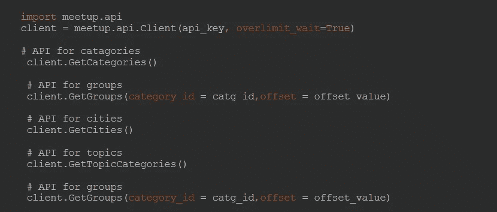
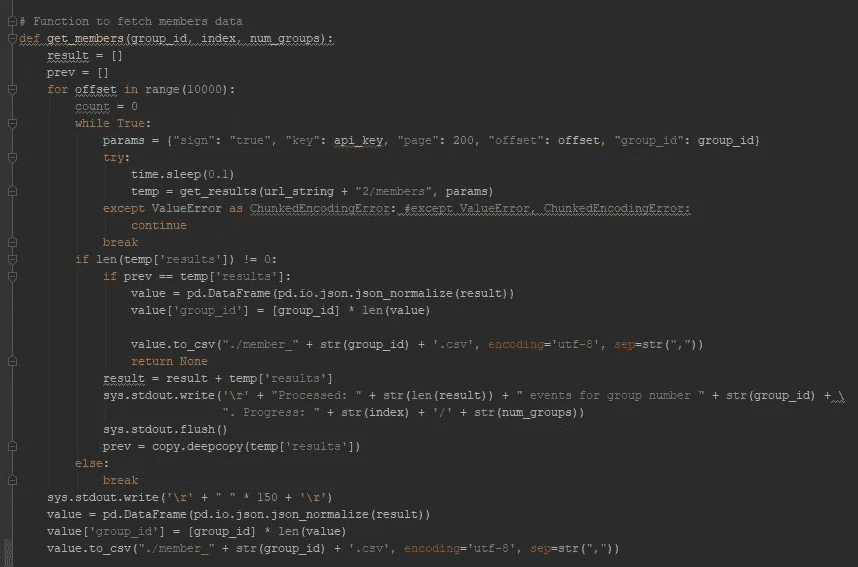
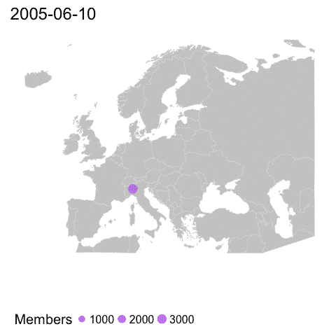
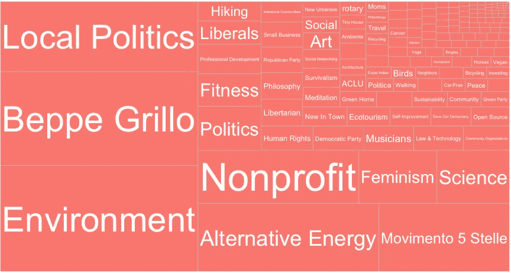
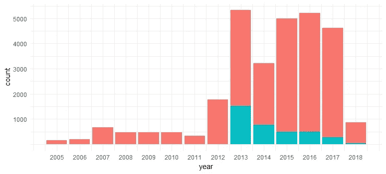
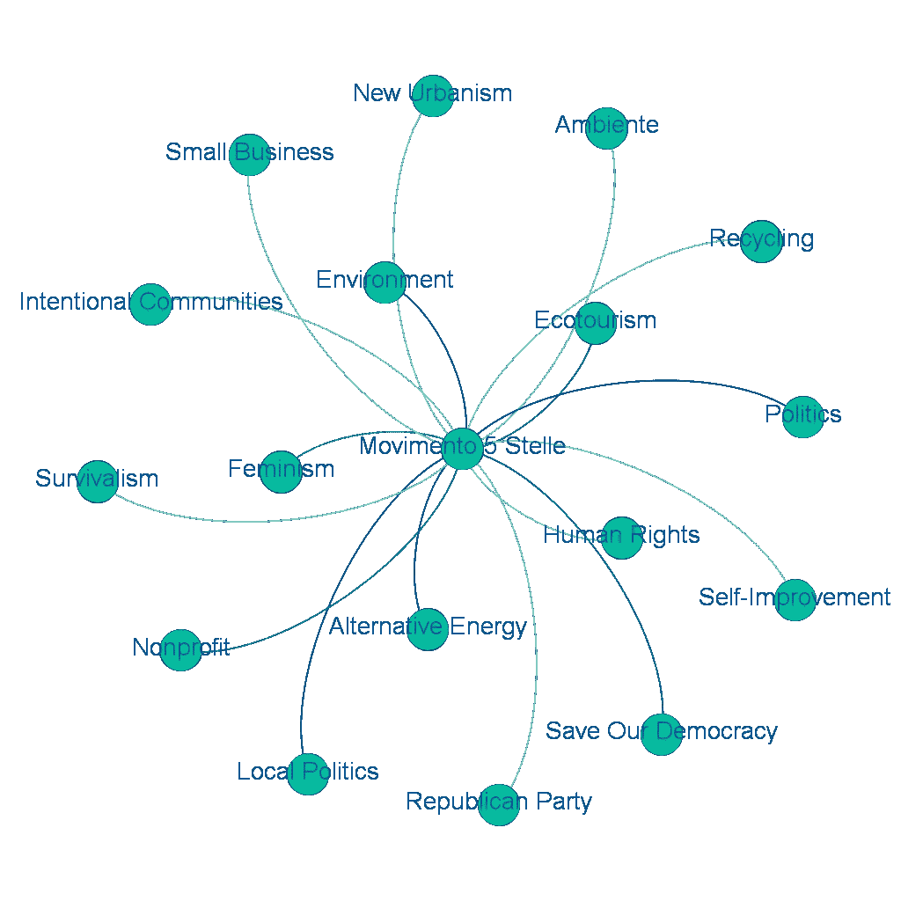

# Meetup 作为动员的来源:将数据科学工具用于社会科学

> 原文：<https://towardsdatascience.com/meetup-as-a-source-of-mobilization-using-data-science-tools-for-social-science-a3ef4cec68?source=collection_archive---------14----------------------->

## 使用数据科学工具为社会科学收集数据

对于社会科学来说，收集数据来理解人类、社会和政治行为一直是一个挑战。虽然这种行为就在我们身边，但找到能够准确描述这些现象的数据是很困难的，如果不是代价高昂的话。正因为如此，对社会动态指标的创造性思考一直是社会科学的一部分。以社会学的创始人之一埃米尔·杜尔凯姆为例，他试图通过观察不同社会群体的自杀率来解释社会控制和社会融合等社会力量。涂尔干利用现有的自杀统计数据作为社会群体中缺乏融合的指标，这导致了一种不归属感。尽管他因使用综合数据来解释个人社会行为而受到批评，但他的研究是第一个社会动力学的方法论研究。

由于数据科学工具箱的快速发展，社会科学家越来越容易获得和使用数据源。 [Stekmaszak an Hukal (2017)](http://blogs.lse.ac.uk/impactofsocialsciences/2017/03/01/when-data-science-meets-social-sciences-the-benefits-of-the-data-revolution-are-clear-but-careful-reflection-is-needed/) 讨论挖掘和管理新数据源的工具的发展以及使用机器从中学习如何使社会科学受益，同时警告社会调查中仍然存在的挑战。数据科学工具允许我们访问大量的新数据源，但这并不意味着我们不应该思考这些信息是如何定义、记录和传播的，以及在何种社会背景下传播的。

数据从来都不是客观的。虽然很有趣！因此，让我们考虑一个有趣的新数据来源，并学习如何将它用于社会科学。

## 聚会和社会运动

我是一名对社会和政治运动感兴趣的社会科学家。因此，当我了解到个人为全世界对某项政治或社会事业感兴趣的所有人组织会议的数据时，我自然感兴趣。Meet-up.com 是一个为人们提供一个平台来组织聚会的网站，聚会的话题可以是你能想到的任何话题。这可以是数据科学、小马、瑜伽或环境、女权主义或地方政治等公共事业。它的工作原理是，你可以创建一个会议，或者注册一个，并用相关主题标记会议。这是一个社交网络，它的显著特点是鼓励人们走出去，在真实世界的活动中进行身体接触。你确定一个时间和地点，那些注册的人可以参加这个活动。

对于一个社会科学家来说，这都是非常有趣的数据。你能做的就是去网站上收集关于团体和事件的信息，将它们分类(这是一种爱好，是娱乐还是运动和政治的一部分？)并查看他们的成员列表。或者你可以使用编程语言来自动化这个过程。这被称为网络抓取或数据挖掘。

## 通过 meetup API 挖掘数据

抓取 web 数据的一种方法是使用网站开发者制作的应用程序编程接口。这是礼貌的方式。API 基本上允许您与应用程序通信，在这种情况下是一个公共网站。我使用 Python 和 [meetup.api 包](https://pypi.org/project/meetup-api/)与它通信。

首先，我收集了所有关于类别、城市和主题的信息。为了使用这个 API，你需要在见面会上注册并申请一个[密钥](https://secure.meetup.com/meetup_api/key/)。我将所有数据存储在单独的 CSV 文件中，以后可以将这些文件加载到我的环境中。下一步是获取属于这些类别的所有组。我将属于某个类别的所有组存储在一个单独的 CSV 文件中。之后，我确保收集每一个独特的组 ID。这对下一步很重要。

现在最重要的步骤是得到每个组的成员列表。您需要构建一个函数来根据惟一的组 id 获取成员数据。对于每个组，您可以有一个单独的文件，其中包含成员列表。

所有这些都会导致大量数据包含在几个 CSV 文件中。许多工作都与清理和管理数据有关。

## 数据管理

首先我要把相关数据筛选出来。由于我的研究涉及欧洲政治和社会运动，我最感兴趣的是欧洲的数据以及社会和政治运动的数据。因此，通过先按类别过滤，再按欧洲国家过滤，我的数据集已经变得更易于管理了！

其次，我需要清理我的数据。这需要提取相关的单词串，并将成员聚合到相关的组和主题中。为此，我需要首先创建三个数据框架:一个包含所有(匿名)成员 id 的数据，一个包含所有组的数据，一个包含所有主题的数据。

当然，关于这个数据的一个有趣的方面是，它实际上是关系型的。一个组的成员也可以是另一个组的成员。其中一些组也可能属于不同的主题。为了利用这一点，我创建了一个双模式网络([附属网络](http://www.steveborgatti.com/papers/bhaffiliations.pdf))。这意味着只要主题有共同的组成员，它们就被认为是相关的。

## 可视化数据

在所有这些清理和管理之后，我终于可以处理这些数据了！(这意味着我也从 Python 切换到 R)。想象一下聚会是如何随着时间的推移在欧洲传播的，我们可以清楚地看到一种地理模式。意大利正在蓬勃发展！

让我们来看看最受 *meetup* 用户欢迎的话题。

除了*环境*，似乎大多数 *meetup* 成员都在为*贝佩·格里洛*动员。此外，贝佩·格里洛在 2009 年至 2017 年发起并领导的政治运动“M5S”也是一个很受欢迎的命名话题。这可以解释在意大利 meetup 的高使用率。

M5S 是一个政治反建制政党，从 2009 年的一场运动中崛起，参加了地区和地方选举。他们在国家议会中没有任何席位，但在 2013 年的全国选举中成为最大的政党。看似突如其来，他们被认为是欧洲历史上发展最快的政党。

## 五星运动

然而，来自 meetup 的数据显示，从 2005 年起，人们就开始以贝佩·格里洛的名字(粉色)组织聚会。使用社交网络如 *meetup* 实际上是由贝佩·格里洛的博客建议来组织本地会议的。在“贝佩·格里洛之友”的保护伞下，人们开始使用*聚会*在贝佩·格里洛的博客上聚在一起讨论话题。虽然贝佩·格里洛仍然更受欢迎，但更普遍地专注于 M5S(蓝色)的聚会仅在 2013 年才开始。2017 年后，贝佩·格里洛辞职，路易吉·迪·梅奥接管了该党的领导权。很容易说这导致了受欢迎程度的大幅下降，但这也为时尚早，因为 2018 年的数据还不完整。然而，更普遍的是，我们可以从这些数据中得出结论，贝佩·格里洛是一个非常受欢迎的领导人，甚至比他所代表的政党更受欢迎。

## M5S 动员是为了什么

政治学的一个关键问题是确定政党代表什么样的利益。使用来自 *meetup* 的数据，我们可以获得一些有趣的见解，了解 M5 的追随者在动员什么。

通过将 M5S 与其他主题的成员重叠表示为纽带(阈值为所有成员的 1%)，我们可以看到意大利反建制党的成员正在动员哪些主题。领带颜色越深，话题之间的重叠程度越高，联系越紧密。这个图表告诉我们，M5S 成员动员最多的是*环境*和*替代能源*，其次是*政治*和*地方政治*，之后是*拯救我们的民主*。

根据这一分析，你可以推断政治运动的积极追随者一方面主要关心环境问题，另一方面关心民主状况，并对参与(地方)政治感兴趣。虽然这些利益似乎与 M5S 现在在政府中的实际成就形成了鲜明的对比，但他们似乎确实符合 M5S 选民对政治上特别活跃和反建制的描述([帕萨雷利&图尔托 2018](http://journals.sagepub.com/doi/10.1177/1354068816642809) )。

## 警告:可靠且有代表性的数据

作为一名优秀的社会科学家，你应该经常问自己(至少)两个问题:1)我的数据有多可靠，2)有多有代表性？

首先，当我可能没有度量我想要度量的东西时，可靠性问题就出现了。例如，在线社交网络可能与现实世界中社会动态的展现方式不同。这当然是一种简化。然而， *meetup* 是一个帮助人们组织真实世界中真实事件的社交网络。然而，也有可能 1)会员实际上并没有参加这些活动，2)组织者分配给活动的主题可能并没有反映出活动实际包含的内容(例如，我看到了许多园艺*聚会*，尽管我怀疑这是他们真正想要的。)

第二，如果你想推断出一些你的数据没有直接捕捉到的结论，数据的外部验证是一个问题。在这种情况下，很可能是谁在使用 *meetups* 进行动员方面存在偏见。例如，使用社交网络在年轻人中可能比老年人更普遍。只有那些愿意参加公共辩论或政治集会的人才会成为这种聚会的成员。虽然研究确实表明 M5 的选民大多是 35 岁以下的年轻人，在政治集会和公共辩论中的活跃程度高于平均水平，但并非所有 M5 的追随者都是如此。简而言之，样本总体可能不是实际总体的均衡代表。从可能存在系统性偏差的样本人群中得出结论是很棘手的，需要额外的稳健性测试。

## 结论

总之， *meetup* 为社会和政治运动的研究提供了极具价值的新数据来源。这是一个免费的资源，允许研究人员在社会和政治运动出现在更传统的数据源之前研究它们的出现和发展。从民主党到茶党，几位美国政客已经认识到了 Meetup 的力量。在欧洲，你可以清楚地看到贝佩·格里洛和 5 Stelle 运动的崛起，使用社交网络分析可以显示他们的追随者在动员什么话题。尽管如此，数据科学工具的使用并不意味着社会调查的警告应该被忽略。社会科学家仍然应该确保数据的可靠性和代表性，以便得出结论。

权力越大，责任越大。

承认

Reini Schrama 是哥本哈根大学政治科学系的博士后。她的专长是欧洲政治、社交网络分析和社会科学数据科学工具箱的使用。2018 年初，她参加了推进学院(Propulsion Academy)的数据科学训练营([点击这里](https://propulsionacademy.com/testimonials/)了解更多信息)。