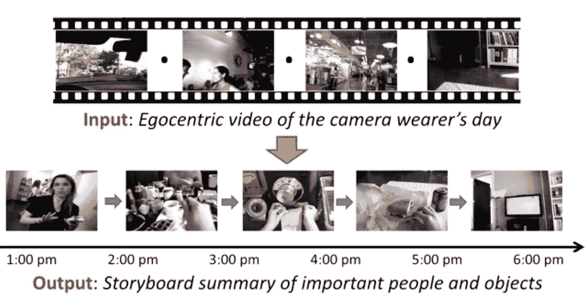
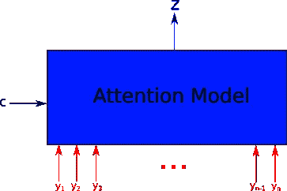
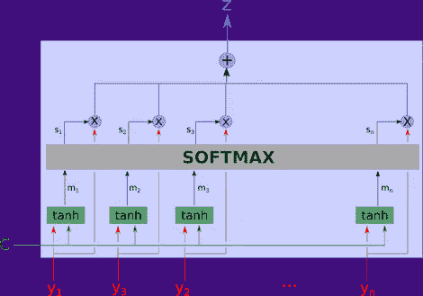
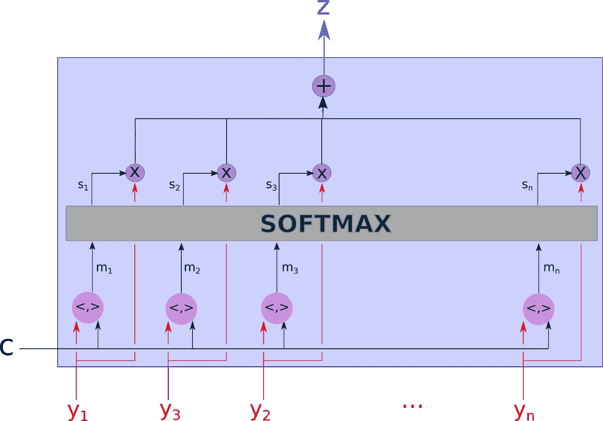
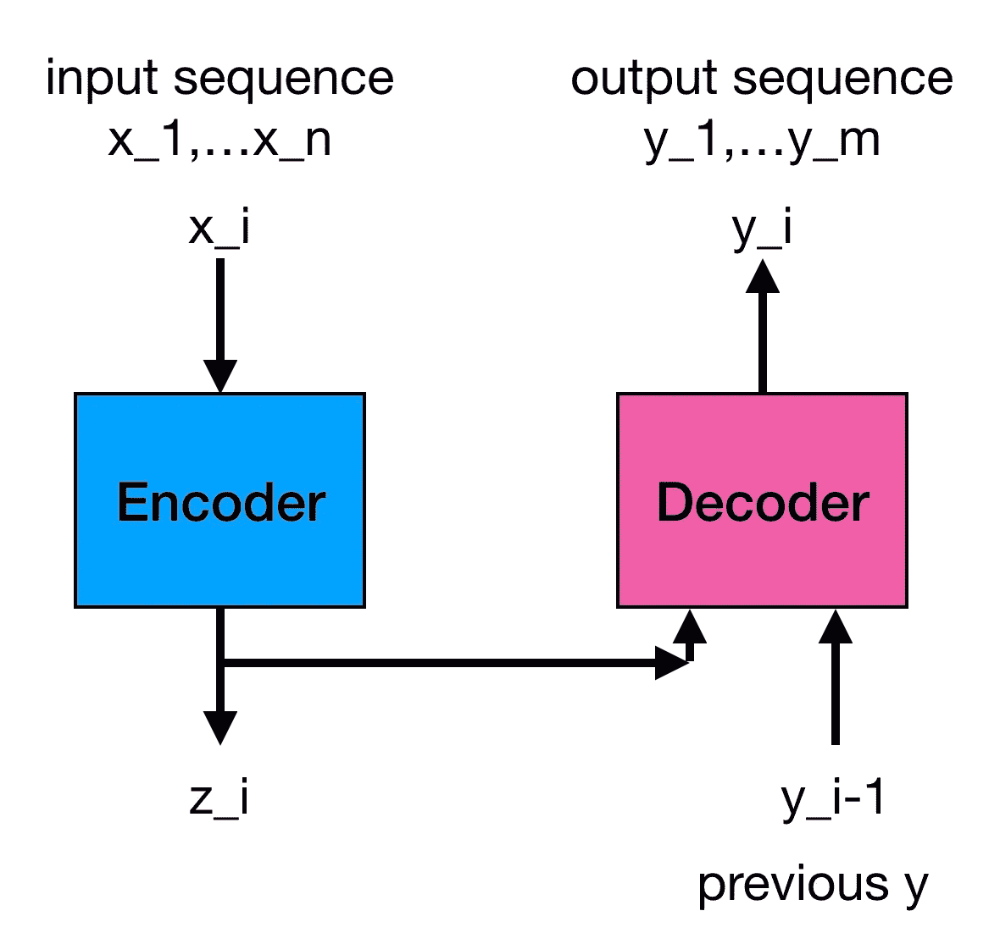
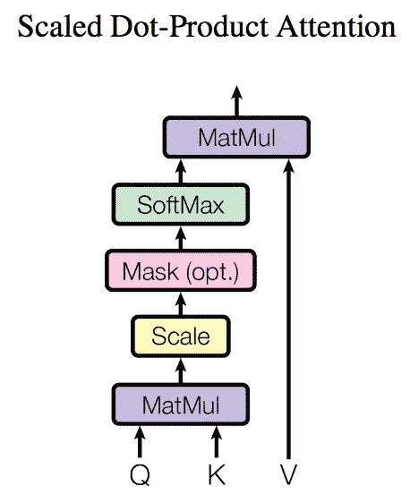
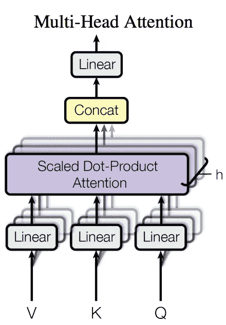
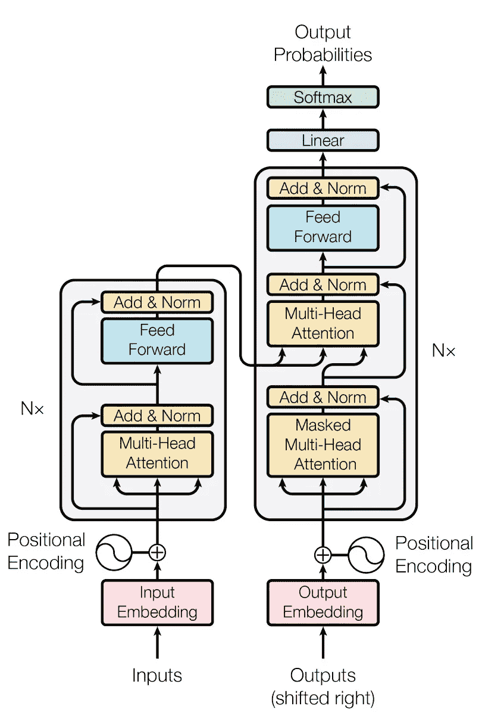
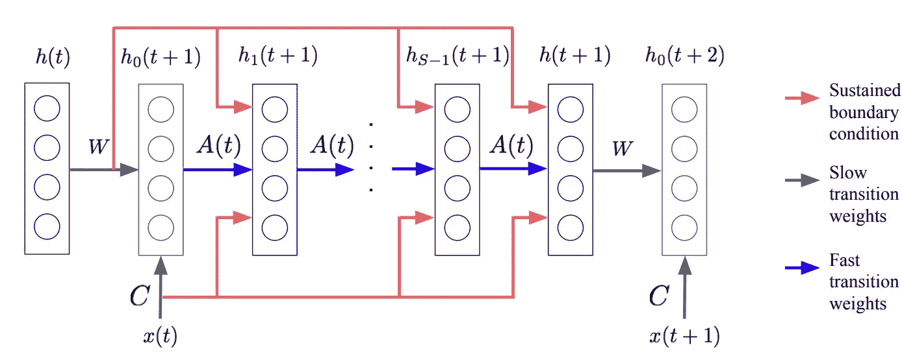

# 记忆，注意力，顺序

> 原文：<https://towardsdatascience.com/memory-attention-sequences-37456d271992?source=collection_archive---------2----------------------->

我们已经看到[分类神经网络](https://medium.com/towards-data-science/neural-network-architectures-156e5bad51ba)的兴起和成功。神经网络的下一个重大步骤是理解来自观察和与现实世界互动的复杂时空数据。我们之前谈过在这个领域运作的[新一波神经网络](https://medium.com/towards-data-science/a-new-kind-of-deep-neural-networks-749bcde19108)。

但是我们如何利用这些网络来学习现实世界中的复杂任务呢？比如，我该如何告诉我的高级真空清洁机器人:“Roomby:你忘了用吸尘器清理客厅红色沙发下的污点了！”并得到适当的回应？

要做到这一点，我们需要用注意机制来解析时空信息，这样我们才能理解复杂指令以及它们与我们环境的关系。

让我们考虑几个示例应用:文本或视频的摘要。考虑这段文字:

> 一个穿白色裙子的女人向一个穿蓝色裙子的女人走来。她切了几片苹果。然后她给了穿蓝衣服的女人一片。

为了回答这个问题:“谁提供了一片苹果？”我们需要关注“苹果”、“苹果所有者”、“给予”等词汇和概念。故事的其余部分是不相关的。故事的这些部分需要我们*的关注。*

类似的情况也发生在视频摘要中，一个长视频可以被摘要为一小组帧序列，在这些帧序列中，重要的动作被执行，并且再次需要我们的*注意*。想象你在找车钥匙，或者你的鞋子，你会关注视频的不同部分和场景。对于每个行动和每个目标，我们需要把注意力集中在重要的数据上，而忽略其他的。

Example of video summarization

仔细想想，摘要和一组集中的数据对于每个时间序列都很重要，无论是文档的翻译，还是视频中的动作识别，或者是任务的句子描述和环境中的执行的组合。

> 所有这些任务都需要把数据减少到焦点集中，并注意这个集中以便提供一个答案或行动

注意力是擅长理解序列的神经网络最重要的组成部分之一，无论是视频序列，现实生活中的动作序列，还是输入序列，如语音、文本或任何其他数据。无怪乎[我们的大脑在很多层面上实施注意力](https://en.wikipedia.org/wiki/Attention)，为的是只选择重要的信息进行处理，排除掉手头任务不需要的铺天盖地的背景信息。

神经网络中注意力的一个伟大回顾是[这里给出](https://blog.heuritech.com/2016/01/20/attention-mechanism/)。我在这里报告一些重要的图表作为参考:

An attention model is a method that takes n arguments y_1 … y_n and a context c. It returns a vector z which is the summary of the y_i focusing on the information linked to context c. More formally, it returns a weighted arithmetic mean of the y_i and the weights are chosen according the relevance of each y_i given the context c.

Implementation of the attention model. Notice that m_i = tanh(W1 c + W2 y_i), meaning that both y_i and c are linearly combined.

Attention model with dot-products used to define relevance of inputs vs context.

上面最后两个数字都实现了“软”注意力。硬注意是通过随机选取概率为 s_i 的输入 y_i 中的一个来实现的。这是比软注意的平均化更粗略的选择。软注意的使用是首选的，因为它可以通过反向传播来训练。

注意力和记忆系统也在这里用很好的形象化描述。

正如他们在[这篇文章](http://www.wildml.com/2016/01/attention-and-memory-in-deep-learning-and-nlp/)中提到的，注意力是有代价的，但实际上这种代价可以通过分级注意力模块来最小化，比如这里实现的。

# 现在看看 attention 如何能够[为翻译](https://arxiv.org/abs/1706.03762)实现整个 RNN:

它可以通过堆叠多层注意力模块来实现这一点，并采用如下架构:

Sequence to sequence system: an encoder takes in an input sequence x, and produces an embedding z. A decoder produces an output sequence y, by taking as input the embedding z and the previous output y of t-1.

Module used for attention [here](https://arxiv.org/abs/1706.03762). Q = query, K = key, V = values. Q and K are multiplied together and scaled to compute a “similarity metric”. This metric produces a weight that modulates the values V.

在多头注意力中，可以并行使用多个注意力模块:

Multiple attention heads are used in parallel to focus on different parts of a sequence in parallel. Here V,q,K are projected with neural network layers to another space, so they can be scaled and mixed.

整个基于注意力的网络被称为“变压器”网络:

在 RNN，时间被编码在序列中，因为输入和输出一次流一个。在前馈神经网络中，需要表示时间来保存*位置编码*。在这些注意力驱动的网络中，时间被编码为一个附加的额外输入，一个正弦波。它基本上是一个添加到输入和输出中的信号，用来表示时间的流逝。注意这里的脑电波与[神经振荡](https://en.wikipedia.org/wiki/Neural_oscillation)的生物相似性。

> 但是为什么我们要使用基于注意力的神经网络，而不是我们到目前为止一直在使用的 RNN/LSTM 呢？因为它们使用的计算量少得多！

如果您阅读论文的表 2，您将会看到这些网络可以节省 2-3 个数量级的操作！这是一些严重的节约！

我相信这种基于注意力网络将会在神经网络的许多应用中慢慢取代 RNN。

[在这里](https://jalammar.github.io/illustrated-transformer/)你可以找到关于变压器架构和数据流的精彩解释！

# 记忆

一项重要且有趣的工作是[快速加权](https://arxiv.org/abs/1610.06258)。这项工作实现了一种神经联想记忆——这是一种短期记忆，位于神经权重(长期)和递归权重(基于输入活动的非常快速的权重)之间。快速权重实现了一种类似于上面看到的神经注意力机制的记忆，其中我们将当前输入与一组存储的先前输入进行比较。这基本上就是上面看到的“点积注意力模型”中发生的事情。

在快速加权中，输入 *x(t)* 是用于与下图中先前存储的值 *h* 进行比较的*上下文*。

Fast associative memory implemented in [Fast Weights](https://arxiv.org/abs/1610.06258)

如果你读了[的论文](https://arxiv.org/abs/1610.06258)你会发现这种神经网络联想记忆再次胜过 RNN 和 LSTM 网络，同样注意力也能。

我认为，这再次证明，目前由 RNN 执行的许多任务可以被像这样计算成本更低(更不用说使用更少的内存带宽和参数)的算法所取代。

还请再看:[注意力递归比较器](https://medium.com/@sanyamagarwal/understanding-attentive-recurrent-comparators-ea1b741da5c3)，也是结合注意力和递归层来了解一个学习单元的细节。

# 关于作者

我在硬件和软件方面都有将近 20 年的神经网络经验(一个罕见的组合)。在这里看关于我:[媒介](https://medium.com/@culurciello/)、[网页](https://e-lab.github.io/html/contact-eugenio-culurciello.html)、[学者](https://scholar.google.com/citations?user=SeGmqkIAAAAJ)、 [LinkedIn](https://www.linkedin.com/in/eugenioculurciello/) 等等…

# 捐款

如果你觉得这篇文章有用，请考虑捐赠来支持更多的教程和博客。任何贡献都能有所作为！