# Meta 用 Pytorch CNNs 标记鞋子

> 原文：<https://towardsdatascience.com/meta-tagging-shoes-with-pytorch-cnns-7a48c3c108fb?source=collection_archive---------9----------------------->

我一直想尝试的是生成描述图像的文本。当以这种方式提出时，两条路径浮现在脑海中。首先将使用 CNN 的组合进行特征提取，并将这些提取的特征提供给 LSTM，让它通过重复迭代来生成描述。第二种方法是构建多标签分类模型，并让输出节点表示特定的标签。第一种模型适用于您希望为图像生成带有语法结构的标题的情况。多标签分类器适用于感兴趣的标签数量有限的情况。这个数字可能很大，只要有足够的数据，就可以用这种方式训练模型。

在这篇文章中，我试图只用原始图像作为输入，为鞋子生成元数据标签。至于方法，我决定使用多标签分类模型。我不使用 CNN + LSTM 路线的第一个原因是，我并不明确需要那种英国式的结构，而这正是 LSTM 的目标。第二个原因是，我觉得我需要比我愿意手工生成的更多的数据，以使模型很好地为我定制的用例训练。我希望我能够利用预训练的网络快速建立一个模型来生成这些元数据标签。这被证明是部分真实的。

> 注意，我把为每个图像生成的标签放在该图像的标题中。

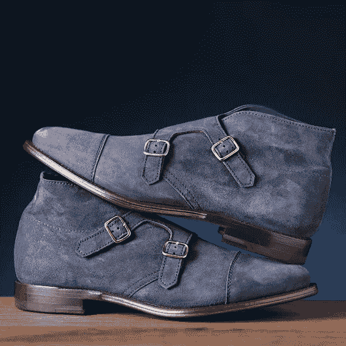

Generated Tags: Blue, Boot, Below the Ankle

# 构建数据集

第一个主要步骤是收集一个小数据集，并对其进行标注以进行多标签分类。为此，我抓取了 220 张图像(训练 200 张/验证 20 张),并在电子表格中标记它们。正如我提到的，我只是想有一些非常简单的分类，所以我选定了 19 个分类，涵盖了原色、款式(平底鞋、高跟鞋、休闲鞋、凉鞋等)。)，还有一些是对鞋子的更多描述，比如它们是高、矮、有光泽还是有图案。

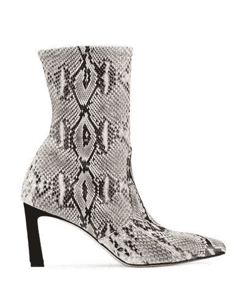

Generated Tags: Grey, Boot, Heel, Above the Ankle, Patterned

首先要注意的是…这些可能是不好的类别，或者至少可以做得更好。我只是想有某种结构来填充一个体面的数字，但仍然有限的标签数量。特别是最后几个标签是脚踝上方或下方的标签。我想包括这些，因为我认为看看网络是否会习惯于根据图像来确定鞋子的高度会很有趣。

# 技术冲刺直入一堵墙

从技术角度来看，这是为这个项目定制 pytorch 数据集生成器类的好机会。这非常简单，因为您需要做的只是向它提供 pytorch dataset 基类并添加函数来生成样本。对我来说，这仅仅意味着添加从项目目录中打开图像的功能，并跟踪适当的目标标签。在这种情况下，目标标签是 1 和 0 的长度为 19 的向量。

> 查看我用于数据准备和培训的 [**jupyter 笔记本**](https://github.com/sugi-chan/Generating-Tags/blob/master/Tag-generation.ipynb) 以了解实现细节

我后来发现的一个注意事项是，BCEWithLogitsLoss()可能更有用，因为它将 sigmoid 图层与损失函数相结合，因此它返回概率(像 softmax 一样)，但每个节点都是独立的(不像 softmax)。这可能有助于清理网络的输出。但是我离题了…回到我的失败。

技术设置完成后，我准备开始测试网络和超参数。显而易见的起点是使用一些标准的预训练网络，并尝试针对这个问题对它们进行定制。我测试的第一个网络是 ResNet 50 模型，在用所有 19 个目标类的 200 个训练样本对其进行训练后，我发现这些模型做得……非常糟糕。

我发现，模特们基本上只是把所有东西都叫做“靴子”，有时当感觉有创意时，就叫做“黑靴子”。

按照我目前的方法，我的第一个想法是，目前的模型表现不佳，我的问题的一个可能的解决方案是投入额外的计算能力。因此，我使用预训练的 ResNet 152 训练了另一个模型，并假设 ResNet 50 可能没有为这个问题提取足够有用的特征。

但即使有 3 倍的层数，一个更强大的模型，和超参数调整，我得到的只是更多的“靴子”。在这一点上，我遇到了一个心理障碍，可以用下面这张 GIF 来概括，GIF 是《英雄 6》中的 Hiro Hamada，他没有想出一个项目主题。

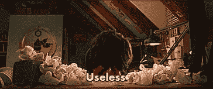

在使用我认为可行的一般方法反复失败后，我真正需要的是后退几步，对我的大脑进行一次硬重置。

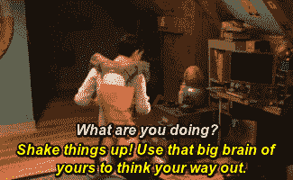

I still frequently code to Immortals

# **寻找新的角度**

所以按照《英雄 6》中浜田义的建议，我想我必须试着用不同的方式来看待这个问题。

想想我最后会去散步或者练一会儿武术。这一次，我在木人桩上练习咏春拳。虽然这是一个数据科学帖子，但我会简单地说，在木制假人上练习包括用手、胳膊和脚击打假人，以增强骨骼强度并改善形态。一开始会很痛，但一旦你的骨头变硬，就会很放松。

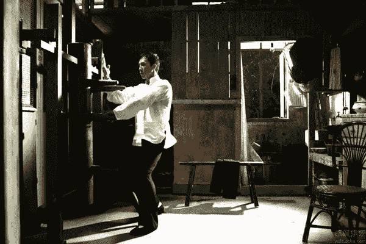

Donnie Yen practicing on a mook yan jong

我在练习时想出的方法简单得令人痛苦。这并不是模型没有提取有用的特征，而是我的目标空间对于我的数据集的大小来说可能太稀疏了。

对于任何给定的图像，它们往往有 3-4 个标签，因此目标数组几乎全是零。在所有 19 个职业的设置中，模型只会经常看到一些组合，但大多数是罕见的…一个常见的组合是“黑靴子”，这似乎可以解释为什么这是所有模型想要返回的原因。

现在，随着问题的重新架构，我准备从新的角度再次发起攻击。我想我可以把这个问题分解成更小的部分，用一套标签生成模型来解决它。

# 新角度

因此，我发现我可以使用 3 个小的 ResNet 18 模型，而不是抛出一个试图一次预测所有 19 个类的大模型。三个模型中的每一个都在 19 个节点的子集上进行训练。

第一个模型在 7 个颜色特征上被训练。映射到黑色、白色、红色、蓝色、褐色、灰色、棕色。

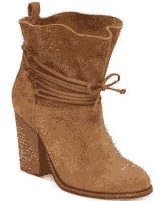

Generated Tags: Tan, Boot, Heel, Above the Ankle

第二个模型有 7 种风格。靴子、鞋跟、运动鞋、凉鞋、平底鞋、铆钉鞋和休闲鞋。

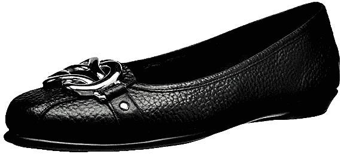

Generated Tags: Black, Flat, Below the Ankle, Patterned

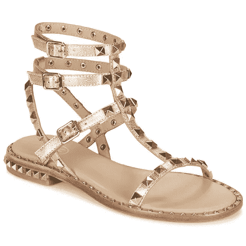

Generated Tags: Tan, Studded, Sandal, Above Ankle

第三个模型着眼于五个特征的混合图案(鳄鱼纹理、豹纹、奇怪的字符等，脚踝以上、脚踝以下、闪亮或皮革)。

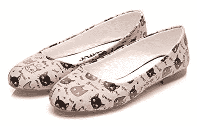

Generated Tags: White, Flat, Below the Ankle, Patterned

在将原始长度为 19 的向量划分为长度为 7、7 和 5 的三个部分之后，我使用其中的每一个作为目标来训练 3 个 ResNet 18 模型。每个 ResNet 18 在 1080 Nvidia GPU 上完成 25 个纪元的训练可能需要大约 3 分钟。

要生成您在所有图像上看到的标签，我所要做的就是让图像通过所有三个模型，并评估输出向量。现在我所做的就是将数组映射回它们原来的类，并检查哪些类有正值，或者如果所有的类都是负值，我会保留值最高的一个。

# 速度测试

出于好奇，我用这三个模型对标记生成速度进行了基准测试。对于这个项目，我在 jupyter 笔记本中包含了基本的低效测试循环，所有三个模型的推理速度都是每个图像 0.043 秒，因此在我的整个 220 个图像数据集上运行大约需要 9.5 秒。它包括两个内部 for 循环，这使得它非常慢。作为一个快速的改进，我去掉了一个内部 for 循环，发现所有三个模型的每幅图像都增加到了 0.025 秒，总时间是 5.7 秒。

向前看，这个评估算法可以更好地优化运行速度，但我只是想表明，即使有多个模型，推理速度也相当快。在这种速度下，对于更大规模的任务，比如说 1000 万张图像，这种设置需要 69.4 小时。

# 限制

考虑到训练集很小，以及我是如何有意识地挑选大部分是白色背景的工作室类型的图像的，模特们在下面这种没有白色背景的情况下挣扎。

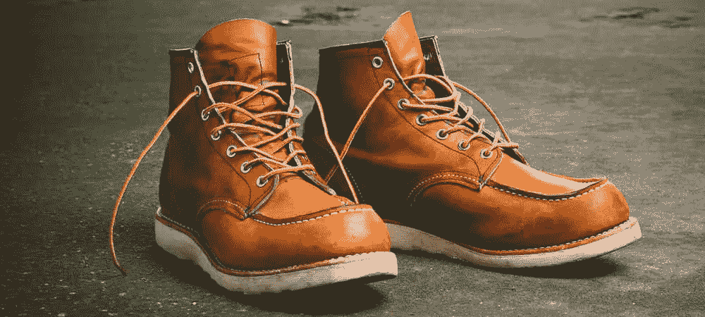

Generated Tags: Tan, Brown, Loafer, Above Ankle, Leather

我猜这种情况下工作体面，但它可能不应该被称为这些懒汉…至少顺便说一下，我把类似的项目归类为靴子。

在下一个例子中，模型无法解释由模型的肤色等因素引起的额外变化。你可能会发现这些标签似乎都不正确…图片不是脚踝以上的黑色..

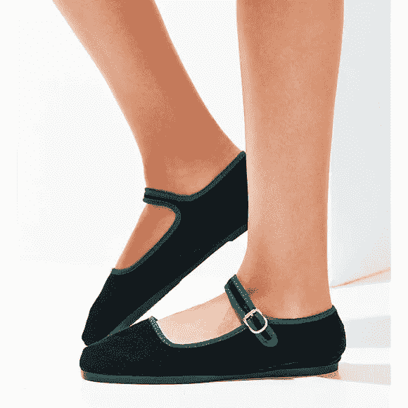

Generated Tags: Black , Heel, Above the Ankle

在我这里展示的这两种情况下，我之前构建的图像分割模型可能会有用。前一篇文章的概念是，应用图像分割模型可以帮助清理输入图像，以便像这些标签生成器 ResNet 18s 这样的第二阶段模型在进行正确分类时不会有太多问题。

# 前进

虽然我没有演示如何生成大量的标签，但我认为在数据很少的环境中，这种方法可以扩展到相当大量的标签。网络不需要考虑和优化目标的巨大变化，因此它应该不难建立。如果你继续使用这种方法，那就意味着你必须调用大量的网络来生成相当窄的标签，并将它们组合起来，以获得那只鞋的完整标签列表。如果输入图像随时间变化或类似情况，保持多个网络协调可能会变得更加麻烦。

在具有大量数据的环境中，使用单个大目标向量来训练更大的模型以生成标签可能是可行的。我的想法是，只要网络能够接触到足够多的样本，目标的稀疏性就不会那么重要。不过这还有待检验。拥有这些大模型的一个缺点是，添加额外的标签要么需要重新训练大模型，要么可以添加额外的小模型来扩充它。