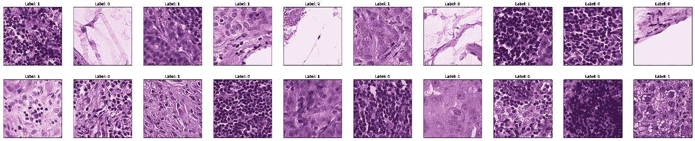
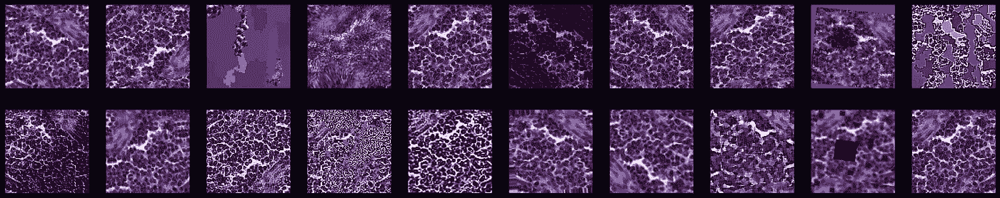
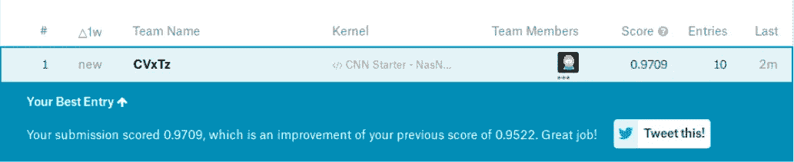

# 使用细胞神经网络、迁移学习和数据增强的转移检测

> 原文：<https://towardsdatascience.com/metastasis-detection-using-cnns-transfer-learning-and-data-augmentation-684761347b59?source=collection_archive---------17----------------------->

Photo by [Lurm](https://unsplash.com/photos/REL986jyuX4?utm_source=unsplash&utm_medium=referral&utm_content=creditCopyText) on [Unsplash](https://unsplash.com/search/photos/cells?utm_source=unsplash&utm_medium=referral&utm_content=creditCopyText)

本项目的目标是使用 Kaggle 上托管的 PatchCamelyon 数据集[【1】](https://github.com/basveeling/pcam)在淋巴结的组织病理学图像上检测癌症转移。

对疾病进展的正确诊断对于选择最合适的治疗方案至关重要，这就是为什么医生依赖于可能存在转移的活检组织的组织病理学图像。在这个项目中，我们将训练一个模型来自动检测恶性肿瘤的证据，以帮助医生做出更好的决定，并有望为癌症患者提供更好的护理。

这里介绍的步骤也可以为任何一般的图像分类问题提供一个强有力的基础:

# 数据

该数据集是一组 96×96 的图像，其中如果在图像的 32×32 中心部分有恶性肿瘤的证据，则每个图像被标记为 1，否则被标记为 0。

Examples from the training set

# 增大

为了减少过度拟合并增加模型的泛化能力，我们使用数据扩充，这是应用于图像的随机扰动序列，保留了标签信息。用这些扰动进行训练也使模型对噪声更鲁棒，并增加其对平移和旋转的不变性。

Random Augmentations applied to the same input image

# 模型

我们使用在 ImageNet 上预先训练的 NasNet mobile(参见[迁移学习](https://en.wikipedia.org/wiki/Transfer_learning))，因为它速度快，因此可以在 6 小时的时间限制内完全在 Kaggle 内核上训练。

# 培养

我们使用训练集的一小部分作为验证，然后使用模型[检查点](https://keras.io/callbacks/#modelcheckpoint) Keras 回调来保存最佳权重，并在我们对排行榜数据进行预测之前加载它们。

# 预测和后处理

对于测试集的每个图像，我们平均原始图像的预测和水平/垂直翻转版本的预测。

Leaderboard Result

这种方法获得了 **0.9709** 的 [AUC](https://en.wikipedia.org/wiki/Receiver_operating_characteristic) 分数，与最先进的 **0.963** 的[数字病理学](https://arxiv.org/abs/1806.03962)旋转等变 CNNs 相当。

可以在 Kaggle 上在线运行模型:[https://www . ka ggle . com/cvx tz/CNN-starter-nasnet-mobile-0-9709-lb](https://www.kaggle.com/CVxTz/cnn-starter-nasnet-mobile-0-9709-lb)

github Repo:[https://github . com/CVxTz/恶性肿瘤 _ 检测/tree/master/code](https://github.com/CVxTz/malignancy_detection/tree/master/code)

[1]https://github.com/basveeling/pcam