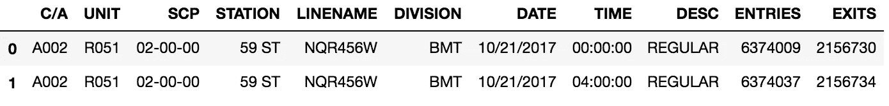
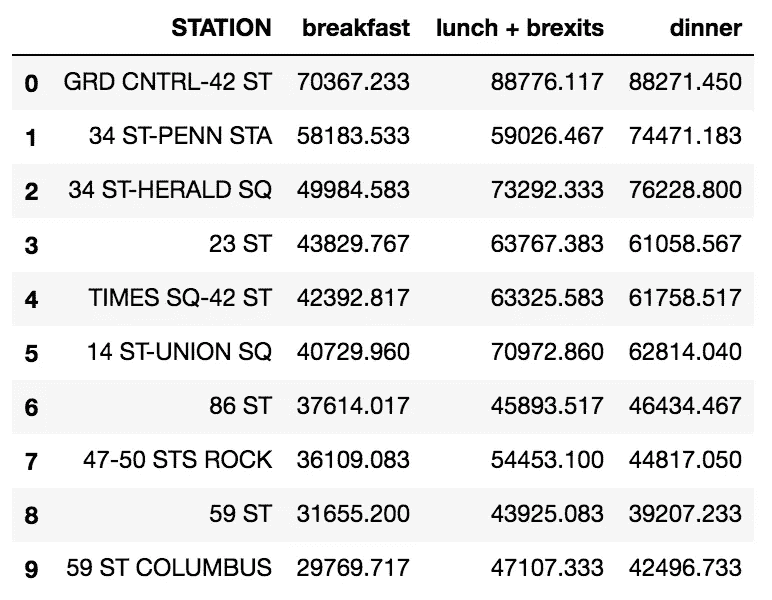
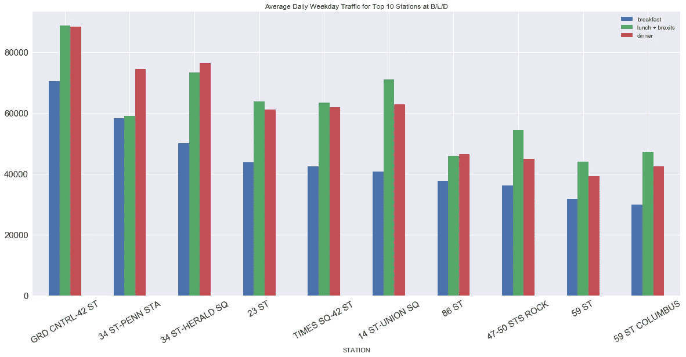
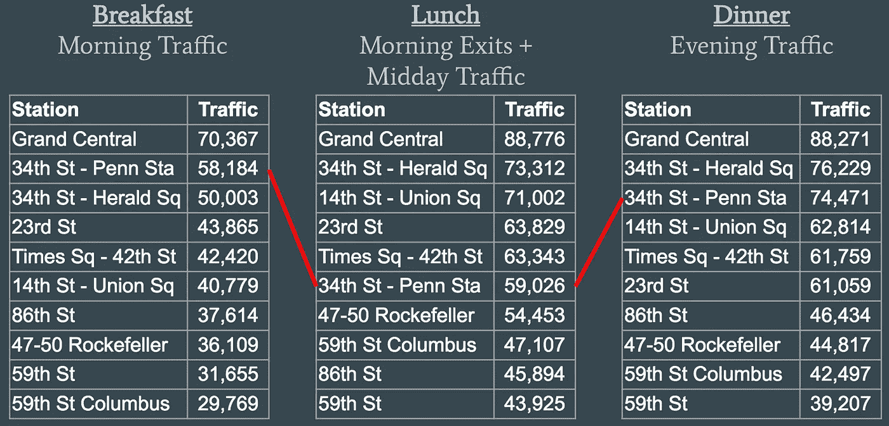
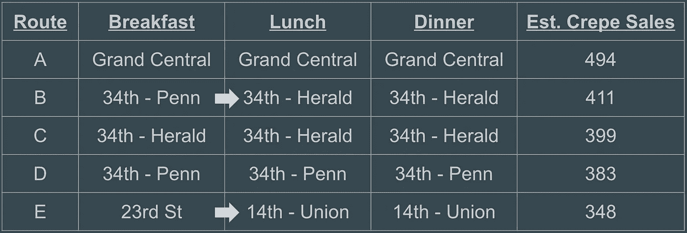

# METIS 简介

> 原文：<https://towardsdatascience.com/metis-introduction-5e772c8affad?source=collection_archive---------12----------------------->

Metis 的第一周主要关注 Python 库“pandas”的使用，这是数据科学家创建、清理和分析数据框的首选工具。作为一个 python 初学者，pandas 文档很难掌握。我发现自己不断地交叉引用课堂上的材料，以找出如何编写多行代码。

在我们的第一个项目中， *Benson，*我们研究了纽约市 MTA 十字转门的数据，并得出结论来帮助一个假想的客户。在我们集思广益的那一天，我的团队特别饿，我们开始改善**煎饼车**的业务，这是纽约街头的一个新的快餐车业务！

# **本森项目**

这个项目的第一步是读入数据。我们通过 MTA 数据网站的一系列链接迭代了 pd.read_csv 命令。

这是导入时数据的格式:

经过一些数据清理(去掉列名，去掉极值，将 dataframe 转换成时间序列)，我们决定了我们真正感兴趣的时间段。

由于 Crepe Cart 是一种主要在早餐、午餐和晚餐时间针对忙碌工作人员的食品服务，我们决定查看工作日早餐从[7AM-12PM]、晚餐从[3PM-8PM]的进出数据，以及午餐从早餐到午餐的[11AM-4PM]数据和出口的组合。我们在午餐时使用早餐出口数据的原因是，我们假设在清晨离开十字转门的人在附近的办公室工作，并且在午餐时间仍会在该区域。

然后，我们找到了每个时间段按流量(入口+出口)排名的前 10 个站点。

Average daily total for each station for each time period.

Top 10 B/L/D visualized

找到这些群体后，我们开始想办法量化可丽饼销量。我们最终假设转换率为 0.2%——因此，每 500 人经过一个车站，我们的煎饼车就会卖出 1 个煎饼。如果一个站点在不同的时间段排名发生变化(如下所示)，我们必须决定是否值得花费时间/成本将快餐车迁移到一个更拥挤的位置。为此，我们假设在曼哈顿的交通条件下，每英里行驶时间为 10 分钟。

Example of station changing ranking

考虑到这些因素，我们计算了绉纱的销售额。

值得注意的是，尽管 B 路线在午餐时间有更多的可丽饼销售，从 34-Penn 到 34-Herald，如果可丽饼车有 3 辆食品卡车，那么它们的旅行就没有意义。相反，他们可以在 34 街和 34 街分别停一辆车。第四辆卡车会走 e 路。

# 最后的想法

本森项目很好地介绍了 Metis 的工作情况。这既紧张又费时，但我们在一周的下午有很多时间来合作和研究它。由于我们只有一周的时间来完成，我们无法将大量数据纳入我们的分析中。如果有更多的时间，我们可以查看交通的季节性变化、公交/拼车数据，以获得更全面的交通状况，以及每个车站附近竞争餐馆的密度。