# 分类中的度量和随机过程

> 原文：<https://towardsdatascience.com/metrics-random-processes-in-classification-fd5bafa79505?source=collection_archive---------2----------------------->

在他的书《机器学习》的介绍中，[Tom Mitchell 教授](http://www.cs.cmu.edu/afs/cs.cmu.edu/user/mitchell/ftp/mlbook.html)将**学习**定义如下:

> 对于某类任务 *T* 和**性能测量** *P* ，如果由 *P* 测量的计算机程序在 *T* 任务中的性能随着经验 *E* 而提高，则称该计算机程序**从经验 *E* 中学习**。

事实上，只有通过预定义的性能指标或**指标**进行评估时，我们才能谈论算法学习。当执行分类任务时，选择正确的指标可能比调整模型参数更重要。为了说明这一点，我们将回顾现有的**最常见的指标**，并展示它们的优缺点，然后集中讨论具有潜在**随机过程**的分类任务的特殊情况，在这种情况下，通常的分类指标都不起作用，并提出一种替代方案。

## 准确(性)

**准确度分数**(通常写成 **ACC** )是人们能想到的最直接的度量标准。它只是简单地计算我们在预测总数中预测正确类别的次数。更正式的说法是:

Notations : p_i is the i-th prediction, y_i the i-th target and N the sample size.

就像任何指标一样，这一指标也有其利弊。从好的方面来说，这很容易理解和解释，因为具有 80%的准确性简单地表明有 80%的机会在看不见的数据上预测正确的类别——当然，前提是我们的模型不会过度拟合和概括得很好。然而，当数据集中的类分布是**不平衡的**，例如当负目标(0)比正目标(1)多得多时，该度量变得无用。事实上，如果 95%的目标是否定的，那么一个总是预测(0)的非常简单(和糟糕)的模型将实现 95%的准确度分数，尽管完全没有用。在这些情况下——这是相当常见的——其他指标如**混淆矩阵**就派上用场了。

## 混淆矩阵

混淆矩阵试图比简单的准确度分数更详细地描述分类器的性能。它可以表示为一个**计数表**，在给定真实值为正或为负的情况下，计数正预测值和负预测值的数量。例如，如果我们要为之前的坏分类器计算一个混淆矩阵，它看起来像这样:

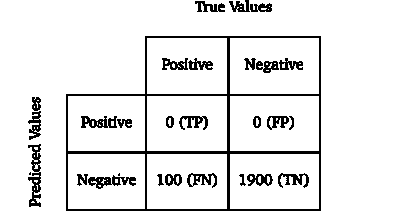

Notations : T/F for True/False, P/N for Positive/Negative

这里我们选择了 2000 的假设样本量。我们可以看到，数据是高度不平衡的，只有 5%的阳性，95%的阴性(0+1900)/2000)，并且分类器总是预测一个负值(“预测值”的“阳性”行为空)。但是，尽管允许我们快速浏览预测的分布，在这种状态下，混淆矩阵并没有真正给我们更多的洞察力。另一种方法是用每一列的总和除以每一列的总和，得到所谓的 T2 归一化混淆矩阵:

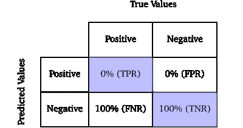

Normalized confusion matrix. Notation : R for rate.

由于这种标准化，对角线上的每个**值**成为预测正确类别的**经验条件概率**。当以真类为正的条件时，这种概率称为真正率或**灵敏度，否则称为真负率或**特异性**。因为这些比率不依赖于类别分布，所以使用混淆矩阵通常比依赖准确度得分更可取。在训练过程中，可以将灵敏度和特异性最大化，以收敛到*完美分类器*——其混淆矩阵等于同一性，因为它只预测实际上是正确类别的类别。在我们的例子中，我们立即看到了一些错误，因为敏感度为零，因此我们可以得出结论，我们注定是坏的分类器确实是坏的(哈利路亚！).**

## ROC / AUC

一般来说，为了对样本进行分类，分类器会计算一个介于零和一之间的**真实值**——或者任何其他可以映射到[0，1]的区间——然后通过使用内部**判别** **阈值**(通常默认设置为 50%)来映射该值，高于该阈值时，它会预测正的和反的。这样一个阈值的选择会极大地影响前面指标显示的结果。事实上，如果我们的模型高度偏向负值，即如果它预测的值分布非常接近零，使用 50%或更高的阈值可能会导致它总是预测负值，而选择更低的阈值可能会导致更多的正值，因此可能会更好地反映分类器的性能。

考虑所有可能阈值的一种方法是依靠 **ROC 曲线**和 **AUC 分数**。ROC 曲线是坐标为**(灵敏度，1-特异性)**或(TPR，FPR)的点的集合，其中每个点对应于相同分类器的性能，但具有不同的阈值。可以看出，对于足够大的数据集，尽管有鉴别阈值，但完全随机的分类器总是将其坐标放在对角线[(0，0)，(1，1)]上，也称为无鉴别线。此外，如果一个点在这条线以上的半平面中，那么下面的不等式成立:

换句话说，混淆矩阵对角线上的每个概率都大于 50%，这意味着我们有超过 50%的机会正确预测每个类别，在这种情况下，我们说我们的分类器表现**比随机猜测**更好。同样的推理也适用于比随机猜测更差的线下点。然而，如果一个分类器总是在所有阈值的非歧视线以下，简单地翻转它的预测就可以使它在线以上，因此是一个可接受的模型。

当阈值为 T=0 时，所有分类器系统地预测阳性，因此它们都位于 ROC 空间中的(1，1)处。相反，当 T = 1 时，发生相反的事情，并且所有分类器都在(0，0)处。为了说明这一点，这里有两个很好的 ROC 曲线的例子:

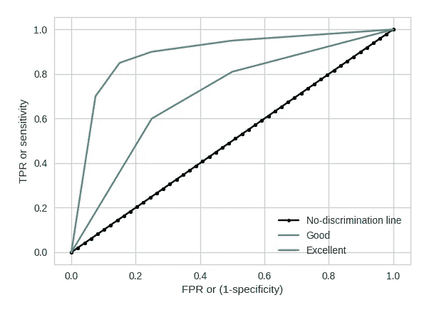

但是我们如何使用这个度量来比较模型呢？当给定一组分类器时，在每个给定的特异性值，最好的分类器必须具有最好的灵敏度。因此，选择最佳模型的近似方法是保留 ROC 曲线严格高于所有其他模型的模型。不幸的是，这只有在几条曲线之间有明确的顺序时才能实现。为了解决这个问题，我们可以求助于一个更具聚合性的指标，即 **AUC 得分**。

对于每条 ROC 曲线，曲线下有一个相关的面积或 **AUC 得分**。该 AUC 直接依赖于 ROC 曲线，但具有一些额外的优点，第一个优点是它允许我们使用真实值客观地比较分类器，而不是依赖于图形的视觉解释。此外，可以表明 AUC 等于分类器对随机选择的正实例的排序高于随机选择的负实例的概率。考虑到这一点，我们看到 AUC 是用于二元分类任务的比任何以前的度量更强大的工具，因为它对不平衡数据集是稳定的，易于解释并且客观地对分类器的性能进行排序。

这些指标中的任何一个(尤其是 AUC)在任何确定性场景中都会发挥很好的作用，比如找出[某物是否是热狗](https://hackernoon.com/how-hbos-silicon-valley-built-not-hotdog-with-mobile-tensorflow-keras-react-native-ef03260747f3)。在这些情况下，目标值是一组预测值的**确定性函数**，并且可以尝试按照通常的例程直接处理分类任务来估计该函数。但是在**随机场景**中，目标除了确定性函数之外还具有**随机不可预测成分，预测类别只是估计概率**的一个代理，也是**估计概率**的结果。例如，如果我们试图预测一次公平的掷硬币的结果，对于一个足够大的数据集，没有一个模型可以达到超过 50%的准确率，无论它有多精确。在这种情况下，潜在的目标和我们唯一希望做的事情是评估过程的概率，并找到最佳模型，即预测总是 50%。

> *不幸的是*，*到目前为止，我们所看到的指标并没有表达出我们在寻找这些概率方面有多好*。

事实上，对于公平的掷硬币和足够大的数据集，除了不能实现大于 50%的准确度之外，所有的 ROC 曲线都将在非歧视线上，并且 AUC 分数将总是 50%。这并没有给我们更多关于分类器发生了什么的信息，因此需要一个新的度量标准。在许多情况下，基础过程是随机的，例如:

*   预测量子力学实验的结果，例如，电子的自旋是向上还是向下。
*   预测扑克游戏中看不见的牌。
*   预测一个学生是否会在一项特定的任务中取得成功(我们在 Kwyk 做的事情)

在所有这些情况下，使用简单的分类标准会阻止我们在建模方面前进。那么我们应该使用什么度量标准呢？因为我们想要一个度量来告诉我们在预测每个类的**连续**概率方面有多好，所以我们将关注一个**回归度量****MSE**。

## 均方误差

均方差或 **MSE** 是预测值和实际值之间的平方差的平均值。它可以正式写成:

Notations : p_i is the i-th prediction, y_i the i-th target and N the sample size.

在二元分类的情况下，其中 ***y*** 是离散变量(0 或 1)***p***是成功的预测概率，它也被称为 **Brier score** 。

为了公平起见，如果我们选择使用的模型总是对所有样本预测相同的概率，快速查看 MSE 配置文件可以让我们找到最佳模型:

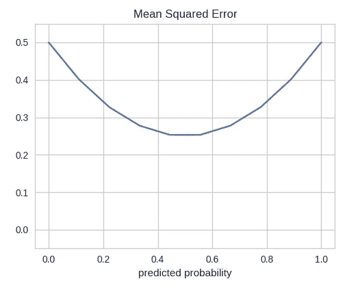

MSE values for a fair coin toss when the predicted probability varies from 0 to 1.

这是一个开始，但是我们看到当模型是最优时，MSE 不为零。事实上，总是预测 50%是我们可以选择的模拟公平抛硬币的最佳模型，因为潜在的过程是 a [伯努利](https://en.wikipedia.org/wiki/Bernoulli_distribution) B(0.5)。但是因为最小均方差是 0.25，我们可以认为还有一个更好的模型，均方差是 0.25。这里，p=0.5 时剩余的 MSE 对应于任务中的**固有随机性**。事实上，当一个过程具有不确定性时，由于我们试图预测的数据中的不确定性，MSE 中总是存在不可避免的误差。现在让我们注意 0.25 正好是 a B(0.5)的方差，它是我们过程的分布。

使用 MSE 实际上允许我们在一组分类器之间进行区分，并确定最佳选项，但是我们仍然没有一个度量标准来告诉我们离完美模型还有多远。这是使用任何先前度量的确定性任务的情况:对于*完美模型*来说，准确度分数是 100%，混淆矩阵等于同一性，并且 ROC 曲线是 AUC = 1 的平方。在任何情况下，我们都看到，由于我们感兴趣的随机过程的本质，MSE 不可能为零，但我们也知道一种将随机观察结果与其潜在概率联系起来的方法，这就是**大数定律(LLN)** 。

事实上，如果预测的概率有任何意义，并且如果我们为每个预测的概率建立一个组，其中我们收集所有相应的目标，对于一个足够大的组，目标的平均值应该收敛到预测的概率。这是朝着期望的度量迈出的又一步，因为我们可以查看每组中平均目标和预测概率之间的差异，我们的分类器越好，这些差异就应该收敛到零。但是当该过程具有连续分布时，这些组的大小将几乎不会增长，并且 LLN 将无法生效。这个问题的一个解决方案是将不同的预测概率一起分组到 **K 个组**的每一个 **n_k** 元素中，并将组内平均成功率(目标的平均值)与组的平均概率进行比较。

让我们看看当我们进行这样的分组时 MSE 会发生什么，这里 BS 代表 **Brier Score** :

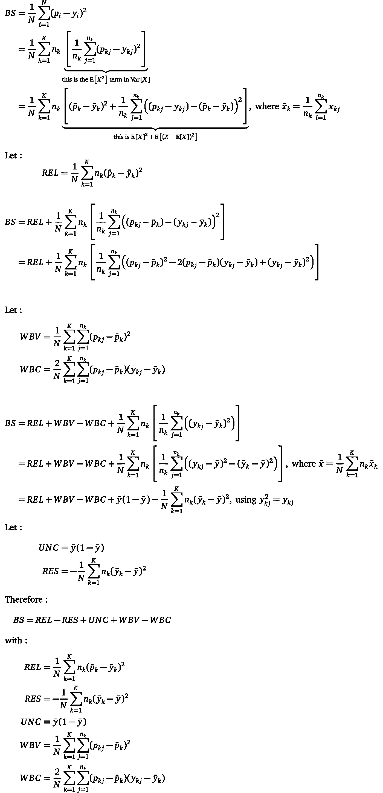

Source : [“Two Extra Components in the Brier Score Decomposition”](http://journals.ametsoc.org/doi/pdf/10.1175/2007WAF2006116.1)

上述计算表明 Brier 分数/MSE 是 5 项相互作用的结果:

*   **不确定性** (UNC):不确定性显示了**在我们的任务中固有的随机性**。例如，如果我们预测的目标总是 0 或 1，UNC 就是 0，因为在要预测的数据中没有任何不确定性。相反，对于一个完全随机的实验，比如之前的公平抛硬币，不确定性是最大的，等于 0.25。
*   **可靠性** (REL):可靠性项衡量每组中的平均预测与组中的平均成功率之间的**偏差**(差异)。这告诉我们，我们的模型是否预测“好”的概率。模型越精确，这一项越趋向于零，如果每个组只有一个目标，我们有 REL=MSE。

> 注意:REL 术语通常可以使用[校准方法](https://www.quora.com/What-is-called-classifier-calibration-in-machine-learning)来“强制执行”。

*   **Resolution**(RES):Resolution 项通过计算组内平均成功率与全局成功率的差异来衡量分组的**质量。该值不能强制执行，但理想情况下，我们希望它尽可能高。高分辨率意味着分组可以很好地区分病例，当每组只有 1 个目标值时，分辨率最高，分辨率=UNC。**
*   **仓内方差** (WBV):这是预测的平均组内**方差。当不同的概率组合在一起时，该值会增加，否则会减少。当 REL 减小时，它通常增加，因为对于较大的组，平均预测概率向平均成功率收敛，通过 LLN 减小 REL，，但是因为不同的预测概率混合在一起，所以 WBV 增加。**
*   仓内协方差 (WBC):这是另一个仅由于将不同概率混合在一起而产生的术语。它是预测值和目标值之间的组内**协方差**，因此显示了两者的联合可变性。这也是唯一一个既可以肯定也可以否定的术语。我们希望它尽可能为正，以补偿当更大的概率值与更大的目标值相关联时发生的 WBV，反之亦然。

> 注意:WBV 和白细胞都为零，每个组只有一个目标。

为了可视化 MSE 分解，我们可以为 n_k = 1 到 100 个元素的 K 个组绘制公平抛硬币示例的每个项:

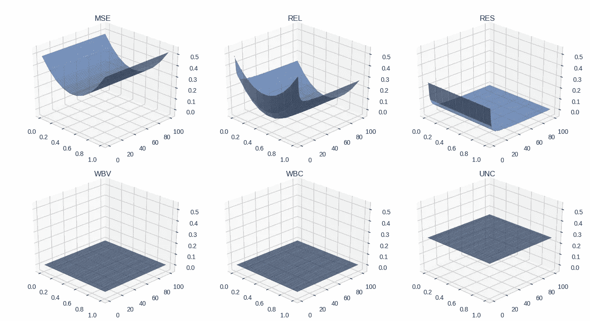

Simple case of an MSE decomposition for different groupings

正如公式中的意图，MSE 不依赖于分组，因此它仅在模型(预测概率)改变时改变。首先，WBV 和 WBC 项为零，因为只预测了一个概率，因此既没有方差也没有协方差。我们可以注意到 UNC 平台为 0.25，这代表了我们试图预测的数据的非常高(实际上是最大)的不确定性。当 n_k = 1 时，RES 自然最大并等于 UNC，但是当我们将越来越多的不同目标组合在一起时，RES 降低到零。最后但并非最不重要的是，对于最优模型，REL 的行为与预期一样，因为它在每个分组中都是最小值，并且由于大数定律，对于较大的分组，它收敛到零。

现在很明显，在原始的 MSE 度量中发生了很多事情。诚然，当试图评估具有内在随机性的任务的模型时，MSE 本身就足够好了，但分解 MSE=REL-RES+WBV-WBC+UNC 提供了更多关于该模型实际上有多好的预测概率的洞察力，这要归功于 REL 项。但是为了使 REL 能够提供信息，分组应该足够大，以便 LLN 能够生效。同时，太大的分组会使指标产生偏差，因为组内预测的概率会偏离平均值，组内成功率也会偏离平均值。

> 为了找到最佳分组，我们可以将目标定为最小化 REL + WBV，因为第一项希望组尽可能大，而第二项惩罚太大的组。

通过注意到当平均成功率不同于平均概率时，REL 增长，可以找到这个优化问题的近似解决方案。对于足够大的组，该误差与 **1/sqrt(n_k)** 的数量级相同。类似地，假设我们从对预测进行排序开始，然后将它们分组到区间中，知道如果区间收敛到单个点，WBV 将减小，我们可以最小化区间长度以最小化 WBV。我们还注意到，假设我们假设预测是均匀分布的，区间长度是**N _ k/N**——这是一个很大的假设，但这里只是寻找一个近似解。为了补偿优化目标中任何缺失的系数，我们最小化这两项的线性组合:

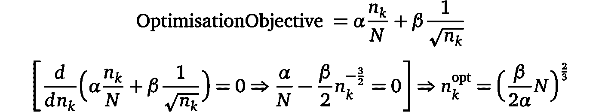

因此，我们找到了一个依赖于一些参数的近似解决方案，让我们改变这些参数，看看这在一些真实数据上看起来如何。

在 **Kwyk** 我们提供在线数学练习，让学生做这些练习，然后利用收集到的数据来预测学生在未来的练习中是否会成功，以校准其复杂性。我们用于此任务的分类器预测每个用户在每次练习中的概率，分布如下:

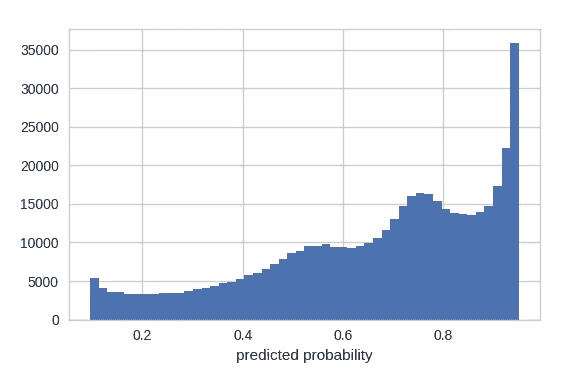

Histogram of the predicted probabilities of our classifier

使用这些概率，我们可以为不同的组大小绘制目标函数的演化图，并查看最小值出现的位置:

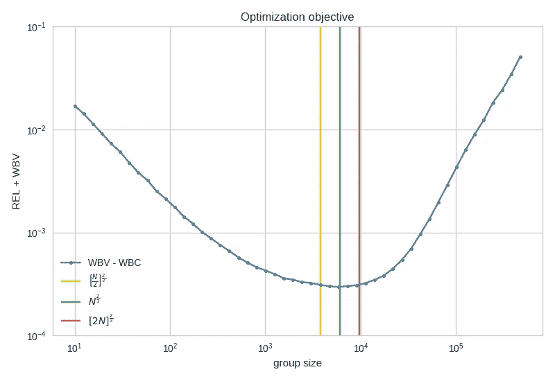

我们看到最佳分组确实符合我们的手工解决方案。我们还可以看到，经验最佳值大致在 **N^(2/3)** 附近，我们建议将此作为最佳团队规模的经验法则。

## 结论

总之，我们看到通常的分类标准在随机环境中是没有用的。在这些情况下，我们必须依赖回归度量，并直接评估我们的分类器预测“好”概率的能力。解决这个问题的一个方法是使用 MSE 并观察算法的表现。但是 MSE 是许多术语之间复杂相互作用的结果，每个术语都有特定的含义和目的。在随机设置中，MSE 中最有趣的部分是 REL，但这是假设我们之前已经对预测进行了分组。分组可以用几种方法进行，其中一些方法信息不够丰富。为了解决这个问题，我们必须使组足够大，以使 REL 由于 LLN 而收敛，但又足够小，以避免混合太多不同的预测概率。为此，我们提出了一个经验法则，它包括对概率进行排序，然后将 n_k = N^(2/3 个元素分组，并在此基础上使用 REL 度量来评估模型。

**奖金:** *我们的模型在预测学生成绩方面表现如何？*

这里是我们在 **Kwyk** 的数据中看到的所有指标。我们已经在 500，000 个样本上训练了我们的分类器，并以 66.30%的全局成功率(目标平均值)预测了 500，000 个不同的样本。这些指标是:

*   准确度分数(阈值 50%) = 75.34%
*   混淆矩阵(阈值 50%):

该模型似乎随机预测了负面影响

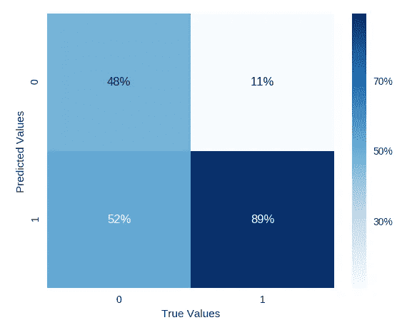

*   混淆矩阵(阈值 60%):

现在看起来没问题了…

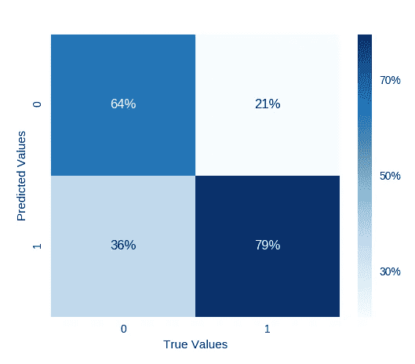

*   ROC 曲线和 AUC:

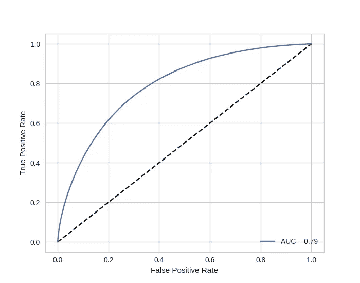

这意味着我们的模型有 79%的机会对随机选择的正面实例评分高于随机选择的负面实例。

*   MSE : 0.168(低值，但这并不能让我们对模型有所了解)

使用我们的经验法则，对于 n_k = N^(2/3 的组) :

*   UNC : 0.223(任务非常不确定，最大 UNC 为 0.25)
*   REL : 0.0002(这个模型相当精确)
*   RES : 0.054(知道 maxRES = UNC，分组就很好了)
*   (WBV，WBC) : (0.00001，0.00003)这些值非常低，表明分组概率非常相似。

*作者:*[*Hicham EL BOUKKOURI*](https://www.linkedin.com/in/hichamelboukkouri)