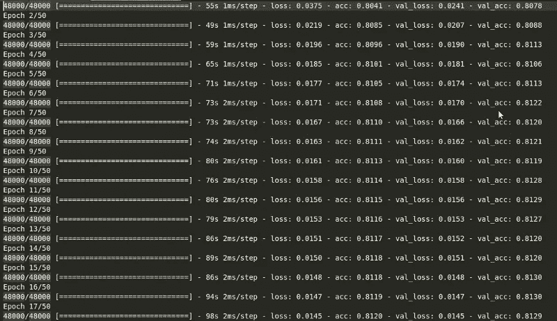
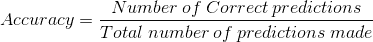
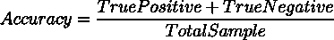
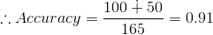
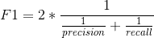
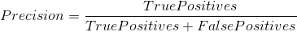
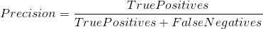
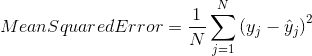

# 评估您的机器学习算法的指标

> 原文：<https://towardsdatascience.com/metrics-to-evaluate-your-machine-learning-algorithm-f10ba6e38234?source=collection_archive---------0----------------------->

评估你的机器学习算法是任何项目的重要组成部分。当使用度量标准 ***评估时，您的模型可能会给你满意的结果，比如 accuracy_score*** ，但当使用其他度量标准(如 ***【对数损失】*** 或任何其他此类度量标准)评估时，您的模型可能会给出糟糕的结果。大多数情况下，我们使用分类准确度来衡量模型的性能，但是这不足以真正判断我们的模型。在本帖中，我们将介绍不同类型的评估指标。

> 分类准确度
> 
> 对数损失
> 
> 混淆矩阵
> 
> 曲线下面积
> 
> F1 分数
> 
> 绝对平均误差
> 
> 均方误差

# **分类精度**

当我们使用术语“准确性”时，分类准确性就是我们通常所指的。它是正确预测数与输入样本总数的比率。

只有当属于每个类的样本数量相等时，它才能很好地工作。

例如，考虑在我们的训练集中有 98%的 A 类样本和 2%的 B 类样本。那么我们的模型通过简单预测属于 a 类的每一个训练样本，就可以轻松得到 **98%的训练准确率**。

当同一个模型在一个测试集上用 60%的 A 类样本和 40%的 B 类样本进行测试时，那么**测试精度会下降到 60%。**分类精度很高，但给我们达到高精度的错觉。

当小类样本的错误分类成本非常高时，真正的问题就出现了。如果我们处理一种罕见但致命的疾病，未能诊断出患者疾病的成本远远高于将健康人送去进行更多测试的成本。

# **对数损耗**

对数损失或对数损失通过惩罚错误的分类来起作用。它适用于多类分类。处理对数损失时，分类器必须为所有样本的每个类别分配概率。假设有属于 M 个类别的 N 个样本，则对数损失计算如下:

在哪里，

y_ij，表示样本 I 是否属于类 j

p_ij 表示样本 I 属于类 j 的概率

对数损失没有上限，它存在于范围[0，∞)内。对数损失越接近 0 表示精度越高，而如果对数损失远离 0 则表示精度越低。

总的来说，最小化日志损失为分类器提供了更高的准确性。

# **混淆矩阵**

顾名思义，混淆矩阵为我们提供了一个矩阵作为输出，并描述了模型的完整性能。

假设我们有一个二元分类问题。我们有一些样本属于两类:是或否。此外，我们有自己的分类器，它预测给定输入样本的类别。在 165 个样本上测试我们的模型，我们得到以下结果。

Confusion Matrix

有 4 个重要术语:

*   **真阳性**:我们预测为是，实际输出也为是的情况。
*   **真否定**:我们预测 NO 而实际输出 NO 的情况
*   **误报**:我们预测的是而实际输出是没有的情况
*   **假阴性**:我们预测为否而实际输出为是的情况。

矩阵的精度可以通过取**“主对角线”**上的值的平均值来计算，即

混淆矩阵构成了其他度量类型的基础。

# **曲线下面积**

*曲线下面积(AUC)* 是最广泛使用的评估指标之一。它用于二分类问题。*分类器的 AUC* 等于分类器将随机选择的正例排序高于随机选择的负例的概率。在定义 *AUC* 之前，让我们理解两个基本术语:

*   **真阳性率(灵敏度)**:真阳性率定义为 *TP/ (FN+TP)* 。真阳性率对应于所有阳性数据点中被正确认为是阳性的阳性数据点的比例。

*   **真阴性率(特异性)**:真阴性率定义为 *TN / (FP+TN)* 。假阳性率对应于所有阴性数据点中被正确认为是阴性的阴性数据点的比例。

*   **假阳性率**:假阳性率定义为 *FP / (FP+TN)* 。假阳性率对应于阴性数据点相对于所有阴性数据点被错误地认为是阳性的比例。

*假阳性率*和*真阳性率*都在**【0，1】**范围内。 *FPR* 和 *TPR* 都是在不同的阈值下计算的，例如(0.00，0.02，0.04，…)。1.00)并绘制图表。 *AUC* 是**【0，1】**中不同点的*假阳性率对*真阳性率的曲线下面积。

显然， *AUC* 的范围为[0，1]。值越大，我们模型的性能越好。

# **F1 得分**

> F1 分数用于衡量测试的准确性

F1 分数是精确度和召回率之间的调和平均值。F1 分数的范围是[0，1]。它告诉您您的分类器有多精确(它正确分类了多少个实例)，以及它有多健壮(它不会遗漏大量实例)。

高精度但低召回，给你一个非常准确的，但它错过了大量的实例，难以分类。F1 分数越大，我们模型的性能越好。数学上，它可以表示为:

F1 Score

F1 评分试图在精确度和召回率之间找到平衡。

*   **精度:**是正确的阳性结果数除以分类器预测的阳性结果数。

Precision

*   **回忆:**是正确阳性结果数除以 ***所有*** 相关样本数(本应鉴定为阳性的所有样本)。

Recall

# **平均绝对误差**

平均绝对误差是原始值和预测值之差的平均值。它为我们提供了预测与实际产出的差距。然而，它们不能给我们任何关于误差方向的概念，即我们是低估了数据还是高估了数据。数学上，它表示为:

# **均方误差**

均方误差(MSE)非常类似于平均绝对误差，唯一的区别是 MSE 取原始值和预测值之差的**平方**的平均值。MSE 的优点是更容易计算梯度，而平均绝对误差需要复杂的线性编程工具来计算梯度。由于我们取误差的平方，较大误差的影响变得比较小误差更明显，因此模型现在可以更多地关注较大误差。

Mean Squared Error

就是这样。

感谢阅读。对于任何建议或疑问，请在下面留下您的评论。

# 编辑

正如许多人指出的那样，一些术语中几乎没有错误。我想，我应该在发表这篇文章之前仔细阅读它。干杯！

# **参考文献**

 [## 理解对数损耗

### 对数损失，或简称为对数损失，是一种分类损失函数，常用作 kaggle…

www.exegetic.biz](http://www.exegetic.biz/blog/2015/12/making-sense-logarithmic-loss/)  [## 混淆矩阵术语简单指南

### 混淆矩阵是一个表格，通常用于描述分类模型的性能(或…

www.dataschool.io](http://www.dataschool.io/simple-guide-to-confusion-matrix-terminology/)  [## API 参考-sci kit-了解 0.19.1 文档

### 这是 scikit-learn 的类和函数引用。请参阅完整的用户指南了解更多详情，因为…

scikit-learn.org](http://scikit-learn.org/stable/modules/classes.html#sklearn-metrics-metrics)  [## 如何解读 F-measure 值？

### 我想知道如何解释 f 值的差异。我知道 f-measure 是一个平衡均值…

stats.stackexchange.com](https://stats.stackexchange.com/questions/49226/how-to-interpret-f-measure-values)  [## AUC 代表什么，是什么？

### 到处寻找，也没能找到 AUC，如与预测相关的，代表什么或意味着什么。

stats.stackexchange.com](https://stats.stackexchange.com/questions/132777/what-does-auc-stand-for-and-what-is-it) 

如果你喜欢这篇文章，请点击👏图标来支持它。这将有助于其他媒体用户找到它。分享一下，让别人也能看。