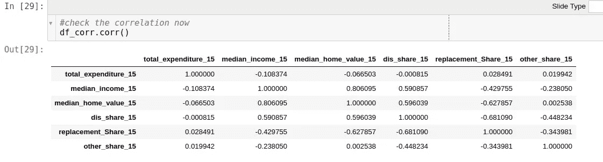
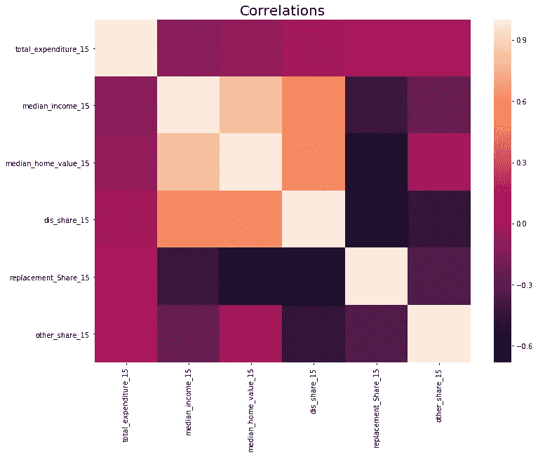

# 2015 年大都市家庭装修支出趋势分析和 2017 年预测

> 原文：<https://towardsdatascience.com/metropolitan-trends-analysis-for-home-improvement-spending-in-2015-and-projection-for-2017-ca2a8609ceba?source=collection_archive---------21----------------------->

## Python 中的熊猫和 Plotly & Seaborn 中的图形分析

**数据集**:来自[哈佛大学住房研究联合中心](http://www.jchs.harvard.edu/research-areas/reports/demographic-change-and-remodeling-outlook)。我在[之前发表在](https://medium.com/@manjula.mishra/home-remodeling-analysis-turned-excel-data-handling-in-python-e1115f8302e4)[数据科学](https://towardsdatascience.com/)的文章中使用了相同数据集的子集。

**该数据集中感兴趣的特征:**

*   25 个美国大都市地区
*   收入中位数:2015 年
*   房屋价值中位数:2015 年
*   可自由支配的”(厨房、浴室、房间扩建和外部附件)、“替换”(外部、内部、系统和设备)和“其他”(灾难修复、地段或庭院的改善)家居装修支出类别
*   2015 年家装总支出
*   2017 年预计实际年度百分比变化

**我的分析的要点:**

*   交互式图表，以便更仔细地查看这些数字
*   可自由支配支出和替代支出呈现负相关
*   房屋价值中值和收入中值(显然)高度相关
*   每位业主的平均支出(房屋装修)和房屋价值中值并不能说明全部情况
*   2015 年家装支出趋势和 2017 年预测
*   相关矩阵
*   附 Jupyter 笔记本在最后看到的原始工作

让我们现在开始深入分析。下面是各种特性的相关矩阵表。有趣的是，中值收入和重置类支出百分比之间呈负相关，而中值收入和可自由支配的家庭装修支出呈正相关。这是否意味着随着收入的增加，越来越多的人喜欢改造他们的厨房/浴室/或者增加一个房间/户外设施？或者替换类别上的项目不需要更改？还是随着收入的增加，房主喜欢让他们的房子现代化？有趣的假设，但我没有分析足够的数据来得出任何结论。

下图显示了相关性的强度。一些负相关让我感到惊讶。例如，房屋价值中位数和重置类支出。这将是一个有趣的调查，如果花在美化厨房或/和增加更多的房间等内部装饰上的支出会推动房屋价值的上升。这超出了我在这篇文章中的分析范围。

第一张图显示了可自由支配支出百分比与替代支出百分比之间明显的负相关关系。可自由支配的支出包括厨房、浴室和户外露台等，而替代支出包括屋顶、窗户和绝缘等项目。从图表来看，房主似乎可以负担得起/选择在其中一个类别上花费，而不是两个都花。

一些大都市地区比其他地区更贵/更值钱。很明显，中等收入水平较高的城市拥有更昂贵的住房。

既然我们刚刚讨论了房屋价值和收入的中位数，那么看看在同一个大都市地区，每位房主在房屋装修上的平均支出会很有意思。从图中可以看出，平均每位业主的支出看起来更低。

上图没有非常清晰地显示出每位车主的平均支出。所以我把它画在下面:

2015 年的家装支出和 2017 年的预测在所有 25 个大都市地区几乎完全重叠。这对企业来说既是好消息也是坏消息。这是一个好消息，因为市场看起来很稳定，没有任何冲击和投机，但另一方面，这也意味着市场额外增长或井喷式增长的可能性较小。

上图迫使我在下图中画出预计的实际年度百分比变化。威斯康星州密尔沃基市和密苏里州堪萨斯市预计增长率最高，而德克萨斯州休斯顿市和佛罗里达州迈阿密市预计增长率为负值。

我的 Jupyter 笔记本展示了数据集和原始作品。