# 使用 Jupyter 笔记本的 ESP 上的 MicroPython

> 原文：<https://towardsdatascience.com/micropython-on-esp-using-jupyter-6f366ff5ed9?source=collection_archive---------3----------------------->

让我们使用 Jupyter 笔记本在 ESP 上玩 MicroPython，以便从传感器获取数据并在物理世界中采取行动。

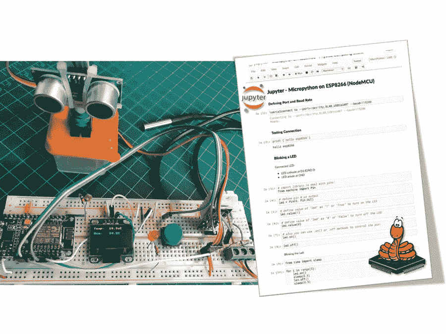

## 1.介绍

在之前的一篇文章中，我们探讨了如何使用 Jupyter 笔记本控制 Raspberry Pi:[使用 Jupyter 笔记本进行物理计算](https://medium.com/@rovai/physical-computing-using-jupyter-notebook-fb9e83e16760)

这是一次很棒的体验，一旦项目运行良好，我就想，“在 ESP8266 上(甚至在 ESP32 上)使用 MicroPython 测试 Jupyter Notebook 怎么样？”。

众所周知，Jupyter Notebook 是一个开源的 web 应用程序，允许您创建和共享包含实时代码、等式、可视化和叙述性文本的文档。用途包括数据清理和转换、数值模拟、统计建模、数据可视化、机器学习等等。对于“更多”，我们还探讨了“物理计算”。

到目前为止，在我的项目中，我主要使用由 Arduino IDE 使用其 C/C++类型语言编程的 ESP8266–01、8266–12E(node MCU)和 ESP32 来探索物联网和物理计算项目。但是另一个用于编程这些设备的伟大工具是 MicroPython:

> MicroPython 是 Python 3 编程语言的一个精简而高效的实现，它包括 Python 标准库的一个小子集，并针对在微控制器和受限环境中运行进行了优化。它的目标是尽可能与普通 Python 兼容，以允许您轻松地将代码从桌面转移到微控制器或嵌入式系统。

此外，我认为使用 Jupyter Notebook 对使用 MicroPython 的 ESP 设备进行编程是一个很好的工具，可以向孩子们教授物理计算，还可以帮助科学家在获取数据时快速进入真实世界玩传感器。

这是我们将在本教程中尝试完成的任务:

*   输出数字信号以打开/关闭 LED
*   从按钮读取数字输入
*   输出 PWM 信号以使 LED 变暗
*   使用 PWM 输出控制伺服电机位置
*   读取模拟信号(使用 LDR 的亮度)
*   读取温度阀 1 线(DS18B20)
*   读取温度和湿度(DHT22)
*   通过 I2C 总线使用有机发光二极管显示数据。

## 2.安装 MicroPython

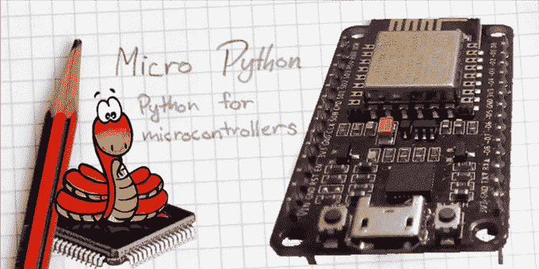

对于一个新的 NodeMCU(或 ESP32)，要做的第一件事是擦除其内存中加载的内容，“刷新”一个新的固件，这将是 MicroPython 解释器。

A.获取新固件:

进入网站: [MicroPython 下载](http://micropython.org/download#esp8266)并为您的设备下载相应的固件:

例如，对于 ESP8266，最新版本为:

```
esp8266-20180511-v1.9.4.bin (Latest 01Jun18)
```

(你可以在这里找到如何安装固件[的细节](http://docs.micropython.org/en/latest/esp8266/esp8266/tutorial/intro.html#deploying-the-firmware))

理想的情况是创建一个目录，您将在其中使用 MicroPython。例如，对于 mac，从您的根目录开始:

```
cd Documents
mkdir MicroPython
cd MicroPython
```

B.将下载的 ESP8266 固件移动到这个最近创建的目录中。

> 此时:使用串行 USB 电缆将 NodeMCU 或 ESP32 连接到您的 PC。

C.使用以下命令检查您的设备正在使用的串行端口:

```
ls /dev/tty.*
```

就我而言，我得到了:

```
/dev/tty.SLAB_USBtoUART
```

D.安装 *esptool* (用于刷新/擦除设备固件的工具)

```
pip install esptool
```

E.擦除 NodeMCU 闪存:

```
esptool.py --port /dev/tty.SLAB_USBtoUART erase_flash
```

F.刷新新固件:

```
esptool.py --port /dev/tty.SLAB_USBtoUART --baud 460800 write_flash --flash_size=detect 0 esp8266-20180511-v1.9.4.bin
```

安装固件后，您可以在终端上使用命令“Screen”玩 REPL*:

```
screen  /dev/tty.SLAB_USBtoUART 115200
>>> print (‘hello ESP8266’)
>>> hello ESP8266
```

如果你在 REPL，使用:

[Ctrl+C]来中断 pgm 和

[Ctrl+A] [K] [Y]退出并返回终端。

* REPL 代表“*读取评估打印循环”*，是您可以在 ESP8266 上访问的交互式 MicroPython 提示符的名称。你可以在这里了解更多关于 REPL [的信息。](http://docs.micropython.org/en/latest/esp8266/esp8266/tutorial/repl.html)

## 3.安装 Jupyter MicroPython 内核

为了通过串行 REPL 与 MicroPython ESP8266 或 ESP32 交互，我们需要安装一个特定的 Jupyter 内核。

> 这只需要做一次。

从 [Jupyter 文档网站](http://jupyter.org/documentation)，我们可以列出所有“社区维护的内核”。在那里，我们将被送到:

[Jupyter MicroPython 内核](https://github.com/goatchurchprime/jupyter_micropython_kernel/)

一旦我们在机器上安装了 Python 3(在我的例子中是 Mac)，使用 shell 命令(即在命令行上)将存储库克隆到一个目录中:

```
git clone https://github.com/goatchurchprime/jupyter_micropython_kernel.git
```

接下来，使用 shell 命令将库(在可编辑模式下)安装到 Python3 中:

```
pip install -e jupyter_micropython_kernel
```

这将在 python/中创建一个指向该目录的小文件../site-packages 目录，并使它能够在以后得到改进时“git update”这个库。


> 这里可能会出错，如果您安装了大量不同版本的 python，您可能需要“pip3”或“sudo pip”。

使用 shell 命令将内核安装到 Jupyter 中:

```
python -m jupyter_micropython_kernel.install
```

这将创建一个小文件”。local/share/jupyter/kernels/micropython/kernel . JSON ”, jupyter 用它来引用它的内核。

要找出您的 kernelspecs 存储在哪里，您可以键入:

```
jupyter kernelspec list
```

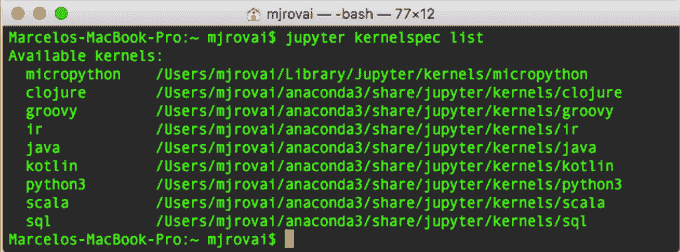

终端 PrintScreen 显示了我在机器上安装的内核列表。注意，在我的例子中，我使用 PIP3 命令安装了 MicroPython 内核，因此，这个内核与其他内核不在同一个目录中(当我试图使用 PIP 安装我的内核时，出现了一个错误)。

现在运行 Jupyter 笔记本:

```
jupyter notebook
```

在笔记本中单击右上角的“新建”按钮，您应该会看到列出的内核显示名称:“MicroPython — USB”。

在第一个单元格中，您需要定义将要使用的端口和波特率(115200 就可以了):

```
%serialconnect to --port=/dev/tty.SLAB_USBtoUART --baud=115200
```

作为响应，单元格将返回:

```
Connecting to --port=/dev/tty.SLAB_USBtoUART --baud=115200
Ready.
```

就是这样！当“Ready”出现时，您应该能够通过运行单元来执行 MicroPython 命令。

让我们试试:

```
print ('hello esp8266')
```

您应该会在储存格的输出上收到 ESP8266 的回应:

```
hello esp8266
```


## 4.LED 闪烁

像往常一样，让我们开始我们的物理计算之旅，“闪烁的 LED”。

低于 NodeMCU 的典型引脚排列(ESP8266–12E 1.0 版):


> 可用管脚有:0、1、2、3、4、5、12、13、14、15、16，对应的是 ESP8266 芯片的实际 GPIO 管脚数。请注意，许多最终用户板使用自己的专用引脚编号(例如标记为 D0、D1 等)。

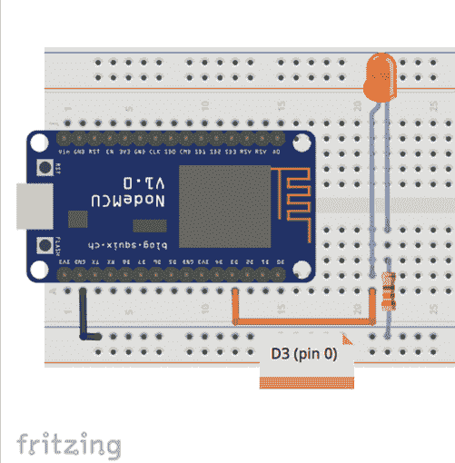

在 NodeMCU 引脚 0 (D3)上安装一个 LED 并测试它，打开和关闭它:

```
# import library to deal with pins:
from machine import Pin# define pin 0 as output
led = Pin(0, Pin.OUT)# define value of "led" as "1" or "True" to turn on the LED
led.value(1)# define value of "led" as "0" or "False" to turn off the LED
led.value(0)# also you can use .on() or .off methods to control the pin:
led.on()
led.off()
```

现在，让我们导入一个时间库并使 LED 闪烁:

```
from time import sleepfor i in range(5):
    led.on()
    sleep(0.5)
    led.off()
    sleep(0.5)
```

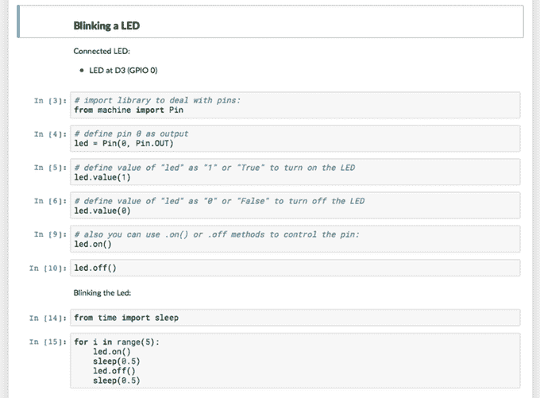

## 5:输入数字信号

你可以在 NodeMCU 上读取的简单传感器数据可以通过一个按钮获得。

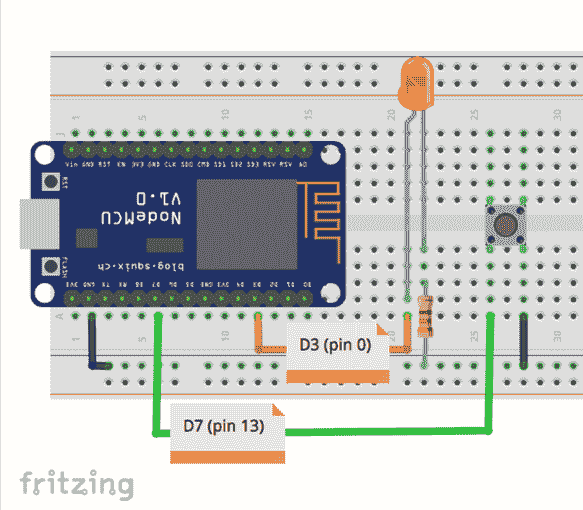

让我们如图所示，在 13 号插脚(D7)和 GND 之间安装一个按钮。

我们按钮的连接方式是，引脚 13 的正常状态为“高”(因此我们将使用一个内部上拉电阻来保证这种状态)。按下时，引脚 13 将为“低”。

```
# define pin 13 as an input and activate an internal Pull-up resistor:button = Pin(13, Pin.IN, Pin.PULL_UP)# Read button state:
print(button.value())
```

当运行上述单元时(不按按钮)，结果将是:

```
1
```

按下按钮，再次运行电池:

```
# Read button state:
print(button.value())
```

现在的结果是:

```
0
```

请注意，停止按下按钮不会将“单元格值”返回到“1”。若要查看“^ 1”，您必须再次运行该单元格。

现在让我们做一个小程序，仅当按钮被按下时才打开 LED:

```
print (button.value())
if button.value() == 0:
    led.on()
else:
    led.off()
```

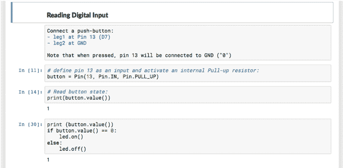

## 6.脉宽调制

除引脚(16)外，所有引脚都可以使能 PWM。所有通道都有一个单一的频率，范围在 1 到 1000 之间(以 Hz 为单位)。占空比介于 0 和 1023 之间，包括 0 和 1023。

开始调用适当的库:

```
from machine import Pin, PWM
```

有几个命令可用:

```
pwm0 = PWM(Pin(0))      # create PWM object from a pin
pwm0.freq()             # get current frequency
pwm0.freq(1000)         # set frequency
pwm0.duty()             # get current duty cycle
pwm0.duty(200)          # set duty cycle
pwm0.deinit()           # turn off PWM on the pin
```

或者您可以设置立即配置 pin:

```
pwm2 = PWM(Pin(2), freq=500, duty=512)
```

让我们将连接到引脚 0 的 LED 从关闭调光到打开:

```
from machine import Pin, PWM
pwm0 = PWM(Pin(0), freq=1000, duty=0)
for i in range (0,1023,20):
    pwm0.duty(i)
    sleep(0.1)
    pwm0.duty(0)
    pwm0.deinit()
```

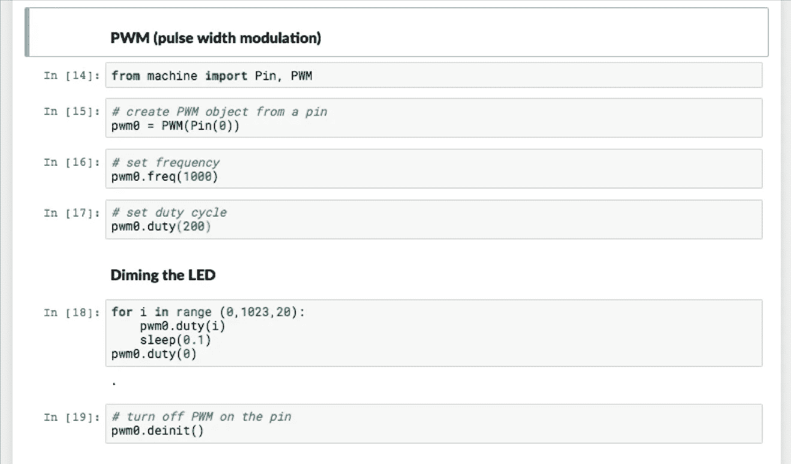

控制一个伺服电机怎么样？

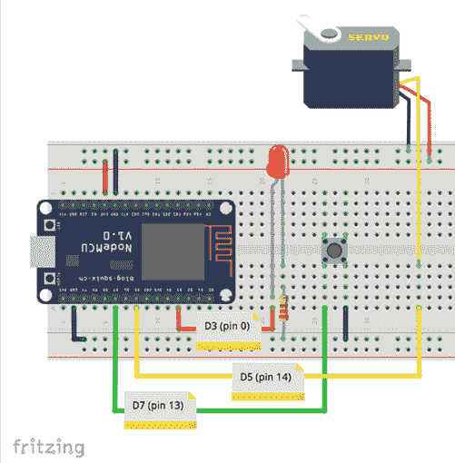

让我们在 NodeMCU 上安装一个小的爱好伺服，如图所示。请注意，我将伺服 VCC 连接到 NodeMCU +3.3V。这对于本教程来说是可以的，但在实际项目中，您必须将伺服 VCC 连接到外部+5V 电源(不要忘记将 GNDs 连接到 NodeMCU GND)。

伺服数据引脚将连接到 NodeMCU 引脚 14 (D5)。

伺服系统通常以 50Hz 的频率工作，然后在大约 40 和 115 之间的占空比将它们分别从 0 度定位到 180 度。占空比 77 会将伺服定位在其中心值(90 度)。

```
servo = PWM(Pin(14), freq=50)
```

在不同位置测试伺服系统:

```
# Minimum position (angle 0)
servo.duty(40)# Maximun position (angle 180)
servo.duty(40)# center position (angle 90)
servo.duty(40)
```

您也可以创建一个简单的交换程序来测试您的伺服:

```
# swipping servo
step = 2
for i in range (40, 115, step):
    servo.duty(i)
    sleep (0.1)
    step = -1*stepfor i in range (115, 40, step):
    servo.duty(i)
    sleep (0.1)
    servo.duty(77)
```

结果下方:

我在这里不使用声纳，所以我将留给你开发一个代码来使用它。很简单 alheady！试试看！

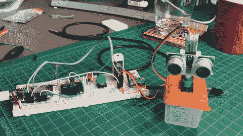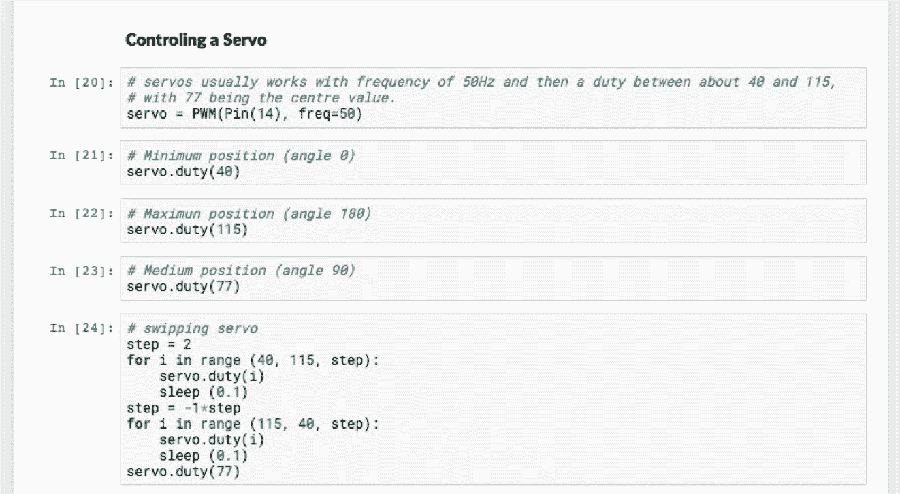

## 7.模拟输入(测量亮度)

ESP8266 有一个引脚 A0，可用于读取模拟电压并将其转换为数字值。您可以使用以下公式构建这样一个 ADC 引脚对象:

```
from machine import ADC
adc = ADC(0)
```

接下来，您可以使用以下公式读取 A0 引脚的值:

```
adc.read()
```

例如，模拟引脚可以用来读取作为分压器的电位计的变量值。这可以被解释为用于调暗 LED 或将伺服移动到特定位置的输出。你可以根据我们目前了解到的情况来尝试一下。

另一个有用的例子是使用 LDR(“光敏电阻”)从模拟传感器捕获数据，如温度(LM35)、紫外线(UV)辐射或光度。

当光度增加时，LDR 会减小其电阻。因此，您可以用 LDR 和电阻创建一个分压器，如图所示。

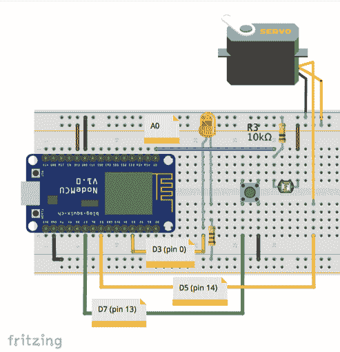

直接读取电阻上的模拟电压，我们将获得与亮度成正比的信号。

让传感器暴露在光线下，读取 ADC 值。

现在，盖住传感器，得到一个较低的值。

就我而言:

*   最大亮度==> adc 值> 850
*   最小亮度==> adc 值< 40

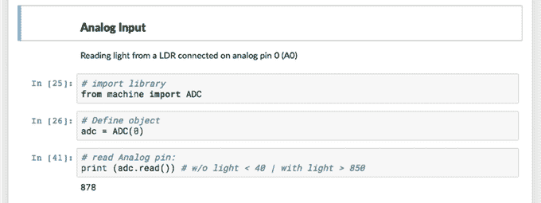

## 8\. Controlling 1-Wire Devices

The 1-wire bus is a serial bus that uses just a single wire for communication (in addition to wires for ground and power). The DS18B20 temperature sensor is a very popular 1-wire device, and here we show how to use the "onewire" module to read from such a device.

For the following code to work you need to have at least one DS18B20 temperature sensor with its data line connected to GPIO 2 (D4).

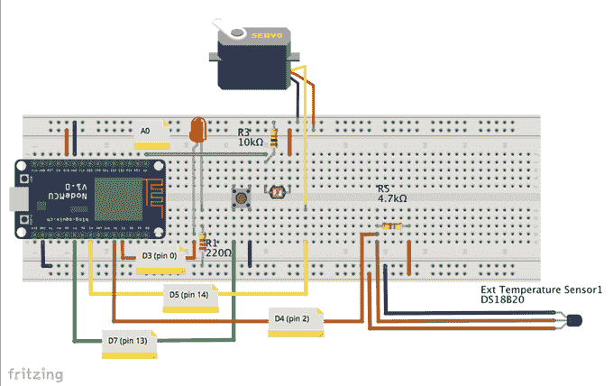

You must also power the sensors and connect a 4.7k Ohm resistor between the data pin and the power pin as shown in the diagram.

Import the libraries:

```
import onewire, ds18x20
```

Define which pin the 1-wire device will be connected. In our case ==>引脚 2 (D4)

```
dat = Pin(2)
```

创建单线对象:

```
ds = ds18x20.DS18X20(onewire.OneWire(dat))
```

扫描总线上的设备。请记住，同一总线上可以连接多个设备。

```
sensors = ds.scan()
print('found devices:', sensors)
```

“传感器”是一个数组，包含所有相连的单线传感器的地址。我们将使用“sensors[0]”来指向我们的传感器。

请注意，您必须执行 *convert_temp()* 函数来启动温度读数，然后等待至少 750 毫秒再读取数值(不要忘记导入时间库)。要读取该值，请使用:*ds . read _ temp(sensors[0]):*

```
ds.convert_temp()
time.sleep_ms(750)
print(ds.read_temp(sensors[0]))
```

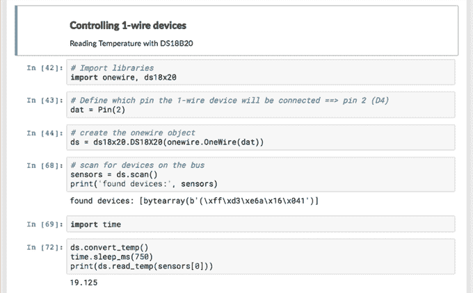

## 9.使用 DHT 传感器读取温度和湿度

DHT(数字湿度和温度)传感器是低成本的数字传感器，配有电容式湿度传感器和热敏电阻来测量周围的空气。它们具有一个处理模数转换的芯片，并仅使用一根数据线提供数字接口。新型传感器还提供了 I2C 接口。

DHT11(蓝色)和 DHT22(白色)传感器提供相同的数字接口，但 DHT22 需要一个单独的对象，因为它有更复杂的计算。DHT22 的湿度和温度读数都有 1 位小数分辨率。DHT11 有两者的整数。自定义协议用于从传感器获取测量值。有效载荷由湿度值、温度值和校验和组成。

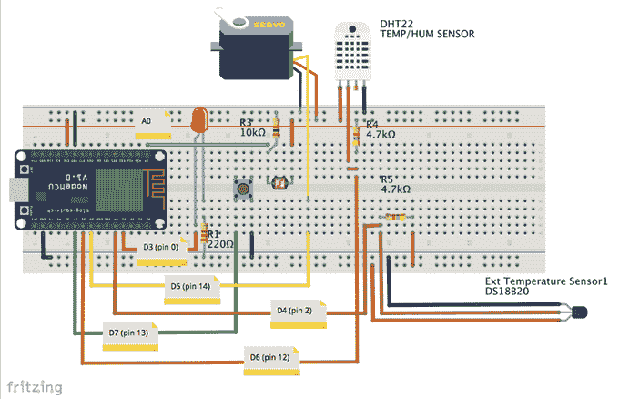

如图所示连接 DHT22。数据引脚将连接到 NodeMCU 引脚 12 (D6)。

要使用 DHT 接口，请构造引用其数据 pin 的对象。开始呼叫图书馆:

```
from dht import DHT22
```

定义适当的 pin 并构造对象:

```
data = DHT22(Pin(12))
```

获取温度和湿度值:

```
data.measure()
temp = data.temperature()
hum = data.humidity()print('Temp: {}oC'.format(temp))
print('Hum:  {}%'.format(hum))
```

为了获得最准确的结果，DHT11 每秒最多只能调用一次，DHT22 每两秒调用一次。传感器精度会随着时间的推移而降低。每个传感器支持不同的工作范围。详情请参考产品数据表。

> DHT22 传感器现在以 AM2302 的名称出售，在其他方面是相同的。

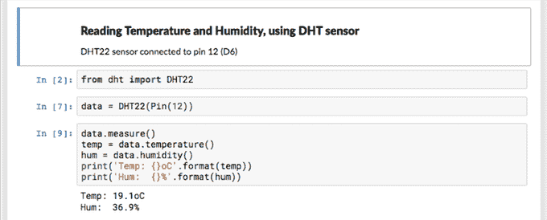

## 10.I2C——使用有机发光二极管显示器

I2C 是用于设备间通信的双线协议。在物理层，它由两条线路组成:

*   SCL 和 SDA，分别是时钟和数据线。

I2C 对象是附加到特定总线上创建的。它们可以在创建时初始化，也可以在以后初始化。

首先，让我们导入库:

```
from machine import I2C
```

考虑引脚 4 (SDA)和引脚 5 (SCL)上的器件，让我们创建一个 i2c 对象:

```
i2c = I2C(scl=Pin(5), sda=Pin(4))
```

现在，你应该扫描 I2C 总线上的最终设备。下面的函数将完成这项工作，返回连接设备的数量及其地址:

```
def scanI2c():
    print('Scan i2c bus...')
    devices = i2c.scan() if len(devices) == 0:
        print("No i2c device !")
    else:
        print('i2c devices found:',len(devices)) for device in devices:
        print("Decimal address: ",device," | Hexa address: ",hex(device))
```

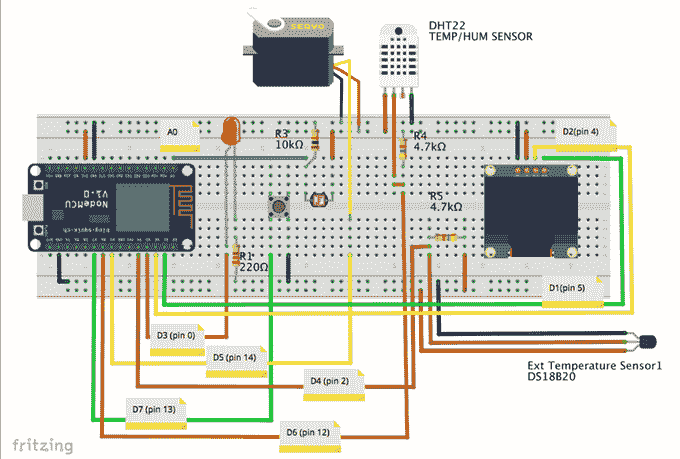

让我们在节点 MCU 上安装一个 I2C·有机发光二极管显示器，如图所示。显示器是固态硬盘 1306 (128 x 64)。

运行扫描功能:

```
scanI2c()
```

我们将得到的结果是，在地址 0x3c 找到了 1 个设备。

该地址将用于创建 oled 对象，如下所示:

```
import ssd1306
i2c = I2C(scl=Pin(5), sda=Pin(4))
oled = ssd1306.SSD1306_I2C(128, 64, i2c, 0x3c)
```

管理显示的一些方法:

```
poweroff(), turns off the screen. Convenient for battery operation.contrast(), to adjust the contrastinvert(), invert the colors of the screen (finally white and black!)show(), to refresh the viewfill(), to fill the screen in black (1) or white (0)pixel(), to turn on a particular pixelscroll(), scroll the screen.text(), to display on text at the indicated x, y positionDraw lines hline(), vline() or any line line()Draw a rect rect rectangle() or rectangle filled fill_rect()
```

让我们测试一下我们的展示:

```
oled.fill(0)
oled.text("Hello esp8266", 0, 0)
oled.show()
```

现在，让我们在 put 有机发光二极管上显示 DHT22 传感器数据:

```
data.measure()
temp = data.temperature()
hum = data.humidity()oled.fill(0)
oled.text("Temp:  " + str(temp) + "oC", 0, 0)
oled.text("Hum:   " + str(hum) + "%",0, 16)
oled.show()
```

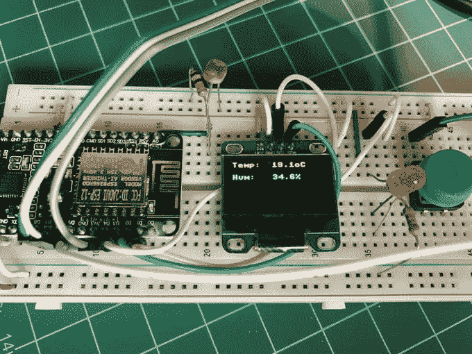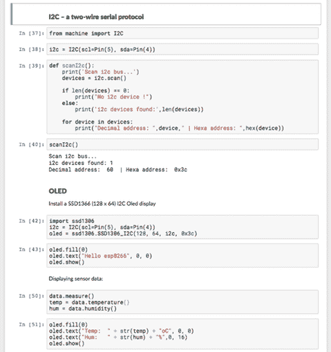

## 11.更进一步

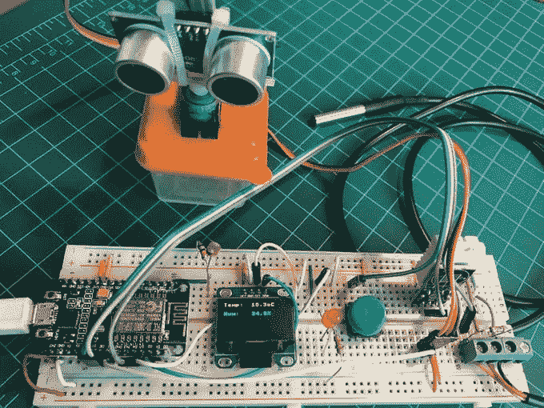

本文为您提供了构建一个更健壮的项目的一些细节，使用 MicroPython 作为编程语言，使用 Jupyter Notebook 作为快速开发和分析的工具。

当然，如果您想在独立于您的 PC 和 Jupyter 的 NodeMCU 上运行用 MicroPython 编写的程序，您必须在任何文本编辑器中将您的代码保存为“main.py”文件，并使用 Adafruit 开发的实用程序:" [Ampy](https://github.com/adafruit/ampy) "将其下载到您的设备上，以便通过串行连接与 MicroPython 板进行交互。

Ampy 是一个简单的命令行工具，通过串行连接在 MicroPython 板上操作文件和运行代码。使用 ampy，您可以将文件从您的计算机发送到 MicroPython 板的文件系统，将文件从板下载到您的计算机，甚至将 Python 脚本发送到板来执行。

安装:

```
sudo pip3 install adafruit-ampy
```

Ampy 通过其串行连接与 MicroPython 板通信。您需要连接您的主板，并安装任何驱动程序来访问它的串行端口。然后，例如，要列出板上的文件，运行如下命令:

```
ampy --port /dev/tty.SLAB_USBtoUART ls
```

为了方便起见，您可以设置一个 AMPY_PORT 环境变量，如果未指定 PORT 参数，将使用该变量。例如在 Linux 或 OSX 上:

```
export AMPY_PORT=/dev/tty.SLAB_USBtoUART
```

因此，从现在开始，您可以简化命令:

列出内部节点 MCU 文件:

```
ampy ls
```

您可以使用以下命令读取安装在 nodeMCU 上的文件:

```
ampy get boot.py
```

一旦使用文本编辑器(例如 nano)创建了一个文件，就可以使用以下命令将其安装到 NodeMCU 上:

```
ampy put main.py
```

现在，当您按下 NodeMcu 上的“Reset”按钮时，首先运行的程序是“main.py”。

对于 Windows，请参见此处的 Adafruit 说明[。](https://github.com/adafruit/ampy)

## 12.结论


一如既往，我希望这个项目可以帮助其他人找到进入令人兴奋的电子世界的方法！

详情和最终代码请访问我的 GitHub 存管: [Pyhon4DS/Micropython](https://github.com/Mjrovai/Python4DS/tree/master/Micropython)

更多项目，请访问我的博客:【MJRoBot.org 

来自世界南部的 Saludos！

我的下一篇文章再见！

谢谢你，

马塞洛