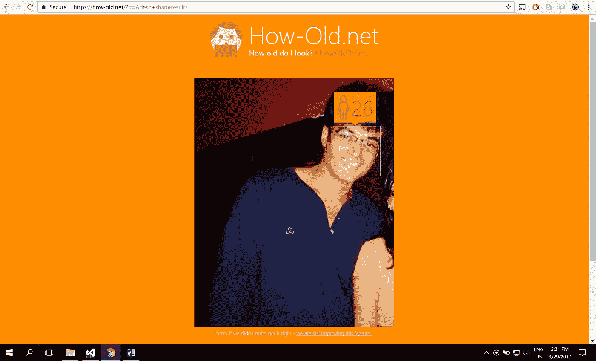
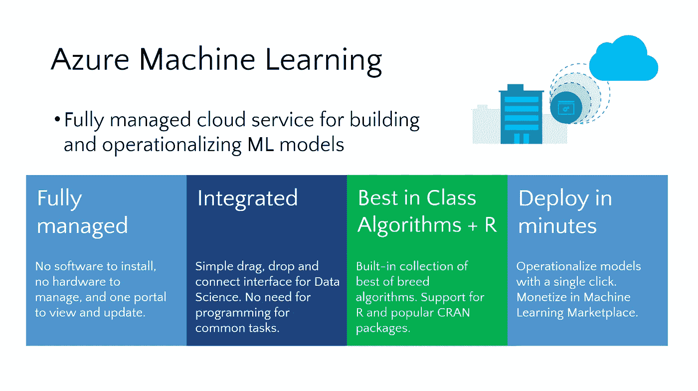
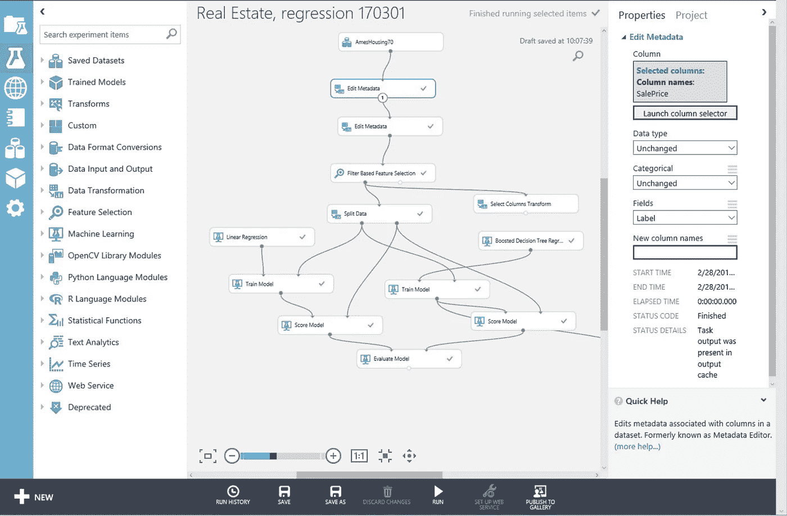
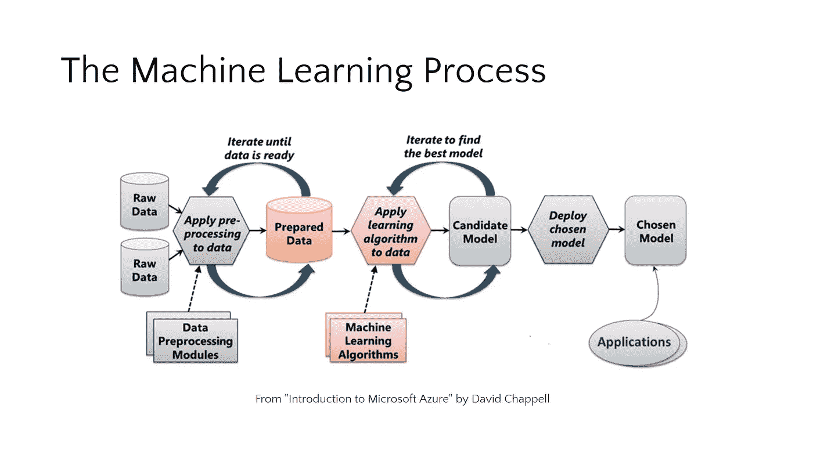
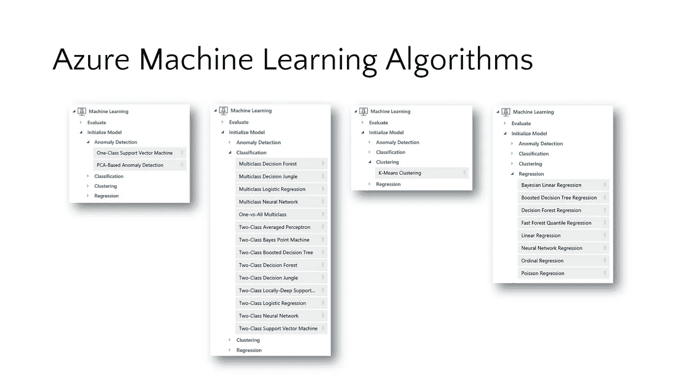
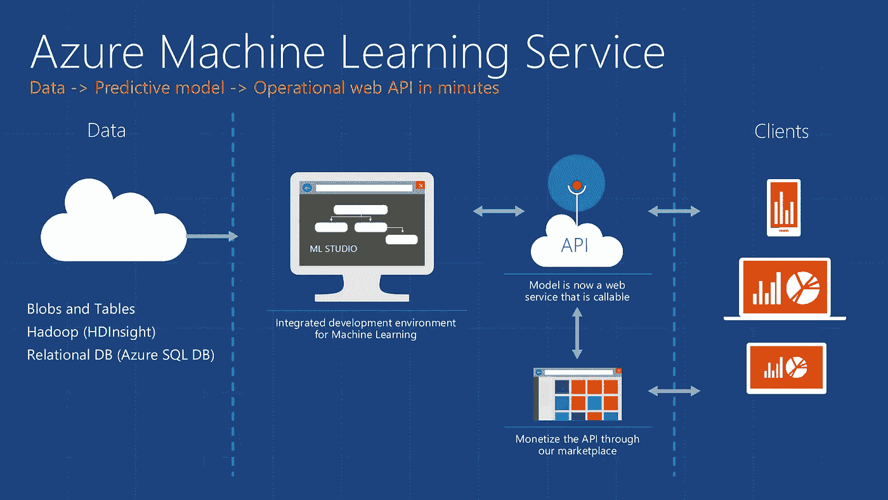

# 微软 Azure 机器学习

> 原文：<https://towardsdatascience.com/microsoft-azure-machine-learning-336f83b0f27b?source=collection_archive---------3----------------------->

# 什么是机器学习？

我先说什么是机器学习。这就是这个世界，在这个世界里，我们有人类和电脑。我们人类从过去的经验中学习，而计算机通过遵循我们编程的指令来学习。问题是我们能让计算机从过去的经验中学习吗？

答案是肯定的，但这种体验有一个名字，叫做数据，因此计算机从以前的数据中学习，这就是机器学习。

机器学习模型分为两大类:有监督的和无监督的。在监督学习中，用大量数据“训练”模型，然后使用算法从未来输入中预测结果。大多数监督学习模型使用回归算法从一组连续的可能结果中计算出一个结果(例如，您的测试分数)，或者使用分类算法从一组有限的可能结果中计算出一个结果的概率(例如，电子邮件是垃圾邮件或者信用卡交易是欺诈性的概率)。在无监督学习中，计算机不是经过训练的，而是呈现给它一组数据，并要求它找出其中的关系。K-Means 聚类是一种常见的无监督学习算法。关于其工作原理的详细解释，请参见 https://blog . intercom . io/machine-learning-way-easy than-it-looks/。

https://how-old.net/#的[提供了一个很好的机器学习的例子。该网站由微软创建，使用先进的图像识别技术来分析你上传的照片，然后使用 ML 模型来“预测”照片中人的年龄。](https://how-old.net/)

Azure 机器学习是一种基于云的预测分析服务，为所有技能水平的数据科学家提供简化的体验。它伴随着 Azure Machine Learning Studio(ML Studio)，这是一个基于浏览器的工具，为构建机器学习模型提供了一个易于使用的拖放界面。它带有一个节省时间的实验库，并具有由微软业务(如 Bing)在现实世界中开发和测试的一流算法。它对 R 和 Python 的内置支持意味着您可以构建定制脚本来定制您的模型。一旦您在 ML Studio 中构建并训练了您的模型，您就可以很容易地将它公开为一个 Web 服务，可以从各种编程语言中使用，或者通过将它放在 Cortana Intelligence Gallery 中与社区共享。

ML Studio 通过提供一个拖放模型来简化机器学习，您可以在该模型中构建工作流。使用 ML Studio 和它为工作流建模提供的各种模块，您通常可以不用编写一行代码就可以构建复杂的模型。但是，它允许您在工作流中的任何地方插入 R 和 Python 代码，为您可以建模的内容提供了无限的灵活性。

ML 从数据开始，数据可以来自多种来源。数据在使用之前通常需要被“清理”, ML Studio 包含了帮助清理的模块。(清理的示例包括删除丢失数据的行、用算法替换丢失的数据、删除重复的行以及删除包含“异常值”的行在实践中，清理数据可能非常耗时，通常会消耗构建模型所需时间的 50%。)一旦数据准备好了，你就选择一个算法，通过允许它迭代数据并在其中找到模式来“训练”模型。之后是对模型的评分和评估，这将告诉你模型预测结果的能力。所有这些都是在 ML Studio 中可视化执行的。一旦模型准备就绪，只需点击几个按钮就可以将其部署为 Web 服务，这样就可以从客户端应用程序调用它。

ML Studio 提供了机器学习中使用的 25 种经典算法的固定实现。它将它们分为四类。

异常检测是对数据集中不符合预期模式的项目、事件或观察结果或其他项目的识别。一个典型的例子是检查代表银行交易的数据集，并检测该组中潜在的欺诈交易。

回归算法寻求建立和量化变量之间的关系。通过在因变量和一个或多个自变量之间建立关系，回归分析能够在给定一组输入的情况下以可量化的准确度预测因变量的值。一个很好的例子可以在[https://how-old.net/#](https://how-old.net/)看到，这个网站让你上传一张照片，然后以不可思议的准确度猜测你的年龄。该网站使用 Azure 机器学习，并将经典回归与高级图像识别相结合。

分类算法的目的是基于由已经被分类(分配到一个类别)的观察值组成的训练数据来识别观察值所属的类别。一个很好的例子是确定一封电子邮件属于“垃圾邮件”还是“非垃圾邮件”。

聚类寻求以这样的方式对一组对象进行分组，即同一组(称为聚类)中的对象彼此之间比其他组(聚类)中的对象更相似。

Azure ML 备忘单可以帮助你为一个模型选择正确的算法，即使你不是一个训练有素的数据科学家。例如，如果您想要使用一组输入值来预测一组连续值的输出值(例如，一个人的年龄)，请使用线性回归。但是，如果您对输出的分布更感兴趣，可以使用快速森林分位数回归。使用后者的一个例子是使用生长图表来评估儿童发育。"艾比的身高占她同龄孩子身高的 10% . "相比之下，分类算法用于从一组离散的值中预测值，例如，将电子邮件分类为垃圾邮件或不是垃圾邮件。链接到备忘单[http://aka.ms/MLCheatSheet](http://aka.ms/MLCheatSheet)

一旦部署为 Web 服务，模型就可以通过 HTTP 与简单的 REST 调用一起使用。这使得开发人员能够构建从 ML 中获取智能的“智能应用程序”。在下一个实验中，学生将构建和训练一个 ML 模型，将其部署为 Web 服务，然后编写一个使用它的客户端应用程序。

关于 Azure 机器学习的好书——点击这里获得你的免费书籍

在微软 Azure 机器学习工作室[这里](https://studio.azureml.net/)创建一个免费账户。

感谢我学习机器学习的 Udacity:)

## 如果你喜欢你所读的，一定要💚作为一名作家，这意味着整个世界

谢谢你，

阿德什·沙阿