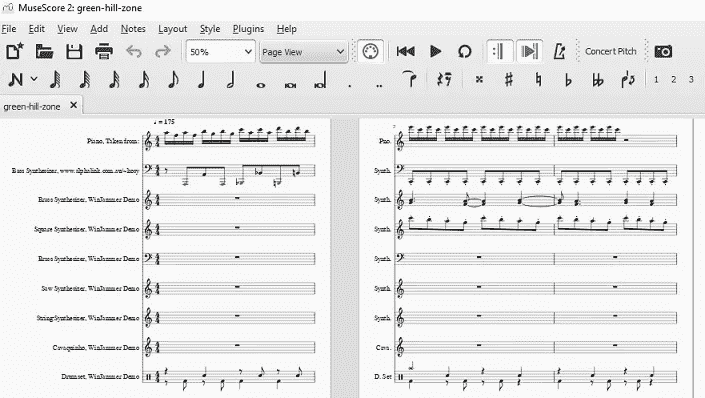
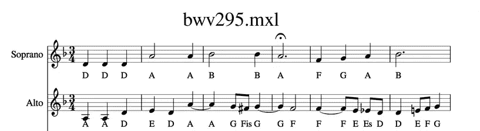
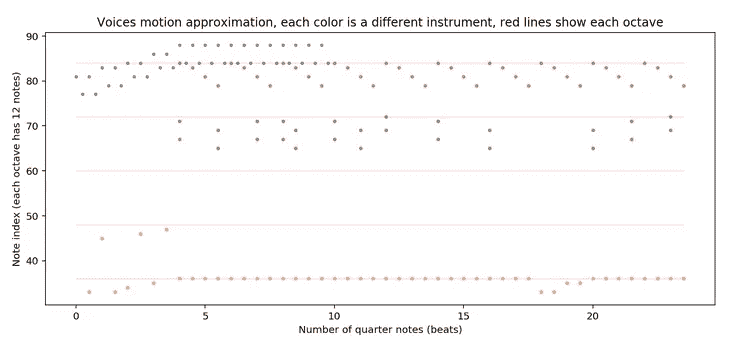
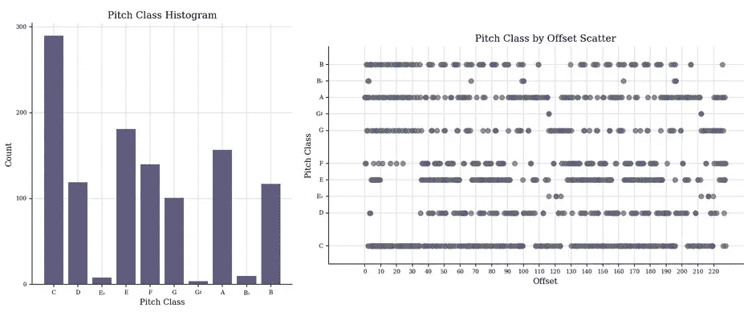
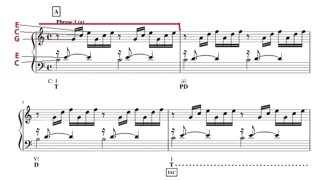
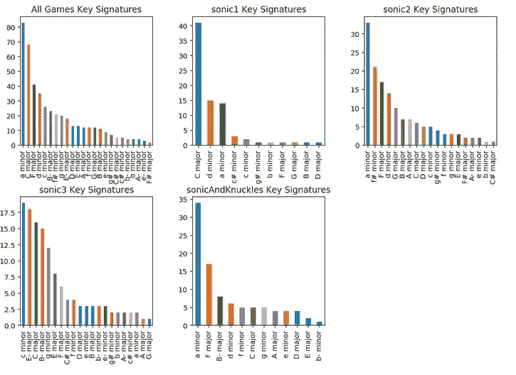
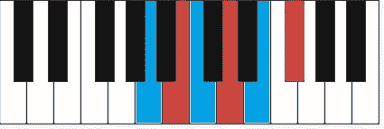
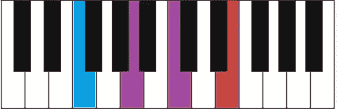

# 在 Kaggle 上使用 Music21 和 Word2Vec 提取 MIDI 音乐数据

> 原文：<https://towardsdatascience.com/midi-music-data-extraction-using-music21-and-word2vec-on-kaggle-cb383261cd4e?source=collection_archive---------5----------------------->

Kaggle 是一个面向数据科学家和机器学习者的社区网站，它提供了几个功能来支持他们的工作和研究。其中一个功能是脚本和笔记本的在线编辑器，他们称之为“内核”。用户可以在线创建和编辑内核，分享关于机器学习算法或 Python 数据结构等主题的知识。

我在那里看了看，看我是否能找到任何与音乐或 MIDI 文件相关的东西，但是我什么也没找到。几乎没有数据库和内核，大多数都集中在分析音乐推荐和偏好上。

这样我决定在那里创建一个新的内核来学习更多关于 MIDI 文件的知识，并通过[和声序列](https://en.wikipedia.org/wiki/Chord_progression)来玩 [Word2Vec](https://en.wikipedia.org/wiki/Word2vec) 。在这篇文章中，我将从高层次上描述我所取得的一些成果。你可以在 [**我的 Kaggle 内核链接上找到所有代码。**](https://www.kaggle.com/wfaria/midi-music-data-extraction-using-music21)

## 主要目标:计算机辅助音乐分析

有一次，我在读关于使用神经网络生成音乐的文章，想起了另一篇关于可解释的人工智能的文章。由于神经网络有“隐藏层”，因此更难理解为什么机器“选择”使用特定的结构来创作音乐。

然后我想，与其让机器做所有的事情，我们可以用电脑来帮助学音乐的学生更好地理解音乐作品。当然，很多人都有同样的想法。例如，在 Youtube 上你可以找到几个节目视频，显示音乐中正在播放的和弦。

我的想法是创建一个内核，在那里你可以选择一组 MIDI 音乐，分析它们，并提取专注于这些作品的知识。这样我就可以回答诸如“贝多芬在这里会用哪个和弦？”或者“Sega Genesis Sonic 游戏上用得比较多的是哪些调号？”

## 什么是“MIDI”和“Music21”

通常当我们谈论音乐文件时，我们会想到像 MP3 扩展名这样的文件扩展名，这是数字音频的一种[音频编码格式](https://en.wikipedia.org/wiki/MP3)。因为它们代表了要听的音乐的音频最终格式，像“音符”或“和弦”这样的概念变得难以想象。

另一种表现音乐的方式是 [MIDI](https://en.wikipedia.org/wiki/MIDI) 文件。**它们是一种非常简洁的方式来表现不同乐器上使用的一系列音符。**如今，从你最喜欢的艺术家那里下载一个 MIDI 文件并开始演奏是相当容易的，可以将钢琴独奏转换成吉他独奏，或者分离出你喜欢的低音部分。

根据压缩配置，通常 MIDI 文件小于 20kb，而 MP3 文件可以超过 4mb。此外，MIDI 文件描述了作品中的所有音符，因此我们可以使用任何 MIDI 编辑器轻松检查音乐结构。最后，在提取任何相关信息后，我们可以从 MIDI 文件导出一个通用的音频文件，并对其应用其他的[音频处理技术](https://en.wikipedia.org/wiki/Digital_signal_processing)，将两者的优点结合起来。



A MIDI file about Sonic’s famous Green Hill theme opened on [MuseScore](https://musescore.org), you can easily see all notes and each instrument used there. It starts with a piano arpeggio and Synths starting playing on the second measure.

有几个库可以通过编程来操作 MIDI 文件。Music21 就是其中之一。引用[他们网站](http://web.mit.edu/music21/doc/about/what.html)的定义:

> Music 21 是一个基于 Python 的计算机辅助音乐学工具包。
> 
> 人们使用 music21 来回答使用计算机的音乐学问题，研究大型音乐数据集，生成音乐范例，教授音乐理论基础，编辑乐谱，研究音乐和大脑，以及作曲(包括算法和直接作曲)。

我选择在这个项目中使用它是因为:

*   它使用 Python 代码
*   它看起来非常健壮，从 2006 年到现在，一直有人在研究它的代码
*   它很好地支持 MIDI 文件
*   它有基于音符序列的音乐分析方法
*   它可以很容易地画出情节和乐谱



With 4 Python lines you can render things like this using Music21, pretty cool!

## 使用音乐提取音符 21

Music21 使从 MIDI 文件中提取音符变得容易。您可以从每种乐器中获取所有音符，并随心所欲地处理它们。我用了一个 [Sonic 的 Green Hill](https://www.youtube.com/watch?v=SF9ZLNxHaBY) MIDI 文件来制作接下来的图片:



On my Kaggle Kernel I got all notes (excluding drums) and plotted them using a scatter plot. Compare the blue points with the piano instrument from the previous MuseScore picture and try to discover which color represents each instrument there.



Music21 also provides some plot methods for examples like those ones. The first one shows which notes are more frequently used while the second one shows when they are played, which is useful to detect key signature changes (which doesn’t happen in this case).

这个库提供了很多处理音符序列的方法，在这个项目中我主要使用了一个分析[键签名](https://en.wikipedia.org/wiki/Key_signature)的方法和一个从音符组合中获取和弦的方法。例如，音符序列[C，E，G]将从 c 大调音阶中产生第一个[和弦。](https://www.basicmusictheory.com/c-major-triad-chords)

## 使用 Music 减少谐波 21

一首音乐可能有数百个音符，这使得分析它变得更加困难。我们可以根据它的和声来简化它，使它更容易理解，同时丢失一些细节，如旋律。[来自维基百科](https://en.wikipedia.org/wiki/Reduction_(music%29):

> 在音乐中，简化是对现有乐谱或作品的改编或转录，其中复杂性降低以使分析、演奏或练习更容易或更清晰；可以减少声部的数量或者简化节奏，例如通过使用音块和弦。

考虑到被分析的小节的上下文、音乐的当前调号和当前小节的音符集，手动操作有几种方法。在这个项目中，我遵循了以下步骤:

*   找到音乐调号
*   对于每个小节，合计每个音符被按下的时间，并选择 4 个最频繁的音符
*   使用 Music21 根据调号找到和弦及其[函数](https://en.wikipedia.org/wiki/Chord_function)
*   简化和弦名称以避免类似“bII#86#6#5”的名称，即使这意味着丢失和弦信息

考虑到巴赫的 c 大调前奏曲，我用我的方法得到了下面的序列:

```
['I', 'ii42', 'vii53', 'I', 'vi6', 'ii42', 'V6', 'i42', ...]
```



A piano sheet showing the first four measures from Bach`s Prelude. I highlighted the first one measure and the notes which are used there. There are only C, E and G notes, so we have a C-major chord. Since the Prelude is in C-major key, the chord is a “I” as my method found. You can find more details [here](https://andrewhennington.wordpress.com/2015/10/22/j-s-bach-prelude-no-1-in-c-major-bwv-846/).

## 使用 Music21 和 Word2Vec 进行谐波分析

我的方法并不完美，猜错了几个和弦，但现在我们可以用每小节一根弦来描述巴赫的前奏和声。因为前奏有 32 个小节，最后我们得到一个 32 个词的列表来描述它的和声进行。

如果我们能得到所有巴赫的作品，并做同样的事情，我们会以一系列的和声序列结束，我们可以分析并发现一些有趣的关系，比如巴赫会在作品中用另一个和弦替换哪个和弦。

Word2Vec 是一种处理文本的技术，[引用本文](https://medium.freecodecamp.org/how-to-get-started-with-word2vec-and-then-how-to-make-it-work-d0a2fca9dad3)中的一段话:

> Word2Vec 背后的想法非常简单。我们假设一个词的意思可以通过它的同伴来推断。这类似于一句谚语，“*让我看看你的朋友，我就能知道你是谁。*
> 
> 如果你有两个单词有非常相似的邻居(意思是:使用它的上下文大致相同)，那么这些单词可能在意思上非常相似，或者至少是相关的。例如，*震惊*、*惊骇、*和*惊讶*这些词通常用在类似的上下文中。

在我的 Kaggle 内核中，我从 Sega Genesis games 下载了 450 个 Sonic MIDI 文件，并为每个文件生成了一个谐波减少序列。然后我训练了一个 word2vec 模型来提取更多关于和弦使用的信息。



Key Signature histograms from Sonic games. A-minor dominates and Sonic 3 has the most diverse plot. Sonic 3 is also the game with more different composers ([Six](http://info.sonicretro.org/Sonic_the_Hedgehog_3#Production_credits), including [Michael Jackson](https://www.billboard.com/articles/news/6858197/michael-jackson-sonic-hedgehog-3-music-theory)) while other games track were composed by a single person.

有了训练好的模型，我能够回答几个仅基于声音成分的问题，一些例子:



In music theory, [chord substitution](https://en.wikipedia.org/wiki/Chord_substitution) is the technique of using a chord in place of another in a sequence of chords, or a chord progression. A good way to replace chords is to choose chords which share notes. In this picture is showed an A-minor chord (**blue**) and a B-minor chord (**red**). Since they don’t share any note, they aren’t a common chord substitution pair. My model gave “0.50” of similarity score for those chords.



In this picture, A-minor chord specific notes are in **red** while F-major specific notes are in **blue**. Since they share 2/3 of their notes (**purple**), they can be used more easily on substitutions. My model’s output when comparing those chords is “0.80”. When comparing an [enharmonic](https://en.wikipedia.org/wiki/Enharmonic) chord it gives “0.95”.

最后，我使用我的模型创建了一个比较几种音乐的方法。word2vec 训练模型将每个谐波减少序列转换为数字向量，我们使用[余弦相似度](https://en.wikipedia.org/wiki/Cosine_similarity)对它们进行比较。我选择了这个[绿山 MIDI 文件](https://files.khinsider.com/midifiles/genesis/sonic-the-hedgehog/green-hill-zone.mid)作为基础，并与所有可用版本进行了比较:

*   翡翠山主题(索尼克 2)——最相似的版本得分 0.990
*   水城主题(索尼克 3)——最相似的版本得分 0.991
*   桑多波利斯(Sonic & Knuckles)——最相似的版本得分为 0.963

那么我们可以说，与绿山主题相比，桑多波利斯主题具有最不同的和声结构。

The desert has no green grass, so it makes sense, right? :P

## 最终考虑

我希望你喜欢这篇文章，并了解更多的音乐理论和声波主题。

关于 word2vec 的使用，我需要找到一种好的方法来衡量模型的准确性，但我之前基于音乐理论演示的测试给出了不错的结果。其他方法也有很大的改进空间，当我有更多的空闲时间时，我有几个想法可以更多地利用这些数据。如有问题或反馈，请评论。再见！