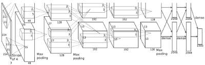
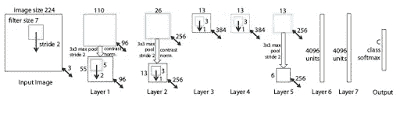
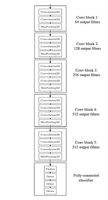
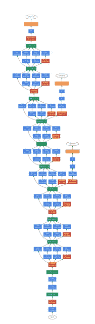
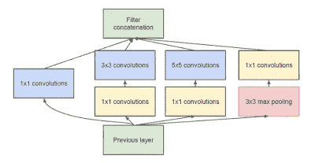
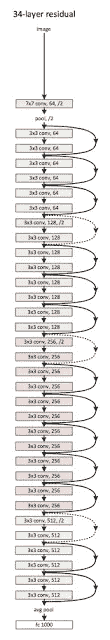
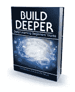

# 深度学习的里程碑

> 原文：<https://towardsdatascience.com/milestones-of-deep-learning-1aaa9aef5b18?source=collection_archive---------3----------------------->

深度学习到现在已经有十年左右了。自问世以来，深度学习因其成功而风靡全球(见我的文章“[什么是深度学习？](http://www.codesofinterest.com/p/what-is-deep-learning.html)“关于深度学习如何通过人工智能进化，以及机器学习)。以下是这些年来深度学习的一些更重要的成就。

**Alex net——2012 年**

The AlexNet Architecture (Image from the research paper: “ImageNet Classification with Deep Convolutional Neural Networks”)

*   证明了卷积神经网络确实有效。AlexNet 及其由 Alex Krizhevsky、Ilya Sutskever 和 Geoffrey E. Hinton 撰写的研究论文“使用深度卷积神经网络进行 ImageNet 分类”通常被认为是将深度学习引入主流的原因。
*   以 15.4%的错误率获得 2012 年 ILSVRC (ImageNet 大规模视觉识别挑战赛)冠军。(作为参考，ILSVRC 第二好的条目有 26.2%的错误率)。
*   8 层:5 层卷积，3 层全连接。
*   将 ReLU 用于非线性函数，而不是之前使用的传统双曲正切函数。
*   介绍了漏失层的使用，以及克服过拟合的数据扩充。

研究论文:“使用深度卷积神经网络的图像网络分类”——Alex Krizhevsky、Ilya Sutskever、Geoffrey E. Hinton

**ZF 网— 2013**

The ZF Net Architecture (Image from the research paper: “Visualizing and Understanding Convolutional Networks”)

*   ILSVRC 2013 的冠军，错误率 11.2%。
*   类似于 AlexNet 架构，通过一些调整和微调来提高性能。
*   介绍了解卷积网络(又名 DeConvNet)，这是一种观察 CNN 内部工作的可视化技术。

研究论文:“可视化和理解卷积网络”——马修·d·泽勒，罗布·弗格斯

**VGG 网— 2014**

The VGG Net Architecture (Image from the Keras Blog: [https://blog.keras.io](https://blog.keras.io))

*   获得 ILSVRC 2014“分类+本地化”类别(非总赢家)，错误率 7.3%。
*   VGG 架构很好地处理了图像分类和定位。
*   19 层网络，带 3x3 过滤器。(与 AlexNet 的 11x11 滤镜和 ZF Net 的 7x7 滤镜相比)。
*   证明了简单的深层结构适用于分层特征提取。

研究论文:“用于大规模图像识别的深度卷积网络”——卡伦·西蒙扬，安德鲁·齐塞曼

**谷歌网— 2014/2015**

The GoogLeNet Architecture (Image from the research paper: “Going Deeper with Convolutions”)

*   ILSVRC 2014 的冠军，错误率 6.7%。
*   介绍了 Inception 模块，它强调 CNN 的各层并不总是必须按顺序堆叠。

The Inception Module (Image from the research paper: “Going Deeper with Convolutions”)

*   22 块层(单独考虑时超过 100 层)。
*   没有完全连接的层。
*   证明优化的非顺序结构可能比顺序结构工作得更好。

研究论文:“深入了解卷积”——Christian Szegedy、、Jia、Pierre Sermanet、Scott Reed、Dragomir Anguelov、Dumitru Erhan、Vincent Vanhoucke、Andrew Rabinovich、Google Inc .、北卡罗来纳大学教堂山分校、密歇根大学安娜堡分校、Magic Leap Inc .

**微软 ResNet — 2015**

The ResNet Architecture (Image from the research paper: “Deep Residual Learning for Image Recognition”)

*   赢得了 ILSVRC 2015。
*   ResNet 的错误率为 3.6%，比人类的准确率更高(据说典型人类的错误率约为 5-10%)。
*   超深(引用论文作者)架构，152 层。
*   引入了残差块，以减少过拟合。

The Residual Block (Image from the research paper: “Deep Residual Learning for Image Recognition”)

研究论文:“深度残差学习在图像识别中的应用”，，，，任，，微软研究院

随着深度学习模型开始超越人类的能力，我们可以肯定地看到更多有趣的深度学习模型，以及未来几年的成就。

**深度学习只是 CNN 吗？**

现在，回头看看我们上面的列表，你可能会想知道“深度学习”是否只是卷积神经网络。

不完全是。

实际上，以下所有模型都被认为是深度学习。

*   卷积神经网络
*   深层玻尔兹曼机器
*   深度信念网络
*   堆叠自动编码器

但是，在深度学习领域，CNN 是最“定义”的，并且解决了更多相关的问题空间，至少目前是这样。但是，请记住，CNN 并不是深度学习的全貌。

我错过了深度学习的什么里程碑吗？请在下面添加您的评论，不要忘记喜欢这篇文章。

如果你想了解更多关于深度学习的知识，可以看看我的书[**Build Deep:Deep Learning 初学者指南**](https://www.amazon.com/dp/1549681060) ，这本书现在已经在亚马逊上出售了。

也可以看看我的博客，[感兴趣的代码](http://www.codesofinterest.com/)，亲身体验深度学习。

另请参见:

[什么是深度学习？](http://www.codesofinterest.com/p/what-is-deep-learning.html) —深度学习是如何产生的，以及它与机器学习和人工智能的关系(是的，它们的意思略有不同)。

相关链接:

[你需要了解的 9 篇深度学习论文](https://adeshpande3.github.io/adeshpande3.github.io/The-9-Deep-Learning-Papers-You-Need-To-Know-About.html)——这篇文章激发了我写这篇文章的灵感。

*原载于 2017 年 7 月 31 日*[*www.codesofinterest.com*](http://www.codesofinterest.com/2017/07/milestones-of-deep-learning.html)*。*