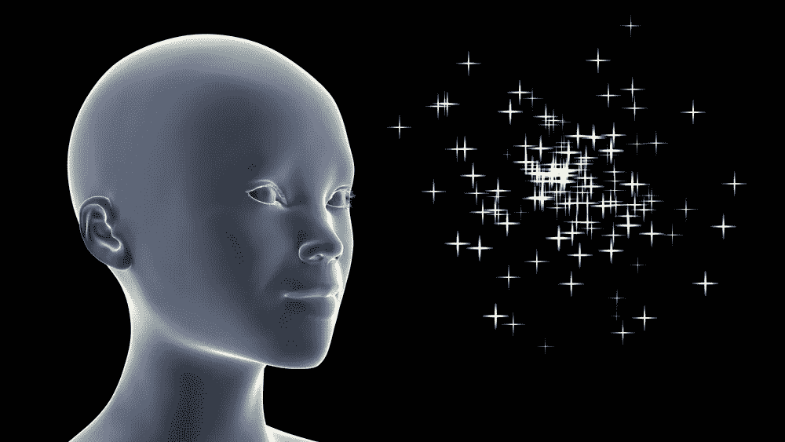
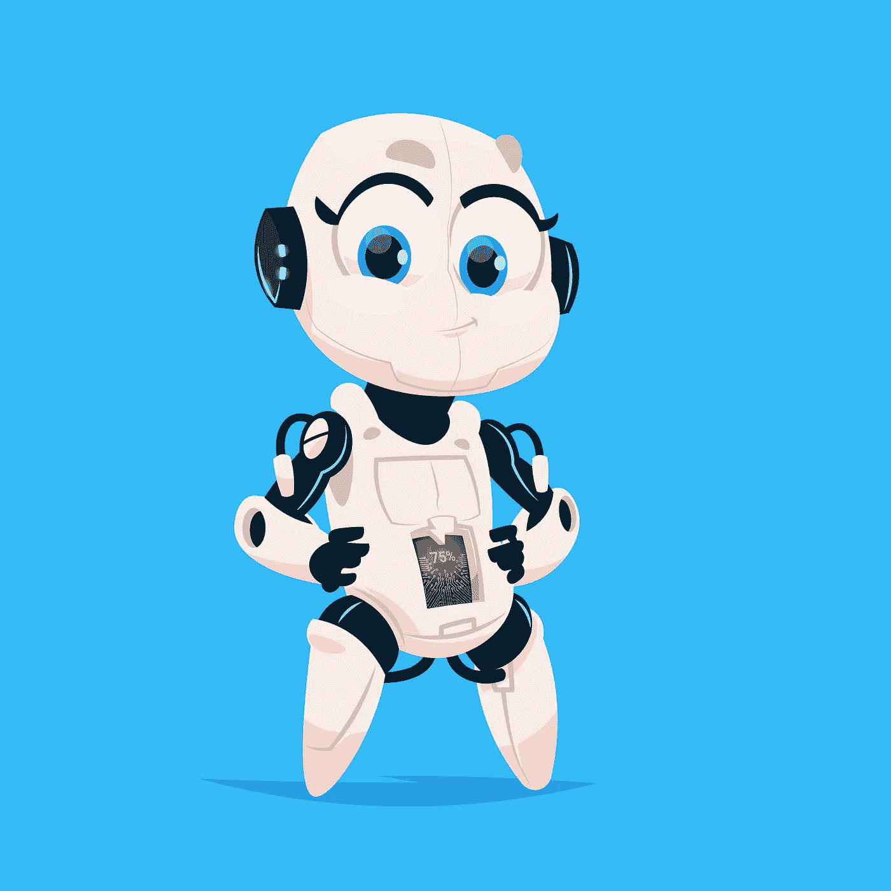

# 思维编码

> 原文：<https://towardsdatascience.com/mind-coding-99acd368d36d?source=collection_archive---------6----------------------->

## 神经健康的简单步骤

在[重新编码你自己的神经瘤](/re-coding-your-own-neurome-303c9b52f68f)和[照顾你的神经瘤](/take-care-of-your-neurome-7e85aac902d3)中，我讨论了这样一个观点，即思维是我们自己头骨中庞大的、有生命的、复杂的湿技术系统的自然属性；我们的神经瘤，值得我们亲自关心和关注。

> 它是由数万亿个脉冲和通信分子产生的，这些分子在多个相互连接的反馈回路中工作。

但是，尽管如此，我们在很大程度上忽略了它。我们在一系列不断变化的注意力状态中度过每一天，让它看不见，被我们的情感所吸引。

就像太阳一样，除非是大热天，否则还是看不见的好。

这种不可见性是由于微调。经过数百万年的进化，神经瘤完美地适应了我们的环境。它特别善于发现差异，忽略相同之处。正因为如此，重新编码只是改变我们的环境来上传新的代码。

我们的环境就是我们自己，如果我们身体上发生变化(做和想不同的事情)，神经瘤就会改变自己，改变形状，同时改变我们是谁。

## 为什么要重新编码？

让我们讨论自由意志。这里我想把有意识的选择和强迫都包括进去。

本杰明·里贝特的传统实验表明，当被要求做出选择时，我们对选择的意识比大脑中的行动落后一秒钟。其中的含义，并非没有争议，是选择首先是潜意识的，而“我选择行动”的意识是后来的描述:选择是潜意识的。

我们可能都多少意识到我们没有意识到*很多事情*。

好吧，如果你没有意识到这一点，你可能在别人身上也意识到了。因此，你可以推断出你自己缺乏意识。

那些试图影响我们的人已经知道，从人类有史以来，甚至可能更早，我们就有有限的心理防火墙。我们真的不需要科学。但是这些天来，科学正在帮助我们很好地分析偏见、启动、推动等等。

这对于那些对操纵感兴趣的人来说是有益且有利可图的，对于那些想要辩护的人来说也应该是同样的兴趣。

当心，因为除非你花时间掌握你的防御，否则其他人会为了他们自己的目的操纵你的思想形态。

你的神经系统中保留的模式，你的信仰、习惯和嗜好，都是物质的东西。它们被写在神经元和它们的连接中，作为真正的代码通道。这种对心理的物理本质的理解有助于我们理解为什么不学习无用的想法或习惯如此困难。

## 如果我是无意识的，这有什么意义？

我们都是无意识的，*和*有意识的。我们都是，一直处于流动的交换中。

意识最大的美和便利就是从那个观察的位置来看我们自己，并进行批判性的评论。

对许多人来说，这种评论本身就带有负面情绪和习惯性。这可能是个问题。但这是一个可以通过认知行为疗法来解决的问题，例如，这种疗法明确寻求提高自我意识和解决习惯问题。

> 有意识的意识会阻碍我们无意识的选择并说不！

Is it a no?

不！是对冲动、信念、习惯和情感的强有力的逻辑阻挡。

通过变得更有自我意识；通过练习和探索我们自己的行为和信念的根源，通过理解记忆、情感和信念以及它们之间的相互联系，我们可以训练自己更有能力去注意一个选择，在注意中更好地理解它，在理解中更有能力说“不！”。

当“不！”完成了它的工作，意识可以进一步帮助，通过重新编码那些路径，通过清除我们在社会、他人、我们的环境的影响下允许刻在我们自己头脑中的代码。

为了知道我们受到了潜意识的影响，我们必须首先能够注意到选择并怀疑这种影响，然后停止自己，然后重新评估。考虑到我们可能会与自己的情绪冲动作斗争，我们可能会考虑建立一个赢得比赛的能力。

## 情感至上

你的神经瘤不断沐浴在来自环境的情感信号中。当我说情绪时，我指的是生化物质。这些是调节我们感觉的分子，包括酶和激素，它们构成了我们最古老的电路。

情绪进化成了让我们去关注其他事情的信号。

情绪不是感觉，这些是我们根据上下文赋予情绪的单独标签。例如，恐惧，或担忧，或内疚，或羞耻，都可能有类似的激素含量。这种情绪的描述和体验取决于我们是否受到攻击，或者担心如果我们被发现做了坏事，我们可能会受到攻击。

不幸的是，感觉是如此强大，以至于我们经常忘记它们是其他事情的信号，而是将我们的全部注意力转移到感觉本身上。

在重新编码之前，让我们先看看一些简单的情感描述。

以下是你可能已经感受到的一些事情的例子(感谢一本很棒的书，安吉拉·阿克曼和贝卡·帕格里西的《情感辞典:性格表达作家指南》):

1.  自信——对自己的能力或品质的自信。
2.  不确定性——不确定的状态。
3.  好奇心——学习或寻求任何知识的欲望，求知欲。
4.  冷漠——冷漠或不感兴趣的状态。
5.  骄傲——一种适当的自尊和满足感，源于自己或他人的成就，或源于财产或关系的品质。
6.  羞辱——一种感觉被贬低、羞辱或没有价值的状态。自尊心受挫。
7.  平和——一种没有焦虑的平静状态。
8.  不知所措——被感情或环境所征服。
9.  渴望——对即将到来的事情的热情。
10.  蔑视——缺乏尊重或无视。
11.  幸福——一种健康的状态；快乐的满足感。
12.  怨恨——对某个行为、言语或人的愤怒，感觉受到了伤害或侮辱。

这些只是其中的几个。每个都有以下特点:

1.  身体化学，我们“感觉到它们”。
2.  信仰，我们相信它们，这是基于；
3.  回忆，我们记得导致它们的事件，并且倾向于重复那些已经发生了很多次的故事。
4.  一种延伸的身心反应，一种完整的神经状态。

## 这些感觉中的每一种都可能是一种强烈的体验，例如怨恨是什么样的？

Contempt

也许头脑中会充满对目标不友好的想法，对不公平或缺乏正义的挫折感，幻想另一个人会垮台，喜怒无常，想独处，专注于一个人或一种情况而损害其他关系，试图通过考虑把其他人带进来而创造一种愤怒的暴民心态。

也许身体会被神经瘤调整，以表现出双臂交叉的怨恨，与他人的物理距离，双手握成拳头，僵硬的姿势，颈部和肩部紧张，不同意地摇头，但什么也不说，走出房间，怒气冲冲，跺着脚上楼，用不必要的力量关门，指指点点和戳空气以示强调。

也许有一张紧闭的嘴，皱眉，抱怨，粗鲁，撅嘴，骂人，音量或强度上升的声音，争吵，低声咕哝或诅咒，扭曲的嘴，酸溜溜的表情，露出牙齿的卷曲嘴唇，轮廓分明的下巴，尖酸的语气，嘲笑别人，在别人背后说话，说闲话，不友善的微笑。

可能会有一个眯着眼睛的平板表情，看过去而不是看他们，一个艰难的表情。

它可能包括拒绝被善意或体贴收买，回避问题的根源，忽视和解的努力，贬低他人的地位或成就，出于受委屈的感觉而破坏他人的项目。

*(感谢安吉拉·阿克曼和贝卡·普利西，链接:*[*http://writershelpingwriters . net/the-emotion-thesaurus-a-writers-guide-to-character-expression*](http://writershelpingwriters.net/the-emotion-thesaurus-a-writers-guide-to-character-expression)*)。*

认出来了吗？

入围的 12 种感觉中的每一种都可以用同样的细节来描述，你会认出它们。然而，没有一点研究和讨论，我们让自己在这些国家的摆布。我们从一个流向另一个，受到我们自己的思想或环境接下来发生的任何刺激的冲击。

是时候收回一些控制权了。防止营销机构操纵我们账户的钱和屏幕上的数据。是时候插入一些防火墙和保护措施了。

## 回到思维编码

环境是我们神经代码的基础。因为我们总是在当下，环境描述了我们此时此刻所处的物理状态。

这就是为什么正念，它给我们一种方法，让我们更好地适应情感，进入情感背后的物质世界，它是如此有帮助，就像一扇门，通向一个被保护的，或更有选择的心灵。

你可以阅读[重新编码你的神经瘤](/re-coding-your-own-neurome-303c9b52f68f)来了解它是如何工作的。下面是一些练习的方法。

## 1.休息一会儿

当然，你可以去度假，去一个远离通常的环境触发因素的地方。我们都知道这一招，它或多或少有用，取决于你在家庭中的角色。

家庭仍然可以成为感情的主要触发因素，至少你不在工作，新的地点和分散注意力的经历会及时诱导平静。

走开。为了让逃离变得有力量，在你离开之前注意你的状态(写在日记里)。等到你恢复了平静(再写一遍)。注意“远离它”的练习带来的不同。这是滑雪假期的正常冥想。

## 2.远离技术人员！

远离你的社交媒体。离开你的收件箱。

Walk or cake?

此刻，你可以通过掌控自己来练习“远离它”。如果你“感觉”太多，无法做到，那就离开屏幕 10 分钟或更长时间。把电话留下。不能？上瘾了？

剧烈运动或改变地点的结合会改变浸泡在你的神经细胞中的化学物质。通常这意味着你回来的时候更加敏锐和冷静。你需要以足够快的速度行走或奔跑，以分散注意力，或者有意识地沿着你的路线专注于小说。

有目的地做，每天做几次，每小时做一次。制定一个常规。记下你之前和之后的感受，并记录下不同之处。你将学习如何通过选择创造不同的精神状态。

## 3.健身拳击

每天一到两次，进行剧烈运动。你喜欢什么都可以，跑步，健走，拳击，骑自行车，旋转。注意任何健康警告，如果你增加血流量，呼吸频率，并从事一些强烈的身体活动，它会推动情绪化学物质并将其清除，同时增加我们从中自然获得的积极激素，并以氧合血的形式增加神经细胞的能量。

期待你的眼睛闪闪发光，你的妙语连珠，一两个笑话出现，让自己和你的处境不那么严肃；足够变得更好。为了让它变得有意识，在日记中写下你以前的样子，花时间注意你现在的样子。通过这种方式，你可以学习如何轻松地产生特定的精神状态。

警觉、放松和准备就绪是正常的状态。去更精确的？只是需要多长时间才能获得收益？如果你以不同的方式尝试事情，例如改变强度、时间、频率，有或没有同伴，会发生什么？在你自己身上实验，一点机器学习，直到你得到它。

## 4.打开你的意识

为了让你的注意力集中到现在，做几次深呼吸就可以让你意识到现在。

在呼气时，注意如果你的眼睛是静止的，并且你注意周边视觉，你能看到什么。

然后再加上你周边听觉能听到的。

除此之外，还要感受你身体的四周，它的位置，它的重量，任何不适，还有你的呼吸。

只是保持正常呼吸一会儿，尽可能多地用眼睛、耳朵、感觉去注意，保持静止但全神贯注。通常你会发现，只需一点点练习，这将平静内心的声音和感觉，并产生一种通常称为“集中”的状态。

## 5.像这样引导

如果你是一个领导者，如果你带头鼓励/允许良好的神经习惯，你会从你的团队中获得更多的闪光点和生产力。允许散步，允许技术休息时间，谈论情绪过载，练习自我学习，发展自我意识、掌控力和灵活性，并与团队分享你的经验作为一项关键的软技能。

科学表明，在办公桌前坐两组，每组 5 个小时，中间有短暂的午餐休息时间，这意味着比同样时间有规律的休息所做的事情要少得多。

## 6.指压

你应该试试指压按摩。我不确定指压按摩期间我的神经瘤会发生什么。这是一个奇怪而神秘的地方，从那里我慢慢地出现并改变了(以一种好的方式)。我只能推荐这段经历，让你们自己记下来。我还在研究这个状态是什么。

## 明白了吗？

我们经常做的许多事情，已经被社会所接受，比如购买食物，可以用心去做。这意味着选择关注行为的物理性。

通过关注你在活动之前和之后的状态，关注你在活动期间的身体状态——你的呼吸和运动，或者你的外部环境，或者两者兼而有之。

所有这些都很容易做到，每天都是如此，我们已经这样做了，部分是因为我们知道我们需要这样做，而且这样做很有效。在你的日常练习中加入有意识的注意，你会很快建立起一种自我意识，知道你如何改变状态，以及你能为自己做些什么来达到更好的状态。

认为精神状态是一个非常强大的工具。一个人工智能编码员会给他们的眼睛牙齿来生成。就像 SWOT 分析，或者思维导图。

想象一下，如果你掌握了成功所需的五种最强大的精神状态。有了这些工具，你能在生活中取得什么成就？

Somewhat happy robot

然后你甚至可以选择一件家务，知道以某种方式做，会让你心情非常好。

但也许让编码人员将这些状态写入他们的机器学习更容易。然后，你可以在你最新的人工智能中购买一个好的记忆(对你停车的地方)，或者一种信心。当然，这不需要你的努力，只需要一些现金。

围绕我们的思维和行为习惯的自律总是有用的。它把一些人标记出来。在一个智能工具将我们的影响扩大到更广的世界里，这甚至更为重要。

像所有的工具一样，纵观历史，智能工具将彻底改变我们的生活。了解我们自己是我们能够保持控制的唯一有意义的方式，而不是奴役其他人，甚至最终奴役人工智能本身。

我很好奇会不会有人专门用 AI/ML 来反思人类的心理健康。如果你是我喜欢聊天的人，请保持联系。

尼克·梅休总经理 www.alembicstrategy.com