# 用 R 挖掘 Google 档案搜索数据

> 原文：<https://towardsdatascience.com/mining-google-archive-search-data-with-r-51f4f76c2d21?source=collection_archive---------9----------------------->

## 从你的在线行为中学习

认领你的谷歌数据相对容易。以下是申请谷歌关于你的所有数据的步骤。*免责声明——自 2018 年 8 月 7 日起，此处的所有链接和代码都可以使用，但是 Google 对其代码或 URL 的任何修改都可能导致它们停止工作。*

## 1)登录您的 Google 帐户，然后点击隐私。您也可以使用下面的链接。

在这里，您可以找到与您帐户的安全和隐私设置相关的所有信息。如果这是你第一次查看谷歌的隐私设置，这可能会让人不知所措。这有点像所有安全/隐私相关事务的谷歌中心。

*   https://myaccount.google.com/privacy

 [## 登录— Google 帐户

### 编辑描述

myaccount.google.com](https://myaccount.google.com/privacy) 

## 2)找到下载您的数据档案的链接或访问下面的链接。

数据存档的链接可以在你的谷歌账户的隐私设置中找到。

*   【https://takeout.google.com/settings/takeout 

 [## 登录— Google 帐户

### 编辑描述

takeout.google.com](https://takeout.google.com/settings/takeout) 

现在，您应该会看到如何开始下载内容的说明。

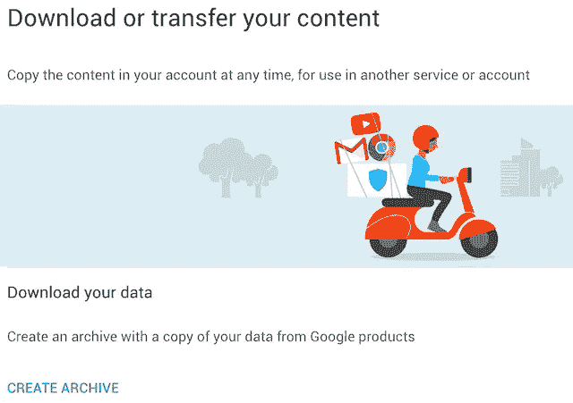

## 3)从存档页面—选择所有 Google 产品，为您的数据创建完整的存档。

确保选择所有产品，以便您拥有完整的数据存档。下面的图片只展示了 4 种产品，在我写这篇文章的时候大约有 50 种不同的产品。

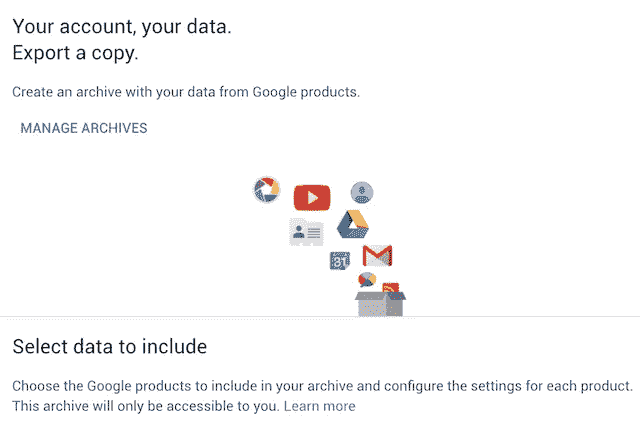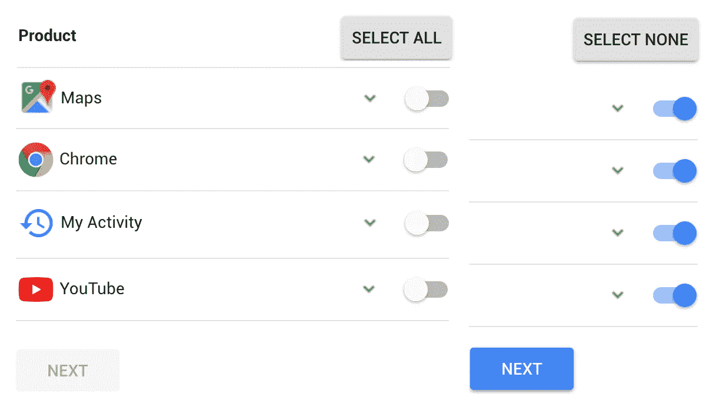

## 4)选择产品后，选择存档文件类型(。zip)。

您还必须选择存档大小。在这种情况下，让我们选择最大归档大小，以确保您的所有帐户数据都在其中。

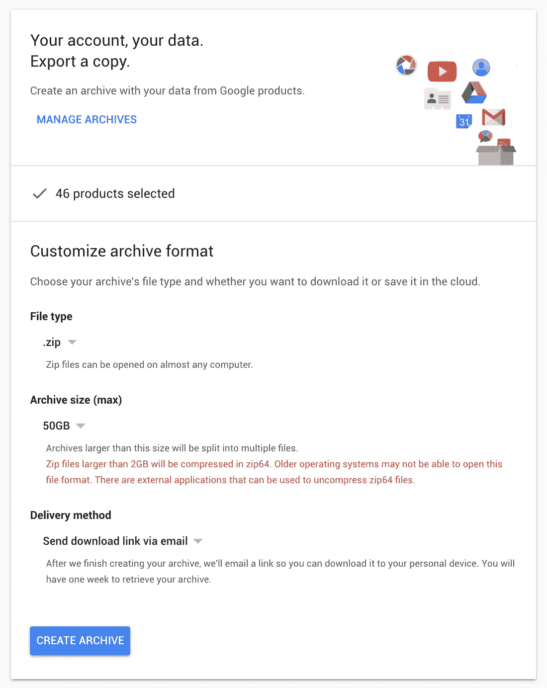

## 5)默认的归档交付方式是通过电子邮件。现在，只要等到你收到谷歌发来的邮件，里面有下载数据的链接。

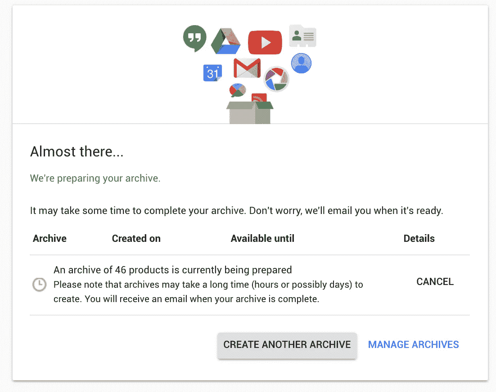

几分钟后(取决于谷歌掌握了你多少数据),会有一封带有下载数据链接的电子邮件。你也可以去**管理档案**并从那里下载数据。

请记住，在谷歌禁用该链接之前，您只有有限的时间来下载您的数据，并且您必须提出新的请求。

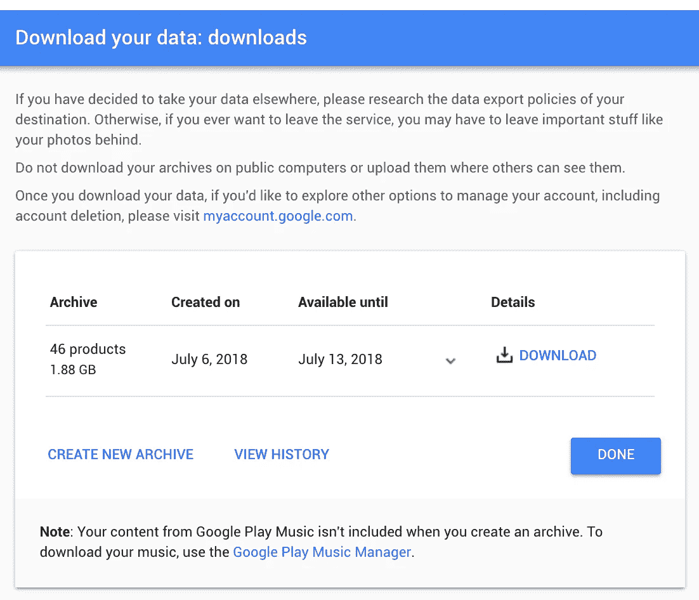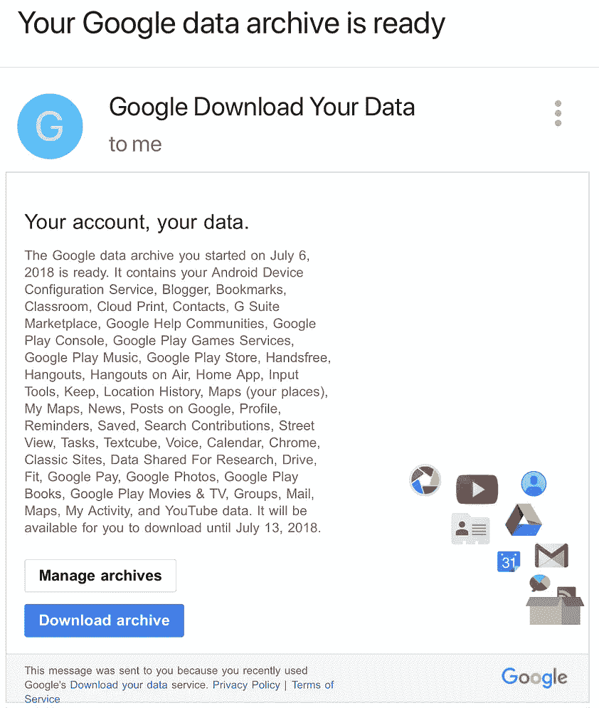

# 数据准备——提取谷歌搜索信息

解压缩归档文件后，名为📁**外卖**应该显示所有选定的谷歌产品的数据。接下来我们将挖掘 Google 搜索数据，因此我们需要找到相关的文件夹/文件。搜索数据以 html 文件的形式出现，位于**搜索**文件夹内的**我的活动**文件夹中。这个文件被命名为***MyActivity.html。*** 记下文件的位置(路径)，因为我们稍后会用到它。

*   📁外卖 MyActivity.html➔我的活动➔搜索➔

# 分析工具包:需要 R 包

检查、安装和加载所需的 R 包

 [## 哈德利/rvest

### R 的简单网页抓取

github.com](https://github.com/hadley/rvest) 

帮助您从网页上抓取信息。它旨在与 magrittr 合作，使表达常见的 web 抓取任务变得容易，其灵感来自于像 beautiful soup 这样的库。

 [## juliasilge/tidytext

### tidy Text——使用 dplyr、ggplot2 和其他 tidy 工具进行文本挖掘…

github.com](https://github.com/juliasilge/tidytext) 

提供函数和支持数据集，允许文本与 tidy 格式相互转换，并在 tidy 工具和现有文本挖掘包之间无缝切换。

 [## tidyverse/lubridate

### lubridate——让在 R 中处理日期变得简单一点

github.com](https://github.com/tidyverse/lubridate) 

Lubridate 使 R 用日期时间做的事情变得更容易，并使 R 做不到的事情成为可能。

 [## ifellows/wordcloud

### 这是一个 R 包，可以创建漂亮的单词云，可视化文档之间的差异和相似之处，并且…

github.com](https://github.com/ifellows/wordcloud) 

创建漂亮的文字云的功能，可视化文档之间的差异和相似性，并避免在散点图中过度绘制文本。

 [## tidyverse/tidyverse

### 从 tidyverse 轻松安装和加载软件包

github.com](https://github.com/tidyverse/tidyverse) 

tidyverse 是一组协调工作的包，因为它们共享公共的数据表示和 API 设计。

# 代码

## 数据准备:提取搜索数据

使用 rvest 包，我们可以读取包含相关搜索数据的 html 文档。通过利用正则表达式(regex)，我们可以从 HTML 文档中提取相关信息。

## 从 Html 数据中提取时间戳

## 从 Html 数据中提取文本

## 从数据中提取搜索类型

现在让我们使用从 html 文件中提取的数据创建一个 DataFrame。

## 数据检查

# 数据分析:可视化谷歌搜索

## 谷歌搜索者每年的数量

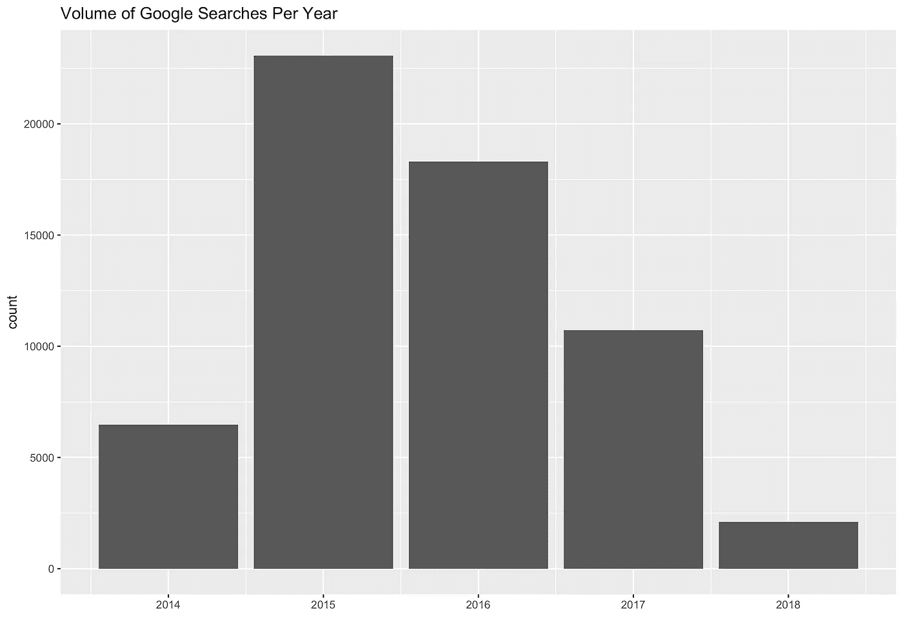

## 每月谷歌搜索量

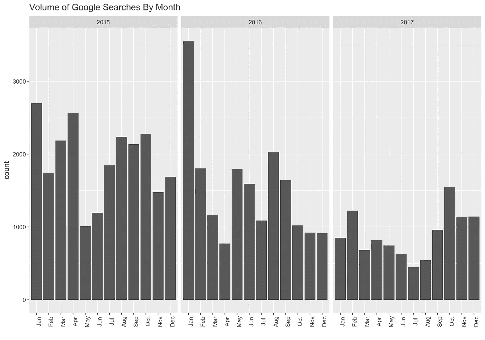

## 每小时谷歌搜索量

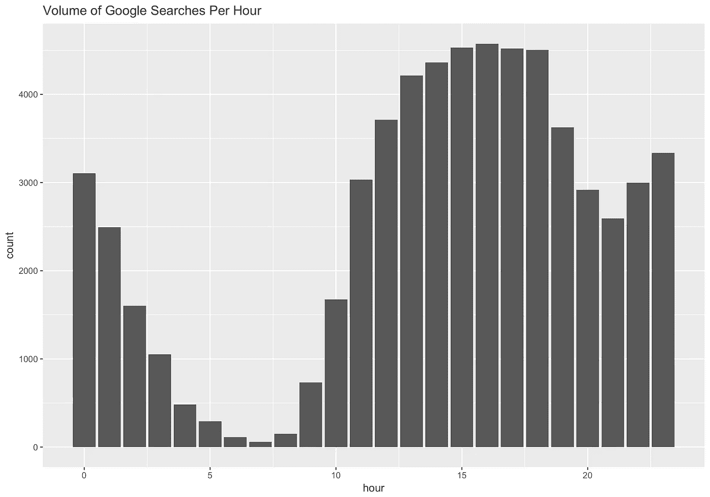

## 每个工作日的谷歌搜索量

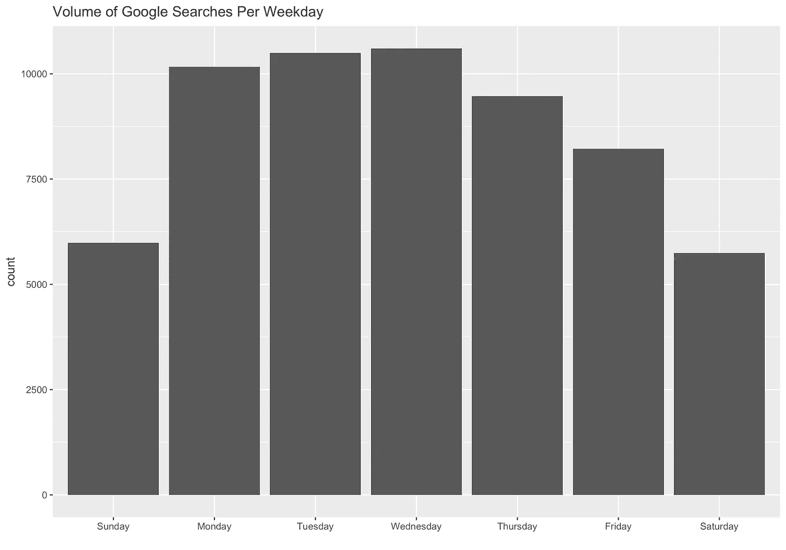

## 每个工作日/小时的谷歌搜索量

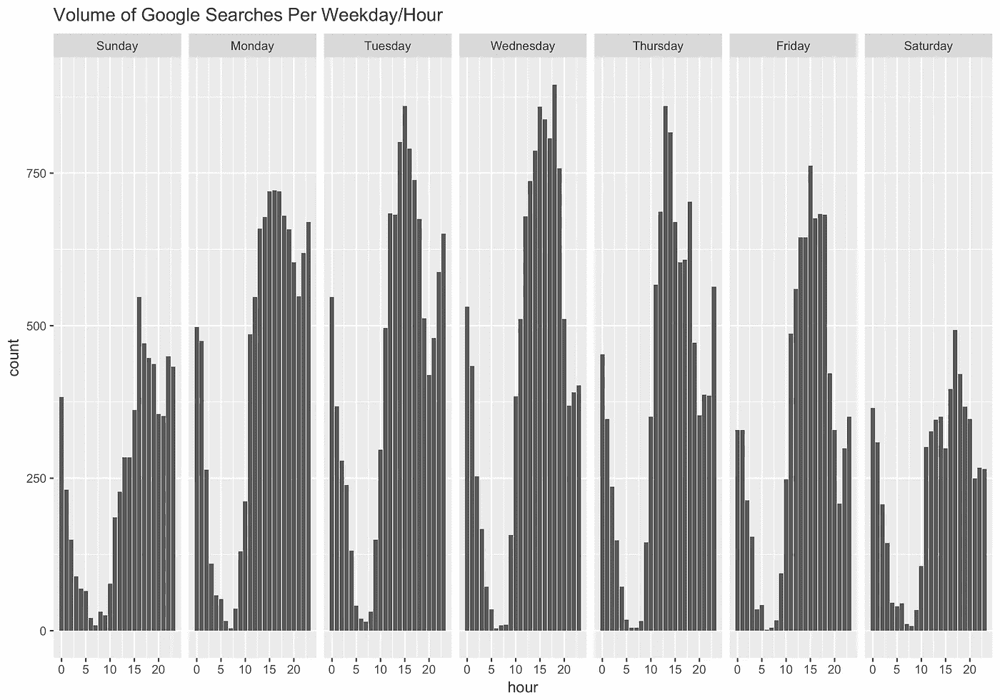

我们可以按年份和星期几对搜索数据进行分组，以可视化整体趋势

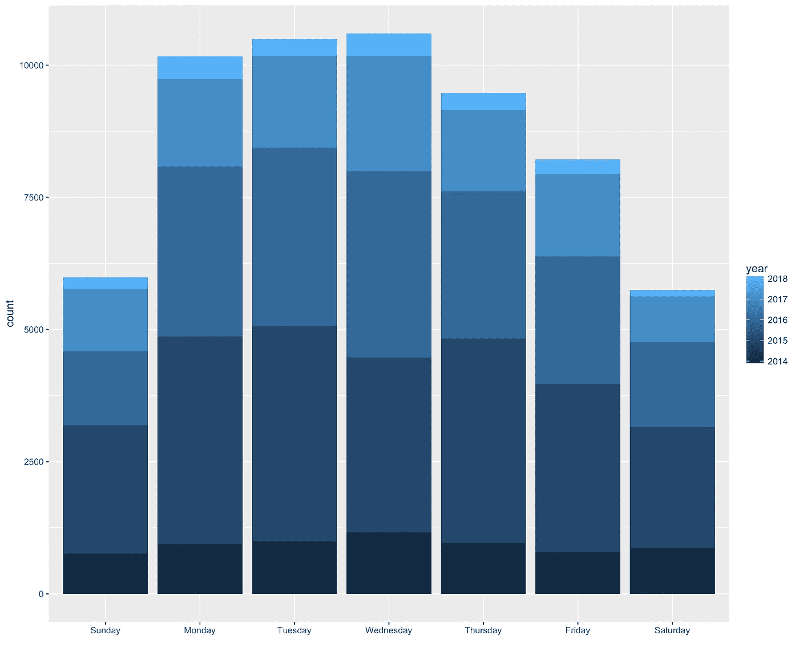

## 来自谷歌搜索数据的词云

首先，我们需要提取文本并使用正则表达式对其进行清理

我们会想在常用的 stops_words (ei)中添加相关的单词。我，是，是)。在下面的代码中，我添加了与我的工作/学校相关的单词，因为这些单词很可能会出现得更频繁。现在我们还需要为单词云中出现的单词的最小频率和最大数量设置一个阈值。

最后，使用创建的包含单词计数的数据帧，我们生成一个单词云。

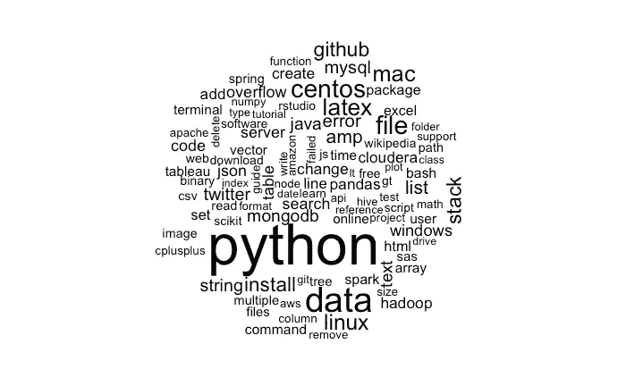

通过访问和了解谷歌等公司从我们的个人账户中维护的数据，我们可以更好地了解如何管理我们经常访问的所有网站的隐私设置，以及检测我们在使用这些服务时的行为模式。我们越能理解，就能越好地保护我们的隐私。

你可以在这里找到完整的脚本 [**谷歌笔记本。rmd**](https://gist.github.com/jlroo/80e7ebe12b57a23927a4a26b61ab5210)