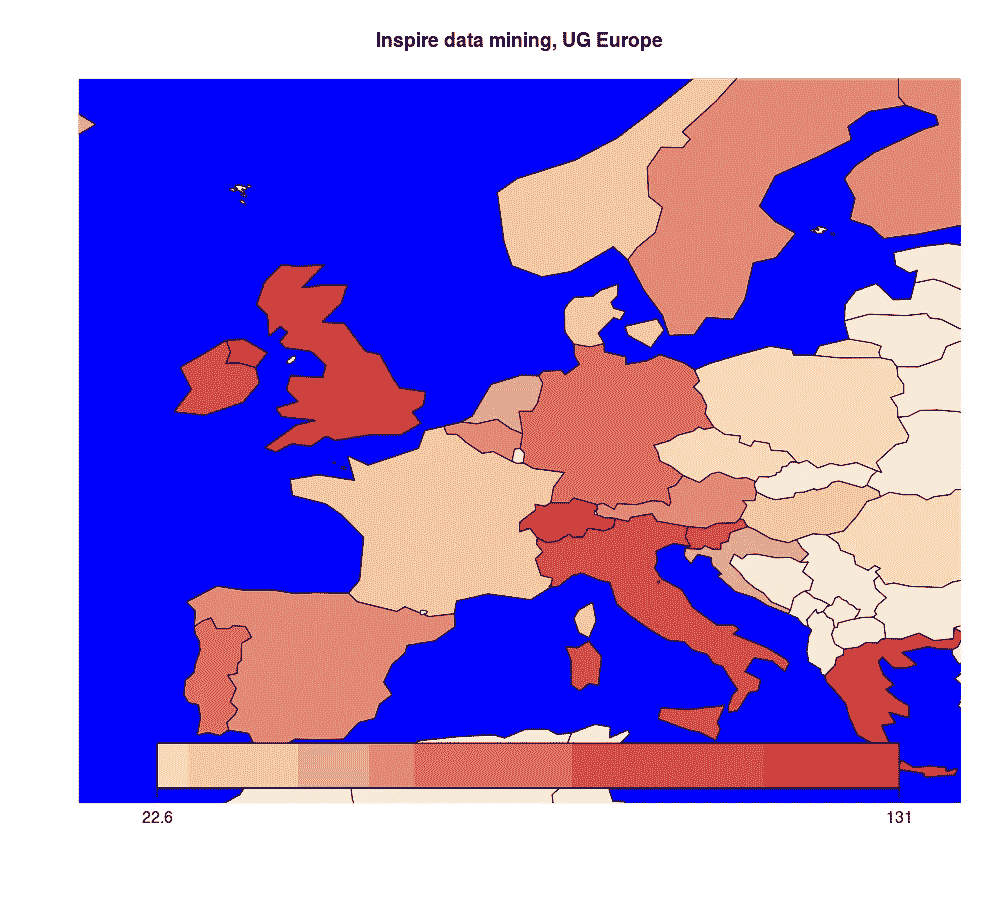
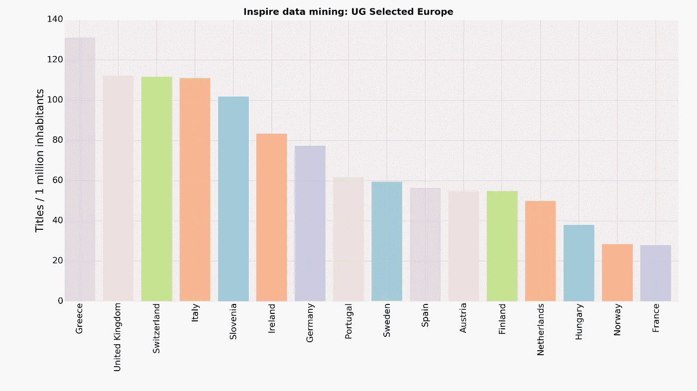
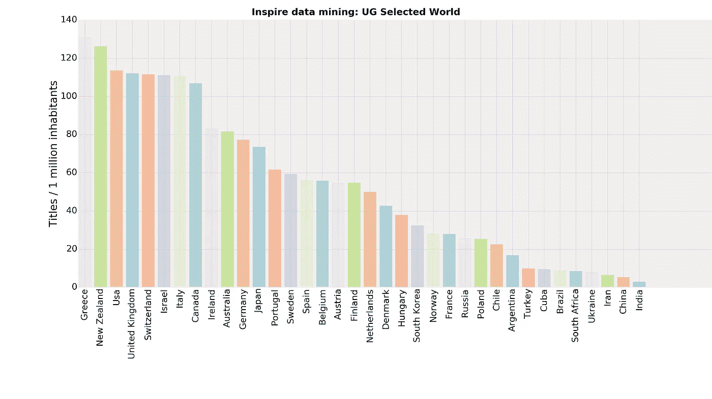

# 挖掘 HEP-Inspire 数据库

> 原文：<https://towardsdatascience.com/mining-the-hep-inspire-database-77a68950ef59?source=collection_archive---------5----------------------->

## 世界上哪些国家对高能物理和数学的研究贡献最大？

Researchers with a Bachelor’s degree from the given country per million inhabitants (from HEP-Inspire database)

在我之前的职业生涯中，我曾在欧洲各地的物理系呆过很长时间。我发现令人震惊的是这些环境似乎享有巨大的文化多样性。大多数情况下，50%到 70%的员工和研究人员来自主办国，而其他职位则由来自世界各地的优秀人才担任。在移居者中，代表最多的国籍是人口众多的大国……加上意大利人。我经常碰到一个笑话，说世界上没有一个高能物理系里没有一个意大利人。有时候，我想，那个人就是我。

这件事引发了我的好奇心，我想**量化每个国家向科学界提供研究人员的能力和趋势**。显而易见，我应该从 [HEP-Inspire](https://inspirehep.net/) 开始搜索，也就是说，这个平台承载了世界上每天产生的大部分高能物理学、宇宙学、天体物理学和数学物理学的文章。

HEP-Inspire 提供了一个大型数据库，其中有研究人员的姓名、统计数据和 bios，任何人都可以[访问](http://inspirehep.net/dumps/inspire-dump.html)(我将引用一些用*斜体*表示的文件)。在该平台注册的 11.5 万名研究人员中，每个人都可以自由分享自己的教育背景信息，包括本科、博士、博士后和教师职位的情况。

我已经开始了我的分析，从 *HepNames* 数据集中解析每个研究者的标识符，以及他或她获得 UG 和 PHD 的位置。我必须面对的第一个问题是，数据库中的位置存储为大学名称(*【a】*字段)和标识符(*【z】*字段)，而不是国家，例如:

> <datafield tag="”371&quot;" ind1="”" ind2="”"><子场码= "**">**华沙 u .**</子场码= "**">**UG**</subfield>
> <子场码= " s ">1980</subfield>
> <子场码="t "****</datafield>

****为了绕过这个问题，我检查了第二个名为 *Institutions* 的数据集，其中包含所有机构的名称、地址和来源国。从这个文件中，我构建了一个字典，以国家名称作为键，以机构代码列表作为值。将机构代码与每个研究人员的“ *z* ”值进行匹配，我最终成功地获得了两本以国家为关键字、以该国家的 UG/PHD 头衔数为值的字典。这些字典和所有代码都可以在我的 [GitHub repo](https://github.com/bugo99iot/hep_inspire_data_mining) 上找到。****

****事实证明，这些数据有时是不完整的、非结构化的或者包含错别字。然而，该算法能够识别数据库中 95%的机构和 98%的研究人员。****

****考虑到结果，我首先感兴趣的是研究每个国家在培养研究人员方面的潜力，这些研究人员在高度理论化、有时甚至是推测性的领域工作，例如高能物理。以欧洲为例，我的结果显示在本文顶部的地图中。按人口单位计算，为科学界提供本科生的能力最强的国家是希腊，每百万人中超过 130 人，其次是英国、瑞士，是的……意大利。与预期相比，表现不佳的国家是法国、荷兰和北欧国家。进一步的见解来自下一批:****

********

****Researchers with a Bachelor’s degree from the given country per million inhabitants****

****在数据集中，不到 12%的研究人员分享了他们的 UG 背景信息，28%的研究人员分享了他们的博士背景信息。不得不做出的主要假设是，所有国家的研究人员都有可能分享他们的教育背景信息，这可能有利于内部竞争激烈的国家。****

****我关心的第二个方面是**了解一个国家从邻国进口/向邻国出口博士生的可能性有多大**。为了评估这一点，我选择了欧洲 14 个国家的样本，并绘制了每个国家的 UG/PHD 头衔在样本中所占的百分比，对人口进行了标准化。****

********

****In the graph, France accounts for 7% of PHDs in the sample and for 3% of UGs (per million inhabitants)****

****该图显示了一个众所周知的趋势。瑞士、德国、英国、瑞典、法国和荷兰等高密度经济体倾向于从意大利、希腊、爱尔兰、匈牙利和葡萄牙的研究团队中招聘博士，这些国家高密度的物理学学士提高了候选人的质量和学术潜力。****

****在这篇文章的结尾，我想分享一下世界上的情况。下面的柱状图包含了一些有代表性的国家。如果你的国家没有出现在那里，你可以在这里看看整套[。](https://github.com/bugo99iot/hep_inspire_data_mining/tree/master/plots)****

********