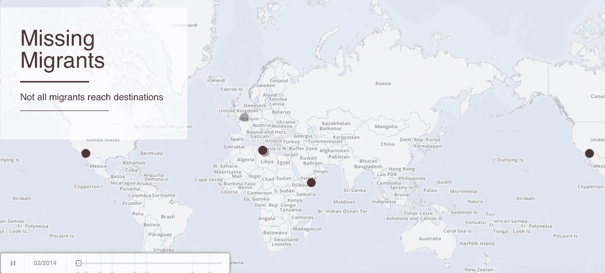
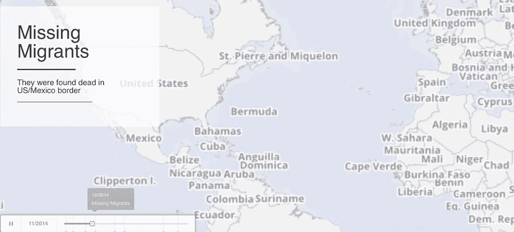

# 失踪的移民发生了什么，他们是谁

> 原文：<https://towardsdatascience.com/missing-migrants-24254bc82474?source=collection_archive---------6----------------------->

2013 年，至少有 368 人死于意大利海岸的两起沉船事故。这使人们更加意识到包括难民在内的移民的死亡，他们通过各种不同的、往往是危险的路线，从未到达目的地。

这篇文章关注的是死亡记录，另一部分是那些从未被发现的人，那些没有记录但可能还活着的人。

完整的连续互动版可以在[这里](http://bl.ocks.org/anonymous/raw/d0e7162680bc275128799c511a553391)找到。我用 [Carto](https://carto.com/) 和 odyssey.js 用 [IOM](https://www.kaggle.com/jmataya/missingmigrants) 从 2014 年到 2017 年收集的数据来可视化移民(尤其是难民)。我发现 odyssey.js 作为一个带有地图缩放的讲故事工具很直观，但是，与工作文件相比，它的导出可能会在几帧中丢失一些数据点。

这是我关于数据科学和视觉故事的[# 100 天项目](https://medium.com/@yanhann10)的第 39 天。感谢阅读。欢迎新主题的建议和反馈。