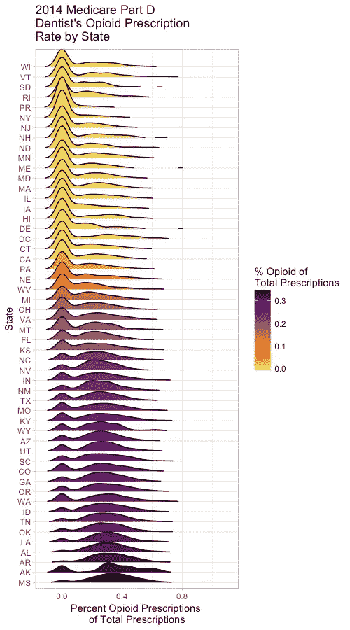
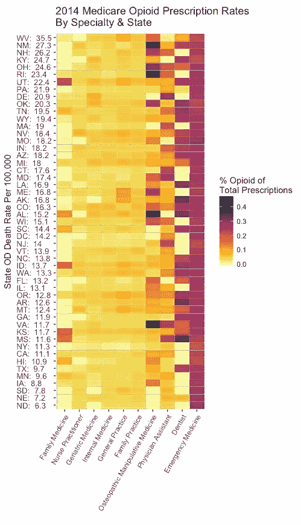

# 密西西比州:2014 年牙科阿片类药物的中心

> 原文：<https://towardsdatascience.com/mississippi-dental-opioid-epicenter-of-2014-ab4d7f68fa49?source=collection_archive---------5----------------------->

美国牙科协会呼吁其成员帮助对抗阿片类药物的流行。虽然牙医开出一小部分阿片类药物，但总体而言，在美国，他们是 10 岁至 19 岁患者的主要处方者。对于 127，338 名牙医中的每一名，医疗保险中心医疗补助服务(CMS)公共[数据集](https://data.cms.gov/Medicare-Claims/Medicare-Part-D-Opioid-Prescriber-Summary-File-201/e4ka-3ncx/data)包括他们的书面处方中阿片类药物的百分比。

2014 年，处方由 Medicare 部分承保的牙医的阿片类药物处方率中位数为 **16.8%** 。这些牙医在 2014 年共开出 **1，110，725** 张阿片类药物处方，占 Medicare 部分承保的所有阿片类药物处方的 **1.4%** 。

每个州都有牙医阿片类药物处方率的分布。这些是按照各州中值从最低(图表顶部)到最高(图表底部)的顺序绘制的。对于 20 个州，中位数是零或实际上是零，因为几乎所有的牙医都有极低的阿片类药物处方率，只有少数例外。

沿着图表往下看，在宾夕法尼亚州，离群值看起来开始占上风。从那里开始，接近图表的底部，异常值接管。密西西比州发生了什么，导致它不幸成为这场竞争的赢家，牙医阿片类药物处方率中位数为**34.2%；**比**多两倍**那个，全国范围内？落后于其他州牙科监管机构，密西西比州牙科检查委员会最近通过了一项法规，要求该州的牙医在密西西比州处方监控计划(PMP)注册，医生长期以来一直被要求参与该计划。

mississpi[刚刚提出了针对阿片类药物处方者的更新法规](https://www.clarionledger.com/story/news/politics/2017/10/03/mississippi-overhauls-opioid-prescription-rules-amid-epidemic/722938001/)，该法规适用于医疗专业人员，**不包括牙医**。这些法规将要求医疗服务提供者在开阿片类药物处方之前，通过**PMP 检查记录。从理论上讲，这一额外的步骤将使临床医生能够发现可能会购买多种止痛药处方的患者。**

来自 2013 年[的 CMS 数据显示](https://www.statnews.com/2015/12/14/opioid-crisis-fueled-prescriptions-family-doctors-internists/)，虽然外科医生和疼痛专家的比例较高，但家庭诊所和执业护士开出的阿片类药物处方总数最高。因为有如此多的初级保健医生，他们是阿片类药物处方的巨大来源。

States ordered bottom to top by OD death rate and medical specialties ranked left to right by opioid prescription rate.

2014 年的数据显示了类似的模式。除去外科、肿瘤和疼痛专家，以及阿片类药物处方率中位数为 0.0%的专家后，上面的热图显示了其他有趣的趋势。不仅牙医的阿片类药物处方率中值相对较高，而且各州的处方率也各不相同。作为对比，看看急诊医学专家(热图中最右边的一栏)。他们的平均比率高于牙医，但在他们的专业中，各州之间是相似的。

像急诊医学一样，一些初级保健专业(执业护士、全科医生、内科医生、家庭医生)在各州之间差异很小。其他专业(家庭医学、整骨操作医学、医师助理)，如牙医，在各州的比率差异很大。这是农村还是城市供应商的问题？我将寻找与 CMS 数据结合的其他数据类型，这可能对此有所帮助。

用于数据操作和数据可视化的代码可以在 [my GitHub](https://github.com/JListman/Opioid_Medicare_D_2014) 中找到。

## 感谢您的阅读。

我欢迎反馈——您可以“鼓掌”表示赞同，或者如果您有具体的回应或问题，请在此给我发消息。我也有兴趣听听你想在未来的帖子中涉及哪些主题。

**阅读更多关于我的作品**[**【jenny-listman.netlify.com】**](https://jenny-listman.netlify.com)**。欢迎随时通过 Twitter**[**@ jblistman**](https://twitter.com/jblistman)**或**[**LinkedIn**](https://www.linkedin.com/in/jenniferlistman/)**联系我。**

注意事项:

1.  医疗保险 D 部分索赔数据来自:[https://data . CMS . gov/Medicare-Claims/Medicare-Part-D-阿片类药物-处方医生-Summary-File-201/e4ka-3n CX/data](https://data.cms.gov/Medicare-Claims/Medicare-Part-D-Opioid-Prescriber-Summary-File-201/e4ka-3ncx/data)
2.  2014 年各州用药过量死亡率(每 100，000 名居民的年龄调整死亡率)数据来自:[https://www.cdc.gov/drugoverdose/data/statedeaths.html](https://www.cdc.gov/drugoverdose/data/statedeaths.html)
3.  使用 [R](https://www.r-project.org) 中的工具处理和绘制数据
4.  牙医不包括被列为口腔外科的专家(仅牙医)，其阿片类药物处方率[是牙医的两倍](https://www.nytimes.com/2017/07/10/opinion/dentists-opioids-addiction-.html?mcubz=1&_r=0)。与口腔外科牙科专家比例较高的州相比，在口腔外科牙科专家较少的州，被列为牙医的从业者可能会进行更多的外科手术，如拔除智齿。否则，这些牙医将会开出更多的鸦片制剂。然而，我的分析显示，州牙医阿片类药物处方率的中位数与州口腔外科牙科专家与牙医的比率之间没有相关性。